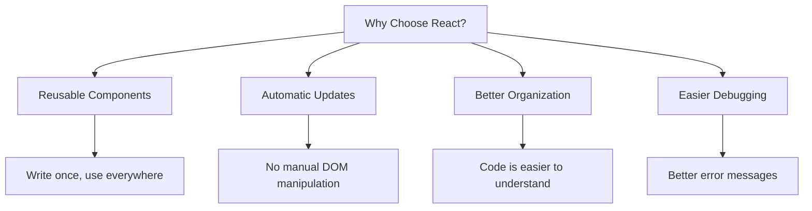
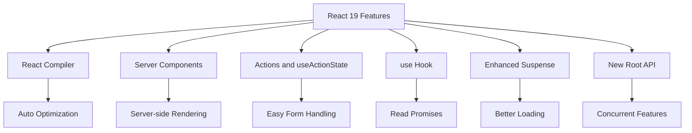

# Day 1 - Hour 1: React Fundamentals & React 19 Introduction

## 🎯 Learning Objectives
By the end of this hour, you will:
- Understand what React is and why it's revolutionary
- Set up a React development environment step by step
- Learn React fundamentals: Components, JSX, Props, and State
- Create your first React application
- Get introduced to React 19's revolutionary new features

---

## 📚 What is React? (For Complete Beginners)

Imagine you're building a website. Traditionally, you would write HTML for structure, CSS for styling, and JavaScript for interactivity. But as websites get complex, this becomes messy and hard to maintain.

**React** is like having a smart assistant that helps you build websites more efficiently by organizing your code into reusable pieces called **"components"**.

### 🤔 Why React? A Simple Comparison

**Traditional Way (Without React):**
```html
<!-- index.html -->
<div id="student-card">
    <h2 id="student-name">Loading...</h2>
    <p id="student-grade">Loading...</p>
    <button id="edit-btn">Edit</button>
</div>

<script>
// script.js - Gets messy quickly!
let studentName = "John Doe";
let studentGrade = "A";

document.getElementById('student-name').textContent = studentName;
document.getElementById('student-grade').textContent = studentGrade;

document.getElementById('edit-btn').addEventListener('click', function() {
    // Lots of manual DOM manipulation code...
    let newName = prompt("Enter new name:");
    studentName = newName;
    document.getElementById('student-name').textContent = studentName;
    // This gets very complex very quickly!
});
</script>
```

**React Way (Clean and Organized):**
```jsx
// StudentCard.jsx - Much cleaner!
function StudentCard() {
    const [studentName, setStudentName] = useState("John Doe");
    const [studentGrade, setStudentGrade] = useState("A");
    
    const handleEdit = () => {
        const newName = prompt("Enter new name:");
        setStudentName(newName);
        // React automatically updates the display!
    };
    
    return (
        <div>
            <h2>{studentName}</h2>
            <p>Grade: {studentGrade}</p>
            <button onClick={handleEdit}>Edit</button>
        </div>
    );
}
```

### 🎯 Key Benefits of React



---

## 🚀 Setting Up React Development Environment (Step by Step)

### Step 1: Install Node.js
1. Go to [nodejs.org](https://nodejs.org)
2. Download the **LTS version** (Long Term Support)
3. Install it (just click "Next" on everything)
4. Open your terminal/command prompt and type:
   ```bash
   node --version
   npm --version
   ```
   You should see version numbers if installed correctly.

### Step 2: Create Your First React App
```bash
# Open terminal and navigate to where you want to create your project
cd Desktop

# Create a new React app (this will take 2-3 minutes)
npx create-react-app my-first-react-app

# Go into the project folder
cd my-first-react-app

# Start the development server
npm start
```

### Step 3: Understanding the Project Structure
After creating your app, you'll see this folder structure:
```
my-first-react-app/
├── public/
│   └── index.html          ← Main HTML file
├── src/
│   ├── App.js             ← Main component (THIS IS WHERE YOU'LL WORK)
│   ├── App.css            ← Styles for App.js
│   ├── index.js           ← Entry point (connects React to HTML)
│   └── index.css          ← Global styles
├── package.json           ← Project configuration
└── README.md             ← Instructions
```

**🎯 Key Files You'll Edit:**
- **`src/App.js`** - This is your main component (most important!)
- **`src/index.js`** - This connects React to your HTML
- **`public/index.html`** - The HTML file that loads everything

---

## 🧩 React Fundamentals (Starting from Zero)

### 1. Components - Think of Them as Custom HTML Tags

A component is like creating your own HTML tag. Instead of just `<div>` or `<button>`, you can create `<StudentCard>` or `<TeacherProfile>`.

**📝 Your First Component (Edit `src/App.js`):**
```jsx
// src/App.js
import React from 'react';
import './App.css';

// This is a component - it's just a JavaScript function!
function Welcome() {
    return <h1>Hello, Faculty Members!</h1>;
}

// Main App component
function App() {
    return (
        <div className="App">
            <Welcome />
            <Welcome />
            <p>Welcome to React!</p>
        </div>
    );
}

export default App;
```

**🎯 What's happening here?**
- `function Welcome()` creates a new component
- `return <h1>...</h1>` tells React what to display
- `<Welcome />` uses your component like an HTML tag
- You can use the same component multiple times!

### 2. JSX - Writing HTML Inside JavaScript

JSX lets you write HTML-like code inside JavaScript. It looks like HTML but it's actually JavaScript!

```jsx
// This is JSX - looks like HTML but it's JavaScript
const element = <h1>Hello, World!</h1>;

// JSX Rules (Important!)
function MyComponent() {
    return (
        <div>  {/* Must have ONE parent element */}
            <h1 className="title">Title</h1>  {/* Use className, not class */}
              {/* Self-closing tags need / */}
            <input type="text" />  {/* All tags must be closed */}
        </div>
    );
}
```

**🎯 JSX vs HTML Differences:**
- Use `className` instead of `class`
- All tags must be closed (`<br />` not `<br>`)
- Must return ONE parent element
- Use `{}` to write JavaScript inside JSX

### 3. Props - Passing Information to Components

Props are like function parameters for components. They let you pass data from one component to another.

**📝 Example: Student Information Card (Add to `src/App.js`):**
```jsx
// Component that receives props
function StudentCard(props) {
    return (
        <div style={{border: '1px solid #ccc', padding: '10px', margin: '10px'}}>
            <h2>{props.name}</h2>
            <p>Roll Number: {props.rollNumber}</p>
            <p>Grade: {props.grade}</p>
            <p>Department: {props.department}</p>
        </div>
    );
}

// Using the component with different props
function App() {
    return (
        <div className="App">
            <h1>Student Management System</h1>
            
            <StudentCard 
                name="Rahul Sharma" 
                rollNumber="CS001" 
                grade="A" 
                department="Computer Science"
            />
            
            <StudentCard 
                name="Priya Singh" 
                rollNumber="CS002" 
                grade="B+" 
                department="Computer Science"
            />
        </div>
    );
}
```

**🎯 What's happening?**
- `props.name` gets the value of the `name` attribute
- Each `<StudentCard>` gets different data
- Same component, different content!

### 4. State - Making Components Remember Things

State is like a component's memory. It can change over time and React will automatically update what's displayed.

**📝 Interactive Counter Example:**
```jsx
// Import useState from React
import React, { useState } from 'react';

function Counter() {
    // useState creates state variable
    // [currentValue, functionToUpdateValue] = useState(initialValue)
    const [count, setCount] = useState(0);
    const [message, setMessage] = useState('Welcome!');
    
    const handleIncrement = () => {
        const newCount = count + 1;
        setCount(newCount);  // Update count
        setMessage(`You clicked ${newCount} times!`);  // Update message
    };
    
    const handleReset = () => {
        setCount(0);
        setMessage('Counter reset!');
    };
    
    return (
        <div style={{padding: '20px', border: '2px solid blue'}}>
            <h2>{message}</h2>
            <p style={{fontSize: '24px'}}>Count: {count}</p>
            <button onClick={handleIncrement}>Click me!</button>
            <button onClick={handleReset}>Reset</button>
        </div>
    );
}
```

**🎯 Understanding useState:**
- `useState(0)` creates state with initial value 0
- Returns an array: `[currentValue, setterFunction]`
- `setCount(newValue)` updates the state
- React automatically re-renders when state changes

---

## 🧪 Hands-On Exercise: Student Management Card

Let's build a practical component that combines everything we've learned:

**📝 Complete Example (Replace your `src/App.js` with this):**
```jsx
import React, { useState } from 'react';
import './App.css';

function StudentManagementCard() {
    // Multiple state variables
    const [student, setStudent] = useState({
        name: '',
        rollNumber: '',
        department: 'Computer Science',
        grade: 'A'
    });
    
    const [isEditing, setIsEditing] = useState(true);
    const [message, setMessage] = useState('Please enter student details');
    
    // Handle input changes
    const handleInputChange = (field, value) => {
        setStudent(prevStudent => ({
            ...prevStudent,  // Keep all other fields same
            [field]: value   // Update only this field
        }));
    };
    
    // Save student data
    const handleSave = () => {
        if (student.name && student.rollNumber) {
            setIsEditing(false);
            setMessage(`Student ${student.name} saved successfully!`);
        } else {
            setMessage('Please fill in all required fields!');
        }
    };
    
    // Edit student data
    const handleEdit = () => {
        setIsEditing(true);
        setMessage('Edit mode: Update student details');
    };
    
    return (
        <div style={{
            maxWidth: '400px',
            margin: '20px auto',
            padding: '20px',
            border: '2px solid #4CAF50',
            borderRadius: '10px',
            backgroundColor: '#f9f9f9'
        }}>
            <h2>🎓 Student Management Card</h2>
            <p style={{color: isEditing ? 'blue' : 'green'}}>{message}</p>
            
            {isEditing ? (
                // Edit Mode
                <div>
                    <div style={{marginBottom: '10px'}}>
                        <label>Name: </label>
                        <input
                            type="text"
                            value={student.name}
                            onChange={(e) => handleInputChange('name', e.target.value)}
                            placeholder="Enter student name"
                            style={{padding: '5px', width: '200px'}}
                        />
                    </div>
                    
                    <div style={{marginBottom: '10px'}}>
                        <label>Roll Number: </label>
                        <input
                            type="text"
                            value={student.rollNumber}
                            onChange={(e) => handleInputChange('rollNumber', e.target.value)}
                            placeholder="Enter roll number"
                            style={{padding: '5px', width: '200px'}}
                        />
                    </div>
                    
                    <div style={{marginBottom: '10px'}}>
                        <label>Department: </label>
                        <select
                            value={student.department}
                            onChange={(e) => handleInputChange('department', e.target.value)}
                            style={{padding: '5px', width: '200px'}}
                        >
                            <option>Computer Science</option>
                            <option>Information Technology</option>
                            <option>Electronics</option>
                            <option>Mechanical</option>
                        </select>
                    </div>
                    
                    <div style={{marginBottom: '10px'}}>
                        <label>Grade: </label>
                        <select
                            value={student.grade}
                            onChange={(e) => handleInputChange('grade', e.target.value)}
                            style={{padding: '5px', width: '200px'}}
                        >
                            <option>A</option>
                            <option>B+</option>
                            <option>B</option>
                            <option>C+</option>
                            <option>C</option>
                        </select>
                    </div>
                    
                    <button onClick={handleSave} style={{
                        padding: '10px 20px',
                        backgroundColor: '#4CAF50',
                        color: 'white',
                        border: 'none',
                        borderRadius: '5px',
                        cursor: 'pointer'
                    }}>
                        💾 Save Student
                    </button>
                </div>
            ) : (
                // View Mode
                <div>
                    <div style={{backgroundColor: 'white', padding: '15px', borderRadius: '5px'}}>
                        <p><strong>📝 Name:</strong> {student.name}</p>
                        <p><strong>🎫 Roll Number:</strong> {student.rollNumber}</p>
                        <p><strong>🏫 Department:</strong> {student.department}</p>
                        <p><strong>📊 Grade:</strong> {student.grade}</p>
                    </div>
                    
                    <button onClick={handleEdit} style={{
                        padding: '10px 20px',
                        backgroundColor: '#2196F3',
                        color: 'white',
                        border: 'none',
                        borderRadius: '5px',
                        cursor: 'pointer',
                        marginTop: '10px'
                    }}>
                        ✏️ Edit Student
                    </button>
                </div>
            )}
        </div>
    );
}

function App() {
    return (
        <div className="App">
            <h1>🚀 My First React Application</h1>
            <StudentManagementCard />
        </div>
    );
}

export default App;
```

**🎯 Try This Code:**
1. Copy this code to your `src/App.js` file
2. Save the file
3. Your browser should automatically refresh
4. Try entering student details and saving them!

---

## 🆕 Introduction to React 19 (The Latest Version)

React 19 is the newest version with amazing features that make coding even easier! Let's see what's new:

### Key React 19 Features Overview



### 1. New Root API (Update your `src/index.js`)

**Old Way (React 17 and earlier):**
```jsx
// src/index.js - Old way
import ReactDOM from 'react-dom';
import App from './App';

ReactDOM.render(<App />, document.getElementById('root'));
```

**New Way (React 19):**
```jsx
// src/index.js - New way (probably already in your project)
import { createRoot } from 'react-dom/client';
import App from './App';

const container = document.getElementById('root');
const root = createRoot(container);
root.render(<App />);
```

**🎯 What changed?**
- More powerful and safer
- Better error handling
- Supports new React 19 features

### 2. React Compiler (Automatic Optimization)

In older React versions, you had to manually optimize code. React 19's compiler does it automatically!

```jsx
// You write simple code like this:
function StudentList({ students }) {
    return (
        <div>
            <h2>Student List</h2>
            {students.map(student => (
                <div key={student.id} style={{
                    border: '1px solid #ddd',
                    padding: '10px',
                    margin: '5px'
                }}>
                    <h3>{student.name}</h3>
                    <p>Grade: {student.grade}</p>
                </div>
            ))}
        </div>
    );
}

// React 19 Compiler automatically makes this super fast!
// You don't need to worry about performance optimization
```

**🎯 What this means for beginners:**
- Write simpler code
- React automatically makes it fast
- Less things to worry about!

### 3. useActionState Hook (Easy Form Handling)

This new hook makes forms much easier to handle:

```jsx
import { useActionState } from 'react';

function SimpleContactForm() {
    // This new hook handles form submissions easily!
    const [state, submitAction, isPending] = useActionState(
        async (prevState, formData) => {
            // Get form data easily
            const name = formData.get('name');
            const email = formData.get('email');
            
            // Simulate sending to server (wait 1 second)
            await new Promise(resolve => setTimeout(resolve, 1000));
            
            // Return success message
            return { 
                message: `Thank you ${name}! We'll contact you at ${email}`,
                success: true 
            };
        },
        { message: '', success: false }  // Initial state
    );
    
    return (
        <div style={{padding: '20px', maxWidth: '400px', margin: '0 auto'}}>
            <h2>📧 Contact Form</h2>
            
            {/* New way: use action instead of onSubmit */}
            <form action={submitAction}>
                <div style={{marginBottom: '10px'}}>
                    <input
                        name="name"
                        type="text"
                        placeholder="Your Name"
                        required
                        disabled={isPending}  // Disable while sending
                        style={{padding: '8px', width: '100%'}}
                    />
                </div>
                
                <div style={{marginBottom: '10px'}}>
                    <input
                        name="email"
                        type="email"
                        placeholder="Your Email"
                        required
                        disabled={isPending}
                        style={{padding: '8px', width: '100%'}}
                    />
                </div>
                
                <button 
                    type="submit" 
                    disabled={isPending}
                    style={{
                        padding: '10px 20px',
                        backgroundColor: isPending ? '#ccc' : '#4CAF50',
                        color: 'white',
                        border: 'none',
                        borderRadius: '5px',
                        cursor: isPending ? 'not-allowed' : 'pointer'
                    }}
                >
                    {isPending ? '⏳ Sending...' : '📤 Send Message'}
                </button>
            </form>
            
            {/* Show success/error message */}
            {state.message && (
                <div style={{
                    marginTop: '15px',
                    padding: '10px',
                    backgroundColor: state.success ? '#d4edda' : '#f8d7da',
                    color: state.success ? '#155724' : '#721c24',
                    borderRadius: '5px'
                }}>
                    {state.message}
                </div>
            )}
        </div>
    );
}
```

### 4. The use() Hook (Read Data Easily)

This hook lets you read data from promises directly:

```jsx
import { use, Suspense } from 'react';

// Function that gets student data (simulates API call)
async function getStudentInfo(studentId) {
    // Wait 1 second (simulating network delay)
    await new Promise(resolve => setTimeout(resolve, 1000));
    
    // Return student data
    return {
        id: studentId,
        name: `Student ${studentId}`,
        grade: 'A',
        courses: ['React', 'JavaScript', 'Python']
    };
}

function StudentDisplay({ studentId }) {
    // use() hook reads the promise directly! 🤯
    const student = use(getStudentInfo(studentId));
    
    return (
        <div style={{
            border: '2px solid #4CAF50',
            padding: '15px',
            margin: '10px',
            borderRadius: '8px'
        }}>
            <h3>👨‍🎓 {student.name}</h3>
            <p>📊 Grade: {student.grade}</p>
            <p>📚 Courses:</p>
            <ul>
                {student.courses.map((course, index) => (
                    <li key={index}>{course}</li>
                ))}
            </ul>
        </div>
    );
}

function StudentApp() {
    return (
        <div>
            <h1>🏫 Student Information System</h1>
            
            {/* Suspense shows loading while data is fetched */}
            <Suspense fallback={<div>⏳ Loading student data...</div>}>
                <StudentDisplay studentId={101} />
                <StudentDisplay studentId={102} />
            </Suspense>
        </div>
    );
}
```

### 5. Enhanced Suspense (Better Loading)

Suspense makes loading states much easier:

```jsx
import { Suspense } from 'react';

function LoadingSpinner() {
    return (
        <div style={{
            display: 'flex',
            justifyContent: 'center',
            alignItems: 'center',
            padding: '50px'
        }}>
            <div>⏳ Loading student data...</div>
        </div>
    );
}

function StudentDashboard() {
    return (
        <div>
            <h1>📊 Student Dashboard</h1>
            
            {/* While StudentDisplay components load, show LoadingSpinner */}
            <Suspense fallback={<LoadingSpinner />}>
                <StudentDisplay studentId={1} />
                <StudentDisplay studentId={2} />
                <StudentDisplay studentId={3} />
            </Suspense>
        </div>
    );
}
```

---

## 💡 Best Practices for Absolute Beginners

### 1. File Organization
```
src/
├── App.js          ← Main component (start here)
├── index.js        ← Entry point (usually don't touch)
├── App.css         ← Styles for App.js
└── components/     ← Create this folder for more components
    ├── StudentCard.js
    ├── TeacherProfile.js
    └── ContactForm.js
```

### 2. Component Naming Rules
```jsx
// ✅ Good - PascalCase (first letter capital)
function StudentCard() { }
function TeacherProfile() { }
function ContactForm() { }

// ❌ Bad - lowercase
function studentcard() { }
function teacher_profile() { }
```

### 3. When to Use State
```jsx
// ✅ Use state for data that changes
const [count, setCount] = useState(0);           // Changes when button clicked
const [name, setName] = useState('');            // Changes when user types
const [isLoggedIn, setIsLoggedIn] = useState(false); // Changes when user logs in

// ✅ Use regular variables for data that never changes
const schoolName = "LPU Punjab";                 // Never changes
const subjects = ["React", "Node.js", "Python"]; // Fixed list
```

### 4. Handling Events
```jsx
// ✅ Good - Simple functions
function handleClick() {
    console.log('Button clicked!');
}

function handleInputChange(event) {
    const newValue = event.target.value;
    setName(newValue);
}

// Use them like this:
<button onClick={handleClick}>Click me</button>
<input onChange={handleInputChange} />
```

---

## 🎯 Hour 1 Summary

**What We Covered:**
- ✅ What React is and why it's better than traditional web development
- ✅ How to set up React step by step
- ✅ React fundamentals: Components, JSX, Props, State
- ✅ Built a complete Student Management Card with edit functionality
- ✅ Introduction to React 19's amazing new features
- ✅ Best practices for writing clean React code

**Key Takeaways:**
1. **React makes websites easier to build** by organizing code into components
2. **Components are like custom HTML tags** that you can reuse
3. **Props pass data** from parent to child components
4. **State helps components remember** and change data
5. **React 19 makes everything simpler** with automatic optimization and new hooks

**Files You Should Know:**
- **`src/App.js`** - Your main component (this is where you code!)
- **`src/index.js`** - Connects React to HTML (rarely changed)
- **`public/index.html`** - The main HTML file

---

## 🚀 Next Hour Preview

In Hour 2, we'll dive deeper into React 19's revolutionary features:
- **React Compiler** - How it automatically optimizes your code
- **Server Components** - Running React on the server for faster websites
- **Advanced useActionState** - Building complex forms easily
- **Advanced Suspense** - Better loading and error handling

---

## 💻 Practice Challenge

Before moving to Hour 2, try to:

### Challenge 1: Teacher Profile Component
Create a `TeacherProfile` component with:
- Name, Subject, Experience (in years)
- Edit/Save functionality like our StudentCard
- Use different styling

### Challenge 2: Simple Calculator
Create a calculator component with:
- Two number inputs
- Add, Subtract, Multiply, Divide buttons
- Display result using state

### Challenge 3: Student List
Create a component that shows multiple students:
- Use the `StudentCard` component we built
- Show 3 different students with different data

**💡 Hint:** Copy the patterns we learned and modify them!

**🎯 Remember:** 
- Always start with `function ComponentName() { }`
- Use `useState` for data that changes
- Return JSX inside parentheses `return ( <div>...</div> )`
