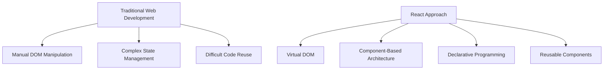
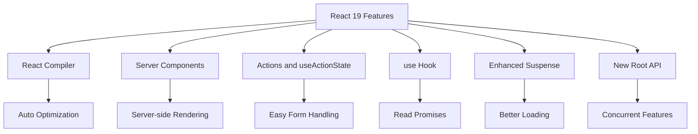

# Day 1 - Hour 1: React Fundamentals & React 19 Introduction

## 🎯 Learning Objectives
By the end of this hour, you will:
- Understand what React is and why it's revolutionary
- Set up a React development environment
- Learn React fundamentals: Components, JSX, Props, and State
- Understand the React component lifecycle
- Get introduced to React 19's revolutionary new features

---

## 📚 What is React?

React is a **JavaScript library** for building user interfaces, particularly web applications. Think of it as a tool that helps you create interactive websites more efficiently.

### 🤔 Why React?



**Before React (Traditional Approach):**
```javascript
// Traditional JavaScript - Complex and Error-prone
document.getElementById('counter').innerHTML = count;
document.getElementById('button').addEventListener('click', function() {
    count++;
    document.getElementById('counter').innerHTML = count;
});
```

**With React:**
```jsx
// React - Simple and Declarative
function Counter() {
    const [count, setCount] = useState(0);
    return (
        <div>
            <p>{count}</p>
            <button onClick={() => setCount(count + 1)}>
                Increment
            </button>
        </div>
    );
}
```

---

## 🚀 Setting Up React Development Environment

### Method 1: Create React App (Recommended for Learning)
```bash
# Install Node.js first (from nodejs.org)
# Then create a new React app
npx create-react-app my-first-react-app
cd my-first-react-app
npm start
```

### Method 2: Vite (Modern and Fast)
```bash
npm create vite@latest my-react-app -- --template react
cd my-react-app
npm install
npm run dev
```

---

## 🧩 React Fundamentals

### 1. Components - The Building Blocks

Think of components as **custom HTML elements** that you can reuse:

```jsx
// Function Component (Modern Approach)
function Welcome(props) {
    return <h1>Hello, {props.name}!</h1>;
}

// Usage
function App() {
    return (
        <div>
            <Welcome name="Faculty" />
            <Welcome name="Students" />
        </div>
    );
}
```

### 2. JSX - JavaScript XML

JSX lets you write HTML-like syntax in JavaScript:

```jsx
// JSX
const element = <h1>Hello, World!</h1>;

// What JSX compiles to (behind the scenes)
const element = React.createElement('h1', null, 'Hello, World!');
```

**JSX Rules:**
- Must return a single parent element
- Use `className` instead of `class`
- Use `camelCase` for attributes
- Self-closing tags must end with `/>`

```jsx
// ✅ Correct JSX
function MyComponent() {
    return (
        <div className="container">
            <h1>Title</h1>
            
            <input type="text" />
        </div>
    );
}

// ❌ Incorrect JSX
function BadComponent() {
    return (
        <h1>Title</h1>
        <p>Paragraph</p> // Multiple elements without wrapper
    );
}
```

### 3. Props - Passing Data to Components

Props are like **function parameters** for components:

```jsx
// Parent Component
function App() {
    const user = {
        name: "Dr. Smith",
        role: "Professor",
        department: "Computer Science"
    };
    
    return <UserCard user={user} isActive={true} />;
}

// Child Component
function UserCard({ user, isActive }) {
    return (
        <div className={`user-card ${isActive ? 'active' : ''}`}>
            <h2>{user.name}</h2>
            <p>{user.role}</p>
            <p>{user.department}</p>
        </div>
    );
}
```

### 4. State - Component Memory

State allows components to "remember" things:

```jsx
import { useState } from 'react';

function Counter() {
    // useState returns [currentValue, setterFunction]
    const [count, setCount] = useState(0);
    const [message, setMessage] = useState('Welcome!');
    
    const handleIncrement = () => {
        setCount(count + 1);
        setMessage(`Count is now ${count + 1}`);
    };
    
    return (
        <div>
            <h2>{message}</h2>
            <p>Current count: {count}</p>
            <button onClick={handleIncrement}>
                Increment
            </button>
        </div>
    );
}
```

---

## 🎯 Practical Exercise: Student Information Card

Let's build a practical component that displays student information:

```jsx
import { useState } from 'react';

function StudentCard() {
    const [student, setStudent] = useState({
        name: '',
        rollNumber: '',
        branch: 'Computer Science',
        year: '1st Year'
    });
    
    const [isEditing, setIsEditing] = useState(false);
    
    const handleInputChange = (field, value) => {
        setStudent(prev => ({
            ...prev,
            [field]: value
        }));
    };
    
    return (
        <div className="student-card">
            <h2>Student Information</h2>
            
            {isEditing ? (
                <div>
                    <input
                        type="text"
                        placeholder="Student Name"
                        value={student.name}
                        onChange={(e) => handleInputChange('name', e.target.value)}
                    />
                    <input
                        type="text"
                        placeholder="Roll Number"
                        value={student.rollNumber}
                        onChange={(e) => handleInputChange('rollNumber', e.target.value)}
                    />
                    <select
                        value={student.branch}
                        onChange={(e) => handleInputChange('branch', e.target.value)}
                    >
                        <option>Computer Science</option>
                        <option>Information Technology</option>
                        <option>Electronics</option>
                    </select>
                    <button onClick={() => setIsEditing(false)}>
                        Save
                    </button>
                </div>
            ) : (
                <div>
                    <p><strong>Name:</strong> {student.name || 'Not provided'}</p>
                    <p><strong>Roll No:</strong> {student.rollNumber || 'Not provided'}</p>
                    <p><strong>Branch:</strong> {student.branch}</p>
                    <p><strong>Year:</strong> {student.year}</p>
                    <button onClick={() => setIsEditing(true)}>
                        Edit
                    </button>
                </div>
            )}
        </div>
    );
}
```

---

## 🆕 Introduction to React 19

React 19 introduced several revolutionary features that fundamentally change how we build React applications, making them more intuitive and performant.

### Key React 19 Features Overview



### 1. New Root API (Enhanced from React 18)

**React 19 with enhanced concurrent features:**
```jsx
import { createRoot } from 'react-dom/client';
import App from './App';

const container = document.getElementById('root');
const root = createRoot(container);
root.render(<App />);
```

### 2. React Compiler (Automatic Optimization)

React 19's compiler automatically makes your code faster - no extra work needed!

```jsx
// You write simple code like this:
function StudentList({ students }) {
    return (
        <div>
            {students.map(student => (
                <div key={student.id}>
                    <h3>{student.name}</h3>
                    <p>Grade: {student.grade}</p>
                </div>
            ))}
        </div>
    );
}

// React 19 Compiler automatically optimizes it behind the scenes!
// No need for memo, useMemo, useCallback anymore
```

### 3. useActionState Hook (Easy Form Handling)

New hook makes form submission super simple:

```jsx
import { useActionState } from 'react';

function SimpleForm() {
    const [state, submitAction, isPending] = useActionState(
        async (prevState, formData) => {
            const name = formData.get('name');
            // Simulate saving to database
            await new Promise(resolve => setTimeout(resolve, 1000));
            return { message: `Hello ${name}!`, success: true };
        },
        { message: '', success: false }
    );
    
    return (
        <form action={submitAction}>
            <input name="name" placeholder="Your name" required />
            <button disabled={isPending}>
                {isPending ? 'Saving...' : 'Submit'}
            </button>
            {state.message && <p>{state.message}</p>}
        </form>
    );
}
```

### 4. The use() Hook (Read Promises Easily)

The `use()` hook lets you read data directly from promises:

```jsx
import { use, Suspense } from 'react';

// Simple data fetching function
async function getStudentName(id) {
    await new Promise(resolve => setTimeout(resolve, 500));
    return `Student ${id}`;
}

function StudentName({ studentId }) {
    // use() hook reads the promise directly!
    const name = use(getStudentName(studentId));
    return <h2>{name}</h2>;
}

function App() {
    return (
        <Suspense fallback={<p>Loading...</p>}>
            <StudentName studentId={123} />
        </Suspense>
    );
}
```

### 5. Enhanced Suspense (Better Loading)

Suspense now handles loading states more smoothly:

```jsx
import { Suspense } from 'react';

function LoadingSpinner() {
    return <div>⏳ Loading student data...</div>;
}

function StudentDashboard() {
    return (
        <div>
            <h1>Students</h1>
            <Suspense fallback={<LoadingSpinner />}>
                <StudentName studentId={1} />
                <StudentName studentId={2} />
            </Suspense>
        </div>
    );
}
```

---

## 💡 Best Practices for Beginners

### 1. Component Naming
```jsx
// ✅ Good - PascalCase for components
function StudentList() { }
function UserProfile() { }

// ❌ Bad - lowercase
function studentlist() { }
```

### 2. State Management
```jsx
// ✅ Good - Use functional updates for dependent state
setCount(prevCount => prevCount + 1);

// ❌ Avoid - Direct state mutation
// Don't do: count++; setCount(count);
```

### 3. Event Handling
```jsx
// ✅ Good - Arrow functions for simple handlers
<button onClick={() => setCount(count + 1)}>Click</button>

// ✅ Good - Separate function for complex logic
const handleComplexClick = () => {
    // Complex logic here
    setCount(count + 1);
    setMessage('Updated!');
};
```

---

## 🎯 Hour 1 Summary

**What We Covered:**
- ✅ React fundamentals: Components, JSX, Props, State
- ✅ Setting up React development environment
- ✅ Building a practical Student Information Card
- ✅ Introduction to React 19's revolutionary features
- ✅ Best practices for modern React development

**Key Takeaways:**
1. React makes UI development more predictable and efficient
2. Components are reusable building blocks
3. State allows components to remember and change data
4. React 19 brings automatic optimization and better developer experience
5. New hooks like `useActionState` and `use()` simplify complex patterns

---

## 🚀 Next Hour Preview

In Hour 2, we'll dive deep into:
- **React Compiler** - How React 19 automatically optimizes your code
- **Server Components** - Running React on the server
- **Actions & useActionState** - Revolutionary form handling
- **Advanced Suspense** - Better loading and error states

---

## 💻 Quick Practice Challenge

Before moving to Hour 2, try to:
1. Create a `TeacherProfile` component with name, subject, and experience
2. Try using the new `useActionState` hook for a simple form
3. Experiment with the React 19 root API in your index.js

**Bonus Challenge:** Create a simple student registration form using `useActionState`!
