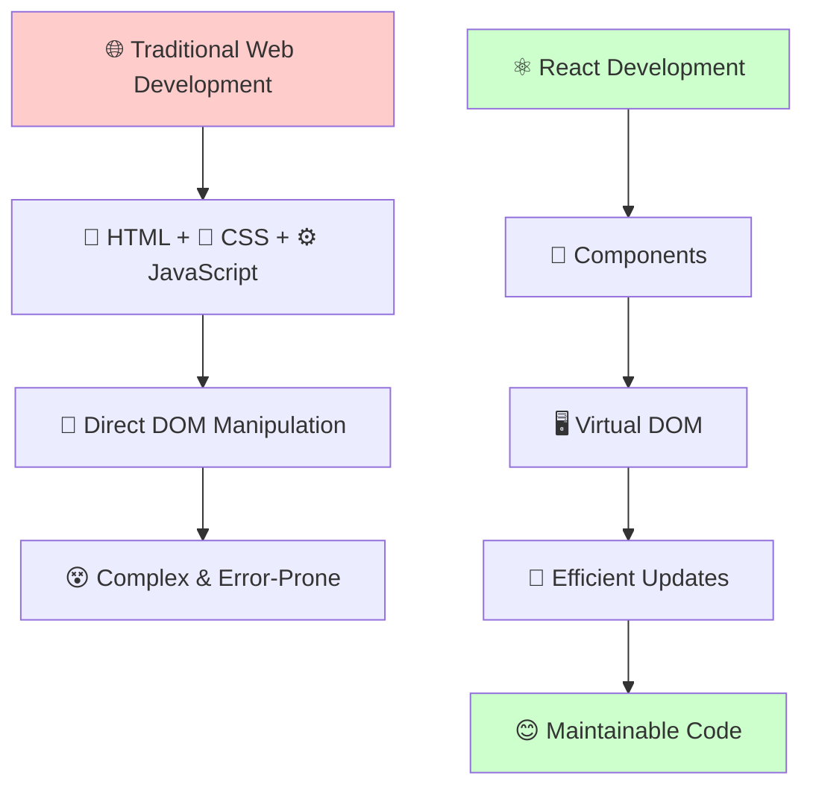
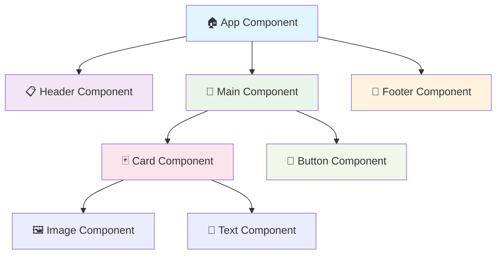
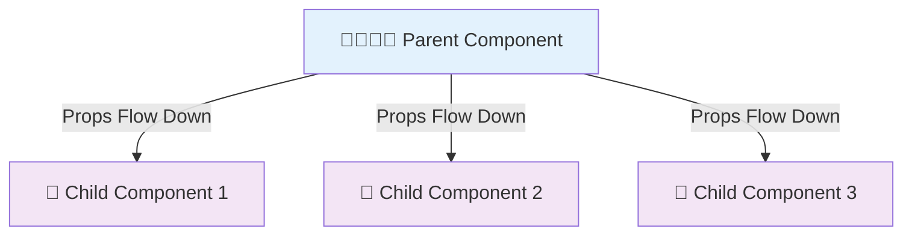
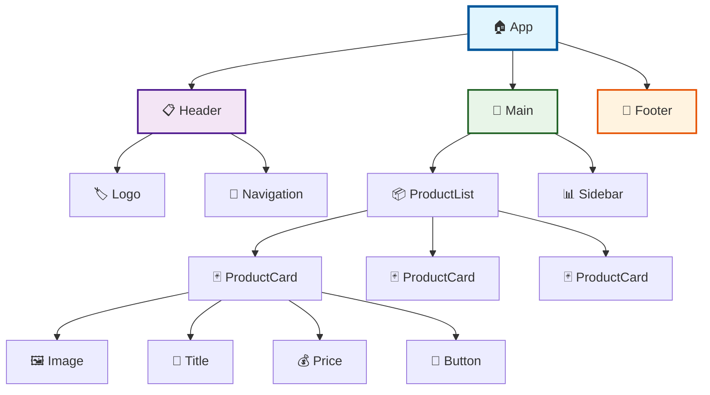
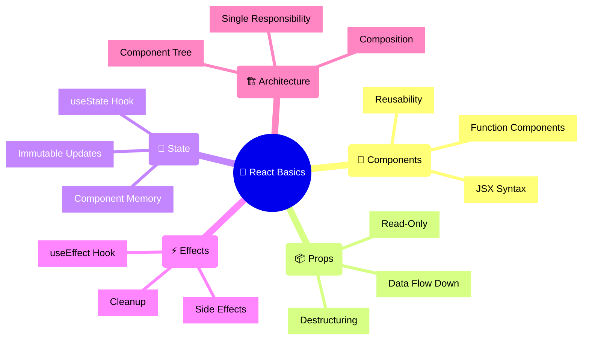

# Day 1 Part 1: React Basics & Hooks 🚀
## Faculty Development Program - Full Stack Development

---

## Table of Contents
1. [What is React?](#what-is-react)
2. [Setting Up React](#setting-up-react)
3. [Components Fundamentals](#components-fundamentals)
4. [JSX Syntax](#jsx-syntax)
5. [Props and State](#props-and-state)
6. [React Hooks](#react-hooks)
7. [Component Architecture](#component-architecture)
8. [Practical Examples](#practical-examples)

---

## What is React? 🤔

React is a JavaScript library for building user interfaces, particularly web applications. Think of it as a tool that helps you create interactive websites by breaking them into smaller, reusable pieces called **components**.

> 💡 **Think of React like LEGO blocks**: Each component is like a LEGO piece that you can combine to build complex structures (websites)!

### Key Concepts:
- **🧩 Component-Based**: Build encapsulated components that manage their own state
- **⚡ Virtual DOM**: React creates a virtual representation of the DOM for better performance
- **📝 Declarative**: You describe what the UI should look like, React handles the how



### 🎯 Why React?
- **🔄 Reusability**: Write once, use everywhere
- **⚡ Performance**: Virtual DOM makes updates fast
- **🧠 Easy to Learn**: JavaScript + HTML-like syntax
- **🌍 Popular**: Used by Facebook, Netflix, Airbnb, and more!

---

## Setting Up React 🛠️

### Method 1: Create React App (🏆 Recommended for beginners)
```bash
npx create-react-app my-first-app
cd my-first-app
npm start
```

> 💡 **Pro Tip**: `npx` downloads and runs the latest version without installing globally!

### Method 2: Basic HTML Setup (for understanding)
```html
<!DOCTYPE html>
<html>
<head>
    <title>My First React App 🚀</title>
    <script crossorigin src="https://unpkg.com/react@17/umd/react.development.js"></script>
    <script crossorigin src="https://unpkg.com/react-dom@17/umd/react-dom.development.js"></script>
    <script src="https://unpkg.com/@babel/standalone/babel.min.js"></script>
</head>
<body>
    <div id="root"><!-- React will render here --></div>
    <script type="text/babel">
        function App() {
            return <h1>Hello, React! 👋</h1>;
        }
        
        ReactDOM.render(<App />, document.getElementById('root'));
    </script>
</body>
</html>
```

---

## Components Fundamentals 🧩

### What is a Component?
A component is like a custom HTML element that you can reuse. It's a function that returns JSX (JavaScript XML).



### Function Components (🆕 Modern Approach)
```jsx
// 🎯 Simple component
function Welcome() {
    return <h1>Hello, World! 🌍</h1>;
}

// 🏹 Arrow function component (same thing, different syntax)
const Greeting = () => {
    return <p>Welcome to React! 🎉</p>;
}

// 📦 Component with props (parameters)
function UserCard(props) {
    return (
        <div className="card">
            <h2>👤 {props.name}</h2>
            <p>📧 {props.email}</p>
            <p>🎂 Age: {props.age}</p>
        </div>
    );
}

// 🎨 Using the component
function App() {
    return (
        <div>
            <Welcome />
            <Greeting />
            <UserCard name="Alice" email="alice@example.com" age={25} />
        </div>
    );
}
```

> 🎯 **Remember**: Component names MUST start with a capital letter! `<welcome />` won't work, but `<Welcome />` will.

---

## JSX Syntax 📝

JSX looks like HTML but it's actually JavaScript. Here are the key differences:

### 🔑 JSX Rules:
1. **`className`** instead of **`class`** (because `class` is a JavaScript keyword)
2. **camelCase** for attributes (`onClick`, not `onclick`)
3. **Self-closing tags** must end with `/>`
4. **JavaScript expressions** go in `{}`
5. **Return one parent element** or use `<>` (Fragment)

```jsx
// ❌ Wrong - Don't do this!
function BadExample() {
    return (
        <div class="container">          // ❌ Should be className
            <input type="text">          // ❌ Should be self-closing
                    // ❌ Should be self-closing
            <div onclick="doSomething"> // ❌ Should be onClick
        </div>
    );
}

// ✅ Correct - Do this!
function GoodExample() {
    const title = "My Awesome App";
    const isActive = true;
    
    return (
        <div className="container">
            <h1>{title} 🚀</h1>
            <input type="text" placeholder="Enter something..." />
            
            <button onClick={() => console.log('Clicked!')}>
                Click me! 👆
            </button>
            <div className={isActive ? 'active' : 'inactive'}>
                Status: {isActive ? '✅ Online' : '❌ Offline'}
            </div>
        </div>
    );
}
```

### 🎭 JSX Expressions & Conditional Rendering
```jsx
function ExpressionExample() {
    const user = { name: "John", age: 25, isVip: true };
    const numbers = [1, 2, 3, 4, 5];
    
    return (
        <div>
            <h1>Welcome {user.name}! 👋</h1>
            <p>🎂 Age: {user.age}</p>
            <p>⭐ Status: {user.isVip ? 'VIP Member' : 'Regular Member'}</p>
            <p>🎲 Random number: {Math.floor(Math.random() * 100)}</p>
            
            {/* Conditional rendering */}
            {user.isVip && <div className="vip-badge">⭐ VIP</div>}
            
            {/* Rendering lists */}
            <ul>
                {numbers.map(num => (
                    <li key={num}>Number: {num}</li>
                ))}
            </ul>
        </div>
    );
}
```

> ⚠️ **Important**: Always provide a `key` prop when rendering lists. React needs this for efficient updates!

---

## Props and State 📦💾

### Props (Properties) 📦
Props are like function parameters - they pass data from parent to child components.



```jsx
// 👨‍👩‍👧‍👦 Parent Component
function App() {
    return (
        <div>
            <h1>🎓 Student Dashboard</h1>
            <StudentCard 
                name="Alice" 
                grade="A+" 
                subject="Mathematics" 
                emoji="🧮"
            />
            <StudentCard 
                name="Bob" 
                grade="B" 
                subject="Science" 
                emoji="🔬"
            />
            <StudentCard 
                name="Charlie" 
                grade="A" 
                subject="History" 
                emoji="📚"
            />
        </div>
    );
}

// 👶 Child Component
function StudentCard(props) {
    return (
        <div className="student-card">
            <h3>{props.emoji} {props.name}</h3>
            <p>📊 Grade: {props.grade}</p>
            <p>📖 Subject: {props.subject}</p>
        </div>
    );
}

// 🎯 With destructuring (cleaner approach)
function StudentCard({ name, grade, subject, emoji }) {
    return (
        <div className="student-card">
            <h3>{emoji} {name}</h3>
            <p>📊 Grade: {grade}</p>
            <p>📖 Subject: {subject}</p>
        </div>
    );
}
```

> 💡 **Props are Read-Only**: Components must never modify their own props. Think of them as function parameters!

### State (Component Memory) 💾
State is like a component's memory - it remembers values that can change over time.

---

## React Hooks 🎣

Hooks are special functions that let you "hook into" React features. They start with "use".

> 🎣 **Think of Hooks**: Like fishing hooks that let you catch React features and use them in your components!

### useState Hook 🔢
The most important hook - it adds state to function components.

```jsx
import { useState } from 'react';

function Counter() {
    // 🎯 useState returns [currentValue, setterFunction]
    const [count, setCount] = useState(0); // Start with 0
    
    return (
        <div className="counter">
            <h2>🔢 Counter App</h2>
            <p className="count-display">Count: {count}</p>
            
            <div className="button-group">
                <button 
                    onClick={() => setCount(count + 1)}
                    className="btn-increment"
                >
                    ➕ Increment
                </button>
                
                <button 
                    onClick={() => setCount(count - 1)}
                    className="btn-decrement"
                >
                    ➖ Decrement
                </button>
                
                <button 
                    onClick={() => setCount(0)}
                    className="btn-reset"
                >
                    🔄 Reset
                </button>
            </div>
        </div>
    );
}
```

### useState with Different Data Types 📊
```jsx
function StateExamples() {
    // 🔢 Number state
    const [age, setAge] = useState(25);
    
    // 📝 String state
    const [name, setName] = useState('');
    
    // ✅ Boolean state
    const [isVisible, setIsVisible] = useState(true);
    
    // 📋 Array state
    const [items, setItems] = useState(['apple', 'banana']);
    
    // 📦 Object state
    const [user, setUser] = useState({
        name: 'John',
        email: 'john@example.com',
        age: 30
    });
    
    // 🔧 Functions to update state
    const addItem = () => {
        setItems([...items, 'orange']); // ✅ Spread operator
    };
    
    const updateUserName = (newName) => {
        setUser({
            ...user,        // ✅ Keep other properties
            name: newName   // 🎯 Update only name
        });
    };
    
    return (
        <div>
            <h3>👤 Name: {user.name}</h3>
            <p>🎂 Age: {age}</p>
            <p>👁️ Visible: {isVisible ? 'Yes' : 'No'}</p>
            <ul>
                {items.map((item, index) => (
                    <li key={index}>🍎 {item}</li>
                ))}
            </ul>
        </div>
    );
}
```

> ⚠️ **Never Mutate State Directly**: Always use the setter function! Don't do `items.push('orange')`, do `setItems([...items, 'orange'])`.

### useEffect Hook ⚡
Used for side effects like API calls, timers, or cleanup.

```jsx
import { useState, useEffect } from 'react';

function Timer() {
    const [seconds, setSeconds] = useState(0);
    const [isRunning, setIsRunning] = useState(true);
    
    // 🎯 Effect runs after every render
    useEffect(() => {
        let interval = null;
        
        if (isRunning) {
            interval = setInterval(() => {
                setSeconds(prev => prev + 1);
            }, 1000);
        }
        
        // 🧹 Cleanup function (important!)
        return () => {
            if (interval) {
                clearInterval(interval);
            }
        };
    }, [isRunning]); // ⚡ Dependency array - effect runs when isRunning changes
    
    const formatTime = (seconds) => {
        const mins = Math.floor(seconds / 60);
        const secs = seconds % 60;
        return `${mins.toString().padStart(2, '0')}:${secs.toString().padStart(2, '0')}`;
    };
    
    return (
        <div className="timer">
            <h2>⏱️ Timer</h2>
            <div className="time-display">
                {formatTime(seconds)}
            </div>
            
            <div className="controls">
                <button onClick={() => setIsRunning(!isRunning)}>
                    {isRunning ? '⏸️ Pause' : '▶️ Start'}
                </button>
                
                <button onClick={() => {
                    setSeconds(0);
                    setIsRunning(false);
                }}>
                    🔄 Reset
                </button>
            </div>
        </div>
    );
}
```

### useEffect Patterns 🎨
```jsx
function EffectPatterns() {
    const [data, setData] = useState(null);
    const [loading, setLoading] = useState(true);
    
    // 📱 Run once on component mount
    useEffect(() => {
        console.log('Component mounted! 🚀');
        
        // 🧹 Cleanup on unmount
        return () => {
            console.log('Component will unmount! 👋');
        };
    }, []); // ⚡ Empty dependency array = run once
    
    // 📊 Run when specific value changes
    useEffect(() => {
        if (data) {
            console.log('Data updated:', data);
        }
    }, [data]); // ⚡ Runs when 'data' changes
    
    // 🌐 Simulated API call
    useEffect(() => {
        const fetchData = async () => {
            setLoading(true);
            // Simulate API delay
            await new Promise(resolve => setTimeout(resolve, 2000));
            setData({ message: 'Hello from API! 📡' });
            setLoading(false);
        };
        
        fetchData();
    }, []);
    
    if (loading) {
        return <div>⏳ Loading...</div>;
    }
    
    return (
        <div>
            <h3>📊 Data from API:</h3>
            <p>{data?.message}</p>
        </div>
    );
}
```

---

## Component Architecture 🏗️

### Component Hierarchy 🌳


### 🎯 Best Practices:
1. **🎯 Single Responsibility**: Each component should do one thing well
2. **🔄 Reusability**: Make components reusable with props
3. **🧩 Composition**: Build complex UIs from simple components
4. **📏 Small Components**: Keep components small and focused

```jsx
// ❌ Too much responsibility - DON'T do this!
function MessyComponent() {
    const [users, setUsers] = useState([]);
    const [products, setProducts] = useState([]);
    const [orders, setOrders] = useState([]);
    const [notifications, setNotifications] = useState([]);
    
    // 50+ lines of mixed logic for users, products, orders...
    
    return (
        <div>
            {/* Handling users, products, orders, and notifications */}
            {/* This component does too many things! */}
        </div>
    );
}

// ✅ Single responsibility - DO this!
function UserList({ users }) {
    return (
        <div className="user-list">
            <h2>👥 Users</h2>
            {users.map(user => (
                <UserCard key={user.id} user={user} />
            ))}
        </div>
    );
}

function UserCard({ user }) {
    return (
        <div className="user-card">
            
            <h3>👤 {user.name}</h3>
            <p>📧 {user.email}</p>
            <p>🏢 {user.department}</p>
        </div>
    );
}

// 🎯 Reusable Button Component
function Button({ children, onClick, variant = 'primary', disabled = false }) {
    const baseClass = 'btn';
    const variantClass = `btn-${variant}`;
    
    return (
        <button 
            className={`${baseClass} ${variantClass} ${disabled ? 'disabled' : ''}`}
            onClick={onClick}
            disabled={disabled}
        >
            {children}
        </button>
    );
}

// 🎨 Usage of reusable button
function ButtonExamples() {
    return (
        <div>
            <Button onClick={() => alert('Primary!')}>
                🚀 Primary Button
            </Button>
            
            <Button variant="secondary" onClick={() => alert('Secondary!')}>
                ⚙️ Secondary Button
            </Button>
            
            <Button variant="danger" onClick={() => alert('Danger!')}>
                ⚠️ Delete
            </Button>
            
            <Button disabled>
                ❌ Disabled Button
            </Button>
        </div>
    );
}
```

---

## Practical Examples 💻

### 🎯 Example 1: Todo List (Complete Beginner Project)

```jsx
import { useState } from 'react';

function TodoApp() {
    const [todos, setTodos] = useState([]);
    const [inputValue, setInputValue] = useState('');
    
    const addTodo = () => {
        if (inputValue.trim()) {
            const newTodo = {
                id: Date.now(), // Simple ID generation
                text: inputValue,
                completed: false,
                createdAt: new Date().toLocaleString()
            };
            
            setTodos([...todos, newTodo]);
            setInputValue(''); // Clear input
        }
    };
    
    const toggleTodo = (id) => {
        setTodos(todos.map(todo =>
            todo.id === id 
                ? { ...todo, completed: !todo.completed }
                : todo
        ));
    };
    
    const deleteTodo = (id) => {
        setTodos(todos.filter(todo => todo.id !== id));
    };
    
    const completedCount = todos.filter(todo => todo.completed).length;
    
    return (
        <div className="todo-app">
            <h1>📝 My Todo List</h1>
            
            <div className="stats">
                <p>📊 Total: {todos.length} | ✅ Completed: {completedCount} | ⏳ Remaining: {todos.length - completedCount}</p>
            </div>
            
            <div className="input-section">
                <input
                    type="text"
                    value={inputValue}
                    onChange={(e) => setInputValue(e.target.value)}
                    placeholder="Add a new todo... ✍️"
                    onKeyPress={(e) => e.key === 'Enter' && addTodo()}
                />
                <button onClick={addTodo} disabled={!inputValue.trim()}>
                    ➕ Add
                </button>
            </div>
            
            <div className="todo-list">
                {todos.length === 0 ? (
                    <p className="empty-state">🎉 No todos yet! Add one above.</p>
                ) : (
                    todos.map(todo => (
                        <TodoItem
                            key={todo.id}
                            todo={todo}
                            onToggle={toggleTodo}
                            onDelete={deleteTodo}
                        />
                    ))
                )}
            </div>
        </div>
    );
}

// 🎯 Separate component for each todo item
function TodoItem({ todo, onToggle, onDelete }) {
    return (
        <div className={`todo-item ${todo.completed ? 'completed' : ''}`}>
            <div className="todo-content">
                <input
                    type="checkbox"
                    checked={todo.completed}
                    onChange={() => onToggle(todo.id)}
                />
                <span 
                    className="todo-text"
                    style={{ 
                        textDecoration: todo.completed ? 'line-through' : 'none',
                        opacity: todo.completed ? 0.6 : 1
                    }}
                >
                    {todo.text}
                </span>
                <small className="todo-date">📅 {todo.createdAt}</small>
            </div>
            
            <div className="todo-actions">
                <button 
                    onClick={() => onToggle(todo.id)}
                    className={todo.completed ? 'btn-undo' : 'btn-complete'}
                >
                    {todo.completed ? '↩️ Undo' : '✅ Complete'}
                </button>
                <button 
                    onClick={() => onDelete(todo.id)}
                    className="btn-delete"
                >
                    🗑️ Delete
                </button>
            </div>
        </div>
    );
}
```

### 🎯 Example 2: Interactive Profile Card

```jsx
import { useState } from 'react';

function ProfileCard() {
    const [isEditing, setIsEditing] = useState(false);
    const [profile, setProfile] = useState({
        name: 'John Doe',
        email: 'john@example.com',
        bio: 'Full Stack Developer 💻',
        location: 'San Francisco, CA',
        avatar: '👨‍💻'
    });
    
    const [tempProfile, setTempProfile] = useState({ ...profile });
    
    const handleEdit = () => {
        setIsEditing(true);
        setTempProfile({ ...profile }); // Backup current values
    };
    
    const handleSave = () => {
        setProfile({ ...tempProfile });
        setIsEditing(false);
    };
    
    const handleCancel = () => {
        setTempProfile({ ...profile }); // Restore original values
        setIsEditing(false);
    };
    
    const updateTempProfile = (field, value) => {
        setTempProfile(prev => ({
            ...prev,
            [field]: value
        }));
    };
    
    return (
        <div className="profile-card">
            <div className="avatar-section">
                <div className="avatar">{profile.avatar}</div>
                {isEditing && (
                    <div className="avatar-picker">
                        {['👨‍💻', '👩‍💻', '🧑‍🎓', '👨‍🎨', '👩‍🔬'].map(emoji => (
                            <button
                                key={emoji}
                                onClick={() => updateTempProfile('avatar', emoji)}
                                className={tempProfile.avatar === emoji ? 'selected' : ''}
                            >
                                {emoji}
                            </button>
                        ))}
                    </div>
                )}
            </div>
            
            <div className="profile-info">
                {isEditing ? (
                    <div className="edit-form">
                        <input
                            type="text"
                            value={tempProfile.name}
                            onChange={(e) => updateTempProfile('name', e.target.value)}
                            placeholder="Your name"
                        />
                        <input
                            type="email"
                            value={tempProfile.email}
                            onChange={(e) => updateTempProfile('email', e.target.value)}
                            placeholder="Your email"
                        />
                        <textarea
                            value={tempProfile.bio}
                            onChange={(e) => updateTempProfile('bio', e.target.value)}
                            placeholder="Tell us about yourself"
                            rows="3"
                        />
                        <input
                            type="text"
                            value={tempProfile.location}
                            onChange={(e) => updateTempProfile('location', e.target.value)}
                            placeholder="Your location"
                        />
                    </div>
                ) : (
                    <div className="display-info">
                        <h2>👤 {profile.name}</h2>
                        <p>📧 {profile.email}</p>
                        <p>📝 {profile.bio}</p>
                        <p>📍 {profile.location}</p>
                    </div>
                )}
            </div>
            
            <div className="actions">
                {isEditing ? (
                    <div className="edit-actions">
                        <button onClick={handleSave} className="btn-save">
                            💾 Save
                        </button>
                        <button onClick={handleCancel} className="btn-cancel">
                            ❌ Cancel
                        </button>
                    </div>
                ) : (
                    <button onClick={handleEdit} className="btn-edit">
                        ✏️ Edit Profile
                    </button>
                )}
            </div>
        </div>
    );
}
```

---

## 🎯 Key Takeaways



### 🎯 Remember These Points:
1. **🧩 React is Component-Based**: Everything is a component
2. **📦 Props flow down**: Data flows from parent to child
3. **💾 State is local**: Each component manages its own state
4. **🎣 Hooks add power**: useState and useEffect are your best friends
5. **📝 JSX is not HTML**: Remember the syntax differences (className, camelCase)
6. **🧠 Think in React**: Break UI into components, identify state, find where state should live

### 🚨 Common Mistakes to Avoid:
- ❌ Mutating state directly: `state.push()` 
- ✅ Use setter: `setState([...state, newItem])`
- ❌ Forgetting keys in lists
- ❌ Using `class` instead of `className`
- ❌ Not cleaning up effects

---

## 🚀 Next Steps
In the next session, we'll learn about **Redux** - a state management library that helps manage application state across multiple components when your app grows bigger!

---

## 🏃‍♂️ Practice Exercises

### 🟢 Beginner Level:
1. **🧮 Calculator**: Create a simple calculator with +, -, *, / operations
2. **🌈 Color Picker**: Build a component that changes background color
3. **📊 Survey Form**: Create a form with different input types

### 🟡 Intermediate Level:
4. **🛒 Shopping Cart**: Build a shopping cart with add/remove items
5. **📝 Note Taking App**: Create, edit, and delete notes
6. **🎮 Memory Game**: Build a simple card matching game

### 🔴 Advanced Level:
7. **📅 Calendar**: Build a monthly calendar view
8. **📈 Dashboard**: Create a dashboard with multiple widgets
9. **🎯 Quiz App**: Build an interactive quiz with scores

> 💡 **Remember**: The best way to learn React is by building projects! Start small and gradually add features. 🚀

---
