# Day 1 Part 1: React Basics & Hooks 🚀
## Faculty Development Program - Full Stack Development

---

## What is React? 🤔

React is a JavaScript library for building user interfaces. Think of it as **LEGO blocks** 🧩 - you build complex websites by combining smaller, reusable pieces called **components**.

> 💡 **Key Point**: React makes websites interactive and dynamic!

```mermaid
graph LR
    A[🌐 Website] --> B[🧩 Component 1]
    A --> C[🧩 Component 2] 
    A --> D[🧩 Component 3]
    B --> E[Smaller Parts]
    C --> F[Smaller Parts]
```



### Why React? 🎯
- **🔄 Reusable**: Write once, use everywhere
- **⚡ Fast**: Updates only what changes
- **🧠 Easy**: JavaScript + HTML-like syntax
- **🌍 Popular**: Used by Facebook, Netflix, Instagram

---

## Setting Up React 🛠️

### Quick Start (Recommended):
```bash
npx create-react-app my-app
cd my-app
npm start
```

### Basic HTML Setup:
```html
<!DOCTYPE html>
<html>
<head>
    <script src="https://unpkg.com/react@17/umd/react.development.js"></script>
    <script src="https://unpkg.com/react-dom@17/umd/react-dom.development.js"></script>
    <script src="https://unpkg.com/@babel/standalone/babel.min.js"></script>
</head>
<body>
    <div id="root"></div>
    <script type="text/babel">
        function App() {
            return <h1>Hello React! 👋</h1>;
        }
        ReactDOM.render(<App />, document.getElementById('root'));
    </script>
</body>
</html>
```

---

## Components - The Building Blocks 🧩

### What is a Component?
A component is a function that returns JSX (looks like HTML).

```jsx
// Simple component
function Welcome() {
    return <h1>Hello World! 🌍</h1>;
}

// Component with emoji
function Greeting() {
    return <p>Welcome to React! 🎉</p>;
}
```

### Using Components:
```jsx
function App() {
    return (
        <div>
            <Welcome />
            <Greeting />
        </div>
    );
}
```

> ⚠️ **Important**: Component names MUST start with capital letter!

---

## JSX - HTML in JavaScript 📝

JSX looks like HTML but has some differences:

### Key Rules:
- Use `className` instead of `class`
- Self-closing tags need `/>`
- JavaScript goes in `{}`
- Return one parent element

```jsx
// ❌ Wrong
function Bad() {
    return (
        <div class="container">
            <input type="text">
            
        </div>
    );
}

// ✅ Correct
function Good() {
    const name = "John";
    return (
        <div className="container">
            <h1>Hello {name}! 👋</h1>
            <input type="text" />
            
        </div>
    );
}
```

### JavaScript in JSX:
```jsx
function Example() {
    const user = "Alice";
    const age = 25;
    const isOnline = true;
    
    return (
        <div>
            <h1>User: {user}</h1>
            <p>Age: {age}</p>
            <p>Status: {isOnline ? "🟢 Online" : "🔴 Offline"}</p>
            <p>Random: {Math.random()}</p>
        </div>
    );
}
```

---

## Props - Passing Data 📦

Props are like function parameters. They pass data from parent to child.

```mermaid
graph TD
    A[👨‍👩‍👧‍👦 Parent] -->|Props| B[👶 Child 1]
    A -->|Props| C[👶 Child 2]
```



### Example:
```jsx
// Parent component
function App() {
    return (
        <div>
            <UserCard name="Alice" age={25} city="New York" />
            <UserCard name="Bob" age={30} city="London" />
        </div>
    );
}

// Child component
function UserCard(props) {
    return (
        <div className="card">
            <h2>👤 {props.name}</h2>
            <p>🎂 Age: {props.age}</p>
            <p>🏙️ City: {props.city}</p>
        </div>
    );
}

// Cleaner way (destructuring)
function UserCard({ name, age, city }) {
    return (
        <div className="card">
            <h2>👤 {name}</h2>
            <p>🎂 Age: {age}</p>
            <p>🏙️ City: {city}</p>
        </div>
    );
}
```

> 💡 **Remember**: Props are read-only! Don't change them.

---

## State - Component Memory 💾

State is like component's memory. It stores data that can change.

### useState Hook:
```jsx
import { useState } from 'react';

function Counter() {
    // [currentValue, setterFunction] = useState(initialValue)
    const [count, setCount] = useState(0);
    
    return (
        <div>
            <h2>Count: {count}</h2>
            <button onClick={() => setCount(count + 1)}>
                ➕ Add
            </button>
            <button onClick={() => setCount(count - 1)}>
                ➖ Minus
            </button>
            <button onClick={() => setCount(0)}>
                🔄 Reset
            </button>
        </div>
    );
}
```

### Different State Types:
```jsx
function StateExamples() {
    const [name, setName] = useState('');           // String
    const [age, setAge] = useState(0);              // Number
    const [isVisible, setIsVisible] = useState(true); // Boolean
    const [items, setItems] = useState(['apple']);   // Array
    
    const addItem = () => {
        setItems([...items, 'orange']); // ✅ Create new array
    };
    
    return (
        <div>
            <input 
                value={name}
                onChange={(e) => setName(e.target.value)}
                placeholder="Enter name"
            />
            <p>Hello {name}!</p>
            <button onClick={addItem}>Add Orange</button>
            <ul>
                {items.map((item, index) => (
                    <li key={index}>{item}</li>
                ))}
            </ul>
        </div>
    );
}
```

> ⚠️ **Never change state directly**: Use the setter function!

---

## useEffect - Side Effects ⚡

useEffect handles things like API calls, timers, and cleanup.

### Basic useEffect:
```jsx
import { useState, useEffect } from 'react';

function Timer() {
    const [seconds, setSeconds] = useState(0);
    
    useEffect(() => {
        const interval = setInterval(() => {
            setSeconds(prev => prev + 1);
        }, 1000);
        
        // Cleanup function
        return () => clearInterval(interval);
    }, []); // Empty array = run once
    
    return <div>Timer: {seconds} seconds</div>;
}
```

### useEffect Patterns:
```jsx
function EffectExamples() {
    const [data, setData] = useState(null);
    
    // Run once when component mounts
    useEffect(() => {
        console.log('Component mounted!');
    }, []);
    
    // Run when data changes
    useEffect(() => {
        if (data) {
            console.log('Data updated:', data);
        }
    }, [data]);
    
    // Fetch data example
    useEffect(() => {
        const fetchData = async () => {
            // Simulate API call
            setTimeout(() => {
                setData({ message: 'Hello from API!' });
            }, 2000);
        };
        fetchData();
    }, []);
    
    return (
        <div>
            {data ? <p>{data.message}</p> : <p>Loading...</p>}
        </div>
    );
}
```

---

## Complete Example: Todo App 📝

```jsx
import { useState } from 'react';

function TodoApp() {
    const [todos, setTodos] = useState([]);
    const [input, setInput] = useState('');
    
    const addTodo = () => {
        if (input.trim()) {
            const newTodo = {
                id: Date.now(),
                text: input,
                completed: false
            };
            setTodos([...todos, newTodo]);
            setInput('');
        }
    };
    
    const toggleTodo = (id) => {
        setTodos(todos.map(todo =>
            todo.id === id 
                ? { ...todo, completed: !todo.completed }
                : todo
        ));
    };
    
    const deleteTodo = (id) => {
        setTodos(todos.filter(todo => todo.id !== id));
    };
    
    return (
        <div className="todo-app">
            <h1>📝 Todo List</h1>
            
            <div>
                <input
                    value={input}
                    onChange={(e) => setInput(e.target.value)}
                    placeholder="Add todo..."
                    onKeyPress={(e) => e.key === 'Enter' && addTodo()}
                />
                <button onClick={addTodo}>Add</button>
            </div>
            
            <div>
                {todos.map(todo => (
                    <TodoItem
                        key={todo.id}
                        todo={todo}
                        onToggle={toggleTodo}
                        onDelete={deleteTodo}
                    />
                ))}
            </div>
        </div>
    );
}

function TodoItem({ todo, onToggle, onDelete }) {
    return (
        <div className="todo-item">
            <input
                type="checkbox"
                checked={todo.completed}
                onChange={() => onToggle(todo.id)}
            />
            <span style={{
                textDecoration: todo.completed ? 'line-through' : 'none'
            }}>
                {todo.text}
            </span>
            <button onClick={() => onDelete(todo.id)}>
                🗑️ Delete
            </button>
        </div>
    );
}

export default TodoApp;
```

---

## Key Takeaways 🎯


### Remember These Rules:
1. **🧩 Components**: Start with capital letter, return JSX
2. **📦 Props**: Read-only data from parent to child
3. **💾 State**: Use useState for changing data
4. **⚡ Effects**: Use useEffect for side effects
5. **📝 JSX**: Use className, camelCase, self-closing tags
6. **🚫 Never**: Mutate state directly

### Common Mistakes:
- ❌ `<welcome />` → ✅ `<Welcome />`
- ❌ `class="btn"` → ✅ `className="btn"`
- ❌ `state.push()` → ✅ `setState([...state, item])`
- ❌ Missing `key` in lists

---

## Practice Exercises 🏃‍♂️

### Beginner:
1. **🧮 Calculator**: Simple calculator with +, -, *, /
2. **🌈 Color Picker**: Change background color
3. **📊 Survey Form**: Form with different inputs

### Intermediate:
4. **🛒 Shopping Cart**: Add/remove items, calculate total
5. **📝 Note App**: Create, edit, delete notes
6. **🎮 Memory Game**: Card matching game

---

## Next: Redux 🏪

In the next session, we'll learn **Redux** - a state management library for larger applications where multiple components need to share the same data!

> 💡 **Why Redux?** When your app grows, passing props becomes messy. Redux provides a central store for all your data.
