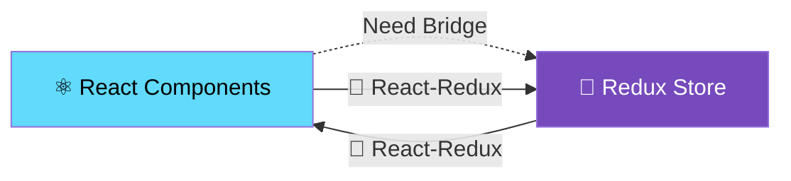
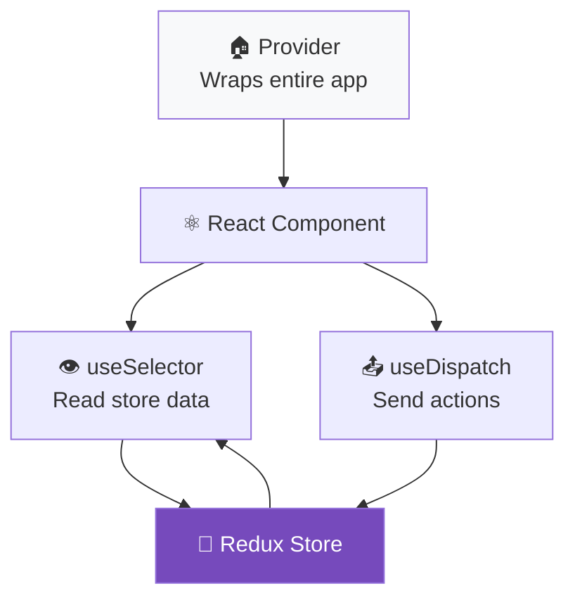
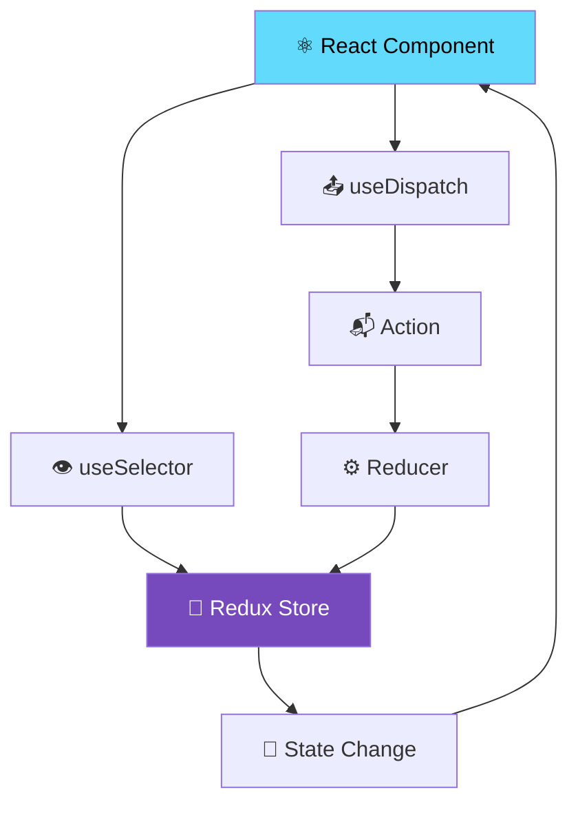

# Day 1 Part 4: React-Redux Integration & DevTools 🔗
## Faculty Development Program - Full Stack Development

---

## What is React-Redux Integration? 🤔

So far we've learned:
- **⚛️ React**: For building user interfaces with components
- **🏪 Redux**: For managing application state
- **🛠️ Redux Toolkit**: For writing Redux code efficiently

Now we need to **connect React components to Redux store** so they can:
- 📖 **Read data** from Redux store
- 📤 **Dispatch actions** to update store
- 🔄 **Re-render** when store data changes

> 💡 **Think of it as**: Building a bridge between your React components and Redux warehouse so they can communicate!



---

## Why Do We Need React-Redux? 🎯

### Without React-Redux (Manual Connection):
```javascript
// ❌ Manual way - lots of work!
function Counter() {
    const [count, setCount] = useState(0);
    
    // Manually subscribe to store
    useEffect(() => {
        const unsubscribe = store.subscribe(() => {
            const state = store.getState();
            setCount(state.counter.count);
        });
        return unsubscribe;
    }, []);
    
    // Manually dispatch actions
    const increment = () => {
        store.dispatch({ type: 'INCREMENT' });
    };
    
    return (
        <div>
            <p>Count: {count}</p>
            <button onClick={increment}>+</button>
        </div>
    );
}
```

### With React-Redux (Easy Connection):
```javascript
// ✅ React-Redux way - simple and clean!
function Counter() {
    const count = useSelector(state => state.counter.count);
    const dispatch = useDispatch();
    
    const increment = () => {
        dispatch({ type: 'INCREMENT' });
    };
    
    return (
        <div>
            <p>Count: {count}</p>
            <button onClick={increment}>+</button>
        </div>
    );
}
```

---

## React-Redux Core Concepts 🧠

### 1. Provider 🏠
**What it is**: A special React component that makes the Redux store available to all child components.

**Think of it as**: The main power outlet that supplies electricity (Redux store) to your entire house (React app).

### 2. useSelector() 👁️
**What it is**: A React hook that lets components read data from Redux store.

**Think of it as**: A window that lets you see what's inside the Redux warehouse.

### 3. useDispatch() 📤
**What it is**: A React hook that lets components send actions to Redux store.

**Think of it as**: A messenger that carries your instructions to the Redux warehouse.



---

## Setting Up React-Redux 🛠️

### Installation:
```bash
npm install react-redux
```

### Basic Setup Structure:
```javascript
// 1. Create store (we already know this!)
const store = configureStore({
    reducer: { counter: counterSlice.reducer }
});

// 2. Wrap app with Provider
function App() {
    return (
        <Provider store={store}>
            <Counter />
            <TodoList />
        </Provider>
    );
}

// 3. Use hooks in components
function Counter() {
    const count = useSelector(state => state.counter.count);
    const dispatch = useDispatch();
    // Component logic...
}
```

---

## Example 1: Simple Counter with React-Redux 🔢

### Complete Working Example:
```html
<!DOCTYPE html>
<html>
<head>
    <title>React-Redux Counter</title>
    <!-- React -->
    <script crossorigin src="https://unpkg.com/react@17/umd/react.development.js"></script>
    <script crossorigin src="https://unpkg.com/react-dom@17/umd/react-dom.development.js"></script>
    <!-- Redux Toolkit -->
    <script src="https://unpkg.com/@reduxjs/toolkit@1.9.7/dist/redux-toolkit.umd.js"></script>
    <!-- React-Redux -->
    <script src="https://unpkg.com/react-redux@8.1.3/dist/react-redux.min.js"></script>
    <!-- Babel for JSX -->
    <script src="https://unpkg.com/@babel/standalone/babel.min.js"></script>
    
    <style>
        body { font-family: Arial, sans-serif; text-align: center; padding: 50px; }
        .counter-container { max-width: 400px; margin: 0 auto; padding: 30px; border: 2px solid #ddd; border-radius: 10px; }
        .count-display { font-size: 48px; color: #2196F3; margin: 20px 0; }
        button { padding: 15px 25px; margin: 10px; font-size: 18px; cursor: pointer; border: none; border-radius: 5px; }
        .increment { background: #4CAF50; color: white; }
        .decrement { background: #f44336; color: white; }
        .reset { background: #ff9800; color: white; }
        .history { background: #f5f5f5; padding: 15px; margin: 20px 0; border-radius: 5px; text-align: left; }
    </style>
</head>
<body>
    <div id="root"></div>
    
    <script type="text/babel">
        // STEP 1: Create Redux Slice (we learned this!)
        const counterSlice = RTK.createSlice({
            name: 'counter',
            initialState: {
                count: 0,
                history: []
            },
            reducers: {
                increment: (state) => {
                    state.count += 1;
                    state.history.push(`➕ Incremented to ${state.count}`);
                },
                decrement: (state) => {
                    state.count -= 1;
                    state.history.push(`➖ Decremented to ${state.count}`);
                },
                incrementByAmount: (state, action) => {
                    state.count += action.payload;
                    state.history.push(`⚡ Added ${action.payload}, now ${state.count}`);
                },
                reset: (state) => {
                    state.count = 0;
                    state.history.push(`🔄 Reset to 0`);
                }
            }
        });
        
        // Extract actions
        const { increment, decrement, incrementByAmount, reset } = counterSlice.actions;
        
        // STEP 2: Create store
        const store = RTK.configureStore({
            reducer: {
                counter: counterSlice.reducer
            }
        });
        
        // STEP 3: Create React Components
        
        // Counter Display Component
        function CounterDisplay() {
            // 👁️ useSelector - Read data from store
            const count = ReactRedux.useSelector(state => state.counter.count);
            
            return (
                <div className="count-display">
                    Count: {count}
                </div>
            );
        }
        
        // Counter Controls Component
        function CounterControls() {
            // 📤 useDispatch - Get dispatch function
            const dispatch = ReactRedux.useDispatch();
            
            return (
                <div>
                    <button 
                        className="increment" 
                        onClick={() => dispatch(increment())}
                    >
                        ➕ Increment
                    </button>
                    
                    <button 
                        className="decrement" 
                        onClick={() => dispatch(decrement())}
                    >
                        ➖ Decrement
                    </button>
                    
                    <button 
                        className="increment" 
                        onClick={() => dispatch(incrementByAmount(5))}
                    >
                        ⚡ +5
                    </button>
                    
                    <button 
                        className="reset" 
                        onClick={() => dispatch(reset())}
                    >
                        🔄 Reset
                    </button>
                </div>
            );
        }
        
        // History Component
        function CounterHistory() {
            // 👁️ Read history from store
            const history = ReactRedux.useSelector(state => state.counter.history);
            
            return (
                <div className="history">
                    <h3>📚 Action History:</h3>
                    {history.length === 0 ? (
                        <p>No actions yet...</p>
                    ) : (
                        <ul>
                            {history.slice(-5).map((action, index) => (
                                <li key={index}>{action}</li>
                            ))}
                        </ul>
                    )}
                </div>
            );
        }
        
        // Main Counter Component
        function Counter() {
            return (
                <div className="counter-container">
                    <h1>🔢 React-Redux Counter</h1>
                    <CounterDisplay />
                    <CounterControls />
                    <CounterHistory />
                </div>
            );
        }
        
        // STEP 4: Main App with Provider
        function App() {
            return (
                // 🏠 Provider makes store available to all components
                <ReactRedux.Provider store={store}>
                    <div>
                        <h1>⚛️ React + 🏪 Redux Integration</h1>
                        <Counter />
                    </div>
                </ReactRedux.Provider>
            );
        }
        
        // STEP 5: Render the app
        ReactDOM.render(<App />, document.getElementById('root'));
        
        console.log('✅ React-Redux Counter app is ready!');
        console.log('🎯 Each component can access Redux store independently!');
    </script>
</body>
</html>
```

---

## useSelector() Deep Dive 👁️

### What useSelector() Does:
1. **Subscribes** to Redux store
2. **Extracts** specific data from state
3. **Re-renders** component when that data changes
4. **Optimizes** performance with shallow comparison

### Basic Usage:
```javascript
function MyComponent() {
    // Select specific data from store
    const count = useSelector(state => state.counter.count);
    const userName = useSelector(state => state.user.name);
    const todos = useSelector(state => state.todos.items);
    
    return <div>Count: {count}, User: {userName}</div>;
}
```

### Selecting Complex Data:
```javascript
function TodoStats() {
    // Calculate derived data
    const stats = useSelector(state => {
        const todos = state.todos.items;
        return {
            total: todos.length,
            completed: todos.filter(t => t.completed).length,
            active: todos.filter(t => !t.completed).length
        };
    });
    
    return (
        <div>
            <p>Total: {stats.total}</p>
            <p>Completed: {stats.completed}</p>
            <p>Active: {stats.active}</p>
        </div>
    );
}
```

### Performance Optimization:
```javascript
// ✅ Good - Select only what you need
const count = useSelector(state => state.counter.count);

// ❌ Avoid - Selecting entire state causes unnecessary re-renders
const entireState = useSelector(state => state);

// ✅ Good - Use multiple selectors for different data
const userName = useSelector(state => state.user.name);
const userEmail = useSelector(state => state.user.email);

// ❌ Avoid - Selecting large objects when you only need parts
const user = useSelector(state => state.user); // if user object is large
```

---

## useDispatch() Deep Dive 📤

### What useDispatch() Does:
1. **Returns** the dispatch function from Redux store
2. **Sends actions** to the store
3. **Triggers** state updates
4. **Causes** re-renders in subscribed components

### Basic Usage:
```javascript
function TodoForm() {
    const dispatch = useDispatch();
    const [text, setText] = useState('');
    
    const handleSubmit = (e) => {
        e.preventDefault();
        if (text.trim()) {
            // Dispatch action to store
            dispatch(addTodo(text));
            setText('');
        }
    };
    
    return (
        <form onSubmit={handleSubmit}>
            <input 
                value={text}
                onChange={(e) => setText(e.target.value)}
                placeholder="Add todo..."
            />
            <button type="submit">Add</button>
        </form>
    );
}
```

### Dispatching Different Types of Actions:
```javascript
function UserProfile() {
    const dispatch = useDispatch();
    
    const handleLogin = () => {
        // Simple action
        dispatch(login());
    };
    
    const handleUpdateProfile = (userData) => {
        // Action with payload
        dispatch(updateProfile(userData));
    };
    
    const handleFetchUser = async () => {
        // Async action (thunk)
        dispatch(fetchUserData());
    };
    
    return (
        <div>
            <button onClick={handleLogin}>Login</button>
            <button onClick={() => handleUpdateProfile({name: 'John'})}>
                Update Profile
            </button>
            <button onClick={handleFetchUser}>Fetch Data</button>
        </div>
    );
}
```

---

## Example 2: Complete Todo App with React-Redux 📝

```html
<!DOCTYPE html>
<html>
<head>
    <title>React-Redux Todo App</title>
    <script crossorigin src="https://unpkg.com/react@17/umd/react.development.js"></script>
    <script crossorigin src="https://unpkg.com/react-dom@17/umd/react-dom.development.js"></script>
    <script src="https://unpkg.com/@reduxjs/toolkit@1.9.7/dist/redux-toolkit.umd.js"></script>
    <script src="https://unpkg.com/react-redux@8.1.3/dist/react-redux.min.js"></script>
    <script src="https://unpkg.com/@babel/standalone/babel.min.js"></script>
    
    <style>
        body { font-family: Arial, sans-serif; max-width: 600px; margin: 50px auto; padding: 20px; }
        .todo-app { background: white; border-radius: 10px; box-shadow: 0 2px 10px rgba(0,0,0,0.1); padding: 30px; }
        .todo-form { display: flex; margin-bottom: 20px; }
        .todo-input { flex: 1; padding: 12px; border: 2px solid #ddd; border-radius: 5px; font-size: 16px; }
        .add-btn { padding: 12px 20px; background: #4CAF50; color: white; border: none; border-radius: 5px; margin-left: 10px; cursor: pointer; }
        .stats { background: #e8f5e8; padding: 15px; border-radius: 5px; margin: 20px 0; text-align: center; }
        .todo-item { display: flex; align-items: center; padding: 15px; margin: 5px 0; border: 1px solid #ddd; border-radius: 5px; }
        .todo-item.completed { opacity: 0.6; text-decoration: line-through; background: #f0f0f0; }
        .todo-text { flex: 1; margin-left: 10px; }
        .todo-actions { display: flex; gap: 5px; }
        .btn { padding: 8px 12px; border: none; border-radius: 3px; cursor: pointer; }
        .btn-toggle { background: #2196F3; color: white; }
        .btn-delete { background: #f44336; color: white; }
        .filters { display: flex; gap: 10px; justify-content: center; margin: 20px 0; }
        .filter-btn { padding: 8px 16px; border: 1px solid #ddd; background: white; cursor: pointer; border-radius: 5px; }
        .filter-btn.active { background: #2196F3; color: white; }
    </style>
</head>
<body>
    <div id="root"></div>
    
    <script type="text/babel">
        // STEP 1: Redux Slice
        const todoSlice = RTK.createSlice({
            name: 'todos',
            initialState: {
                items: [],
                filter: 'all', // 'all', 'active', 'completed'
                nextId: 1
            },
            reducers: {
                addTodo: (state, action) => {
                    state.items.push({
                        id: state.nextId,
                        text: action.payload,
                        completed: false,
                        createdAt: new Date().toISOString()
                    });
                    state.nextId += 1;
                },
                toggleTodo: (state, action) => {
                    const todo = state.items.find(item => item.id === action.payload);
                    if (todo) {
                        todo.completed = !todo.completed;
                    }
                },
                deleteTodo: (state, action) => {
                    state.items = state.items.filter(item => item.id !== action.payload);
                },
                setFilter: (state, action) => {
                    state.filter = action.payload;
                },
                clearCompleted: (state) => {
                    state.items = state.items.filter(item => !item.completed);
                }
            }
        });
        
        const { addTodo, toggleTodo, deleteTodo, setFilter, clearCompleted } = todoSlice.actions;
        
        // STEP 2: Store
        const store = RTK.configureStore({
            reducer: {
                todos: todoSlice.reducer
            }
        });
        
        // STEP 3: React Components
        
        // Todo Form Component
        function TodoForm() {
            const dispatch = ReactRedux.useDispatch();
            const [text, setText] = React.useState('');
            
            const handleSubmit = (e) => {
                e.preventDefault();
                if (text.trim()) {
                    dispatch(addTodo(text.trim()));
                    setText('');
                }
            };
            
            return (
                <form className="todo-form" onSubmit={handleSubmit}>
                    <input
                        className="todo-input"
                        type="text"
                        value={text}
                        onChange={(e) => setText(e.target.value)}
                        placeholder="What needs to be done?"
                    />
                    <button className="add-btn" type="submit">
                        ➕ Add Todo
                    </button>
                </form>
            );
        }
        
        // Todo Stats Component
        function TodoStats() {
            const stats = ReactRedux.useSelector(state => {
                const todos = state.todos.items;
                return {
                    total: todos.length,
                    completed: todos.filter(t => t.completed).length,
                    active: todos.filter(t => !t.completed).length
                };
            });
            
            return (
                <div className="stats">
                    <strong>📊 Stats: </strong>
                    Total: {stats.total} | 
                    Active: {stats.active} | 
                    Completed: {stats.completed}
                </div>
            );
        }
        
        // Filter Buttons Component
        function FilterButtons() {
            const dispatch = ReactRedux.useDispatch();
            const currentFilter = ReactRedux.useSelector(state => state.todos.filter);
            
            const filters = [
                { key: 'all', label: 'All' },
                { key: 'active', label: 'Active' },
                { key: 'completed', label: 'Completed' }
            ];
            
            return (
                <div className="filters">
                    {filters.map(filter => (
                        <button
                            key={filter.key}
                            className={`filter-btn ${currentFilter === filter.key ? 'active' : ''}`}
                            onClick={() => dispatch(setFilter(filter.key))}
                        >
                            {filter.label}
                        </button>
                    ))}
                    <button
                        className="filter-btn"
                        onClick={() => dispatch(clearCompleted())}
                    >
                        Clear Completed
                    </button>
                </div>
            );
        }
        
        // Single Todo Item Component
        function TodoItem({ todo }) {
            const dispatch = ReactRedux.useDispatch();
            
            return (
                <div className={`todo-item ${todo.completed ? 'completed' : ''}`}>
                    <input
                        type="checkbox"
                        checked={todo.completed}
                        onChange={() => dispatch(toggleTodo(todo.id))}
                    />
                    <span className="todo-text">{todo.text}</span>
                    <div className="todo-actions">
                        <button
                            className="btn btn-toggle"
                            onClick={() => dispatch(toggleTodo(todo.id))}
                        >
                            {todo.completed ? '↩️' : '✅'}
                        </button>
                        <button
                            className="btn btn-delete"
                            onClick={() => dispatch(deleteTodo(todo.id))}
                        >
                            🗑️
                        </button>
                    </div>
                </div>
            );
        }
        
        // Todo List Component
        function TodoList() {
            const filteredTodos = ReactRedux.useSelector(state => {
                const { items, filter } = state.todos;
                
                switch (filter) {
                    case 'active':
                        return items.filter(todo => !todo.completed);
                    case 'completed':
                        return items.filter(todo => todo.completed);
                    default:
                        return items;
                }
            });
            
            if (filteredTodos.length === 0) {
                return (
                    <div style={{ textAlign: 'center', padding: '20px', color: '#666' }}>
                        🎉 No todos to show!
                    </div>
                );
            }
            
            return (
                <div>
                    {filteredTodos.map(todo => (
                        <TodoItem key={todo.id} todo={todo} />
                    ))}
                </div>
            );
        }
        
        // Main Todo App Component
        function TodoApp() {
            return (
                <div className="todo-app">
                    <h1>📝 React-Redux Todo App</h1>
                    <TodoForm />
                    <TodoStats />
                    <FilterButtons />
                    <TodoList />
                </div>
            );
        }
        
        // STEP 4: App with Provider
        function App() {
            return (
                <ReactRedux.Provider store={store}>
                    <TodoApp />
                </ReactRedux.Provider>
            );
        }
        
        // STEP 5: Render
        ReactDOM.render(<App />, document.getElementById('root'));
        
        // Demo data
        setTimeout(() => {
            store.dispatch(addTodo('Learn React-Redux 🔗'));
            store.dispatch(addTodo('Build awesome apps 🚀'));
            store.dispatch(addTodo('Master state management 💪'));
        }, 1000);
        
        console.log('✅ React-Redux Todo app ready!');
    </script>
</body>
</html>
```

---

## Redux DevTools Setup & Usage 🛠️

### What are Redux DevTools?
Redux DevTools are browser extensions that provide powerful debugging capabilities for Redux applications.

### Installation:
1. **Install Browser Extension**:
   - Chrome: [Redux DevTools Extension](https://chrome.google.com/webstore/detail/redux-devtools/lmhkpmbekcpmknklioeibfkpmmfibljd)
   - Firefox: [Redux DevTools Extension](https://addons.mozilla.org/en-US/firefox/addon/reduxdevtools/)

2. **Code Setup** (RTK does this automatically):
```javascript
const store = RTK.configureStore({
    reducer: {
        counter: counterSlice.reducer
    }
    // DevTools are automatically enabled in development
});
```

### DevTools Features:

#### 1. Action History 📜
- See every action that was dispatched
- View action type and payload
- Jump to any point in time

#### 2. State Inspector 🔍
- View current state tree
- See how state changes over time
- Inspect nested objects and arrays

#### 3. Time Travel Debugging ⏰
- Go back and forward through actions
- See how your app looked at any point
- Debug state changes step by step

#### 4. Action Replay 🔄
- Replay actions automatically
- Test different scenarios
- Debug race conditions

### How to Use DevTools:

```html
<!DOCTYPE html>
<html>
<head>
    <title>Redux DevTools Demo</title>
    <script crossorigin src="https://unpkg.com/react@17/umd/react.development.js"></script>
    <script crossorigin src="https://unpkg.com/react-dom@17/umd/react-dom.development.js"></script>
    <script src="https://unpkg.com/@reduxjs/toolkit@1.9.7/dist/redux-toolkit.umd.js"></script>
    <script src="https://unpkg.com/react-redux@8.1.3/dist/react-redux.min.js"></script>
    <script src="https://unpkg.com/@babel/standalone/babel.min.js"></script>
    
    <style>
        body { font-family: Arial, sans-serif; text-align: center; padding: 50px; }
        .devtools-demo { max-width: 500px; margin: 0 auto; padding: 30px; border: 2px solid #ddd; border-radius: 10px; }
        button { padding: 15px 25px; margin: 10px; font-size: 16px; cursor: pointer; border: none; border-radius: 5px; }
        .instructions { background: #e3f2fd; padding: 20px; border-radius: 5px; margin: 20px 0; text-align: left; }
    </style>
</head>
<body>
    <div id="root"></div>
    
    <script type="text/babel">
        // Complex slice for DevTools demo
        const demoSlice = RTK.createSlice({
            name: 'demo',
            initialState: {
                count: 0,
                user: { name: '', email: '' },
                todos: [],
                history: []
            },
            reducers: {
                increment: (state) => {
                    state.count += 1;
                    state.history.push(`Count increased to ${state.count}`);
                },
                decrement: (state) => {
                    state.count -= 1;
                    state.history.push(`Count decreased to ${state.count}`);
                },
                setUser: (state, action) => {
                    state.user = action.payload;
                    state.history.push(`User set to ${action.payload.name}`);
                },
                addTodo: (state, action) => {
                    state.todos.push({
                        id: Date.now(),
                        text: action.payload,
                        completed: false
                    });
                    state.history.push(`Todo added: ${action.payload}`);
                },
                toggleTodo: (state, action) => {
                    const todo = state.todos.find(t => t.id === action.payload);
                    if (todo) {
                        todo.completed = !todo.completed;
                        state.history.push(`Todo ${todo.completed ? 'completed' : 'uncompleted'}: ${todo.text}`);
                    }
                }
            }
        });
        
        const { increment, decrement, setUser, addTodo, toggleTodo } = demoSlice.actions;
        
        const store = RTK.configureStore({
            reducer: {
                demo: demoSlice.reducer
            }
        });
        
        function DevToolsDemo() {
            const state = ReactRedux.useSelector(state => state.demo);
            const dispatch = ReactRedux.useDispatch();
            
            const performComplexAction = () => {
                // Dispatch multiple actions to see in DevTools
                dispatch(increment());
                dispatch(setUser({ name: 'John Doe', email: 'john@example.com' }));
                dispatch(addTodo('Learn Redux DevTools'));
                dispatch(increment());
                dispatch(addTodo('Master debugging'));
            };
            
            return (
                <div className="devtools-demo">
                    <h1>🛠️ Redux DevTools Demo</h1>
                    
                    <div className="instructions">
                        <h3>📋 How to Use DevTools:</h3>
                        <ol>
                            <li>Open browser DevTools (F12)</li>
                            <li>Look for "Redux" tab</li>
                            <li>Click buttons below</li>
                            <li>Watch actions appear in DevTools</li>
                            <li>Click on actions to see details</li>
                            <li>Use time travel debugging!</li>
                        </ol>
                    </div>
                    
                    <div>
                        <h3>Count: {state.count}</h3>
                        <button onClick={() => dispatch(increment())}>➕ Increment</button>
                        <button onClick={() => dispatch(decrement())}>➖ Decrement</button>
                    </div>
                    
                    <div>
                        <h3>User: {state.user.name || 'Not set'}</h3>
                        <button onClick={() => dispatch(setUser({ name: 'Alice', email: 'alice@example.com' }))}>
                            👤 Set User Alice
                        </button>
                        <button onClick={() => dispatch(setUser({ name: 'Bob', email: 'bob@example.com' }))}>
                            👤 Set User Bob
                        </button>
                    </div>
                    
                    <div>
                        <h3>Todos: {state.todos.length}</h3>
                        <button onClick={() => dispatch(addTodo('New Todo'))}>📝 Add Todo</button>
                        {state.todos.length > 0 && (
                            <button onClick={() => dispatch(toggleTodo(state.todos[0].id))}>
                                ✅ Toggle First Todo
                            </button>
                        )}
                    </div>
                    
                    <div>
                        <button 
                            onClick={performComplexAction}
                            style={{ background: '#9c27b0', color: 'white', fontSize: '18px', padding: '15px 30px' }}
                        >
                            🚀 Perform Complex Action
                        </button>
                    </div>
                    
                    <div style={{ marginTop: '20px', textAlign: 'left' }}>
                        <h3>📜 Action History:</h3>
                        <ul>
                            {state.history.slice(-5).map((action, index) => (
                                <li key={index}>{action}</li>
                            ))}
                        </ul>
                    </div>
                </div>
            );
        }
        
        function App() {
            return (
                <ReactRedux.Provider store={store}>
                    <DevToolsDemo />
                </ReactRedux.Provider>
            );
        }
        
        ReactDOM.render(<App />, document.getElementById('root'));
        
        console.log('✅ DevTools demo ready!');
        console.log('🔧 Open Redux DevTools to see magic happen!');
    </script>
</body>
</html>
```

---

## DevTools Features Explained 🔍

### 1. Inspector Tab 👁️
Shows current state tree in a readable format:
```javascript
// State structure you'll see in DevTools
{
  demo: {
    count: 5,
    user: {
      name: "John Doe",
      email: "john@example.com"
    },
    todos: [
      { id: 1, text: "Learn Redux", completed: true },
      { id: 2, text: "Build app", completed: false }
    ],
    history: ["Count increased to 1", "User set to John Doe", ...]
  }
}
```

### 2. Action Tab 📋
Shows all dispatched actions:
```javascript
// What you'll see for each action
{
  type: "demo/setUser",
  payload: {
    name: "John Doe",
    email: "john@example.com"
  },
  meta: {
    timestamp: 1640995200000
  }
}
```

### 3. Diff Tab 📊
Shows what changed between states:
```diff
// Before and after comparison
- count: 4
+ count: 5

+ user: {
+   name: "John Doe",
+   email: "john@example.com"
+ }
```

### 4. Test Tab 🧪
Allows you to dispatch custom actions:
```javascript
// You can dispatch actions directly from DevTools
{
  "type": "demo/increment"
}

// Or with payload
{
  "type": "demo/addTodo",
  "payload": "Custom todo from DevTools"
}
```

---

## Best Practices for React-Redux 🎯

### 1. Component Organization 📁
```javascript
// ✅ Good: Separate concerns
function TodoList() {
    const todos = useSelector(state => state.todos.items);
    return (
        <div>
            {todos.map(todo => (
                <TodoItem key={todo.id} todo={todo} />
            ))}
        </div>
    );
}

function TodoItem({ todo }) {
    const dispatch = useDispatch();
    return (
        <div onClick={() => dispatch(toggleTodo(todo.id))}>
            {todo.text}
        </div>
    );
}

// ❌ Avoid: One huge component
function MassiveTodoComponent() {
    // Hundreds of lines handling everything
}
```

### 2. Selector Optimization ⚡
```javascript
// ✅ Good: Select only what you need
function TodoCount() {
    const count = useSelector(state => state.todos.items.length);
    return <div>Total: {count}</div>;
}

// ❌ Avoid: Selecting unnecessary data
function TodoCount() {
    const allTodos = useSelector(state => state.todos.items);
    return <div>Total: {allTodos.length}</div>; // Re-renders when any todo changes
}

// ✅ Better: Memoized selectors for complex calculations
const selectTodoStats = state => {
    const todos = state.todos.items;
    return {
        total: todos.length,
        completed: todos.filter(t => t.completed).length,
        active: todos.filter(t => !t.completed).length
    };
};

function TodoStats() {
    const stats = useSelector(selectTodoStats);
    return <div>Total: {stats.total}, Active: {stats.active}</div>;
}
```

### 3. Action Dispatching 📤
```javascript
// ✅ Good: Descriptive action dispatching
function TodoForm() {
    const dispatch = useDispatch();
    const [text, setText] = useState('');
    
    const handleSubmit = (e) => {
        e.preventDefault();
        if (text.trim()) {
            dispatch(addTodo(text.trim()));
            setText('');
        }
    };
    
    return (
        <form onSubmit={handleSubmit}>
            <input value={text} onChange={(e) => setText(e.target.value)} />
            <button type="submit">Add</button>
        </form>
    );
}

// ❌ Avoid: Inline action objects
function BadTodoForm() {
    const dispatch = useDispatch();
    
    const handleClick = () => {
        dispatch({ type: 'todos/addTodo', payload: 'Hard-coded todo' }); // Not maintainable
    };
    
    return <button onClick={handleClick}>Add</button>;
}
```

### 4. Provider Placement 🏠
```javascript
// ✅ Good: Provider at the root
function App() {
    return (
        <Provider store={store}>
            <Router>
                <Header />
                <Main />
                <Footer />
            </Router>
        </Provider>
    );
}

// ❌ Avoid: Multiple providers
function BadApp() {
    return (
        <div>
            <Provider store={store}>
                <Header />
            </Provider>
            <Provider store={store}> {/* Unnecessary duplication */}
                <Main />
            </Provider>
        </div>
    );
}
```

---

## Performance Optimization 🚀

### 1. Avoiding Unnecessary Re-renders
```javascript
// ✅ Good: React.memo for pure components
const TodoItem = React.memo(({ todo }) => {
    const dispatch = useDispatch();
    
    console.log(`TodoItem ${todo.id} rendered`); // Will only log when this todo changes
    
    return (
        <div onClick={() => dispatch(toggleTodo(todo.id))}>
            {todo.text}
        </div>
    );
});

// Without memo, TodoItem re-renders when ANY todo changes
// With memo, TodoItem only re-renders when its specific todo changes
```

### 2. Selector Performance
```javascript
// ✅ Good: Stable selectors
const selectActiveTodos = state => state.todos.items.filter(t => !t.completed);

function ActiveTodoList() {
    const activeTodos = useSelector(selectActiveTodos);
    return (
        <div>
            {activeTodos.map(todo => (
                <TodoItem key={todo.id} todo={todo} />
            ))}
        </div>
    );
}

// ✅ Even better: Memoized selectors with reselect (advanced)
import { createSelector } from '@reduxjs/toolkit';

const selectTodos = state => state.todos.items;
const selectFilter = state => state.todos.filter;

const selectFilteredTodos = createSelector(
    [selectTodos, selectFilter],
    (todos, filter) => {
        switch (filter) {
            case 'active':
                return todos.filter(t => !t.completed);
            case 'completed':
                return todos.filter(t => t.completed);
            default:
                return todos;
        }
    }
);
```

---

## Common Patterns & Solutions 🔧

### Pattern 1: Form Handling
```javascript
function UserForm() {
    const dispatch = useDispatch();
    const user = useSelector(state => state.user.data);
    const [formData, setFormData] = useState({
        name: user?.name || '',
        email: user?.email || ''
    });
    
    const handleChange = (field) => (e) => {
        setFormData(prev => ({
            ...prev,
            [field]: e.target.value
        }));
    };
    
    const handleSubmit = (e) => {
        e.preventDefault();
        dispatch(updateUser(formData));
    };
    
    return (
        <form onSubmit={handleSubmit}>
            <input
                value={formData.name}
                onChange={handleChange('name')}
                placeholder="Name"
            />
            <input
                value={formData.email}
                onChange={handleChange('email')}
                placeholder="Email"
            />
            <button type="submit">Save</button>
        </form>
    );
}
```

### Pattern 2: Loading States
```javascript
function UserProfile() {
    const dispatch = useDispatch();
    const { data: user, loading, error } = useSelector(state => state.user);
    
    useEffect(() => {
        if (!user) {
            dispatch(fetchUser());
        }
    }, [dispatch, user]);
    
    if (loading) return <div>⏳ Loading...</div>;
    if (error) return <div>❌ Error: {error}</div>;
    if (!user) return <div>👤 No user data</div>;
    
    return (
        <div>
            <h2>{user.name}</h2>
            <p>{user.email}</p>
        </div>
    );
}
```

### Pattern 3: Conditional Rendering
```javascript
function TodoApp() {
    const user = useSelector(state => state.user);
    const todos = useSelector(state => state.todos.items);
    
    if (!user.isLoggedIn) {
        return <LoginForm />;
    }
    
    return (
        <div>
            <h1>Welcome, {user.name}!</h1>
            {todos.length === 0 ? (
                <EmptyState />
            ) : (
                <TodoList />
            )}
        </div>
    );
}
```

---

## Error Handling & Debugging 🐛

### Common Issues & Solutions:

#### 1. "Cannot read property of undefined"
```javascript
// ❌ Problem: State might not be initialized
const name = useSelector(state => state.user.name); // Error if user is null

// ✅ Solution: Safe property access
const name = useSelector(state => state.user?.name || '');
const name = useSelector(state => state.user && state.user.name);
```

#### 2. "Provider not found" Error
```javascript
// ❌ Problem: Component not wrapped in Provider
function App() {
    return <TodoList />; // Error: no Provider
}

// ✅ Solution: Wrap with Provider
function App() {
    return (
        <Provider store={store}>
            <TodoList />
        </Provider>
    );
}
```

#### 3. Component Not Re-rendering
```javascript
// ❌ Problem: Mutating state
const todoSlice = createSlice({
    name: 'todos',
    initialState: { items: [] },
    reducers: {
        addTodo: (state, action) => {
            state.items.push(action.payload); // This works with RTK
        },
        badAddTodo: (state, action) => {
            return state.items.push(action.payload); // Wrong! Returns length, not state
        }
    }
});

// ✅ Solution: Always return new state or use RTK's Immer
const todoSlice = createSlice({
    name: 'todos',
    initialState: { items: [] },
    reducers: {
        addTodo: (state, action) => {
            state.items.push(action.payload); // RTK handles immutability
        }
    }
});
```

### Debugging Tips:
1. **Use Redux DevTools** to trace state changes
2. **Add console.logs** in selectors to see when they run
3. **Check action types** for typos
4. **Verify Provider placement**
5. **Test selectors independently**

---

## Testing React-Redux Components 🧪

### Testing Components with Redux:
```javascript
// utils/test-utils.js
import { render } from '@testing-library/react';
import { Provider } from 'react-redux';
import { configureStore } from '@reduxjs/toolkit';

export function renderWithRedux(component, initialState = {}) {
    const store = configureStore({
        reducer: {
            todos: todoSlice.reducer,
            user: userSlice.reducer
        },
        preloadedState: initialState
    });
    
    return {
        ...render(
            <Provider store={store}>
                {component}
            </Provider>
        ),
        store
    };
}

// TodoList.test.js
import { renderWithRedux } from './utils/test-utils';
import TodoList from './TodoList';

test('renders todo items', () => {
    const initialState = {
        todos: {
            items: [
                { id: 1, text: 'Test todo', completed: false }
            ]
        }
    };
    
    const { getByText } = renderWithRedux(<TodoList />, initialState);
    expect(getByText('Test todo')).toBeInTheDocument();
});

test('dispatches toggle action on click', () => {
    const initialState = {
        todos: {
            items: [
                { id: 1, text: 'Test todo', completed: false }
            ]
        }
    };
    
    const { getByText, store } = renderWithRedux(<TodoList />, initialState);
    
    fireEvent.click(getByText('Test todo'));
    
    const actions = store.getActions();
    expect(actions).toContainEqual({
        type: 'todos/toggleTodo',
        payload: 1
    });
});
```

---

## Real-World Project Structure 📁

### Recommended Folder Structure:
```
src/
├── app/
│   ├── store.js              # Store configuration
│   └── hooks.js              # Typed hooks (TypeScript)
├── features/
│   ├── auth/
│   │   ├── authSlice.js      # Auth state management
│   │   ├── LoginForm.js      # Login component
│   │   └── UserProfile.js    # Profile component
│   ├── todos/
│   │   ├── todoSlice.js      # Todo state management
│   │   ├── TodoList.js       # Todo list component
│   │   ├── TodoItem.js       # Todo item component
│   │   └── TodoForm.js       # Add todo form
│   └── posts/
│       ├── postSlice.js      # Posts state management
│       ├── PostList.js       # Posts component
│       └── CreatePost.js     # Create post form
├── shared/
│   ├── components/           # Reusable components
│   ├── utils/               # Helper functions
│   └── constants/           # App constants
└── App.js                   # Main app component
```

### Store Configuration:
```javascript
// app/store.js
import { configureStore } from '@reduxjs/toolkit';
import authSlice from '../features/auth/authSlice';
import todoSlice from '../features/todos/todoSlice';
import postSlice from '../features/posts/postSlice';

export const store = configureStore({
    reducer: {
        auth: authSlice,
        todos: todoSlice,
        posts: postSlice
    },
    middleware: (getDefaultMiddleware) =>
        getDefaultMiddleware({
            serializableCheck: {
                ignoredActions: ['persist/PERSIST', 'persist/REHYDRATE']
            }
        }),
    devTools: process.env.NODE_ENV !== 'production'
});

export type RootState = ReturnType<typeof store.getState>;
export type AppDispatch = typeof store.dispatch;
```

---

## Key Takeaways 🎯

### React-Redux Integration Summary:
1. **🏠 Provider**: Makes Redux store available to React components
2. **👁️ useSelector**: Reads data from Redux store
3. **📤 useDispatch**: Sends actions to Redux store
4. **🔄 Automatic re-renders**: Components update when selected state changes

### Benefits of React-Redux:
- ✅ **Automatic subscriptions** - No manual store.subscribe()
- ✅ **Performance optimized** - Only re-renders when needed
- ✅ **Simple API** - Just two main hooks
- ✅ **Type safety** - Great TypeScript support
- ✅ **DevTools integration** - Built-in debugging

### Best Practices Recap:
1. **🎯 Select specific data** - Don't select entire state
2. **🔧 Use React.memo** - For performance optimization
3. **📝 Keep actions descriptive** - Use action creators
4. **🏠 Provider at root** - Wrap entire app
5. **🧪 Test with mock store** - Easier testing

### Common Patterns:
- **📋 Form handling** with local state + Redux
- **⏳ Loading states** with async thunks
- **🔍 Conditional rendering** based on Redux state
- **🎨 Optimistic updates** for better UX

---

## Complete Day 1 Summary 🎉

### What We've Learned Today:

#### Part 1: React Basics 🔧
- ⚛️ Components and JSX
- 📦 Props and State
- 🎣 Hooks (useState, useEffect)
- 🏗️ Component architecture

#### Part 2: Redux Core Concepts 🏪
- 🏪 Store - Central state container
- 📬 Actions - What happened
- ⚙️ Reducers - How state changes
- 🌊 Data flow and patterns

#### Part 3: Redux Toolkit 🛠️
- 🍰 createSlice() - Simplified Redux
- 🏪 configureStore() - Enhanced store
- ⚡ createAsyncThunk() - Async operations
- 📉 75% less boilerplate code

#### Part 4: React-Redux Integration 🔗
- 🏠 Provider component
- 👁️ useSelector hook
- 📤 useDispatch hook
- 🛠️ Redux DevTools

### The Complete Flow:


### Technologies Mastered:
- ✅ **React** - UI Components
- ✅ **Redux** - State Management  
- ✅ **Redux Toolkit** - Modern Redux
- ✅ **React-Redux** - Integration
- ✅ **DevTools** - Debugging

### Ready for Production! 🚀
You now have all the tools needed to build:
- 🏢 **Large-scale applications**
- 👥 **Team projects**
- 🔄 **Complex state management**
- 🐛 **Debuggable code**
- ⚡ **Performant UIs**

**🎓 Congratulations on completing the React-Redux fundamentals!**

---

## Next Steps & Resources 📚

### Continue Learning:
1. **🎨 UI Libraries** - Material-UI, Chakra UI
2. **🛣️ Routing** - React Router
3. **🌐 API Integration** - Axios, React Query
4. **🧪 Testing** - Jest, React Testing Library
5. **📦 Build Tools** - Webpack, Vite

### Advanced Topics:
- 🔥 **Real-time updates** with WebSockets
- 📱 **Mobile development** with React Native
- 🎯 **Performance optimization** techniques
- 🔒 **Authentication** and security
- ☁️ **Deployment** strategies

### Practice Projects:
- 🛒 **E-commerce store**
- 📱 **Social media app**
- 📊 **Dashboard application**
- 🎮 **Game with React**
- 📝 **Blog platform**

**Keep coding and building amazing things! 🚀**
