# Day 1 Part 2: Redux Core Concepts 🏪
## Faculty Development Program - Full Stack Development

---

## What is Redux? 🤔

Redux is a **JavaScript library** (not a framework) that helps manage the **state** (data) of your application. Think of it as a central warehouse 🏪 where all your app's data is stored.

> 💡 **State**: Data that can change over time (like user info, shopping cart items, etc.)

### Why Do We Need Redux?

In React, we learned about **component state** using `useState`. But what happens when many components need the same data?

```mermaid
graph TD
    A[🏠 App Component] --> B[📋 Header Component]
    A --> C[📄 Main Component]
    B --> D[👤 User Profile Component]
    C --> E[🛒 Cart Component]
    C --> F[📦 Product List Component]
    
    A -.->|"😰 Pass user data down"| B
    B -.->|"😰 Pass user data down"| D
    A -.->|"😰 Pass cart data down"| C
    C -.->|"😰 Pass cart data down"| E
```


**😵 Problem: Props Drilling - passing data through many components**

```mermaid
graph TD
    G[🏪 Redux Store<br/>All Data Here] --> A[🏠 App]
    G --> B[📋 Header]
    G --> C[📄 Main]
    G --> D[👤 User Profile]
    G --> E[🛒 Cart]
    G --> F[📦 Product List]
    
    style G fill:#ccffcc,stroke:#2e7d32,stroke-width:3px
```


**😊 Solution: Redux Store - central data storage**

---

## Redux vs React State 📊

| React State (useState) | Redux State |
|----------------------|-------------|
| ✅ Simple components | ✅ Complex apps |
| ✅ Local data | ✅ Shared data |
| ✅ Few components | ✅ Many components |
| ❌ Props drilling | ✅ Direct access |

### When to Use Redux:
- 🏢 **Large apps** with many components
- 🤝 **Multiple components** need same data
- 🔄 **Complex state changes**
- 🐛 **Debugging** is important

### When to Use React State:
- 🏠 **Small apps**
- 📱 **Simple forms**
- 🎯 **Component-specific data**

---

## Redux Architecture: The Three Pillars 🏛️

Redux works on three main concepts:

### 1. Store 🏪 (The Warehouse)
- **What it is**: A JavaScript object that holds ALL your app's data
- **Think of it as**: A database in your browser
- **Contains**: Your entire application state

### 2. Actions 📬 (The Message)
- **What it is**: A plain JavaScript object that describes what happened
- **Think of it as**: A message or instruction
- **Contains**: Information about what you want to change

### 3. Reducers ⚙️ (The Worker)
- **What it is**: A pure function that updates the state
- **Think of it as**: A worker who receives instructions and updates the warehouse
- **Contains**: Logic for how to change the state

### The Redux Flow:

```mermaid
sequenceDiagram
    participant User as 👤 User
    participant Component as 🖥️ React Component
    participant Store as 🏪 Redux Store
    participant Reducer as ⚙️ Reducer
    
    User->>Component: 1. Clicks button
    Component->>Store: 2. Dispatches Action
    Store->>Reducer: 3. Calls Reducer with Action
    Reducer->>Store: 4. Returns new state
    Store->>Component: 5. Notifies of state change
    Component->>User: 6. Re-renders with new data
```


---

## Setting Up Redux 🛠️

### Installation (in a real React project):
```bash
npm install redux
```

### For Learning (HTML file):
```html
<!DOCTYPE html>
<html>
<head>
    <!-- Import Redux library from CDN -->
    <script src="https://unpkg.com/redux@4.2.1/dist/redux.min.js"></script>
</head>
<body>
    <div id="app">
        <!-- Your UI goes here -->
    </div>
    
    <script>
        // Your Redux code goes here
        // Redux is available as global variable: Redux
    </script>
</body>
</html>
```

> 💡 **CDN**: Content Delivery Network - a way to include libraries without installing them

---

## Example 1: Simple Counter 🔢

Let's build a counter step-by-step to understand each Redux concept:

### Step 1: Understanding Actions 📬

**What is an Action?**
An action is a plain JavaScript object that describes what happened. It must have a `type` property.

```javascript
// This is an ACTION - a simple JavaScript object
const incrementAction = {
    type: 'INCREMENT'  // Required: describes what happened
};

// This is also an ACTION - with additional data
const setCountAction = {
    type: 'SET_COUNT',
    payload: 10  // Optional: additional data
};
```

**What are Action Creators?**
Action creators are functions that create and return action objects. They make it easier to create actions.

```javascript
// This is an ACTION CREATOR - a function that returns an action
function increment() {
    return {
        type: 'INCREMENT'
    };
}

// Another ACTION CREATOR - with parameters
function setCount(number) {
    return {
        type: 'SET_COUNT',
        payload: number
    };
}

// Using action creators
console.log(increment());     // Returns: { type: 'INCREMENT' }
console.log(setCount(5));     // Returns: { type: 'SET_COUNT', payload: 5 }
```

### Step 2: Understanding Reducers ⚙️

**What is a Reducer?**
A reducer is a pure function that takes the current state and an action, then returns a new state.

```javascript
// This is a REDUCER - a function that updates state
function counterReducer(state, action) {
    // state: current state
    // action: the action object we want to process
    // Returns: new state
}
```

**Reducer Rules:**
1. **Pure function**: Same input always gives same output
2. **No mutations**: Never change the original state
3. **Return new state**: Always return a new object
4. **Handle unknown actions**: Return current state if action is unknown

```javascript
// Initial state - the starting point of our data
const initialState = {
    count: 0
};

// COUNTER REDUCER - handles counter-related actions
function counterReducer(state = initialState, action) {
    // If state is undefined, use initialState (first time)
    
    switch (action.type) {
        case 'INCREMENT':
            // ✅ Good: Return new object
            return {
                count: state.count + 1
            };
        
        case 'DECREMENT':
            return {
                count: state.count - 1
            };
        
        case 'SET_COUNT':
            return {
                count: action.payload
            };
        
        default:
            // Always return current state for unknown actions
            return state;
    }
}

// Test the reducer
console.log(counterReducer(undefined, { type: 'INCREMENT' })); 
// Returns: { count: 1 }
```

### Step 3: Understanding the Store 🏪

**What is a Store?**
The store is an object that holds the application state and provides methods to interact with it.

```javascript
// CREATE STORE - this holds all our app data
const store = Redux.createStore(counterReducer);

// STORE METHODS:
console.log(store.getState());        // Get current state
store.dispatch(increment());          // Send an action
store.subscribe(() => {               // Listen for changes
    console.log('State changed!');
});
```

### Complete Counter Example:

```html
<!DOCTYPE html>
<html>
<head>
    <title>Redux Counter</title>
    <script src="https://unpkg.com/redux@4.2.1/dist/redux.min.js"></script>
    <style>
        body { font-family: Arial, sans-serif; text-align: center; padding: 50px; }
        button { padding: 10px 20px; margin: 10px; font-size: 16px; cursor: pointer; }
        .count { font-size: 24px; margin: 20px; }
    </style>
</head>
<body>
    <h1>🔢 Redux Counter</h1>
    <div class="count">Count: <span id="counter">0</span></div>
    
    <button id="increment">➕ Increment</button>
    <button id="decrement">➖ Decrement</button>
    <button id="reset">🔄 Reset</button>
    
    <script>
        // STEP 1: Define what can happen (Action Types)
        const INCREMENT = 'INCREMENT';
        const DECREMENT = 'DECREMENT';
        const RESET = 'RESET';
        
        // STEP 2: Create Action Creators (functions that make actions)
        function increment() {
            return { type: INCREMENT };
        }
        
        function decrement() {
            return { type: DECREMENT };
        }
        
        function reset() {
            return { type: RESET };
        }
        
        // STEP 3: Define Initial State (starting data)
        const initialState = {
            count: 0
        };
        
        // STEP 4: Create Reducer (function that updates state)
        function counterReducer(state = initialState, action) {
            switch (action.type) {
                case INCREMENT:
                    return { count: state.count + 1 };
                case DECREMENT:
                    return { count: state.count - 1 };
                case RESET:
                    return { count: 0 };
                default:
                    return state;
            }
        }
        
        // STEP 5: Create Store (the central data warehouse)
        const store = Redux.createStore(counterReducer);
        
        // STEP 6: Function to update the UI
        function updateDisplay() {
            const state = store.getState();
            document.getElementById('counter').textContent = state.count;
            console.log('Current state:', state);
        }
        
        // STEP 7: Subscribe to state changes (listen for updates)
        store.subscribe(updateDisplay);
        
        // STEP 8: Connect buttons to Redux actions
        document.getElementById('increment').onclick = function() {
            console.log('Increment button clicked');
            store.dispatch(increment());  // Send increment action
        };
        
        document.getElementById('decrement').onclick = function() {
            console.log('Decrement button clicked');
            store.dispatch(decrement());  // Send decrement action
        };
        
        document.getElementById('reset').onclick = function() {
            console.log('Reset button clicked');
            store.dispatch(reset());      // Send reset action
        };
        
        // STEP 9: Initial display update
        updateDisplay();
        
        console.log('✅ Redux Counter is ready!');
    </script>
</body>
</html>
```

---

## Example 2: Todo List 📝

Now let's build a more complex example to understand working with arrays and objects:

```html
<!DOCTYPE html>
<html>
<head>
    <title>Redux Todo List</title>
    <script src="https://unpkg.com/redux@4.2.1/dist/redux.min.js"></script>
    <style>
        body { font-family: Arial, sans-serif; max-width: 500px; margin: 50px auto; padding: 20px; }
        .todo-input { padding: 10px; width: 300px; margin-right: 10px; }
        .add-btn { padding: 10px 15px; background: #4CAF50; color: white; border: none; cursor: pointer; }
        .todo-item { padding: 10px; margin: 5px 0; border: 1px solid #ddd; display: flex; justify-content: space-between; }
        .completed { text-decoration: line-through; opacity: 0.6; }
        .delete-btn { background: #f44336; color: white; border: none; padding: 5px 10px; cursor: pointer; }
    </style>
</head>
<body>
    <h1>📝 Redux Todo List</h1>
    
    <div>
        <input type="text" id="todoInput" class="todo-input" placeholder="Add a new todo..." />
        <button id="addBtn" class="add-btn">➕ Add</button>
    </div>
    
    <div id="todoList"></div>
    
    <script>
        // STEP 1: Action Types
        const ADD_TODO = 'ADD_TODO';
        const TOGGLE_TODO = 'TOGGLE_TODO';
        const DELETE_TODO = 'DELETE_TODO';
        
        // STEP 2: Action Creators
        function addTodo(text) {
            return {
                type: ADD_TODO,
                payload: {
                    id: Date.now(),        // Simple ID generation
                    text: text,
                    completed: false
                }
            };
        }
        
        function toggleTodo(id) {
            return {
                type: TOGGLE_TODO,
                payload: { id: id }
            };
        }
        
        function deleteTodo(id) {
            return {
                type: DELETE_TODO,
                payload: { id: id }
            };
        }
        
        // STEP 3: Initial State
        const initialState = {
            todos: []  // Array to store all todos
        };
        
        // STEP 4: Reducer
        function todoReducer(state = initialState, action) {
            switch (action.type) {
                case ADD_TODO:
                    // Add new todo to the array
                    return {
                        todos: [...state.todos, action.payload]
                        // ...state.todos means "copy all existing todos"
                        // then add the new todo at the end
                    };
                
                case TOGGLE_TODO:
                    // Update specific todo's completed status
                    return {
                        todos: state.todos.map(function(todo) {
                            if (todo.id === action.payload.id) {
                                // This is the todo we want to toggle
                                return {
                                    ...todo,                    // Copy existing todo
                                    completed: !todo.completed // Flip completed status
                                };
                            }
                            // Return unchanged todo
                            return todo;
                        })
                    };
                
                case DELETE_TODO:
                    // Remove todo from array
                    return {
                        todos: state.todos.filter(function(todo) {
                            return todo.id !== action.payload.id;
                            // Keep all todos except the one we want to delete
                        })
                    };
                
                default:
                    return state;
            }
        }
        
        // STEP 5: Create Store
        const store = Redux.createStore(todoReducer);
        
        // STEP 6: UI Update Function
        function renderTodos() {
            const state = store.getState();
            const todoList = document.getElementById('todoList');
            
            if (state.todos.length === 0) {
                todoList.innerHTML = '<p>No todos yet. Add one above! 🎉</p>';
                return;
            }
            
            // Create HTML for each todo
            todoList.innerHTML = state.todos.map(function(todo) {
                return `
                    <div class="todo-item ${todo.completed ? 'completed' : ''}">
                        <span onclick="toggleTodoItem(${todo.id})" style="cursor: pointer;">
                            ${todo.completed ? '✅' : '⭕'} ${todo.text}
                        </span>
                        <button class="delete-btn" onclick="deleteTodoItem(${todo.id})">
                            🗑️ Delete
                        </button>
                    </div>
                `;
            }).join('');
            
            console.log('Current todos:', state.todos);
        }
        
        // STEP 7: Functions to be called from HTML
        function addTodoFromInput() {
            const input = document.getElementById('todoInput');
            const text = input.value.trim();
            
            if (text) {
                store.dispatch(addTodo(text));
                input.value = '';  // Clear input
            }
        }
        
        function toggleTodoItem(id) {
            store.dispatch(toggleTodo(id));
        }
        
        function deleteTodoItem(id) {
            store.dispatch(deleteTodo(id));
        }
        
        // STEP 8: Subscribe to store changes
        store.subscribe(renderTodos);
        
        // STEP 9: Event Listeners
        document.getElementById('addBtn').onclick = addTodoFromInput;
        
        document.getElementById('todoInput').addEventListener('keypress', function(e) {
            if (e.key === 'Enter') {
                addTodoFromInput();
            }
        });
        
        // STEP 10: Initial render
        renderTodos();
        
        console.log('✅ Redux Todo App is ready!');
    </script>
</body>
</html>
```

---

## Understanding Redux Patterns 🎯

### Pattern 1: The Redux Cycle
Every Redux interaction follows this pattern:

1. **User Action** → User clicks, types, etc.
2. **Dispatch Action** → `store.dispatch(actionCreator())`
3. **Reducer Called** → Redux calls your reducer function
4. **State Updated** → Reducer returns new state
5. **UI Updates** → Components re-render with new data

### Pattern 2: Action Structure
```javascript
// Basic action (minimum)
{
    type: 'ACTION_NAME'
}

// Action with data
{
    type: 'ACTION_NAME',
    payload: { /* your data here */ }
}
```

### Pattern 3: Reducer Structure
```javascript
function myReducer(state = initialState, action) {
    switch (action.type) {
        case 'ACTION_TYPE':
            return { ...state, /* changes */ };
        default:
            return state;
    }
}
```

### Pattern 4: Store Usage
```javascript
// Create store
const store = Redux.createStore(reducer);

// Get current state
const currentState = store.getState();

// Send action
store.dispatch(actionCreator());

// Listen for changes
store.subscribe(() => {
    console.log('State changed:', store.getState());
});
```

---

## Common Mistakes & Solutions ⚠️

### Mistake 1: Mutating State
```javascript
// ❌ DON'T DO THIS - Mutating state
function badReducer(state, action) {
    state.count++;  // This changes the original state!
    return state;
}

// ✅ DO THIS - Return new state
function goodReducer(state, action) {
    return {
        ...state,      // Copy existing state
        count: state.count + 1  // Change what you need
    };
}
```

### Mistake 2: Missing Default Case
```javascript
// ❌ DON'T DO THIS - No default case
function badReducer(state, action) {
    switch (action.type) {
        case 'INCREMENT':
            return { count: state.count + 1 };
        // What happens with unknown actions?
    }
}

// ✅ DO THIS - Always include default
function goodReducer(state, action) {
    switch (action.type) {
        case 'INCREMENT':
            return { count: state.count + 1 };
        default:
            return state;  // Return unchanged state
    }
}
```

### Mistake 3: Forgetting Action Type
```javascript
// ❌ DON'T DO THIS - Missing type
const badAction = {
    data: 'some value'
};

// ✅ DO THIS - Always include type
const goodAction = {
    type: 'SET_DATA',
    payload: 'some value'
};
```

---

## Key Takeaways 🎯

### Redux Vocabulary:
- **📚 Library**: Collection of pre-written code (Redux is a library)
- **🏪 Store**: Object that holds all application state
- **📬 Action**: Plain object describing what happened
- **⚙️ Reducer**: Pure function that updates state
- **🚀 Dispatch**: Method to send actions to the store
- **👂 Subscribe**: Method to listen for state changes

### Redux Flow:
```
UI Event → Action → Reducer → New State → UI Update
```

### Best Practices:
1. **📝 Use constants for action types** (avoid typos)
2. **🏭 Create action creators** (easier to use)
3. **🚫 Never mutate state** (always return new objects)
4. **✅ Always handle default case** (in reducers)
5. **🧪 Keep reducers pure** (no side effects)

---

## Practice Exercise 🏃‍♂️

Build a simple user profile manager:

**Requirements:**
- Set user name
- Set user email
- Toggle online/offline status
- Display current user info

**State Structure:**
```javascript
{
    user: {
        name: '',
        email: '',
        isOnline: false
    }
}
```

**Actions Needed:**
- `SET_NAME`
- `SET_EMAIL`
- `TOGGLE_STATUS`

Try to implement this following the patterns we learned!

---

## Next: Redux Toolkit 🛠️

In the next session, we'll learn **Redux Toolkit** - the modern way to write Redux that:
- Reduces boilerplate code
- Includes best practices by default
- Makes Redux development faster and easier

> 💡 **Preview**: Redux Toolkit is like Redux with superpowers - same concepts, better developer experience!
