```mermaid
graph LR
    A[😰 Traditional Redux<br/>100 lines of code] --> B[🛠️ Redux Toolkit<br/>25 lines of code]
    
    style A fill:#ffcccc
    style B fill:#ccffcc
```

# Day 1 Part 3: Redux Toolkit 🛠️
## Faculty Development Program - Full Stack Development

---

## What is Redux Toolkit? 🤔

Redux Toolkit (RTK) is the **official, modern way** to write Redux code. It's like Redux with superpowers! 🦸‍♂️

> 💡 **Think of Redux Toolkit**: Like having a smart assistant that writes Redux code for you - same concepts, much easier syntax!

### Problems with Traditional Redux:
- 😰 **Too much boilerplate** (repetitive code)
- 🐛 **Easy to make mistakes** (mutating state)
- 📝 **Lots of files** for simple features
- ⏰ **Time-consuming** setup

### Redux Toolkit Solutions:
- ✅ **Less code** (up to 75% reduction!)
- ✅ **Built-in best practices**
- ✅ **Prevents common mistakes**
- ✅ **Better developer experience**



---

## Redux vs Redux Toolkit Comparison 📊

| Traditional Redux | Redux Toolkit |
|------------------|---------------|
| 📝 Manual action types | 🤖 Auto-generated |
| 🏭 Manual action creators | 🤖 Auto-generated |
| ⚙️ Switch statements | 🎯 Object syntax |
| 🚫 Immutable updates | ✅ "Mutable" syntax (Immer) |
| 📁 Multiple files | 📄 Single slice file |
| 🐛 Easy to make mistakes | 🛡️ Built-in protection |

---

## Installation & Setup 🛠️

### For Real Projects:
```bash
npm install @reduxjs/toolkit react-redux
```

### For Learning (HTML):
```html
<!DOCTYPE html>
<html>
<head>
    <!-- Redux Toolkit includes Redux, so we only need this -->
    <script src="https://unpkg.com/@reduxjs/toolkit@1.9.7/dist/redux-toolkit.umd.js"></script>
</head>
<body>
    <div id="app">
        <!-- Your UI here -->
    </div>
    
    <script>
        // Redux Toolkit is available as: RTK
        // Also includes: RTK.createSlice, RTK.configureStore, etc.
    </script>
</body>
</html>
```

---

## Core RTK Concepts 🧠

### 1. createSlice() 🍰
**What it is**: A function that creates actions and reducers together in one place.

**What it replaces**: Action types + Action creators + Reducer

**Think of it as**: A smart factory that builds everything you need for one feature.

### 2. configureStore() 🏪
**What it is**: An enhanced version of Redux's createStore.

**What it replaces**: createStore + middleware setup

**Think of it as**: A pre-configured store with debugging tools included.

### 3. createAsyncThunk() ⚡
**What it is**: A function for handling async operations (API calls).

**What it replaces**: Manual async action creators

**Think of it as**: A helper for API calls that handles loading states automatically.

---

## Example 1: Counter with Redux Toolkit 🔢

Let's rebuild our counter using Redux Toolkit and see the difference:

### Traditional Redux (from previous lesson):
```javascript
// Action types
const INCREMENT = 'INCREMENT';
const DECREMENT = 'DECREMENT';

// Action creators
const increment = () => ({ type: INCREMENT });
const decrement = () => ({ type: DECREMENT });

// Reducer
function counterReducer(state = { count: 0 }, action) {
    switch (action.type) {
        case INCREMENT:
            return { count: state.count + 1 };
        case DECREMENT:
            return { count: state.count - 1 };
        default:
            return state;
    }
}

// Store
const store = Redux.createStore(counterReducer);
```

### Redux Toolkit Version:
```javascript
// Everything in one place! 🎉
const counterSlice = RTK.createSlice({
    name: 'counter',              // Feature name
    initialState: { count: 0 },   // Starting state
    reducers: {                   // Actions + Reducers combined
        increment: (state) => {
            state.count += 1;     // Looks like mutation, but it's safe!
        },
        decrement: (state) => {
            state.count -= 1;
        }
    }
});

// Auto-generated action creators
const { increment, decrement } = counterSlice.actions;

// Store with built-in DevTools
const store = RTK.configureStore({
    reducer: {
        counter: counterSlice.reducer
    }
});
```

### Complete Counter Example:
```html
<!DOCTYPE html>
<html>
<head>
    <title>Redux Toolkit Counter</title>
    <script src="https://unpkg.com/@reduxjs/toolkit@1.9.7/dist/redux-toolkit.umd.js"></script>
    <style>
        body { font-family: Arial, sans-serif; text-align: center; padding: 50px; }
        button { padding: 10px 20px; margin: 10px; font-size: 16px; cursor: pointer; }
        .count { font-size: 24px; margin: 20px; color: #2196F3; }
        .info { background: #e3f2fd; padding: 15px; margin: 20px; border-radius: 5px; }
    </style>
</head>
<body>
    <h1>🛠️ Redux Toolkit Counter</h1>
    <div class="count">Count: <span id="counter">0</span></div>
    
    <button id="increment">➕ Increment</button>
    <button id="decrement">➖ Decrement</button>
    <button id="incrementBy5">⚡ +5</button>
    <button id="reset">🔄 Reset</button>
    
    <div class="info">
        <h3>📊 Current State:</h3>
        <pre id="stateDisplay"></pre>
    </div>
    
    <script>
        // STEP 1: Create a Slice (combines actions + reducer)
        const counterSlice = RTK.createSlice({
            name: 'counter',                    // Name of this feature
            initialState: {                     // Starting state
                count: 0,
                history: []
            },
            reducers: {                         // Actions and their logic
                increment: (state) => {
                    // This looks like we're mutating state, but RTK uses Immer
                    // behind the scenes to make it immutable
                    state.count += 1;
                    state.history.push(`Incremented to ${state.count}`);
                },
                decrement: (state) => {
                    state.count -= 1;
                    state.history.push(`Decremented to ${state.count}`);
                },
                incrementByAmount: (state, action) => {
                    // action.payload contains the data passed to the action
                    const amount = action.payload;
                    state.count += amount;
                    state.history.push(`Added ${amount}, now ${state.count}`);
                },
                reset: (state) => {
                    state.count = 0;
                    state.history.push('Reset to 0');
                }
            }
        });
        
        // STEP 2: Extract action creators (auto-generated by RTK)
        const { increment, decrement, incrementByAmount, reset } = counterSlice.actions;
        
        console.log('🎯 Available actions:', counterSlice.actions);
        console.log('📝 Increment action:', increment());
        console.log('📝 IncrementByAmount action:', incrementByAmount(5));
        
        // STEP 3: Create store with configureStore (enhanced createStore)
        const store = RTK.configureStore({
            reducer: {
                counter: counterSlice.reducer    // Add our slice reducer
            },
            // configureStore automatically adds:
            // - Redux DevTools Extension
            // - Thunk middleware
            // - Serialization checks
            // - Immutability checks
        });
        
        console.log('🏪 Store created with initial state:', store.getState());
        
        // STEP 4: UI Update Function
        function updateDisplay() {
            const state = store.getState();
            const counterState = state.counter;  // Get counter slice state
            
            // Update counter display
            document.getElementById('counter').textContent = counterState.count;
            
            // Update state display
            document.getElementById('stateDisplay').textContent = 
                JSON.stringify(counterState, null, 2);
            
            console.log('🔄 State updated:', counterState);
        }
        
        // STEP 5: Subscribe to store changes
        store.subscribe(updateDisplay);
        
        // STEP 6: Connect buttons to actions
        document.getElementById('increment').onclick = () => {
            console.log('🖱️ Increment clicked');
            store.dispatch(increment());
        };
        
        document.getElementById('decrement').onclick = () => {
            console.log('🖱️ Decrement clicked');
            store.dispatch(decrement());
        };
        
        document.getElementById('incrementBy5').onclick = () => {
            console.log('🖱️ Increment by 5 clicked');
            store.dispatch(incrementByAmount(5));
        };
        
        document.getElementById('reset').onclick = () => {
            console.log('🖱️ Reset clicked');
            store.dispatch(reset());
        };
        
        // STEP 7: Initial display
        updateDisplay();
        
        console.log('✅ Redux Toolkit Counter ready!');
        console.log('🛠️ Open DevTools to see Redux DevTools Extension working!');
    </script>
</body>
</html>
```

---

## Understanding createSlice() 🍰

### What createSlice() Does:
1. **Generates action types** automatically
2. **Creates action creators** automatically  
3. **Creates the reducer** function
4. **Handles immutability** with Immer library

### Slice Structure:
```javascript
const mySlice = RTK.createSlice({
    name: 'featureName',        // Used for action types
    initialState: {             // Starting state
        // your initial data
    },
    reducers: {                 // Actions and their logic
        actionName: (state, action) => {
            // Update state here (looks mutable, but isn't!)
        }
    }
});
```

### Action Payload:
```javascript
const userSlice = RTK.createSlice({
    name: 'user',
    initialState: { name: '', email: '' },
    reducers: {
        setUser: (state, action) => {
            // action.payload contains the data sent with the action
            state.name = action.payload.name;
            state.email = action.payload.email;
        },
        updateName: (state, action) => {
            // action.payload can be a simple value
            state.name = action.payload;
        }
    }
});

// Usage:
store.dispatch(setUser({ name: 'John', email: 'john@email.com' }));
store.dispatch(updateName('Jane'));
```

---

## Example 2: Todo List with Redux Toolkit 📝

```html
<!DOCTYPE html>
<html>
<head>
    <title>Redux Toolkit Todo</title>
    <script src="https://unpkg.com/@reduxjs/toolkit@1.9.7/dist/redux-toolkit.umd.js"></script>
    <style>
        body { font-family: Arial, sans-serif; max-width: 600px; margin: 50px auto; padding: 20px; }
        .todo-input { padding: 10px; width: 400px; margin-right: 10px; }
        .add-btn { padding: 10px 15px; background: #4CAF50; color: white; border: none; cursor: pointer; }
        .todo-item { padding: 15px; margin: 10px 0; border: 1px solid #ddd; border-radius: 5px; display: flex; justify-content: space-between; align-items: center; }
        .completed { text-decoration: line-through; opacity: 0.6; background: #f0f0f0; }
        .delete-btn { background: #f44336; color: white; border: none; padding: 8px 12px; cursor: pointer; border-radius: 3px; }
        .toggle-btn { background: #2196F3; color: white; border: none; padding: 8px 12px; cursor: pointer; border-radius: 3px; margin-right: 10px; }
        .stats { background: #e8f5e8; padding: 15px; border-radius: 5px; margin: 20px 0; }
    </style>
</head>
<body>
    <h1>📝 Redux Toolkit Todo List</h1>
    
    <div>
        <input type="text" id="todoInput" class="todo-input" placeholder="What needs to be done?" />
        <button id="addBtn" class="add-btn">➕ Add Todo</button>
    </div>
    
    <div id="stats" class="stats"></div>
    <div id="todoList"></div>
    
    <script>
        // STEP 1: Create Todo Slice
        const todoSlice = RTK.createSlice({
            name: 'todos',
            initialState: {
                items: [],                  // Array of todo objects
                filter: 'all',              // 'all', 'active', 'completed'
                nextId: 1                   // For generating unique IDs
            },
            reducers: {
                addTodo: (state, action) => {
                    // Create new todo object
                    const newTodo = {
                        id: state.nextId,
                        text: action.payload,
                        completed: false,
                        createdAt: new Date().toISOString()
                    };
                    
                    // Add to items array (RTK handles immutability)
                    state.items.push(newTodo);
                    state.nextId += 1;
                },
                
                toggleTodo: (state, action) => {
                    // Find the todo by ID
                    const todo = state.items.find(item => item.id === action.payload);
                    if (todo) {
                        // Toggle completed status
                        todo.completed = !todo.completed;
                        todo.updatedAt = new Date().toISOString();
                    }
                },
                
                deleteTodo: (state, action) => {
                    // Remove todo from array
                    state.items = state.items.filter(item => item.id !== action.payload);
                },
                
                editTodo: (state, action) => {
                    const { id, text } = action.payload;
                    const todo = state.items.find(item => item.id === id);
                    if (todo) {
                        todo.text = text;
                        todo.updatedAt = new Date().toISOString();
                    }
                },
                
                setFilter: (state, action) => {
                    state.filter = action.payload;
                },
                
                clearCompleted: (state) => {
                    state.items = state.items.filter(item => !item.completed);
                }
            }
        });
        
        // STEP 2: Extract actions (auto-generated)
        const { 
            addTodo, 
            toggleTodo, 
            deleteTodo, 
            editTodo, 
            setFilter, 
            clearCompleted 
        } = todoSlice.actions;
        
        // STEP 3: Create store
        const store = RTK.configureStore({
            reducer: {
                todos: todoSlice.reducer
            }
        });
        
        // STEP 4: Helper functions for UI
        function getTodos() {
            return store.getState().todos.items;
        }
        
        function getStats() {
            const todos = getTodos();
            return {
                total: todos.length,
                completed: todos.filter(t => t.completed).length,
                active: todos.filter(t => !t.completed).length
            };
        }
        
        function renderStats() {
            const stats = getStats();
            document.getElementById('stats').innerHTML = `
                <h3>📊 Statistics</h3>
                <p>📝 Total: ${stats.total} | ✅ Completed: ${stats.completed} | ⏳ Active: ${stats.active}</p>
            `;
        }
        
        function renderTodos() {
            const todos = getTodos();
            const todoList = document.getElementById('todoList');
            
            if (todos.length === 0) {
                todoList.innerHTML = '<p style="text-align: center; color: #666;">🎉 No todos yet! Add one above.</p>';
                return;
            }
            
            todoList.innerHTML = todos.map(todo => `
                <div class="todo-item ${todo.completed ? 'completed' : ''}">
                    <span onclick="toggleTodoItem(${todo.id})" style="cursor: pointer; flex: 1;">
                        ${todo.completed ? '✅' : '⭕'} ${todo.text}
                    </span>
                    <div>
                        <button class="toggle-btn" onclick="toggleTodoItem(${todo.id})">
                            ${todo.completed ? '↩️ Undo' : '✅ Done'}
                        </button>
                        <button class="delete-btn" onclick="deleteTodoItem(${todo.id})">
                            🗑️ Delete
                        </button>
                    </div>
                </div>
            `).join('');
        }
        
        function updateUI() {
            renderStats();
            renderTodos();
            
            // Log current state for debugging
            console.log('📊 Current state:', store.getState());
        }
        
        // STEP 5: Functions called from HTML
        function addTodoFromInput() {
            const input = document.getElementById('todoInput');
            const text = input.value.trim();
            
            if (text) {
                console.log('➕ Adding todo:', text);
                store.dispatch(addTodo(text));
                input.value = '';
            }
        }
        
        function toggleTodoItem(id) {
            console.log('🔄 Toggling todo:', id);
            store.dispatch(toggleTodo(id));
        }
        
        function deleteTodoItem(id) {
            console.log('🗑️ Deleting todo:', id);
            store.dispatch(deleteTodo(id));
        }
        
        // STEP 6: Subscribe to state changes
        store.subscribe(updateUI);
        
        // STEP 7: Event listeners
        document.getElementById('addBtn').onclick = addTodoFromInput;
        
        document.getElementById('todoInput').addEventListener('keypress', (e) => {
            if (e.key === 'Enter') {
                addTodoFromInput();
            }
        });
        
        // STEP 8: Initial render
        updateUI();
        
        // STEP 9: Demo data for testing
        setTimeout(() => {
            store.dispatch(addTodo('Learn Redux Toolkit 🛠️'));
            store.dispatch(addTodo('Build awesome apps 🚀'));
            store.dispatch(addTodo('Master React development 💪'));
        }, 1000);
        
        console.log('✅ Redux Toolkit Todo app ready!');
        console.log('🎯 Available actions:', Object.keys(todoSlice.actions));
    </script>
</body>
</html>
```

---

## configureStore() vs createStore() 🏪

### Traditional createStore():
```javascript
// Basic store creation
const store = Redux.createStore(reducer);

// With middleware (complex setup)
const store = Redux.createStore(
    reducer,
    Redux.applyMiddleware(ReduxThunk, logger)
);
```

### Redux Toolkit configureStore():
```javascript
// Simple setup with built-in best practices
const store = RTK.configureStore({
    reducer: {
        counter: counterSlice.reducer,
        todos: todoSlice.reducer
    }
    // Automatically includes:
    // - Redux DevTools Extension
    // - Thunk middleware for async actions
    // - Immutability checks
    // - Serialization checks
});
```

### What configureStore() Includes:
- ✅ **Redux DevTools** - Time travel debugging
- ✅ **Thunk Middleware** - For async actions
- ✅ **Development Checks** - Warns about common mistakes
- ✅ **Better Error Messages** - Helpful debugging info

---

## Async Actions with createAsyncThunk() ⚡

### What is createAsyncThunk()?
A function that helps handle async operations (like API calls) with automatic loading states.

### Basic Pattern:
```javascript
const fetchUserData = RTK.createAsyncThunk(
    'user/fetchUserData',           // Action type prefix
    async (userId) => {             // Async function
        const response = await fetch(`/api/users/${userId}`);
        const data = await response.json();
        return data;                // This becomes action.payload
    }
);

// Automatically creates three actions:
// - fetchUserData.pending   (loading state)
// - fetchUserData.fulfilled (success state)
// - fetchUserData.rejected  (error state)
```

### Simple API Example:
```html
<!DOCTYPE html>
<html>
<head>
    <title>Redux Toolkit Async</title>
    <script src="https://unpkg.com/@reduxjs/toolkit@1.9.7/dist/redux-toolkit.umd.js"></script>
    <style>
        body { font-family: Arial, sans-serif; max-width: 600px; margin: 50px auto; padding: 20px; }
        button { padding: 10px 20px; margin: 10px; font-size: 16px; cursor: pointer; }
        .loading { color: #2196F3; }
        .error { color: #f44336; }
        .user-card { background: #f5f5f5; padding: 20px; border-radius: 5px; margin: 20px 0; }
    </style>
</head>
<body>
    <h1>⚡ Redux Toolkit Async Example</h1>
    
    <button id="fetchUser">📡 Fetch Random User</button>
    <button id="clearUser">🗑️ Clear User</button>
    
    <div id="userDisplay"></div>
    
    <script>
        // STEP 1: Create async thunk for API call
        const fetchRandomUser = RTK.createAsyncThunk(
            'user/fetchRandom',                    // Action type
            async () => {                          // Async function
                console.log('🌐 Fetching user data...');
                
                // Simulate API call delay
                await new Promise(resolve => setTimeout(resolve, 1000));
                
                // Fetch from JSONPlaceholder API (free testing API)
                const response = await fetch('https://jsonplaceholder.typicode.com/users/1');
                
                if (!response.ok) {
                    throw new Error('Failed to fetch user');
                }
                
                const userData = await response.json();
                console.log('✅ User data received:', userData);
                return userData;
            }
        );
        
        // STEP 2: Create slice with async actions
        const userSlice = RTK.createSlice({
            name: 'user',
            initialState: {
                data: null,          // User data
                loading: false,      // Loading state
                error: null          // Error message
            },
            reducers: {
                clearUser: (state) => {
                    state.data = null;
                    state.error = null;
                }
            },
            extraReducers: (builder) => {
                // Handle async thunk actions
                builder
                    .addCase(fetchRandomUser.pending, (state) => {
                        console.log('⏳ Fetch pending...');
                        state.loading = true;
                        state.error = null;
                    })
                    .addCase(fetchRandomUser.fulfilled, (state, action) => {
                        console.log('✅ Fetch successful:', action.payload);
                        state.loading = false;
                        state.data = action.payload;
                        state.error = null;
                    })
                    .addCase(fetchRandomUser.rejected, (state, action) => {
                        console.log('❌ Fetch failed:', action.error.message);
                        state.loading = false;
                        state.data = null;
                        state.error = action.error.message;
                    });
            }
        });
        
        // STEP 3: Extract actions
        const { clearUser } = userSlice.actions;
        
        // STEP 4: Create store
        const store = RTK.configureStore({
            reducer: {
                user: userSlice.reducer
            }
        });
        
        // STEP 5: UI Update function
        function updateUserDisplay() {
            const { data, loading, error } = store.getState().user;
            const display = document.getElementById('userDisplay');
            
            if (loading) {
                display.innerHTML = '<div class="loading">⏳ Loading user data...</div>';
            } else if (error) {
                display.innerHTML = `<div class="error">❌ Error: ${error}</div>`;
            } else if (data) {
                display.innerHTML = `
                    <div class="user-card">
                        <h3>👤 User Information</h3>
                        <p><strong>Name:</strong> ${data.name}</p>
                        <p><strong>Email:</strong> ${data.email}</p>
                        <p><strong>Phone:</strong> ${data.phone}</p>
                        <p><strong>Website:</strong> ${data.website}</p>
                        <p><strong>Company:</strong> ${data.company.name}</p>
                    </div>
                `;
            } else {
                display.innerHTML = '<div>👋 Click "Fetch Random User" to load data</div>';
            }
        }
        
        // STEP 6: Subscribe to changes
        store.subscribe(updateUserDisplay);
        
        // STEP 7: Event listeners
        document.getElementById('fetchUser').onclick = () => {
            console.log('🖱️ Fetch user button clicked');
            store.dispatch(fetchRandomUser());
        };
        
        document.getElementById('clearUser').onclick = () => {
            console.log('🖱️ Clear user button clicked');
            store.dispatch(clearUser());
        };
        
        // STEP 8: Initial render
        updateUserDisplay();
        
        console.log('✅ Async Redux Toolkit app ready!');
        console.log('🎯 Try clicking "Fetch Random User" to see async actions in action!');
    </script>
</body>
</html>
```

---

## Redux Toolkit Best Practices 🎯

### 1. File Organization:
```
src/
  store/
    index.js          // Store configuration
    counterSlice.js   // Counter feature
    todoSlice.js      // Todo feature
    userSlice.js      // User feature
```

### 2. Slice Structure:
```javascript
// Good slice structure
const featureSlice = RTK.createSlice({
    name: 'feature',
    initialState: {
        data: [],
        loading: false,
        error: null
    },
    reducers: {
        // Synchronous actions
    },
    extraReducers: (builder) => {
        // Async actions
    }
});
```

### 3. Action Naming:
```javascript
// ✅ Good action names
addTodo
toggleTodo
deleteTodo
fetchUserData
updateProfile

// ❌ Avoid generic names
update
change
set
```

### 4. State Shape:
```javascript
// ✅ Good state structure
{
    users: {
        items: [],
        loading: false,
        error: null
    },
    todos: {
        items: [],
        filter: 'all'
    }
}
```

---

## Comparison Summary 📋

### Lines of Code Comparison:

**Traditional Redux (Counter):**
```javascript
// ~25 lines of code
const INCREMENT = 'INCREMENT';
const increment = () => ({ type: INCREMENT });
function reducer(state = {count: 0}, action) {
    switch (action.type) {
        case INCREMENT:
            return { count: state.count + 1 };
        default:
            return state;
    }
}
const store = Redux.createStore(reducer);
```

**Redux Toolkit (Counter):**
```javascript
// ~8 lines of code
const counterSlice = RTK.createSlice({
    name: 'counter',
    initialState: { count: 0 },
    reducers: {
        increment: (state) => { state.count += 1; }
    }
});
const store = RTK.configureStore({
    reducer: { counter: counterSlice.reducer }
});
```

### Feature Comparison:

| Feature | Traditional Redux | Redux Toolkit |
|---------|------------------|---------------|
| **Setup Time** | 🐌 Slow | ⚡ Fast |
| **Code Amount** | 📝 Verbose | 🎯 Concise |
| **Learning Curve** | 📈 Steep | 📉 Gentle |
| **Best Practices** | 🤔 Manual | ✅ Built-in |
| **DevTools** | 🔧 Manual setup | 🎁 Included |
| **Type Safety** | ❌ Manual | ✅ Built-in |

---

## Key Takeaways 🎯

### Redux Toolkit Advantages:
1. **🚀 Faster Development** - Less boilerplate code
2. **🛡️ Fewer Bugs** - Built-in best practices
3. **🎯 Better DX** - Developer experience improvements
4. **📚 Easier Learning** - Simpler syntax
5. **🔧 Better Tooling** - DevTools included

### Core RTK Functions:
- **🍰 createSlice()** - Creates actions + reducer
- **🏪 configureStore()** - Enhanced store setup
- **⚡ createAsyncThunk()** - Handles async operations

### When to Use Redux Toolkit:
- ✅ **Always** for new Redux projects
- ✅ **Migrating** existing Redux code
- ✅ **Learning** Redux concepts
- ✅ **Production** applications

### Migration Path:
1. **Start with RTK** for new features
2. **Gradually migrate** existing slices
3. **Keep existing code** working during transition
4. **Full migration** when convenient

---

## Practice Exercise 🏃‍♂️

Build a **User Profile Manager** with Redux Toolkit:

**Requirements:**
- Fetch user data from API
- Edit user information
- Save changes
- Handle loading/error states

**Features to implement:**
- `fetchUser` (async thunk)
- `updateProfile` (reducer)
- `resetProfile` (reducer)
- Loading indicators
- Error handling

**API to use**: https://jsonplaceholder.typicode.com/users

**Starter Template:**
```html
<!DOCTYPE html>
<html>
<head>
    <title>User Profile Manager</title>
    <script src="https://unpkg.com/@reduxjs/toolkit@1.9.7/dist/redux-toolkit.umd.js"></script>
</head>
<body>
    <h1>👤 User Profile Manager</h1>
    
    <button id="fetchBtn">📡 Fetch User</button>
    <button id="editBtn">✏️ Edit Profile</button>
    <button id="saveBtn">💾 Save Changes</button>
    
    <div id="profileDisplay"></div>
    <div id="editForm" style="display: none;">
        <input id="nameInput" placeholder="Name" />
        <input id="emailInput" placeholder="Email" />
    </div>
    
    <script>
        // TODO: Implement Redux Toolkit solution
        // 1. Create async thunk for fetchUser
        // 2. Create userSlice with reducers
        // 3. Set up store
        // 4. Connect UI
    </script>
</body>
</html>
```

---

## Migration from Traditional Redux 🔄

### Step-by-Step Migration Guide:

#### Before (Traditional Redux):
```javascript
// actionTypes.js
const ADD_TODO = 'todos/ADD_TODO';
const TOGGLE_TODO = 'todos/TOGGLE_TODO';

// actions.js
const addTodo = (text) => ({
    type: ADD_TODO,
    payload: { id: Date.now(), text, completed: false }
});

// reducer.js
const initialState = { todos: [] };
function todoReducer(state = initialState, action) {
    switch (action.type) {
        case ADD_TODO:
            return {
                ...state,
                todos: [...state.todos, action.payload]
            };
        default:
            return state;
    }
}
```

#### After (Redux Toolkit):
```javascript
// todoSlice.js
const todoSlice = RTK.createSlice({
    name: 'todos',
    initialState: { todos: [] },
    reducers: {
        addTodo: (state, action) => {
            state.todos.push({
                id: Date.now(),
                text: action.payload,
                completed: false
            });
        },
        toggleTodo: (state, action) => {
            const todo = state.todos.find(t => t.id === action.payload);
            if (todo) todo.completed = !todo.completed;
        }
    }
});

export const { addTodo, toggleTodo } = todoSlice.actions;
export default todoSlice.reducer;
```

---

## Common Redux Toolkit Patterns 🎨

### Pattern 1: Loading States
```javascript
const dataSlice = RTK.createSlice({
    name: 'data',
    initialState: {
        items: [],
        status: 'idle', // 'idle' | 'loading' | 'succeeded' | 'failed'
        error: null
    },
    reducers: {},
    extraReducers: (builder) => {
        builder
            .addCase(fetchData.pending, (state) => {
                state.status = 'loading';
            })
            .addCase(fetchData.fulfilled, (state, action) => {
                state.status = 'succeeded';
                state.items = action.payload;
            })
            .addCase(fetchData.rejected, (state, action) => {
                state.status = 'failed';
                state.error = action.error.message;
            });
    }
});
```

### Pattern 2: Normalized State
```javascript
const usersSlice = RTK.createSlice({
    name: 'users',
    initialState: {
        entities: {},    // { 1: {id: 1, name: 'John'}, 2: {...} }
        ids: []         // [1, 2, 3]
    },
    reducers: {
        addUser: (state, action) => {
            const user = action.payload;
            state.entities[user.id] = user;
            state.ids.push(user.id);
        },
        updateUser: (state, action) => {
            const { id, changes } = action.payload;
            Object.assign(state.entities[id], changes);
        }
    }
});
```

### Pattern 3: Conditional Logic
```javascript
const cartSlice = RTK.createSlice({
    name: 'cart',
    initialState: { items: [] },
    reducers: {
        addToCart: (state, action) => {
            const existingItem = state.items.find(
                item => item.id === action.payload.id
            );
            
            if (existingItem) {
                existingItem.quantity += 1;
            } else {
                state.items.push({ ...action.payload, quantity: 1 });
            }
        }
    }
});
```

---

## Debugging with Redux DevTools 🐛

### What Redux DevTools Shows:
1. **🎬 Action History** - Every action dispatched
2. **📊 State Tree** - Current state structure
3. **⏰ Time Travel** - Jump to any previous state
4. **📈 State Diff** - What changed between states
5. **🔍 Action Details** - Payload and metadata

### How to Use DevTools:
1. **Install Extension** in Chrome/Firefox
2. **Open DevTools** (F12)
3. **Click Redux tab**
4. **Dispatch actions** and watch changes
5. **Click any action** to see details
6. **Use time travel** to debug issues

### DevTools Features:
```javascript
// configureStore automatically enables DevTools
const store = RTK.configureStore({
    reducer: {
        counter: counterSlice.reducer
    },
    // DevTools configuration (optional)
    devTools: process.env.NODE_ENV !== 'production'
});
```

---

## Performance Considerations ⚡

### RTK Performance Benefits:
1. **🔧 Immer Optimization** - Efficient immutable updates
2. **📦 Built-in Memoization** - Prevents unnecessary re-renders
3. **🎯 Selector Optimization** - Smart state selection
4. **⚡ Middleware Efficiency** - Optimized middleware stack

### Best Practices for Performance:
```javascript
// ✅ Good: Normalize complex state
const postsSlice = RTK.createSlice({
    name: 'posts',
    initialState: {
        entities: {},
        ids: []
    }
});

// ❌ Avoid: Deeply nested arrays
const badState = {
    categories: [
        {
            posts: [
                { comments: [...] }
            ]
        }
    ]
};

// ✅ Good: Flat state structure
const goodState = {
    categories: { entities: {}, ids: [] },
    posts: { entities: {}, ids: [] },
    comments: { entities: {}, ids: [] }
};
```

---

## Testing Redux Toolkit 🧪

### Testing Slices:
```javascript
// Testing reducers
describe('counterSlice', () => {
    test('should increment count', () => {
        const initialState = { count: 0 };
        const action = increment();
        const newState = counterSlice.reducer(initialState, action);
        expect(newState.count).toBe(1);
    });
});

// Testing async thunks
describe('fetchUser', () => {
    test('should handle successful fetch', async () => {
        const mockUser = { id: 1, name: 'John' };
        global.fetch = jest.fn(() =>
            Promise.resolve({
                ok: true,
                json: () => Promise.resolve(mockUser)
            })
        );
        
        const result = await fetchUser()(dispatch, getState);
        expect(result.payload).toEqual(mockUser);
    });
});
```

---

## Real-World Example: Complete App Structure 🏗️

### Folder Structure:
```
src/
├── app/
│   └── store.js              # Store configuration
├── features/
│   ├── counter/
│   │   └── counterSlice.js   # Counter feature
│   ├── todos/
│   │   └── todoSlice.js      # Todo feature
│   └── users/
│       └── userSlice.js      # User feature
└── components/
    ├── Counter.js            # Counter component
    ├── TodoList.js           # Todo component
    └── UserProfile.js        # User component
```

### Store Configuration:
```javascript
// app/store.js
import { configureStore } from '@reduxjs/toolkit';
import counterReducer from '../features/counter/counterSlice';
import todoReducer from '../features/todos/todoSlice';
import userReducer from '../features/users/userSlice';

export const store = configureStore({
    reducer: {
        counter: counterReducer,
        todos: todoReducer,
        users: userReducer
    },
    middleware: (getDefaultMiddleware) =>
        getDefaultMiddleware({
            serializableCheck: {
                ignoredActions: ['persist/PERSIST']
            }
        })
});

export type RootState = ReturnType<typeof store.getState>;
export type AppDispatch = typeof store.dispatch;
```

---

## Conclusion & Next Steps 🎯

### What We Learned:
1. **🛠️ Redux Toolkit** simplifies Redux development
2. **🍰 createSlice()** combines actions and reducers
3. **🏪 configureStore()** provides enhanced store setup
4. **⚡ createAsyncThunk()** handles async operations
5. **🎁 DevTools** are included by default

### Redux Toolkit Benefits:
- ✅ **75% less code** than traditional Redux
- ✅ **Built-in best practices**
- ✅ **Better developer experience**
- ✅ **Fewer bugs** and mistakes
- ✅ **Modern JavaScript** features

### When to Use Redux Toolkit:
- 🏢 **Medium to large applications**
- 👥 **Team development**
- 🔄 **Complex state management**
- 🐛 **Debugging requirements**
- ⚡ **Performance optimization**

### Migration Strategy:
1. **🆕 New projects**: Start with Redux Toolkit
2. **🔄 Existing projects**: Migrate incrementally
3. **📚 Learning**: Use RTK to understand Redux concepts
4. **🚀 Production**: RTK is production-ready

---

## Additional Resources 📚

### Official Documentation:
- [Redux Toolkit Docs](https://redux-toolkit.js.org/)
- [Redux DevTools Extension](https://github.com/reduxjs/redux-devtools)

### Learning Path:
1. **Master React fundamentals** ✅
2. **Understand Redux concepts** ✅ 
3. **Learn Redux Toolkit** ✅
4. **Next**: React-Redux integration 🚀

### Practice Projects:
- 🛒 **E-commerce cart**
- 📝 **Note-taking app**
- 👥 **User management system**
- 📊 **Dashboard with API data**

---

## Summary: Redux Journey Complete! 🎉

```mermaid
graph LR
    A[😕 Props Drilling Problem] --> B[🏪 Redux Solution]
    B --> C[🛠️ Redux Toolkit Improvement]
    C --> D[😊 Happy Development]
    
    style A fill:#ffcccc
    style B fill:#fff3e0
    style C fill:#e8f5e8
    style D fill:#ccffcc
```



### The Redux Evolution:
1. **Problem**: Complex state management in React
2. **Solution**: Redux for centralized state
3. **Improvement**: Redux Toolkit for better DX
4. **Result**: Powerful, maintainable applications

**🎯 You're now ready to build complex React applications with confident state management!**
