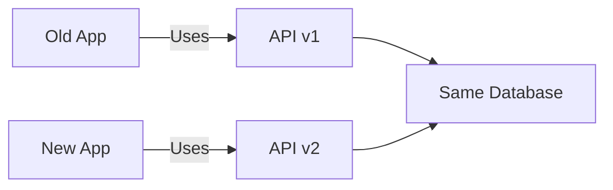
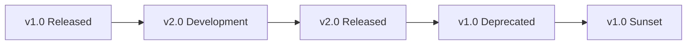

# 🔄 API Versioning Guide for Beginners
## Simple and Practical Guide to API Versions

---

## 📚 Table of Contents
1. [What is API Versioning?](#what-is-api-versioning)
2. [Why Do We Need It?](#why-do-we-need-it)
3. [Types of Versioning](#types-of-versioning)
4. [Setup](#setup)
5. [URL Path Versioning (Recommended)](#url-path-versioning)
6. [Header-Based Versioning](#header-based-versioning)
7. [Query Parameter Versioning](#query-parameter-versioning)
8. [Best Practices](#best-practices)

---

## 🎯 What is API Versioning?

**API Versioning** is like having different editions of a book. When you update your API, you create a new version so existing apps don't break.

### Simple Example
```javascript
// Version 1: Simple user data
{ "name": "John Doe", "email": "john@email.com" }

// Version 2: Enhanced user data  
{ "id": 1, "firstName": "John", "lastName": "Doe", "email": "john@email.com" }
```



---

## 🤔 Why Do We Need It?

### The Problem
Without versioning, when you change your API:
- ❌ Existing apps break
- ❌ Users get angry
- ❌ You lose customers

### The Solution
With versioning:
- ✅ Old apps keep working
- ✅ New apps get new features
- ✅ Everyone is happy

---

## 🔧 Types of Versioning

### 1. URL Path (Most Popular)
```
GET /api/v1/users
GET /api/v2/users
```

### 2. Header-Based
```
GET /api/users
Header: API-Version: v2
```

### 3. Query Parameter
```
GET /api/users?version=v2
```

---

## 🚀 Setup

### Create Project
```bash
mkdir api-versioning
cd api-versioning
npm init -y
npm install express
```

### Basic Structure
```
api-versioning/
├── server.js
├── package.json
└── routes/
    ├── v1.js
    └── v2.js
```

---

## 🛣️ URL Path Versioning (Recommended)

This is the **easiest** and **most common** method.

### Step 1: Create Version Routes

**routes/v1.js**
```javascript
const express = require('express');
const router = express.Router();

// Sample data for v1
const users = [
    { name: "John Doe", email: "john@email.com" },
    { name: "Jane Smith", email: "jane@email.com" }
];

router.get('/users', (req, res) => {
    res.json({
        version: "1.0",
        data: users
    });
});

router.get('/users/:id', (req, res) => {
    const user = users[req.params.id];
    if (user) {
        res.json({ version: "1.0", data: user });
    } else {
        res.status(404).json({ error: "User not found" });
    }
});

module.exports = router;
```

**routes/v2.js**
```javascript
const express = require('express');
const router = express.Router();

// Enhanced data for v2
const users = [
    { id: 1, firstName: "John", lastName: "Doe", email: "john@email.com", active: true },
    { id: 2, firstName: "Jane", lastName: "Smith", email: "jane@email.com", active: false }
];

router.get('/users', (req, res) => {
    res.json({
        version: "2.0",
        data: users,
        total: users.length
    });
});

router.get('/users/:id', (req, res) => {
    const user = users.find(u => u.id == req.params.id);
    if (user) {
        res.json({ version: "2.0", data: user });
    } else {
        res.status(404).json({ error: "User not found" });
    }
});

module.exports = router;
```

### Step 2: Main Server

**server.js**
```javascript
const express = require('express');
const app = express();

// Import version routes
const v1Routes = require('./routes/v1');
const v2Routes = require('./routes/v2');

app.use(express.json());

// Setup version routes
app.use('/api/v1', v1Routes);
app.use('/api/v2', v2Routes);

// Info endpoint
app.get('/', (req, res) => {
    res.json({
        message: "API Versioning Demo",
        versions: ["v1", "v2"],
        endpoints: [
            "GET /api/v1/users",
            "GET /api/v2/users",
            "GET /api/v1/users/0",
            "GET /api/v2/users/1"
        ]
    });
});

app.listen(3000, () => {
    console.log('🚀 Server running on http://localhost:3000');
});
```

### Test It
```bash
# Start server
node server.js

# Test v1
curl http://localhost:3000/api/v1/users

# Test v2  
curl http://localhost:3000/api/v2/users
```

---

## 📋 Header-Based Versioning

Version specified in HTTP headers.

### Simple Implementation

**header-server.js**
```javascript
const express = require('express');
const app = express();

// Sample data
const v1Users = [
    { name: "John", email: "john@email.com" }
];

const v2Users = [
    { id: 1, firstName: "John", lastName: "Doe", email: "john@email.com" }
];

app.use(express.json());

// Version detection middleware
app.use((req, res, next) => {
    req.version = req.headers['api-version'] || 'v1';
    next();
});

app.get('/api/users', (req, res) => {
    if (req.version === 'v2') {
        res.json({ version: "2.0", data: v2Users });
    } else {
        res.json({ version: "1.0", data: v1Users });
    }
});

app.get('/', (req, res) => {
    res.json({
        message: "Header-Based Versioning",
        usage: "Add 'API-Version: v2' header to requests",
        example: "curl -H 'API-Version: v2' http://localhost:3001/api/users"
    });
});

app.listen(3001, () => {
    console.log('🚀 Header versioning server on http://localhost:3001');
});
```

### Test It
```bash
# Default (v1)
curl http://localhost:3001/api/users

# Version 2
curl -H "API-Version: v2" http://localhost:3001/api/users
```

---

## ❓ Query Parameter Versioning

Version specified as URL parameter.

### Simple Implementation

**query-server.js**
```javascript
const express = require('express');
const app = express();

// Sample data
const v1Users = [{ name: "John", email: "john@email.com" }];
const v2Users = [{ id: 1, firstName: "John", lastName: "Doe", email: "john@email.com" }];

app.use(express.json());

app.get('/api/users', (req, res) => {
    const version = req.query.version || 'v1';
    
    if (version === 'v2') {
        res.json({ version: "2.0", data: v2Users });
    } else {
        res.json({ version: "1.0", data: v1Users });
    }
});

app.get('/', (req, res) => {
    res.json({
        message: "Query Parameter Versioning",
        examples: [
            "http://localhost:3002/api/users",
            "http://localhost:3002/api/users?version=v2"
        ]
    });
});

app.listen(3002, () => {
    console.log('🚀 Query versioning server on http://localhost:3002');
});
```

### Test It
```bash
# Default (v1)
curl "http://localhost:3002/api/users"

# Version 2
curl "http://localhost:3002/api/users?version=v2"
```

---

## 🧪 Testing All Methods

Create **test.js**:
```javascript
const axios = require('axios'); // npm install axios

async function testVersioning() {
    console.log('🧪 Testing API Versioning...\n');
    
    try {
        // Test URL Path Versioning
        console.log('1. URL Path Versioning:');
        const v1 = await axios.get('http://localhost:3000/api/v1/users');
        const v2 = await axios.get('http://localhost:3000/api/v2/users');
        console.log('V1:', v1.data.version);
        console.log('V2:', v2.data.version);
        
        // Test Header Versioning
        console.log('\n2. Header Versioning:');
        const headerV1 = await axios.get('http://localhost:3001/api/users');
        const headerV2 = await axios.get('http://localhost:3001/api/users', {
            headers: { 'API-Version': 'v2' }
        });
        console.log('Header V1:', headerV1.data.version);
        console.log('Header V2:', headerV2.data.version);
        
        // Test Query Parameter Versioning
        console.log('\n3. Query Parameter Versioning:');
        const queryV1 = await axios.get('http://localhost:3002/api/users');
        const queryV2 = await axios.get('http://localhost:3002/api/users?version=v2');
        console.log('Query V1:', queryV1.data.version);
        console.log('Query V2:', queryV2.data.version);
        
    } catch (error) {
        console.error('Error:', error.message);
    }
}

testVersioning();
```

---

## 📊 Comparison of Methods

| Method | Pros | Cons | Best For |
|--------|------|------|----------|
| **URL Path** | Easy to use, Clear, Cacheable | URLs change | Public APIs |
| **Header** | Clean URLs, Flexible | Not visible in browser | Internal APIs |
| **Query** | Simple, Visible | URL pollution | Simple cases |

---

## 📋 Best Practices

### ✅ Do's
- **Start with v1** - Always begin with version 1
- **Use semantic versioning** - v1.0, v2.0, v2.1
- **Document changes** - Keep changelog
- **Support old versions** - Don't break existing apps
- **Plan deprecation** - Give users time to migrate

### ❌ Don'ts
- **Don't break v1** when creating v2
- **Don't version everything** - Only version when necessary
- **Don't use too many versions** - Keep it simple
- **Don't forget documentation** - Users need to know what changed

### 🔄 Version Lifecycle


### 📝 Example Migration Notice
```javascript
// Add to v1 responses
{
    "version": "1.0",
    "deprecated": true,
    "sunset_date": "2025-12-31",
    "migration_guide": "https://api.example.com/v2-migration",
    "data": { /* your data */ }
}
```

---

## 🎯 Summary

1. **API Versioning** prevents breaking existing applications
2. **URL Path versioning** is most popular and easiest
3. **Plan for migration** from day one
4. **Document everything** clearly
5. **Test all versions** regularly

### Quick Start Checklist
- [ ] Choose versioning method (recommend URL path)
- [ ] Create version folders/files
- [ ] Implement version detection
- [ ] Add version info to responses
- [ ] Test with different versions
- [ ] Document the API changes

---

## 📚 Next Steps
- Learn about **Semantic Versioning** (semver.org)
- Study **API Documentation** best practices
- Explore **Database Migrations** for data changes
- Learn about **Backward Compatibility** strategies

---

*This document is part of the Faculty Development Program. Practice with the minimal examples and gradually add complexity as needed.*