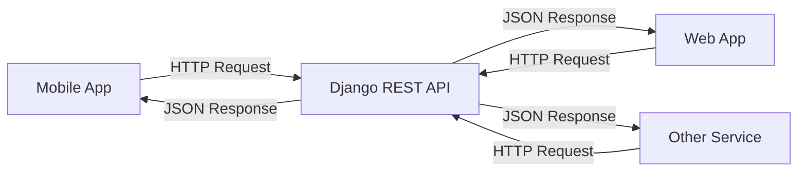
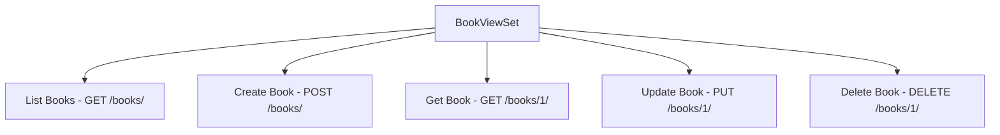
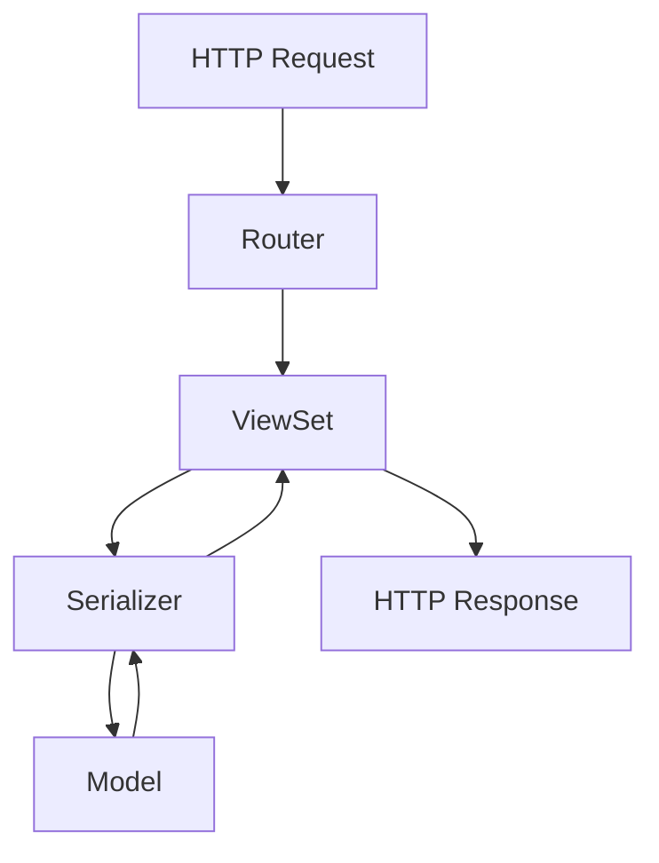

# Django REST Framework - Part A 🚀
## Serializers, ViewSets, and Routers

---

## 📚 Table of Contents
1. [What is Django REST Framework?](#what-is-django-rest-framework)
2. [Setting up DRF](#setting-up-drf)
3. [Understanding Serializers](#understanding-serializers)
4. [Working with ViewSets](#working-with-viewsets)
5. [URL Routing with Routers](#url-routing-with-routers)
6. [Complete Example](#complete-example)
7. [Best Practices](#best-practices)

---

## 🤔 What is Django REST Framework?

**Django REST Framework (DRF)** is a powerful toolkit for building Web APIs in Django. Think of it as a bridge that helps your Django application communicate with other applications (like mobile apps, websites, or other services) using a standardized format called REST.

### 🔄 REST API Concept



### 💡 Why Use DRF?
- ✅ Easy to build APIs
- ✅ Automatic API documentation
- ✅ Built-in authentication
- ✅ Powerful serialization
- ✅ Browsable API interface

---

## 🛠️ Setting up DRF

### Step 1: Install Django and DRF

```bash
# Create virtual environment
python -m venv drf_env
source drf_env/bin/activate  # On Windows: drf_env\Scripts\activate

# Install packages
pip install django
pip install djangorestframework
```

### Step 2: Create Django Project

```bash
# Create project
django-admin startproject library_project
cd library_project

# Create app
python manage.py startapp books
```

### Step 3: Configure Settings

```python
# settings.py
INSTALLED_APPS = [
    'django.contrib.admin',
    'django.contrib.auth',
    'django.contrib.contenttypes',
    'django.contrib.sessions',
    'django.contrib.messages',
    'django.contrib.staticfiles',
    'rest_framework',  # Add DRF
    'books',          # Add your app
]

# DRF Configuration
REST_FRAMEWORK = {
    'DEFAULT_PERMISSION_CLASSES': [
        'rest_framework.permissions.AllowAny',
    ]
}
```

### Step 4: Create a Simple Model

```python
# books/models.py
from django.db import models

class Book(models.Model):
    title = models.CharField(max_length=200)
    author = models.CharField(max_length=100)
    published_date = models.DateField()
    pages = models.IntegerField()
    price = models.DecimalField(max_digits=6, decimal_places=2)
    
    def __str__(self):
        return self.title
```

### Step 5: Run Migrations

```bash
python manage.py makemigrations
python manage.py migrate
python manage.py createsuperuser  # Create admin user
```

---

## 📝 Understanding Serializers

### 🤔 What are Serializers?

Serializers are like **translators** that convert:
- **Python objects** → **JSON** (for API responses)
- **JSON** → **Python objects** (for API requests)

```mermaid
graph LR
    A[Python Object<br/>Book Instance] -->|Serialize| B[JSON Data<br/>{"title": "Django Book"}]
    B -->|Deserialize| A
```

### 🔧 Types of Serializers

#### 1. **Serializer** (Basic)
For custom serialization logic

#### 2. **ModelSerializer** (Recommended)
Automatically creates serializer based on Django model

### 📖 Creating Your First Serializer

```python
# books/serializers.py
from rest_framework import serializers
from .models import Book

class BookSerializer(serializers.ModelSerializer):
    class Meta:
        model = Book
        fields = '__all__'  # Include all fields
        
    # Optional: Custom validation
    def validate_pages(self, value):
        if value <= 0:
            raise serializers.ValidationError("Pages must be positive")
        return value
```

### 🎯 Serializer Options

```python
class BookSerializer(serializers.ModelSerializer):
    class Meta:
        model = Book
        
        # Different field options:
        fields = '__all__'                    # All fields
        # fields = ['title', 'author', 'price']  # Specific fields
        # exclude = ['id']                      # All except specified
        
        # Read-only fields
        read_only_fields = ['id']
```

### 🧪 Testing Serializer in Shell

```bash
python manage.py shell
```

```python
# In Django shell
from books.models import Book
from books.serializers import BookSerializer

# Create a book
book = Book.objects.create(
    title="Django for Beginners",
    author="William Vincent",
    published_date="2023-01-01",
    pages=300,
    price=29.99
)

# Serialize (Python → JSON)
serializer = BookSerializer(book)
print(serializer.data)
# Output: {'id': 1, 'title': 'Django for Beginners', ...}

# Deserialize (JSON → Python)
data = {
    'title': 'DRF Tutorial',
    'author': 'John Doe',
    'published_date': '2023-06-15',
    'pages': 250,
    'price': '25.50'
}
serializer = BookSerializer(data=data)
if serializer.is_valid():
    book = serializer.save()
    print(f"Created: {book}")
```

---

## 🎭 Working with ViewSets

### 🤔 What are ViewSets?

ViewSets are **classes that handle multiple related views**. Instead of writing separate views for CREATE, READ, UPDATE, DELETE operations, ViewSets do it all!



### 🔧 Types of ViewSets

#### 1. **ViewSet** (Basic)
You define all actions manually

#### 2. **ModelViewSet** (Recommended)
Provides default CRUD operations automatically

#### 3. **ReadOnlyModelViewSet**
Only provides read operations (list and retrieve)

### 📖 Creating Your First ViewSet

```python
# books/views.py
from rest_framework import viewsets
from rest_framework.response import Response
from .models import Book
from .serializers import BookSerializer

class BookViewSet(viewsets.ModelViewSet):
    """
    A ViewSet that provides default `create()`, `retrieve()`, `update()`,
    `partial_update()`, `destroy()` and `list()` actions.
    """
    queryset = Book.objects.all()
    serializer_class = BookSerializer
```

### 🎯 Custom Actions in ViewSets

```python
from rest_framework.decorators import action
from rest_framework.response import Response

class BookViewSet(viewsets.ModelViewSet):
    queryset = Book.objects.all()
    serializer_class = BookSerializer
    
    # Custom action: GET /books/expensive/
    @action(detail=False, methods=['get'])
    def expensive(self, request):
        expensive_books = Book.objects.filter(price__gt=50)
        serializer = self.get_serializer(expensive_books, many=True)
        return Response(serializer.data)
    
    # Custom action: POST /books/1/mark_favorite/
    @action(detail=True, methods=['post'])
    def mark_favorite(self, request, pk=None):
        book = self.get_object()
        # Your custom logic here
        return Response({'status': f'{book.title} marked as favorite'})
```

### 🧪 ViewSet HTTP Methods Mapping

| HTTP Method | ViewSet Action | URL Pattern | Description |
|-------------|----------------|-------------|-------------|
| GET | list() | `/books/` | Get all books |
| POST | create() | `/books/` | Create new book |
| GET | retrieve() | `/books/1/` | Get specific book |
| PUT | update() | `/books/1/` | Update entire book |
| PATCH | partial_update() | `/books/1/` | Update part of book |
| DELETE | destroy() | `/books/1/` | Delete book |

---

## 🛣️ URL Routing with Routers

### 🤔 What are Routers?

Routers **automatically generate URL patterns** for your ViewSets. No need to manually write URLs!

```mermaid
graph LR
    A[Router] --> B[/books/ - List/Create]
    A --> C[/books/1/ - Detail/Update/Delete]
    A --> D[/books/expensive/ - Custom Action]
```

### 🔧 Types of Routers

#### 1. **SimpleRouter**
Basic URL routing

#### 2. **DefaultRouter** (Recommended)
Includes an API root view and browsable API

### 📖 Setting up Routers

#### Step 1: Create App URLs

```python
# books/urls.py
from django.urls import path, include
from rest_framework.routers import DefaultRouter
from . import views

# Create router
router = DefaultRouter()
router.register(r'books', views.BookViewSet)

urlpatterns = [
    path('', include(router.urls)),
]
```

#### Step 2: Include in Main URLs

```python
# library_project/urls.py
from django.contrib import admin
from django.urls import path, include

urlpatterns = [
    path('admin/', admin.site.urls),
    path('api/', include('books.urls')),  # All API URLs under /api/
]
```

### 🎯 Generated URL Patterns

With the router setup above, you automatically get:

| URL | HTTP Method | Action | Description |
|-----|-------------|--------|-------------|
| `/api/books/` | GET | list | List all books |
| `/api/books/` | POST | create | Create new book |
| `/api/books/1/` | GET | retrieve | Get book with ID 1 |
| `/api/books/1/` | PUT | update | Update book with ID 1 |
| `/api/books/1/` | PATCH | partial_update | Partially update book |
| `/api/books/1/` | DELETE | destroy | Delete book with ID 1 |
| `/api/books/expensive/` | GET | expensive | Custom action |

---

## 🔗 Complete Example

Let's put everything together with a complete working example:

### 📁 Project Structure
```
library_project/
├── library_project/
│   ├── __init__.py
│   ├── settings.py
│   ├── urls.py
│   └── wsgi.py
└── books/
    ├── __init__.py
    ├── models.py
    ├── serializers.py
    ├── views.py
    ├── urls.py
    └── apps.py
```

### 📄 Complete Code Files

#### models.py
```python
from django.db import models

class Book(models.Model):
    title = models.CharField(max_length=200)
    author = models.CharField(max_length=100)
    published_date = models.DateField()
    pages = models.IntegerField()
    price = models.DecimalField(max_digits=6, decimal_places=2)
    created_at = models.DateTimeField(auto_now_add=True)
    
    class Meta:
        ordering = ['-created_at']
    
    def __str__(self):
        return f"{self.title} by {self.author}"
```

#### serializers.py
```python
from rest_framework import serializers
from .models import Book

class BookSerializer(serializers.ModelSerializer):
    # Add computed field
    days_since_published = serializers.SerializerMethodField()
    
    class Meta:
        model = Book
        fields = '__all__'
        read_only_fields = ['id', 'created_at']
    
    def get_days_since_published(self, obj):
        from datetime import date
        return (date.today() - obj.published_date).days
    
    def validate_price(self, value):
        if value <= 0:
            raise serializers.ValidationError("Price must be positive")
        return value
```

#### views.py
```python
from rest_framework import viewsets, status
from rest_framework.decorators import action
from rest_framework.response import Response
from django.db.models import Avg
from .models import Book
from .serializers import BookSerializer

class BookViewSet(viewsets.ModelViewSet):
    queryset = Book.objects.all()
    serializer_class = BookSerializer
    
    @action(detail=False, methods=['get'])
    def statistics(self, request):
        """Get book statistics"""
        total_books = Book.objects.count()
        avg_price = Book.objects.aggregate(Avg('price'))['price__avg']
        avg_pages = Book.objects.aggregate(Avg('pages'))['pages__avg']
        
        return Response({
            'total_books': total_books,
            'average_price': round(avg_price, 2) if avg_price else 0,
            'average_pages': round(avg_pages, 2) if avg_pages else 0,
        })
    
    @action(detail=False, methods=['get'])
    def by_author(self, request):
        """Get books grouped by author"""
        author = request.query_params.get('author')
        if author:
            books = Book.objects.filter(author__icontains=author)
            serializer = self.get_serializer(books, many=True)
            return Response(serializer.data)
        return Response(
            {'error': 'Please provide author parameter'}, 
            status=status.HTTP_400_BAD_REQUEST
        )
```

#### urls.py (books app)
```python
from django.urls import path, include
from rest_framework.routers import DefaultRouter
from . import views

router = DefaultRouter()
router.register(r'books', views.BookViewSet, basename='book')

urlpatterns = [
    path('', include(router.urls)),
]
```

### 🧪 Testing Your API

#### Start the Server
```bash
python manage.py runserver
```

#### Visit the Browsable API
Open: `http://127.0.0.1:8000/api/`

#### Test with curl or Postman

```bash
# Create a book
curl -X POST http://127.0.0.1:8000/api/books/ \
     -H "Content-Type: application/json" \
     -d '{
       "title": "Learning DRF",
       "author": "Jane Doe",
       "published_date": "2023-01-15",
       "pages": 280,
       "price": "34.99"
     }'

# Get all books
curl http://127.0.0.1:8000/api/books/

# Get statistics
curl http://127.0.0.1:8000/api/books/statistics/

# Get books by author
curl "http://127.0.0.1:8000/api/books/by_author/?author=Jane"
```

---

## ✨ Best Practices

### 🎯 Serializer Best Practices

```python
class BookSerializer(serializers.ModelSerializer):
    # ✅ Use descriptive field names
    price_in_usd = serializers.DecimalField(source='price', max_digits=6, decimal_places=2)
    
    # ✅ Add helpful validation
    def validate_published_date(self, value):
        from datetime import date
        if value > date.today():
            raise serializers.ValidationError("Published date cannot be in the future")
        return value
    
    # ✅ Use SerializerMethodField for computed values
    is_expensive = serializers.SerializerMethodField()
    
    def get_is_expensive(self, obj):
        return obj.price > 50
    
    class Meta:
        model = Book
        fields = '__all__'
        # ✅ Always specify read-only fields
        read_only_fields = ['id', 'created_at']
```

### 🎭 ViewSet Best Practices

```python
class BookViewSet(viewsets.ModelViewSet):
    queryset = Book.objects.all()
    serializer_class = BookSerializer
    
    # ✅ Override get_queryset for dynamic filtering
    def get_queryset(self):
        queryset = Book.objects.all()
        author = self.request.query_params.get('author')
        if author:
            queryset = queryset.filter(author__icontains=author)
        return queryset
    
    # ✅ Use different serializers for different actions
    def get_serializer_class(self):
        if self.action == 'list':
            return BookListSerializer  # Lighter serializer for lists
        return BookDetailSerializer
    
    # ✅ Add proper error handling
    @action(detail=True, methods=['post'])
    def mark_read(self, request, pk=None):
        try:
            book = self.get_object()
            # Your logic here
            return Response({'status': 'marked as read'})
        except Book.DoesNotExist:
            return Response(
                {'error': 'Book not found'}, 
                status=status.HTTP_404_NOT_FOUND
            )
```

### 🛣️ Router Best Practices

```python
# ✅ Use meaningful router names
router = DefaultRouter()
router.register(r'books', BookViewSet, basename='book')
router.register(r'authors', AuthorViewSet, basename='author')

# ✅ Version your APIs
urlpatterns = [
    path('api/v1/', include(router.urls)),
]
```

### 📝 General Tips

#### 🔒 Security
- Always validate input data
- Use appropriate permissions
- Don't expose sensitive information

#### 🚀 Performance
- Use `select_related()` and `prefetch_related()` for database optimization
- Implement pagination for large datasets
- Consider caching for frequently accessed data

#### 📚 Documentation
- Add docstrings to your ViewSets and custom actions
- Use meaningful variable names
- Comment complex logic

---

## 🎉 Summary

You've learned the fundamentals of Django REST Framework:

1. **Serializers**: Convert between Python objects and JSON
2. **ViewSets**: Handle multiple related API views in one class
3. **Routers**: Automatically generate URL patterns

### 🔄 The DRF Flow



### 🚀 What's Next?

In the upcoming parts, you'll learn:
- **Part B**: JWT Authentication with SimpleJWT
- **Part C**: Advanced Filtering & Pagination
- **Part D**: Advanced DRF Features

Keep practicing with the examples above, and you'll master DRF in no time! 🎯

---

### 💡 Quick Reference

| Component | Purpose | Key Methods |
|-----------|---------|-------------|
| **Serializer** | Data conversion | `is_valid()`, `save()`, `to_representation()` |
| **ViewSet** | Handle requests | `list()`, `create()`, `retrieve()`, `update()`, `destroy()` |
| **Router** | URL routing | `register()`, `include()` |

Happy coding! 🚀