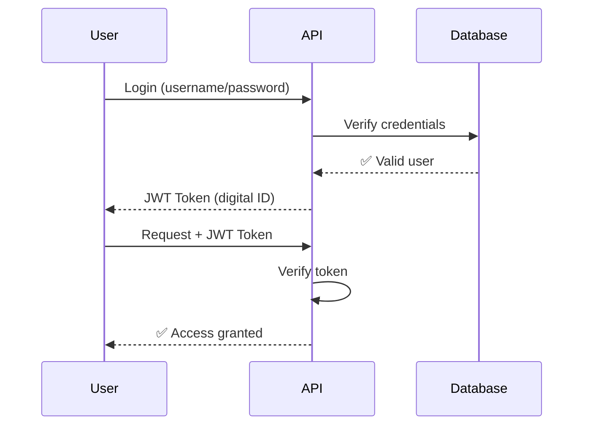
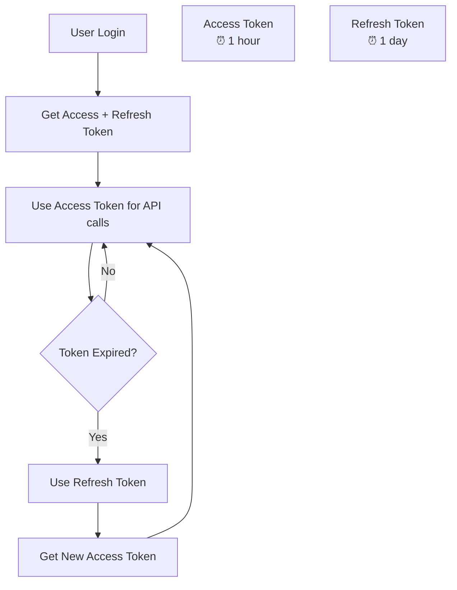
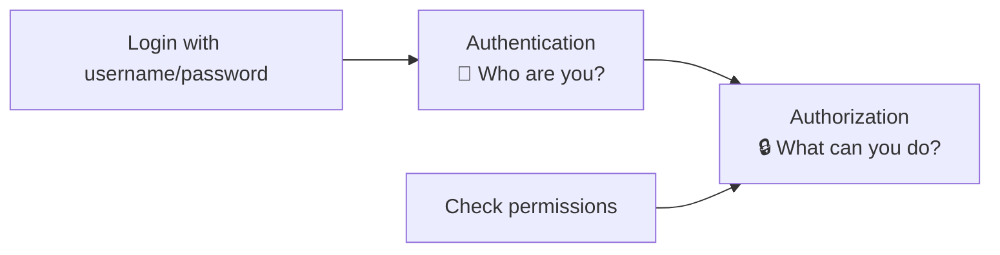
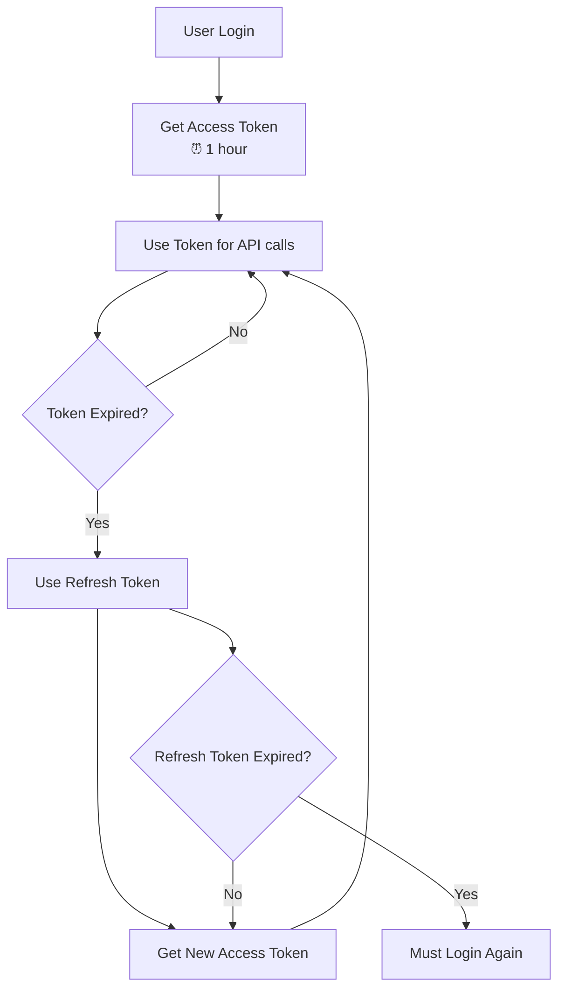

# Django REST Framework - Part B 🔐
## JWT Authentication with SimpleJWT

---

## 📚 What We'll Build

Add **secure authentication** to our Book API:
- 🔑 **Login** to get JWT tokens
- 🔒 **Protect** book operations (only logged-in users can add/delete)
- 🔄 **Refresh** expired tokens
- 🚪 **Logout** functionality

---

## 🤔 What is JWT Authentication?

**JWT (JSON Web Token)** is like a **digital ID card** that proves you're logged in.



**🔑 How JWT Works:**
- User logs in → Gets JWT token
- User includes token in requests → API verifies token
- Token expires → User refreshes or logs in again

---

## 🛠️ Step 1: Install SimpleJWT

```bash
# Make sure your virtual environment is active
pip install djangorestframework-simplejwt
```

---

## ⚙️ Step 2: Configure Settings

**📁 File: `bookstore/settings.py`**

```python
from datetime import timedelta

INSTALLED_APPS = [
    'django.contrib.admin',
    'django.contrib.auth',
    'django.contrib.contenttypes',
    'django.contrib.sessions',
    'django.contrib.messages',
    'django.contrib.staticfiles',
    'rest_framework',
    'rest_framework_simplejwt',  # ← ADD THIS
    'books',
]

# ← REPLACE the old REST_FRAMEWORK with this:
REST_FRAMEWORK = {
    'DEFAULT_AUTHENTICATION_CLASSES': (
        'rest_framework_simplejwt.authentication.JWTAuthentication',
    ),
    'DEFAULT_PERMISSION_CLASSES': [
        'rest_framework.permissions.IsAuthenticated',  # ← Now requires login
    ],
}

# ← ADD JWT Settings
SIMPLE_JWT = {
    'ACCESS_TOKEN_LIFETIME': timedelta(minutes=60),    # Token expires in 1 hour
    'REFRESH_TOKEN_LIFETIME': timedelta(days=1),       # Refresh token lasts 1 day
    'ROTATE_REFRESH_TOKENS': True,                     # Get new refresh token on refresh
}
```

---

## 🛣️ Step 3: Add Authentication URLs

**📁 File: `bookstore/urls.py`**

```python
from django.contrib import admin
from django.urls import path, include
from rest_framework_simplejwt.views import (
    TokenObtainPairView,
    TokenRefreshView,
)

urlpatterns = [
    path('admin/', admin.site.urls),
    path('api/', include('books.urls')),
    # ← ADD THESE AUTHENTICATION URLS
    path('api/token/', TokenObtainPairView.as_view(), name='token_obtain_pair'),
    path('api/token/refresh/', TokenRefreshView.as_view(), name='token_refresh'),
]
```

---

## 👤 Step 4: Create a User for Testing

```bash
# Create a superuser
python manage.py createsuperuser

# Enter details when prompted:
# Username: admin
# Email: admin@example.com  
# Password: admin123
```

---

## 🧪 Step 5: Test Authentication

### Start the Server
```bash
python manage.py runserver
```

### 🔑 Test 1: Login to Get Token

```bash
# Get JWT tokens by logging in
curl -X POST http://127.0.0.1:8000/api/token/ -H "Content-Type: application/json" -d "{\"username\": \"admin\", \"password\": \"admin123\"}"
```

**Response:**
```json
{
    "access": "eyJ0eXAiOiJKV1QiLCJhbGciOiJIUzI1NiJ9...",
    "refresh": "eyJ0eXAiOiJKV1QiLCJhbGciOiJIUzI1NiJ9..."
}
```

### 🔒 Test 2: Try Accessing Books Without Token

```bash
# This will FAIL with 401 Unauthorized
curl http://127.0.0.1:8000/api/books/
```

### ✅ Test 3: Access Books WITH Token

```bash
# Replace YOUR_ACCESS_TOKEN with the actual token from step 1
curl -H "Authorization: Bearer YOUR_ACCESS_TOKEN" \
     http://127.0.0.1:8000/api/books/
```

---

## 🎯 JWT Token Flow



---

## 🔧 Step 6: Add Custom Authentication Views

**📁 Create new file: `books/auth_views.py`**

```python
from rest_framework.decorators import api_view, permission_classes
from rest_framework.permissions import IsAuthenticated
from rest_framework.response import Response
from rest_framework import status
from rest_framework_simplejwt.tokens import RefreshToken

@api_view(['POST'])
@permission_classes([IsAuthenticated])
def logout_view(request):
    """
    Logout by blacklisting the refresh token
    """
    try:
        refresh_token = request.data["refresh"]
        token = RefreshToken(refresh_token)
        token.blacklist()
        return Response({"message": "Successfully logged out"}, 
                       status=status.HTTP_200_OK)
    except Exception as e:
        return Response({"error": "Invalid token"}, 
                       status=status.HTTP_400_BAD_REQUEST)

@api_view(['GET'])
@permission_classes([IsAuthenticated])
def user_profile(request):
    """
    Get current user information
    """
    user = request.user
    return Response({
        "id": user.id,
        "username": user.username,
        "email": user.email,
        "is_staff": user.is_staff,
    })
```

### Update URLs

**📁 File: `books/urls.py`**

```python
from django.urls import path, include
from rest_framework.routers import DefaultRouter
from .views import BookViewSet
from .auth_views import logout_view, user_profile  # ← ADD THIS

router = DefaultRouter()
router.register('books', BookViewSet)

urlpatterns = [
    path('', include(router.urls)),
    path('auth/logout/', logout_view, name='logout'),        # ← ADD THIS
    path('auth/profile/', user_profile, name='user_profile'), # ← ADD THIS
]
```

---

## 🔓 Step 7: Optional - Allow Some Operations Without Login

If you want some operations to be public (like viewing books) but others to require login (like adding/deleting):

**📁 File: `books/views.py`**

```python
from rest_framework import viewsets
from rest_framework.permissions import IsAuthenticatedOrReadOnly
from .models import Book
from .serializers import BookSerializer

class BookViewSet(viewsets.ModelViewSet):
    queryset = Book.objects.all()
    serializer_class = BookSerializer
    permission_classes = [IsAuthenticatedOrReadOnly]  # ← ADD THIS
    
    # This means:
    # GET (read) = Anyone can access
    # POST, PUT, DELETE = Only logged-in users
```

---

## 🧪 Complete Testing Guide

### 1. **Login and Get Tokens**
```bash
curl -X POST http://127.0.0.1:8000/api/token/ \
     -H "Content-Type: application/json" \
     -d '{"username": "admin", "password": "admin123"}'
```

### 2. **View Your Profile**
```bash
curl -H "Authorization: Bearer YOUR_ACCESS_TOKEN" \
     http://127.0.0.1:8000/api/auth/profile/
```

### 3. **Add a Book (Requires Authentication)**
```bash
curl -X POST http://127.0.0.1:8000/api/books/ \
     -H "Authorization: Bearer YOUR_ACCESS_TOKEN" \
     -H "Content-Type: application/json" \
     -d '{"title": "Secured Book", "author": "Auth User", "price": "19.99"}'
```

### 4. **Refresh Your Token**
```bash
curl -X POST http://127.0.0.1:8000/api/token/refresh/ \
     -H "Content-Type: application/json" \
     -d '{"refresh": "YOUR_REFRESH_TOKEN"}'
```

### 5. **Logout**
```bash
curl -X POST http://127.0.0.1:8000/api/auth/logout/ \
     -H "Authorization: Bearer YOUR_ACCESS_TOKEN" \
     -H "Content-Type: application/json" \
     -d '{"refresh": "YOUR_REFRESH_TOKEN"}'
```

---

## 🌐 Testing in Browser

### Access the Browsable API
1. Go to: `http://127.0.0.1:8000/api/books/`
2. You'll see **"Authentication credentials were not provided"**
3. Click **"Log in"** in the top right corner
4. Enter your admin credentials
5. Now you can use the API through the browser!

---

## 📊 Authentication URLs Summary

| URL | Method | Purpose | Auth Required |
|-----|---------|----------|---------------|
| `/api/token/` | POST | Login (get tokens) | ❌ No |
| `/api/token/refresh/` | POST | Refresh access token | ❌ No |
| `/api/auth/logout/` | POST | Logout | ✅ Yes |
| `/api/auth/profile/` | GET | Get user info | ✅ Yes |
| `/api/books/` | GET | View books | ✅ Yes* |
| `/api/books/` | POST | Add book | ✅ Yes |

*Depends on your permission settings

---

## 🔧 Key Files Modified

### 1. **Settings** (`bookstore/settings.py`)
- Added `rest_framework_simplejwt` to `INSTALLED_APPS`
- Configured JWT authentication
- Set token lifetimes

### 2. **Main URLs** (`bookstore/urls.py`)
- Added token endpoints

### 3. **App URLs** (`books/urls.py`)
- Added logout and profile endpoints

### 4. **New File** (`books/auth_views.py`)
- Custom logout and profile views

---

## 💡 Key Concepts

### 🔐 **Authentication vs Authorization**



### ⏰ **Token Lifecycle**



---

## ✅ What You've Accomplished

🎉 **Congratulations!** Your API now has:

- ✅ **Secure login** with JWT tokens
- ✅ **Protected endpoints** (only logged-in users can modify data)
- ✅ **Token refresh** functionality
- ✅ **Proper logout** with token blacklisting
- ✅ **User profile** endpoint

---

## 🚀 What's Next?

In **Part C**, we'll add:
- **🔍 Filtering** - Search books by title, author, price range
- **📄 Pagination** - Handle large datasets efficiently
- **🔧 Advanced permissions** - User-specific data access

Your Book API is getting more professional with each step! 🎯
