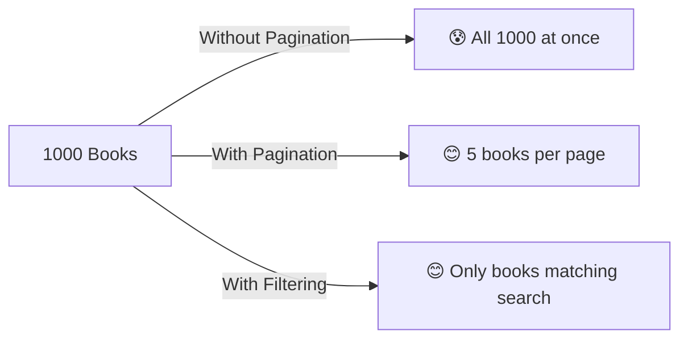
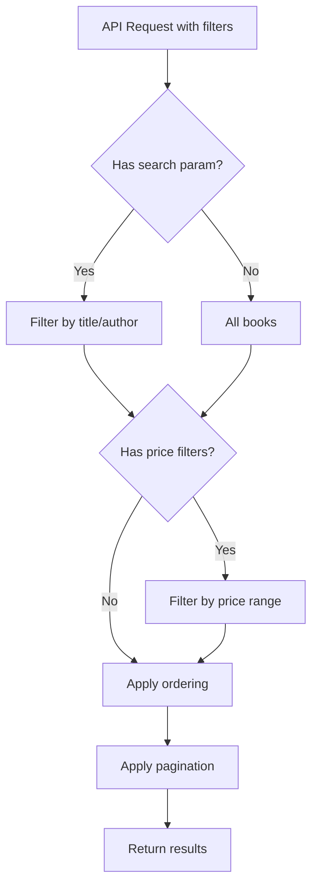

# Django REST Framework - Part C 🔍
## Filtering & Pagination

---

## 📚 What We'll Add

Enhance our Book API with:
- 🔍 **Search books** by title, author, or price
- 📄 **Pagination** to handle many books (show 5 books per page)
- 🎯 **Filter by price range** (e.g., books under $30)

---

## 🤔 Why Filtering & Pagination?

**Without filtering/pagination:**
- API returns ALL books (could be thousands!)
- Hard to find specific books
- Slow response times

**With filtering/pagination:**
- Find exactly what you need
- Fast, manageable responses
- Better user experience



---

## 🛠️ Step 1: Install Django Filter

```bash
# Install django-filter package
pip install django-filter
```

---

## ⚙️ Step 2: Update Settings

**📁 File: `bookstore/settings.py`**

```python
INSTALLED_APPS = [
    'django.contrib.admin',
    'django.contrib.auth',
    'django.contrib.contenttypes',
    'django.contrib.sessions',
    'django.contrib.messages',
    'django.contrib.staticfiles',
    'rest_framework',
    'rest_framework_simplejwt',
    'django_filters',  # ← ADD THIS
    'books',
]

REST_FRAMEWORK = {
    'DEFAULT_AUTHENTICATION_CLASSES': (
        'rest_framework_simplejwt.authentication.JWTAuthentication',
    ),
    'DEFAULT_PERMISSION_CLASSES': [
        'rest_framework.permissions.IsAuthenticated',
    ],
    # ← ADD THESE PAGINATION & FILTERING SETTINGS
    'DEFAULT_PAGINATION_CLASS': 'rest_framework.pagination.PageNumberPagination',
    'PAGE_SIZE': 5,  # Show 5 books per page
    'DEFAULT_FILTER_BACKENDS': [
        'django_filters.rest_framework.DjangoFilterBackend',
        'rest_framework.filters.SearchFilter',
        'rest_framework.filters.OrderingFilter',
    ],
}
```

---

## 🔍 Step 3: Add Filtering to Book ViewSet

**📁 File: `books/views.py`**

```python
from rest_framework import viewsets
from rest_framework.permissions import IsAuthenticatedOrReadOnly
from django_filters.rest_framework import DjangoFilterBackend
from rest_framework.filters import SearchFilter, OrderingFilter
from .models import Book
from .serializers import BookSerializer

class BookViewSet(viewsets.ModelViewSet):
    queryset = Book.objects.all()
    serializer_class = BookSerializer
    permission_classes = [IsAuthenticatedOrReadOnly]
    
    # ← ADD THESE FILTER SETTINGS
    filter_backends = [DjangoFilterBackend, SearchFilter, OrderingFilter]
    
    # Exact filtering by fields
    filterset_fields = ['author', 'price']
    
    # Search in these fields (partial matching)
    search_fields = ['title', 'author']
    
    # Allow ordering by these fields
    ordering_fields = ['price', 'title', 'id']
    ordering = ['id']  # Default ordering
```

---

## 🎯 Step 4: Create Advanced Filter Class (Optional)

For more complex filtering like price ranges:

**📁 Create new file: `books/filters.py`**

```python
import django_filters
from .models import Book

class BookFilter(django_filters.FilterSet):
    # Price range filtering
    min_price = django_filters.NumberFilter(field_name="price", lookup_expr='gte')
    max_price = django_filters.NumberFilter(field_name="price", lookup_expr='lte')
    
    # Title contains (case-insensitive)
    title_contains = django_filters.CharFilter(field_name="title", lookup_expr='icontains')
    
    class Meta:
        model = Book
        fields = ['author']  # Exact match for author
```

**📁 Update `books/views.py`:**

```python
from rest_framework import viewsets
from rest_framework.permissions import IsAuthenticatedOrReadOnly
from django_filters.rest_framework import DjangoFilterBackend
from rest_framework.filters import SearchFilter, OrderingFilter
from .models import Book
from .serializers import BookSerializer
from .filters import BookFilter  # ← ADD THIS

class BookViewSet(viewsets.ModelViewSet):
    queryset = Book.objects.all()
    serializer_class = BookSerializer
    permission_classes = [IsAuthenticatedOrReadOnly]
    
    filter_backends = [DjangoFilterBackend, SearchFilter, OrderingFilter]
    
    # ← REPLACE filterset_fields with filterset_class
    filterset_class = BookFilter
    
    search_fields = ['title', 'author']
    ordering_fields = ['price', 'title', 'id']
    ordering = ['id']
```

---

## 📄 Step 5: Custom Pagination (Optional)

For more control over pagination:

**📁 Create new file: `books/pagination.py`**

```python
from rest_framework.pagination import PageNumberPagination
from rest_framework.response import Response

class BookPagination(PageNumberPagination):
    page_size = 3  # 3 books per page
    page_size_query_param = 'page_size'  # Allow ?page_size=10
    max_page_size = 20  # Maximum books per page
    
    def get_paginated_response(self, data):
        return Response({
            'total_books': self.page.paginator.count,
            'total_pages': self.page.paginator.num_pages,
            'current_page': self.page.number,
            'next': self.get_next_link(),
            'previous': self.get_previous_link(),
            'results': data
        })
```

**📁 Update `books/views.py`:**

```python
from .pagination import BookPagination  # ← ADD THIS

class BookViewSet(viewsets.ModelViewSet):
    queryset = Book.objects.all()
    serializer_class = BookSerializer
    permission_classes = [IsAuthenticatedOrReadOnly]
    pagination_class = BookPagination  # ← ADD THIS
    
    filter_backends = [DjangoFilterBackend, SearchFilter, OrderingFilter]
    filterset_class = BookFilter
    search_fields = ['title', 'author']
    ordering_fields = ['price', 'title', 'id']
    ordering = ['id']
```

---

## 🧪 Step 6: Add Sample Data for Testing

**📁 Create file: `add_sample_books.py` (in project root)**

```python
import os
import django

os.environ.setdefault('DJANGO_SETTINGS_MODULE', 'bookstore.settings')
django.setup()

from books.models import Book

# Add sample books
books_data = [
    {"title": "Django Basics", "author": "John Doe", "price": 25.99},
    {"title": "Python Guide", "author": "Jane Smith", "price": 35.50},
    {"title": "Web Development", "author": "John Doe", "price": 45.00},
    {"title": "REST APIs", "author": "Bob Wilson", "price": 29.99},
    {"title": "Database Design", "author": "Jane Smith", "price": 55.00},
    {"title": "Frontend Basics", "author": "Alice Brown", "price": 22.50},
    {"title": "Backend Systems", "author": "Charlie Davis", "price": 65.99},
    {"title": "Mobile Apps", "author": "Diana Lee", "price": 39.99},
]

for book_data in books_data:
    Book.objects.get_or_create(**book_data)

print("Sample books added!")
```

**Run the script:**
```bash
python add_sample_books.py
```

---

## 🧪 Testing All Features

### 🔑 First, Login to Get Token
```bash
curl -X POST http://127.0.0.1:8000/api/token/ \
     -H "Content-Type: application/json" \
     -d '{"username": "admin", "password": "admin123"}'
```

### 📄 Test 1: Basic Pagination
```bash
# Get first page (3 books)
curl -H "Authorization: Bearer YOUR_TOKEN" \
     "http://127.0.0.1:8000/api/books/"

# Get second page
curl -H "Authorization: Bearer YOUR_TOKEN" \
     "http://127.0.0.1:8000/api/books/?page=2"

# Custom page size (5 books per page)
curl -H "Authorization: Bearer YOUR_TOKEN" \
     "http://127.0.0.1:8000/api/books/?page_size=5"
```

### 🔍 Test 2: Search Books
```bash
# Search by title or author containing "Django"
curl -H "Authorization: Bearer YOUR_TOKEN" \
     "http://127.0.0.1:8000/api/books/?search=Django"

# Search for "John"
curl -H "Authorization: Bearer YOUR_TOKEN" \
     "http://127.0.0.1:8000/api/books/?search=John"
```

### 🎯 Test 3: Filter by Exact Values
```bash
# Books by specific author
curl -H "Authorization: Bearer YOUR_TOKEN" \
     "http://127.0.0.1:8000/api/books/?author=John%20Doe"

# Books with exact price
curl -H "Authorization: Bearer YOUR_TOKEN" \
     "http://127.0.0.1:8000/api/books/?price=25.99"
```

### 💰 Test 4: Price Range Filtering
```bash
# Books under $30
curl -H "Authorization: Bearer YOUR_TOKEN" \
     "http://127.0.0.1:8000/api/books/?max_price=30"

# Books over $40
curl -H "Authorization: Bearer YOUR_TOKEN" \
     "http://127.0.0.1:8000/api/books/?min_price=40"

# Books between $25 and $45
curl -H "Authorization: Bearer YOUR_TOKEN" \
     "http://127.0.0.1:8000/api/books/?min_price=25&max_price=45"
```

### 📊 Test 5: Ordering
```bash
# Order by price (cheapest first)
curl -H "Authorization: Bearer YOUR_TOKEN" \
     "http://127.0.0.1:8000/api/books/?ordering=price"

# Order by price (most expensive first)
curl -H "Authorization: Bearer YOUR_TOKEN" \
     "http://127.0.0.1:8000/api/books/?ordering=-price"

# Order by title alphabetically
curl -H "Authorization: Bearer YOUR_TOKEN" \
     "http://127.0.0.1:8000/api/books/?ordering=title"
```

### 🔥 Test 6: Combine Everything
```bash
# Search for "Django", price under $30, order by price, page 1
curl -H "Authorization: Bearer YOUR_TOKEN" \
     "http://127.0.0.1:8000/api/books/?search=Django&max_price=30&ordering=price&page=1"
```

---

## 🌐 Testing in Browser

1. Go to: `http://127.0.0.1:8000/api/books/`
2. Log in with your credentials
3. You'll see **filter options** in the browsable API interface
4. Try different combinations of filters!

**Browser URL Examples:**
- `http://127.0.0.1:8000/api/books/?search=Python`
- `http://127.0.0.1:8000/api/books/?max_price=30&ordering=price`
- `http://127.0.0.1:8000/api/books/?page=2&page_size=2`

---

## 📊 All Available Query Parameters

| Parameter | Example | Description |
|-----------|---------|-------------|
| `search` | `?search=Django` | Search in title and author |
| `author` | `?author=John Doe` | Exact author match |
| `min_price` | `?min_price=25` | Books costing $25 or more |
| `max_price` | `?max_price=50` | Books costing $50 or less |
| `title_contains` | `?title_contains=guide` | Title containing "guide" |
| `ordering` | `?ordering=-price` | Sort by price (desc) |
| `page` | `?page=2` | Get page 2 |
| `page_size` | `?page_size=10` | 10 items per page |

---

## 🔧 Complete Filter Flow



---

## 📁 Files Modified/Added

### 📝 **Modified Files:**
1. **`bookstore/settings.py`** - Added pagination and filter settings
2. **`books/views.py`** - Added filtering and pagination to ViewSet

### 🆕 **New Files:**
1. **`books/filters.py`** - Custom filter class for advanced filtering
2. **`books/pagination.py`** - Custom pagination class
3. **`add_sample_books.py`** - Script to add test data

---

## ✅ What You've Accomplished

🎉 **Your Book API now has:**

- ✅ **Pagination** - Handle large datasets efficiently
- ✅ **Search** - Find books by title or author
- ✅ **Filtering** - Filter by exact author, price ranges
- ✅ **Ordering** - Sort by price, title, or ID
- ✅ **Combining filters** - Use multiple filters together
- ✅ **Browser-friendly** - Works in DRF's browsable API

---

## 🎯 Quick Reference

### **Common Filter Combinations:**

```bash
# Cheap Django books, ordered by price
?search=Django&max_price=30&ordering=price

# Jane Smith's books, page 2
?author=Jane Smith&page=2

# Expensive books, most expensive first
?min_price=50&ordering=-price

# Books with "guide" in title, 10 per page
?title_contains=guide&page_size=10
```

---

## 🚀 You're Done! 

**Congratulations!** 🎉 You've built a **complete, professional REST API** with:

- ✅ **CRUD operations** (Create, Read, Update, Delete)
- ✅ **JWT Authentication** (Secure login/logout)
- ✅ **Advanced Filtering** (Search, price ranges, exact matches)
- ✅ **Pagination** (Handle large datasets)
- ✅ **Ordering** (Sort results)

Your faculty now understand the **core concepts of Django REST Framework** and can build their own APIs! 🎯