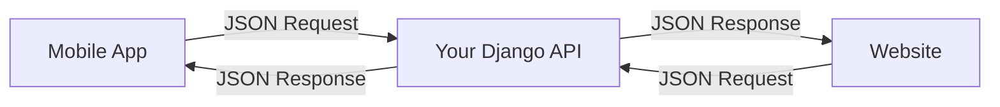
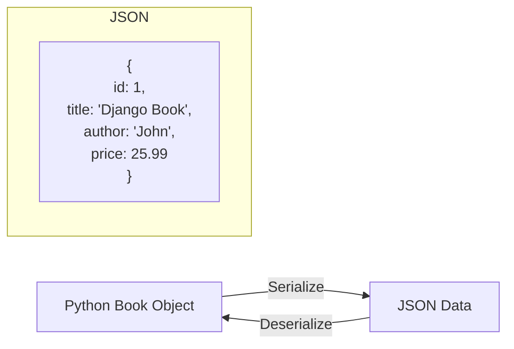
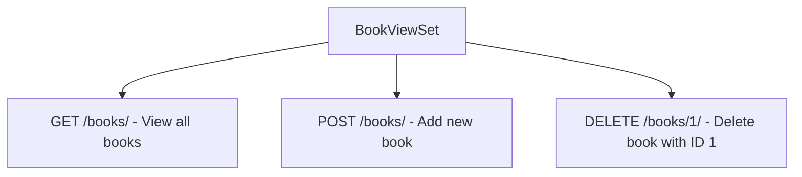
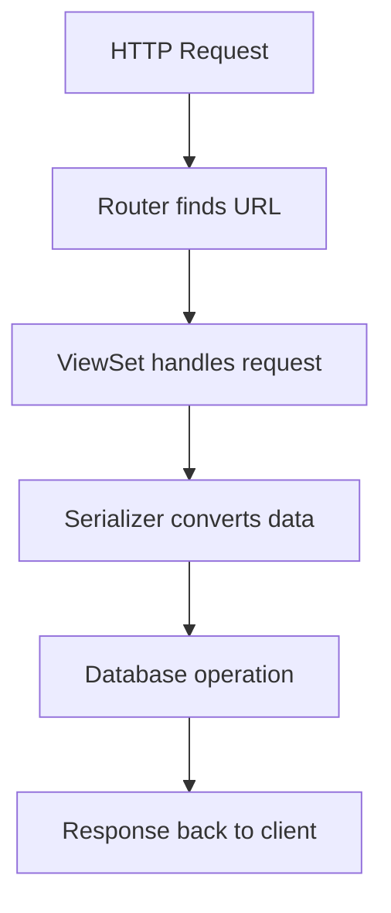

# Django REST Framework - Part A 🚀
## Serializers, ViewSets, and Routers (Minimal Guide)

---

## 📚 What We'll Build

A simple **Book API** with just 3 operations:
- 📖 **View all books** (GET)
- ➕ **Add a book** (POST) 
- 🗑️ **Delete a book** (DELETE)

---

## 🤔 What is Django REST Framework?

**DRF** helps you build APIs that can talk to mobile apps, websites, or other services using JSON.



---

## 🛠️ Complete Setup (Step by Step)

### Step 1: Install Everything

```bash
# Create and activate virtual environment
python -m venv myenv
# Windows: myenv\Scripts\activate
# Mac/Linux: source myenv/bin/activate

# Install packages
pip install django
pip install djangorestframework
```

### Step 2: Create Project

```bash
# Create Django project
django-admin startproject bookstore
cd bookstore

# Create Django app
python manage.py startapp books
```

### Step 3: Configure Django Settings

**📁 File: `bookstore/settings.py`**

```python
INSTALLED_APPS = [
    'django.contrib.admin',
    'django.contrib.auth',
    'django.contrib.contenttypes',
    'django.contrib.sessions',
    'django.contrib.messages',
    'django.contrib.staticfiles',
    'rest_framework',  # ← ADD THIS
    'books',          # ← ADD THIS
]

# ← ADD THIS BLOCK
REST_FRAMEWORK = {
    'DEFAULT_PERMISSION_CLASSES': [
        'rest_framework.permissions.AllowAny',
    ]
}
```

---

## 📝 Step 4: Create the Book Model

**📁 File: `books/models.py`**

```python
from django.db import models

class Book(models.Model):
    title = models.CharField(max_length=100)
    author = models.CharField(max_length=100)
    price = models.DecimalField(max_digits=6, decimal_places=2)
    
    def __str__(self):
        return self.title
```

### Run Database Commands

```bash
python manage.py makemigrations
python manage.py migrate
```

---

## 🔄 Step 5: Create Serializer

**📁 Create new file: `books/serializers.py`**

```python
from rest_framework import serializers
from .models import Book

class BookSerializer(serializers.ModelSerializer):
    class Meta:
        model = Book
        fields = '__all__'  # Include all fields (id, title, author, price)
```

**🤔 What does a Serializer do?**



---

## 🎭 Step 6: Create ViewSet

**📁 File: `books/views.py`**

```python
from rest_framework import viewsets
from .models import Book
from .serializers import BookSerializer

class BookViewSet(viewsets.ModelViewSet):
    queryset = Book.objects.all()
    serializer_class = BookSerializer
```

**🤔 What does a ViewSet do?**



---

## 🛣️ Step 7: Setup URLs with Router

**📁 Create new file: `books/urls.py`**

```python
from django.urls import path, include
from rest_framework.routers import DefaultRouter
from .views import BookViewSet

# Create router and register our viewset
router = DefaultRouter()
router.register('books', BookViewSet)

urlpatterns = [
    path('', include(router.urls)),
]
```

**📁 File: `bookstore/urls.py` (Main project URLs)**

```python
from django.contrib import admin
from django.urls import path, include

urlpatterns = [
    path('admin/', admin.site.urls),
    path('api/', include('books.urls')),  # ← ADD THIS LINE
]
```

**🤔 How Router Works:**

```mermaid
flowchart LR
    A[Router] --> B[/api/books/ - List & Create]
    A --> C[/api/books/1/ - Get, Update, Delete specific book]
```

---

## 🚀 Step 8: Test Your API

### Start the Server

```bash
python manage.py runserver
```

### 🌐 Open Your Browser

Visit: **http://127.0.0.1:8000/api/books/**

You'll see the **DRF Browsable API** - a web interface to test your API!

### 📱 Test with Commands

```bash
# 1. Add a book (POST)
curl -X POST http://127.0.0.1:8000/api/books/ \
     -H "Content-Type: application/json" \
     -d '{"title": "Django Guide", "author": "John Doe", "price": "29.99"}'

# 2. View all books (GET)
curl http://127.0.0.1:8000/api/books/

# 3. Delete a book (DELETE) - replace 1 with actual book ID
curl -X DELETE http://127.0.0.1:8000/api/books/1/
```

---

## 📁 Complete Project Structure

```
bookstore/
├── bookstore/
│   ├── settings.py     ← Modified
│   ├── urls.py         ← Modified
│   └── ...
├── books/
│   ├── models.py       ← Created Book model
│   ├── serializers.py  ← Created (NEW FILE)
│   ├── views.py        ← Created BookViewSet
│   ├── urls.py         ← Created (NEW FILE)
│   └── ...
└── manage.py
```

---

## 🔧 Complete Code Summary

### 1. **Model** (books/models.py)
```python
from django.db import models

class Book(models.Model):
    title = models.CharField(max_length=100)
    author = models.CharField(max_length=100)
    price = models.DecimalField(max_digits=6, decimal_places=2)
    
    def __str__(self):
        return self.title
```

### 2. **Serializer** (books/serializers.py)
```python
from rest_framework import serializers
from .models import Book

class BookSerializer(serializers.ModelSerializer):
    class Meta:
        model = Book
        fields = '__all__'
```

### 3. **ViewSet** (books/views.py)
```python
from rest_framework import viewsets
from .models import Book
from .serializers import BookSerializer

class BookViewSet(viewsets.ModelViewSet):
    queryset = Book.objects.all()
    serializer_class = BookSerializer
```

### 4. **URLs** (books/urls.py)
```python
from django.urls import path, include
from rest_framework.routers import DefaultRouter
from .views import BookViewSet

router = DefaultRouter()
router.register('books', BookViewSet)

urlpatterns = [
    path('', include(router.urls)),
]
```

---

## 🎯 What You Get

| URL | Method | Action | What it does |
|-----|---------|---------|--------------|
| `/api/books/` | GET | List | View all books |
| `/api/books/` | POST | Create | Add new book |
| `/api/books/1/` | GET | Retrieve | View book with ID 1 |
| `/api/books/1/` | DELETE | Destroy | Delete book with ID 1 |

---

## 🎉 Key Concepts Learned

### 🔄 The DRF Flow



### 📝 Three Main Components

1. **📋 Serializer**: Converts Python ↔ JSON
2. **🎭 ViewSet**: Handles HTTP requests (GET, POST, DELETE)
3. **🛣️ Router**: Creates URLs automatically

---

## 💡 Quick Tips

### ✅ **Do's**
- Always add `rest_framework` and your app to `INSTALLED_APPS`
- Create `serializers.py` file in your app
- Use `ModelViewSet` for basic CRUD operations
- Register ViewSets with Router

### ❌ **Don'ts**
- Don't forget to run migrations after creating models
- Don't miss including app URLs in main `urls.py`
- Don't forget to import all required classes

---

## 🚀 What's Next?

You now have a working API! In the next parts we'll add:
- **Part B**: JWT Authentication (Login/Logout)
- **Part C**: Filtering & Pagination (Search & Limit results)

Try adding more books through the browser interface at `http://127.0.0.1:8000/api/books/` before moving to the next part! 🎯