# 🐍 Django Basics - Getting Started
## Study Material for Faculty at Lovely Professional University

---

## 📚 Table of Contents
1. [What is Django?](#what-is-django)
2. [Django Architecture - MVT Pattern](#django-architecture---mvt-pattern)
3. [Environment Setup](#environment-setup)
4. [Creating Your First Django Project](#creating-your-first-django-project)
5. [Understanding Django Project Structure](#understanding-django-project-structure)
6. [Creating Your First App](#creating-your-first-app)
7. [Models - Database Layer](#models---database-layer)
8. [Views - Business Logic Layer](#views---business-logic-layer)
9. [Templates - Presentation Layer](#templates---presentation-layer)
10. [URL Routing](#url-routing)
11. [Django Admin Interface](#django-admin-interface)
12. [Database Operations](#database-operations)
13. [Static Files and Media](#static-files-and-media)
14. [Forms and Form Handling](#forms-and-form-handling)
15. [Summary and Next Steps](#summary-and-next-steps)

---

## 🎯 What is Django?

Django is a **high-level Python web framework** that encourages rapid development and clean, pragmatic design. It follows the **"Don't Repeat Yourself" (DRY)** principle and emphasizes **"Convention over Configuration"**.

### 🌟 Key Features:
- ⚡ **Fast Development**: Built-in features reduce development time
- 🔒 **Secure**: Built-in protection against common security threats
- 📈 **Scalable**: Used by Instagram, Pinterest, Mozilla, and NASA
- 🧩 **Versatile**: Suitable for content management, scientific computing, big data
- 🔧 **Batteries Included**: ORM, admin panel, authentication, and more

### 🏢 Companies Using Django:
- Instagram 📸
- Pinterest 📌
- Mozilla 🦊
- Spotify 🎵
- NASA 🚀

---

## 🏗️ Django Architecture - MVT Pattern

Django follows the **Model-View-Template (MVT)** architectural pattern:

```mermaid
graph TB
    User[👤 User] --> URL[🌐 URL Dispatcher]
    URL --> View[👁️ View]
    View --> Model[🗃️ Model]
    Model --> DB[(💾 Database)]
    DB --> Model
    Model --> View
    View --> Template[📄 Template]
    Template --> Response[📤 HTTP Response]
    Response --> User
    
    style User fill:#e1f5fe
    style URL fill:#fff3e0
    style View fill:#f3e5f5
    style Model fill:#e8f5e8
    style Template fill:#fff8e1
    style DB fill:#fce4ec
```



### 📋 Component Breakdown:

| Component | Responsibility | Example |
|-----------|---------------|---------|
| **Model** 🗃️ | Data structure and database operations | User, Product, Order |
| **View** 👁️ | Business logic and request handling | Process login, Display products |
| **Template** 📄 | Presentation layer (HTML) | Login form, Product list page |
| **URL Dispatcher** 🌐 | Maps URLs to views | `/login/` → login_view |

---

## 🛠️ Environment Setup

### Step 1: Install Python
```bash
# Check if Python is installed
python --version
# or
python3 --version
```

### Step 2: Create Virtual Environment
```bash
# Create virtual environment
python -m venv django_env

# Activate virtual environment
# On Windows:
django_env\Scripts\activate

# On macOS/Linux:
source django_env/bin/activate
```

### Step 3: Install Django
```bash
# Install Django
pip install django

# Verify installation
django-admin --version
```

### 💡 Pro Tip:
> Always use virtual environments to avoid package conflicts between different projects!

---

## 🚀 Creating Your First Django Project

### Step 1: Create Project
```bash
# Create a new Django project
django-admin startproject university_portal

# Navigate to project directory
cd university_portal
```

### Step 2: Run Development Server
```bash
# Start the development server
python manage.py runserver

# Custom port (optional)
python manage.py runserver 8080
```

### 🎉 Success!
Visit `http://127.0.0.1:8000/` in your browser to see the Django welcome page.

---

## 📁 Understanding Django Project Structure

```
university_portal/
├── 📁 university_portal/        # Project package
│   ├── 📄 __init__.py          # Makes it a Python package
│   ├── ⚙️ settings.py          # Project settings
│   ├── 🌐 urls.py              # URL routing
│   ├── 🚀 wsgi.py              # WSGI deployment
│   └── 🔧 asgi.py              # ASGI deployment
├── 🛠️ manage.py                # Command-line utility
└── 📊 db.sqlite3               # Default database (created after first run)
```

### 📋 File Explanations:

#### ⚙️ settings.py
```python
# Key settings explained
DEBUG = True                    # Development mode
ALLOWED_HOSTS = []             # Allowed host names
INSTALLED_APPS = [             # Installed applications
    'django.contrib.admin',
    'django.contrib.auth',
    # ... more apps
]
DATABASES = {                  # Database configuration
    'default': {
        'ENGINE': 'django.db.backends.sqlite3',
        'NAME': BASE_DIR / 'db.sqlite3',
    }
}
```

#### 🌐 urls.py
```python
from django.contrib import admin
from django.urls import path

urlpatterns = [
    path('admin/', admin.site.urls),
    # Add more URL patterns here
]
```

---

## 📱 Creating Your First App

Django projects consist of multiple **apps**. An app is a web application that does something specific.

### Step 1: Create App
```bash
# Create a new app called 'students'
python manage.py startapp students
```

### Step 2: App Structure
```
students/
├── 📁 migrations/              # Database migrations
├── 📄 __init__.py
├── 🛠️ admin.py                # Admin interface
├── 📱 apps.py                  # App configuration
├── 🗃️ models.py               # Data models
├── 🧪 tests.py                # Test cases
└── 👁️ views.py                # View functions
```

### Step 3: Register App
Add the app to `settings.py`:

```python
INSTALLED_APPS = [
    'django.contrib.admin',
    'django.contrib.auth',
    'django.contrib.contenttypes',
    'django.contrib.sessions',
    'django.contrib.messages',
    'django.contrib.staticfiles',
    'students',  # 👈 Add your app here
]
```

---

## 🗃️ Models - Database Layer

Models define the structure of your database tables using Python classes.

### Creating Your First Model

```python
# students/models.py
from django.db import models

class Student(models.Model):
    name = models.CharField(max_length=100)
    email = models.EmailField(unique=True)
    student_id = models.CharField(max_length=20, unique=True)
    phone = models.CharField(max_length=15)
    created_at = models.DateTimeField(auto_now_add=True)
    
    def __str__(self):
        return f"{self.name} ({self.student_id})"
```

### 🔍 Field Types Reference:

| Field Type | Purpose | Example |
|------------|---------|---------|
| `CharField` | Short text | Name, Email |
| `TextField` | Long text | Description, Address |
| `IntegerField` | Numbers | Age, Year |
| `DateTimeField` | Date & Time | Created, Updated |
| `BooleanField` | True/False | Is Active |
| `ForeignKey` | One-to-Many | Student → Department |
| `OneToOneField` | One-to-One | User → Profile |
| `ManyToManyField` | Many-to-Many | Students ↔ Courses |

### 📊 Model Structure:


---

## 💾 Database Operations

### Step 1: Create Migration Files
```bash
# Create migration files
python manage.py makemigrations students
```

### Step 2: Apply Migrations
```bash
# Apply migrations to database
python manage.py migrate
```

### Step 3: Create Superuser
```bash
# Create admin user
python manage.py createsuperuser
```

### 💡 Migration Commands:
```bash
# Check migration status
python manage.py showmigrations

# View SQL for migration
python manage.py sqlmigrate students 0001

# Reset migrations (⚠️ Development only)
python manage.py migrate students zero
```

---

## 👁️ Views - Business Logic Layer

Views handle HTTP requests and return HTTP responses.

### Function-Based Views

```python
# students/views.py
from django.shortcuts import render, get_object_or_404
from django.http import HttpResponse
from .models import Student

def home(request):
    """Home page view"""
    student_count = Student.objects.count()
    return render(request, 'students/home.html', {'student_count': student_count})

def student_list(request):
    """Display all students"""
    students = Student.objects.all()
    return render(request, 'students/student_list.html', {'students': students})

def student_detail(request, student_id):
    """Display individual student details"""
    student = get_object_or_404(Student, student_id=student_id)
    return render(request, 'students/student_detail.html', {'student': student})
```

### 🔍 View Types:

| View Type | Purpose | Example |
|-----------|---------|---------|
| **Function-Based** | Simple, direct | `def home(request):` |
| **Class-Based** | Reusable, DRY | `class StudentListView(ListView):` |
| **Generic Views** | Common patterns | `ListView`, `DetailView` |

---

## 📄 Templates - Presentation Layer

Templates define how data is presented to users using HTML and Django template language.

### Create Templates Directory
```bash
# Create templates directory structure
mkdir -p students/templates/students
```

### Base Template
```html
<!-- students/templates/students/base.html -->
<!DOCTYPE html>
<html lang="en">
<head>
    <meta charset="UTF-8">
    <meta name="viewport" content="width=device-width, initial-scale=1.0">
    <title>University Portal</title>
    <link href="https://cdn.jsdelivr.net/npm/bootstrap@5.1.3/dist/css/bootstrap.min.css" rel="stylesheet">
</head>
<body>
    <nav class="navbar navbar-expand-lg navbar-dark bg-primary">
        <div class="container">
            <a class="navbar-brand" href="">📠University Portal</a>
        </div>
    </nav>

    <div class="container mt-4">
        
        
    </div>
</body>
</html>
```

### Home Template
```html
<!-- students/templates/students/home.html -->



<h1>🎓 Welcome to University Portal</h1>

<div class="card">
    <div class="card-body">
        <h5 class="card-title">👥 Students</h5>
        <h2>{{ student_count }}</h2>
        <p class="card-text">Total enrolled students</p>
        <a href="" class="btn btn-primary">View All Students</a>
    </div>
</div>

```

### Student List Template
```html
<!-- students/templates/students/student_list.html -->



<h1>👥 All Students</h1>

<table class="table table-striped">
    <thead>
        <tr>
            <th>Student ID</th>
            <th>Name</th>
            <th>Email</th>
            <th>Phone</th>
            <th>Actions</th>
        </tr>
    </thead>
    <tbody>
        
        <tr>
            <td>{{ student.student_id }}</td>
            <td>{{ student.name }}</td>
            <td>{{ student.email }}</td>
            <td>{{ student.phone }}</td>
            <td>
                <a href="" 
                   class="btn btn-sm btn-primary">View</a>
            </td>
        </tr>
        
    </tbody>
</table>

```

### 🎨 Template Language Features:

| Feature | Syntax | Purpose |
|---------|--------|---------|
| **Variables** | `{{ variable }}` | Display data |
| **Tags** | `` | Control logic |
| **Filters** | `{{ value\|filter }}` | Transform data |
| **Comments** | `{# comment #}` | Documentation |
| **Template Inheritance** | `` | Reuse layouts |
| **Include** | `` | Reuse components |

---

## 🌐 URL Routing

URLs map HTTP requests to view functions.

### Project URLs
```python
# university_portal/urls.py
from django.contrib import admin
from django.urls import path, include

urlpatterns = [
    path('admin/', admin.site.urls),
    path('', include('students.urls')),  # Include app URLs
]
```

### App URLs
```python
# students/urls.py
from django.urls import path
from . import views

app_name = 'students'

urlpatterns = [
    path('', views.home, name='home'),
    path('students/', views.student_list, name='student_list'),
    path('students/<str:student_id>/', views.student_detail, name='student_detail'),
]
```

### 🔗 URL Patterns:

| Pattern | Matches | View |
|---------|---------|------|
| `''` | `/` | home |
| `'students/'` | `/students/` | student_list |
| `'students/<str:student_id>/'` | `/students/12345/` | student_detail |

### 💡 URL Tips:
```python
# In templates - reverse URL lookup
<a href="">Home</a>
<a href="">View Student</a>

# In views - redirect
from django.urls import reverse
return redirect(reverse('students:home'))
```

---

## 🛠️ Django Admin Interface

Django provides a powerful admin interface out of the box.

### Register Models with Admin
```python
# students/admin.py
from django.contrib import admin
from .models import Student

@admin.register(Student)
class StudentAdmin(admin.ModelAdmin):
    list_display = ('student_id', 'name', 'email', 'phone')
    list_filter = ('created_at',)
    search_fields = ('name', 'student_id', 'email')
    ordering = ('student_id',)
```

### ⚙️ Admin Customization Options:

| Option | Purpose | Example |
|--------|---------|---------|
| `list_display` | Columns to show | `('name', 'email')` |
| `list_filter` | Filter sidebar | `('department', 'year')` |
| `search_fields` | Search functionality | `('name', 'email')` |
| `ordering` | Default sorting | `('name',)` |
| `readonly_fields` | Non-editable fields | `('created_at',)` |

---

## 🗄️ Database Operations (Django ORM)

Django's Object-Relational Mapping (ORM) allows database operations using Python code.

### Creating Records
```python
# In Django shell: python manage.py shell
from students.models import Student

# Create a student
student = Student.objects.create(
    name="John Doe",
    email="john@example.com",
    student_id="CSE2024001",
    phone="+91-9876543210"
)
```

### Querying Records
```python
# Get all students
students = Student.objects.all()

# Filter students
john = Student.objects.get(student_id="CSE2024001")
students_with_john = Student.objects.filter(name__contains="John")

# Count records
total_students = Student.objects.count()
```

### Updating Records
```python
# Update single record
student = Student.objects.get(student_id="CSE2024001")
student.phone = "+91-9876543211"
student.save()
```

### Deleting Records
```python
# Delete single record
student = Student.objects.get(student_id="CSE2024001")
student.delete()
```

### 🔍 ORM Query Reference:

| Operation | Method | Example |
|-----------|--------|---------|
| **Get All** | `.all()` | `Student.objects.all()` |
| **Filter** | `.filter()` | `Student.objects.filter(year=2)` |
| **Exclude** | `.exclude()` | `Student.objects.exclude(year=1)` |
| **Get One** | `.get()` | `Student.objects.get(id=1)` |
| **First** | `.first()` | `Student.objects.first()` |
| **Last** | `.last()` | `Student.objects.last()` |
| **Count** | `.count()` | `Student.objects.count()` |
| **Exists** | `.exists()` | `Student.objects.filter(year=5).exists()` |

---

## 📁 Static Files and Media

### Static Files Configuration
```python
# settings.py
import os

# Static files (CSS, JavaScript, Images)
STATIC_URL = '/static/'
STATICFILES_DIRS = [
    BASE_DIR / 'static',
]
STATIC_ROOT = BASE_DIR / 'staticfiles'

# Media files (User uploads)
MEDIA_URL = '/media/'
MEDIA_ROOT = BASE_DIR / 'media'
```

### Directory Structure
```
university_portal/
├── static/
│   ├── css/
│   │   └── style.css
│   ├── js/
│   │   └── main.js
│   └── images/
│       └── logo.png
├── media/
│   └── uploads/
│       └── student_photos/
└── students/
    └── static/students/
        ├── css/
        └── js/
```

### Using Static Files in Templates
```html
<!-- Load static files tag -->


<!DOCTYPE html>
<html>
<head>
    <link rel="stylesheet" href="">
</head>
<body>
    
    <script src=""></script>
</body>
</html>
```

---

## 📝 Forms and Form Handling

### Creating a Form
```python
# students/forms.py
from django import forms
from .models import Student

class StudentForm(forms.ModelForm):
    class Meta:
        model = Student
        fields = ['name', 'email', 'student_id', 'phone']
        widgets = {
            'name': forms.TextInput(attrs={'class': 'form-control'}),
            'email': forms.EmailInput(attrs={'class': 'form-control'}),
            'student_id': forms.TextInput(attrs={'class': 'form-control'}),
            'phone': forms.TextInput(attrs={'class': 'form-control'}),
        }
```

### Form View
```python
# students/views.py
from django.shortcuts import render, redirect
from .forms import StudentForm

def add_student(request):
    if request.method == 'POST':
        form = StudentForm(request.POST)
        if form.is_valid():
            form.save()
            return redirect('students:student_list')
    else:
        form = StudentForm()
    
    return render(request, 'students/add_student.html', {'form': form})
```

### Form Template
```html
<!-- students/templates/students/add_student.html -->



<h2>Add New Student</h2>
<form method="post">
    
    {{ form.as_p }}
    <button type="submit" class="btn btn-primary">Save Student</button>
    <a href="" class="btn btn-secondary">Cancel</a>
</form>

```

---

## 📚 Summary and Next Steps

### 🎯 What We've Learned:
- ✅ Django project structure and MVT pattern
- ✅ Creating models and database operations
- ✅ Writing views and URL routing  
- ✅ Creating templates with Django template language
- ✅ Using Django admin interface
- ✅ Handling static files and forms

### 🚀 Next Steps:
After mastering these Django basics, you'll be ready for:
- **Part B**: Django REST Framework (DRF) - Serializers, ViewSets, Routers
- **Part C**: JWT Authentication with SimpleJWT
- **Part D**: Advanced Filtering & Pagination

### 💡 Practice Suggestions:
1. Create a complete CRUD application for students
2. Add more models (courses, departments, etc.)
3. Implement user authentication
4. Add search and filtering functionality
5. Deploy your application

### 📖 Additional Resources:
- [Django Official Documentation](https://docs.djangoproject.com/)
- [Django Tutorial](https://docs.djangoproject.com/en/stable/intro/tutorial01/)
- [Django Best Practices](https://django-best-practices.readthedocs.io/)

---

*Ready for Part B? Let's dive into Django REST Framework! 🚀*