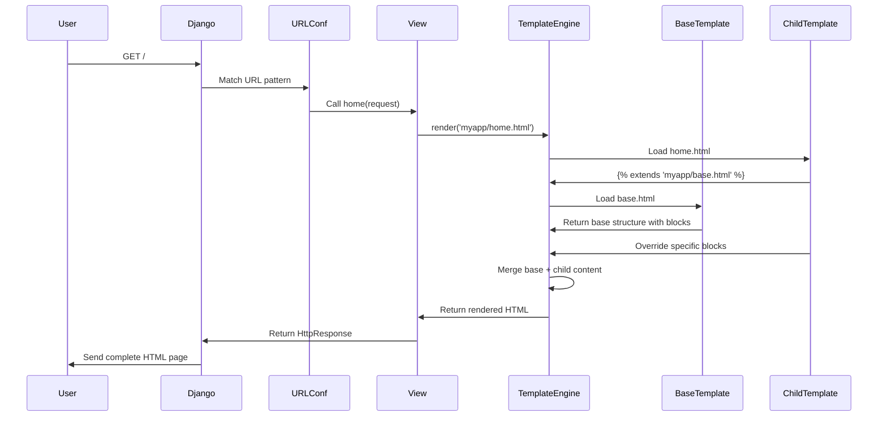
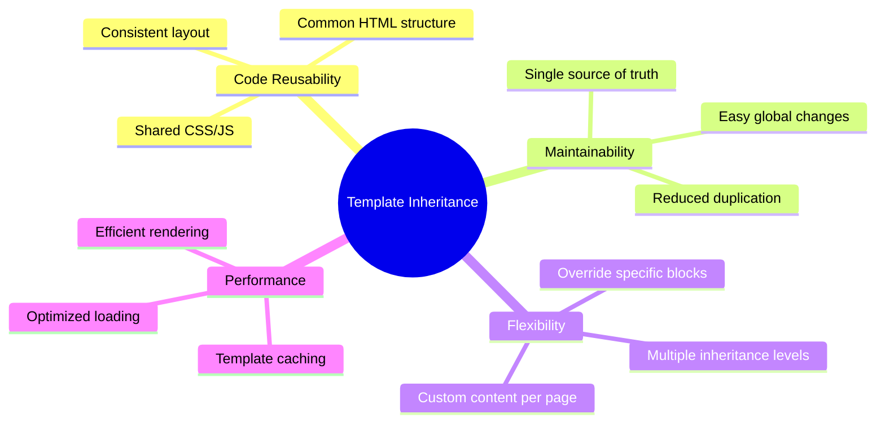
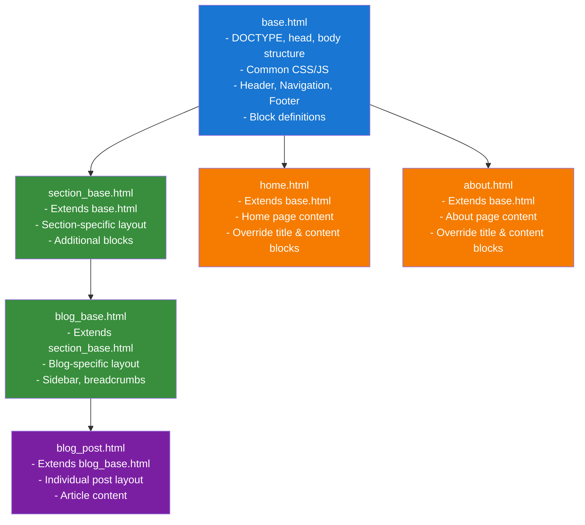

# Django Template Inheritance Flow

This diagram explains how Django template inheritance works, showing the relationship between base templates, child templates, and the rendering process.

## Template Inheritance Architecture

```mermaid
graph TB
    subgraph "Project Structure"
        A[myproject/] --> B[myapp/]
        B --> C[templates/]
        C --> D[myapp/]
        D --> E[base.html]
        D --> F[home.html]
        D --> G[about.html]
    end

    subgraph "Base Template (base.html)"
        H[<!DOCTYPE html>]
        I[My Website]
        J[Header Section]
        K[Navigation]
        L[Default Content]
        M[Footer]
        
        H --> I
        I --> J
        J --> K
        K --> L
        L --> M
    end

    subgraph "Child Templates"
        N[home.html<br/>]
        O[about.html<br/>]
        
        P[Home - My Website]
        Q[Home Page Content]
        
        R[About - My Website]
        S[About Page Content]
        
        N --> P
        N --> Q
        O --> R
        O --> S
    end

    E -.-> N
    E -.-> O
    
    style E fill:#e1f5fe
    style N fill:#f3e5f5
    style O fill:#f3e5f5
```

## Request-Response Flow



## Template Block Inheritance

```mermaid
graph LR
    subgraph "Base Template Blocks"
        A[]
        B[]
        C[Header - Fixed]
        D[Navigation - Fixed]
        E[Footer - Fixed]
    end

    subgraph "Home Template Override"
        F[<br/>Home - My Website]
        G[<br/>Welcome to Home Page]
    end

    subgraph "About Template Override"
        H[<br/>About - My Website]
        I[<br/>About Us Content]
    end

    subgraph "Final Rendered Pages"
        J[Home Page<br/>- Custom Title<br/>- Custom Content<br/>- Inherited Header/Nav/Footer]
        K[About Page<br/>- Custom Title<br/>- Custom Content<br/>- Inherited Header/Nav/Footer]
    end

    A -.-> F
    A -.-> H
    B -.-> G
    B -.-> I
    
    F --> J
    G --> J
    C --> J
    D --> J
    E --> J
    
    H --> K
    I --> K
    C --> K
    D --> K
    E --> K

    style A fill:#ffecb3
    style B fill:#ffecb3
    style F fill:#c8e6c9
    style G fill:#c8e6c9
    style H fill:#c8e6c9
    style I fill:#c8e6c9
```

## Key Benefits of Template Inheritance



## Template Loading Process

```mermaid
flowchart TD
    A[Request arrives] --> B{URL matches pattern?}
    B -->|Yes| C[Call corresponding view]
    B -->|No| D[404 Error]
    
    C --> E[View calls render()]
    E --> F[Template engine starts]
    F --> G{Child template extends base?}
    
    G -->|Yes| H[Load base template]
    G -->|No| I[Render template directly]
    
    H --> J[Identify blocks in base]
    J --> K[Load child template blocks]
    K --> L[Merge base + child content]
    L --> M[Apply context variables]
    M --> N[Return rendered HTML]
    
    I --> M
    N --> O[Send response to user]
    
    style A fill:#e8f5e8
    style N fill:#e8f5e8
    style D fill:#ffebee
```

## Template Inheritance Hierarchy Example



This diagram illustrates the complete flow of Django template inheritance, from the basic project structure through the rendering process, showing how base templates provide structure while child templates customize specific content blocks.