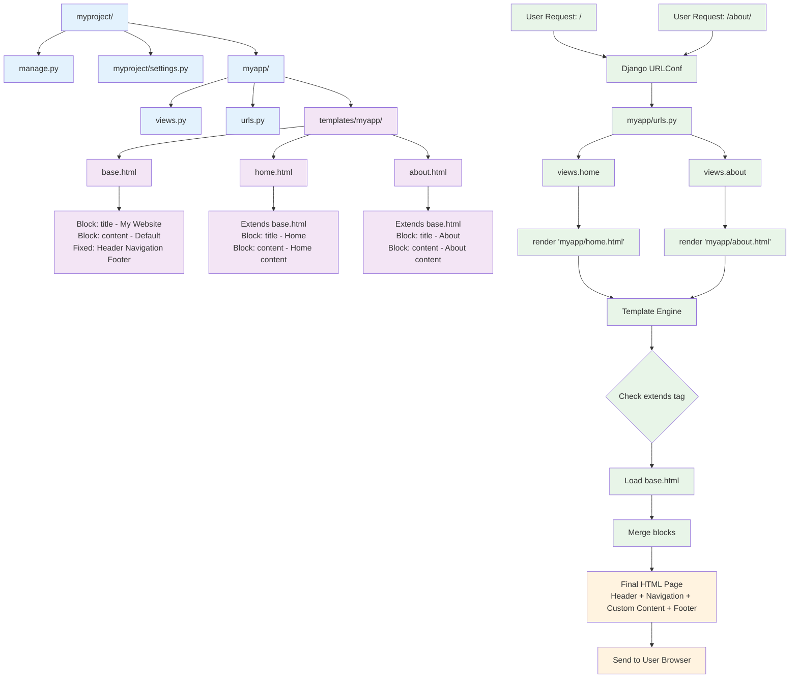

# Django Template Inheritance - Complete Flow

This diagram shows the entire flow of Django template inheritance, from project structure to final rendered output.

```mermaid
flowchart TD
    %% Project Structure
    A[myproject/] --> B[manage.py]
    A --> C[myproject/settings.py]
    A --> D[myapp/]
    
    D --> E[views.py]
    D --> F[urls.py]
    D --> G[templates/myapp/]
    
    G --> H[base.html]
    G --> I[home.html]
    G --> J[about.html]
    
    %% Request Flow
    K[User Request: /] --> L[Django URLConf]
    L --> M[myapp/urls.py]
    M --> N[views.home]
    
    O[User Request: /about/] --> L
    M --> P[views.about]
    
    %% Template Processing
    N --> Q[render 'myapp/home.html']
    P --> R[render 'myapp/about.html']
    
    Q --> S[Template Engine]
    R --> S
    
    S --> T{Check extends tag}
    T --> U[Load base.html]
    U --> V[Merge blocks]
    
    %% Template Content
    H --> W[Block: title - My Website<br/>Block: content - Default<br/>Fixed: Header Navigation Footer]
    I --> X[Extends base.html<br/>Block: title - Home<br/>Block: content - Home content]
    J --> Y[Extends base.html<br/>Block: title - About<br/>Block: content - About content]
    
    %% Final Output
    V --> Z[Final HTML Page<br/>Header + Navigation + Custom Content + Footer]
    Z --> AA[Send to User Browser]
    
    %% Styling
    classDef projectFiles fill:#e3f2fd
    classDef templates fill:#f3e5f5
    classDef process fill:#e8f5e8
    classDef output fill:#fff3e0
    
    class A,B,C,D,E,F projectFiles
    class G,H,I,J,W,X,Y templates
    class K,L,M,N,O,P,Q,R,S,T,U,V process
    class Z,AA output
```
