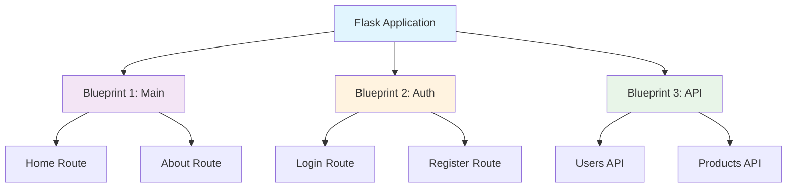

# Flask Blueprints - Complete Beginner's Guide 📚

## 🎯 Learning Objectives
By the end of this guide, you will:
- Understand what Flask Blueprints are and why they're important
- Learn how to create and register blueprints
- Build a practical multi-page application using blueprints
- Understand best practices for organizing Flask applications

---

## 📖 What are Flask Blueprints?

### Definition
A **Blueprint** in Flask is a way to organize your application into smaller, reusable components. Think of blueprints as "mini-applications" that can be plugged into your main Flask app.

### 🤔 Why Use Blueprints?

**Without Blueprints** (Small App):
```python
# Everything in one file - gets messy quickly!
from flask import Flask

app = Flask(__name__)

@app.route('/')
def home():
    return "Home Page"

@app.route('/about')
def about():
    return "About Page"

@app.route('/contact')
def contact():
    return "Contact Page"

@app.route('/products')
def products():
    return "Products Page"

# Imagine 50+ routes here... 😱
```

**With Blueprints** (Organized):
```
my_app/
├── app.py
├── blueprints/
│   ├── main.py      # Home, About routes
│   ├── products.py  # Product-related routes
│   └── contact.py   # Contact routes
```

### 🌟 Benefits of Using Blueprints

1. **Organization**: Keep related routes together
2. **Reusability**: Use the same blueprint in multiple applications
3. **Team Collaboration**: Different developers can work on different blueprints
4. **Maintainability**: Easier to debug and update specific features
5. **Scalability**: Handle large applications efficiently

---

## 🏗️ Blueprint Architecture



---

## 🚀 Creating Your First Blueprint

### Step 1: Basic Blueprint Structure

```python
# blueprints/main.py
from flask import Blueprint, render_template

# Create a blueprint
main_bp = Blueprint(
    'main',                    # Blueprint name
    __name__,                  # Import name
    template_folder='templates', # Optional: custom template folder
    static_folder='static'       # Optional: custom static folder
)

@main_bp.route('/')
def home():
    return "<h1>Welcome to Home Page! 🏠</h1>"

@main_bp.route('/about')
def about():
    return "<h1>About Us 📋</h1>"
```

### Step 2: Register Blueprint in Main App

```python
# app.py
from flask import Flask
from blueprints.main import main_bp

app = Flask(__name__)

# Register the blueprint
app.register_blueprint(main_bp)

if __name__ == '__main__':
    app.run(debug=True)
```

### 💡 Pro Tip
Always use `debug=True` during development for automatic reloading and better error messages!

---

## 🛠️ Practical Example: Building a Simple Website

Let's build a complete website with multiple blueprints:

### Project Structure
```
flask_blueprint_demo/
├── app.py
├── blueprints/
│   ├── __init__.py
│   ├── main.py
│   ├── products.py
│   └── auth.py
└── templates/
    ├── base.html
    ├── home.html
    ├── products.html
    └── login.html
```

### 📁 File: `blueprints/__init__.py`
```python
# This file makes 'blueprints' a Python package
# Can be empty or contain package initialization code
```

### 📁 File: `blueprints/main.py`
```python
from flask import Blueprint, render_template

main_bp = Blueprint('main', __name__)

@main_bp.route('/')
def home():
    return render_template('home.html')

@main_bp.route('/about')
def about():
    return "<h1>About Our Company</h1><p>We make awesome Flask apps! 🚀</p>"
```

### 📁 File: `blueprints/products.py`
```python
from flask import Blueprint, render_template

products_bp = Blueprint('products', __name__)

# Sample product data
PRODUCTS = [
    {"id": 1, "name": "Laptop", "price": 999.99},
    {"id": 2, "name": "Mouse", "price": 29.99},
    {"id": 3, "name": "Keyboard", "price": 79.99}
]

@products_bp.route('/products')
def product_list():
    return render_template('products.html', products=PRODUCTS)

@products_bp.route('/products/<int:product_id>')
def product_detail(product_id):
    # Find product by ID
    product = next((p for p in PRODUCTS if p['id'] == product_id), None)
    if product:
        return f"<h1>{product['name']}</h1><p>Price: ${product['price']}</p>"
    return "<h1>Product not found! 😞</h1>", 404
```

### 📁 File: `blueprints/auth.py`
```python
from flask import Blueprint, render_template, request, redirect, url_for, flash

auth_bp = Blueprint('auth', __name__)

@auth_bp.route('/login', methods=['GET', 'POST'])
def login():
    if request.method == 'POST':
        username = request.form['username']
        password = request.form['password']
        
        # Simple validation (In real apps, use proper authentication!)
        if username == 'admin' and password == 'secret':
            return f"<h1>Welcome {username}! ✅</h1>"
        else:
            return "<h1>Invalid credentials! ❌</h1>"
    
    return render_template('login.html')

@auth_bp.route('/register')
def register():
    return "<h1>Registration Page 📝</h1><p>Coming soon...</p>"
```

### 📁 File: `app.py`
```python
from flask import Flask
from blueprints.main import main_bp
from blueprints.products import products_bp
from blueprints.auth import auth_bp

# Create Flask application
app = Flask(__name__)
app.secret_key = 'your-secret-key-here'  # Needed for flash messages

# Register all blueprints
app.register_blueprint(main_bp)
app.register_blueprint(products_bp)
app.register_blueprint(auth_bp)

# Optional: Add a catch-all route
@app.route('/health')
def health_check():
    return {"status": "healthy", "blueprints": ["main", "products", "auth"]}

if __name__ == '__main__':
    app.run(debug=True, host='0.0.0.0', port=5000)
```

---

## 🎨 HTML Templates

### 📁 File: `templates/base.html`
```html
<!DOCTYPE html>
<html lang="en">
<head>
    <meta charset="UTF-8">
    <meta name="viewport" content="width=device-width, initial-scale=1.0">
    <title>Flask Blueprints Demo</title>
    <style>
        body { font-family: Arial, sans-serif; margin: 40px; }
        nav { background: #f0f0f0; padding: 10px; margin-bottom: 20px; }
        nav a { margin-right: 15px; text-decoration: none; color: #333; }
        nav a:hover { color: #007bff; }
    </style>
</head>
<body>
    <nav>
        <a href="/">🏠 Home</a>
        <a href="/about">📋 About</a>
        <a href="/products">🛍️ Products</a>
        <a href="/login">🔐 Login</a>
        <a href="/register">📝 Register</a>
    </nav>
    
    <main>
        
    </main>
</body>
</html>
```

### 📁 File: `templates/home.html`
```html



<h1>Welcome to Our Flask App! 🎉</h1>
<p>This is built using Flask Blueprints for better organization.</p>

<div style="background: #e8f5e8; padding: 15px; border-radius: 5px; margin-top: 20px;">
    <h3>🌟 Features:</h3>
    <ul>
        <li>Organized with Blueprints</li>
        <li>Product Catalog</li>
        <li>User Authentication</li>
        <li>Responsive Design</li>
    </ul>
</div>

```

### 📁 File: `templates/products.html`
```html



<h1>Our Products 🛍️</h1>

<div style="display: grid; grid-template-columns: repeat(auto-fit, minmax(200px, 1fr)); gap: 20px;">
    
    <div style="border: 1px solid #ddd; padding: 15px; border-radius: 5px;">
        <h3>{{ product.name }}</h3>
        <p style="color: #007bff; font-size: 18px; font-weight: bold;">
            ${{ "%.2f"|format(product.price) }}
        </p>
        <a href="/products/{{ product.id }}" style="color: #28a745;">View Details →</a>
    </div>
    
</div>

```

### 📁 File: `templates/login.html`
```html



<h1>Login 🔐</h1>

<form method="POST" style="max-width: 300px;">
    <div style="margin-bottom: 15px;">
        <label for="username">Username:</label><br>
        <input type="text" id="username" name="username" required 
               style="width: 100%; padding: 8px; margin-top: 5px;">
    </div>
    
    <div style="margin-bottom: 15px;">
        <label for="password">Password:</label><br>
        <input type="password" id="password" name="password" required
               style="width: 100%; padding: 8px; margin-top: 5px;">
    </div>
    
    <button type="submit" style="background: #007bff; color: white; padding: 10px 20px; border: none; border-radius: 5px; cursor: pointer;">
        Login
    </button>
</form>

<div style="margin-top: 20px; padding: 10px; background: #fff3cd; border-radius: 5px;">
    <strong>💡 Demo Credentials:</strong><br>
    Username: <code>admin</code><br>
    Password: <code>secret</code>
</div>

```

---

## 🏃‍♂️ Running the Application

### Step 1: Create the Project Structure
```bash
mkdir flask_blueprint_demo
cd flask_blueprint_demo
mkdir blueprints templates
touch app.py
touch blueprints/__init__.py blueprints/main.py blueprints/products.py blueprints/auth.py
touch templates/base.html templates/home.html templates/products.html templates/login.html
```

### Step 2: Install Flask
```bash
pip install flask
```

### Step 3: Run the Application
```bash
python app.py
```

### Step 4: Test Your Routes
Visit these URLs in your browser:
- `http://localhost:5000/` - Home page
- `http://localhost:5000/about` - About page
- `http://localhost:5000/products` - Products list
- `http://localhost:5000/products/1` - Product detail
- `http://localhost:5000/login` - Login form
- `http://localhost:5000/health` - Health check

---

## 🔧 Advanced Blueprint Features

### 1. URL Prefixes
```python
# Register blueprint with URL prefix
app.register_blueprint(products_bp, url_prefix='/shop')

# Now routes become:
# /shop/products
# /shop/products/1
```

### 2. Subdomain Support
```python
# Register blueprint for subdomain
app.register_blueprint(api_bp, subdomain='api')

# Routes accessible at:
# api.yoursite.com/users
# api.yoursite.com/products
```

### 3. Blueprint Error Handlers
```python
# In your blueprint file
@products_bp.errorhandler(404)
def product_not_found(error):
    return "<h1>Product not found! 🔍</h1>", 404

@products_bp.errorhandler(500)
def internal_error(error):
    return "<h1>Something went wrong! 😵</h1>", 500
```

### 4. Blueprint Before/After Request Handlers
```python
@products_bp.before_request
def before_product_request():
    print("About to handle a product request!")

@products_bp.after_request
def after_product_request(response):
    print("Product request handled!")
    return response
```

---

## ✅ Best Practices

### 1. **Naming Conventions**
```python
# ✅ Good
main_bp = Blueprint('main', __name__)
user_auth_bp = Blueprint('user_auth', __name__)

# ❌ Avoid
bp = Blueprint('bp', __name__)
blueprint1 = Blueprint('blueprint1', __name__)
```

### 2. **File Organization**
```
📁 Large Project Structure:
app/
├── __init__.py
├── blueprints/
│   ├── __init__.py
│   ├── auth/
│   │   ├── __init__.py
│   │   ├── routes.py
│   │   └── forms.py
│   ├── main/
│   │   ├── __init__.py
│   │   └── routes.py
│   └── api/
│       ├── __init__.py
│       └── routes.py
├── templates/
├── static/
└── run.py
```

### 3. **Import Organization**
```python
# ✅ Good - Clear imports
from flask import Blueprint, render_template, request, redirect, url_for
from .forms import LoginForm
from .models import User

# ❌ Avoid - Wild imports
from flask import *
```

### 4. **Configuration Management**
```python
# Use environment-based configuration
import os

class Config:
    SECRET_KEY = os.environ.get('SECRET_KEY') or 'dev-secret-key'
    DEBUG = os.environ.get('DEBUG', True)

app.config.from_object(Config)
```

---

## 🚨 Common Mistakes to Avoid

### 1. **Circular Imports**
```python
# ❌ Don't do this
# main.py imports auth.py
# auth.py imports main.py
# This creates circular dependency!

# ✅ Solution: Use application factory pattern
```

### 2. **Not Using URL Prefixes**
```python
# ❌ Without prefixes - routes can conflict
@main_bp.route('/dashboard')
@admin_bp.route('/dashboard')  # Conflict!

# ✅ With prefixes - clean separation
app.register_blueprint(main_bp)
app.register_blueprint(admin_bp, url_prefix='/admin')
```

### 3. **Hardcoded URLs**
```python
# ❌ Hardcoded
return redirect('/products')

# ✅ Using url_for
return redirect(url_for('products.product_list'))
```

---

## 🎯 Quick Reference

### Blueprint Creation Syntax
```python
blueprint_name = Blueprint(
    'name',           # Blueprint name
    __name__,         # Import name  
    url_prefix='/api', # Optional URL prefix
    subdomain='api',   # Optional subdomain
    template_folder='templates',  # Custom template folder
    static_folder='static'        # Custom static folder
)
```

### Registration Options
```python
app.register_blueprint(bp)                    # Basic registration
app.register_blueprint(bp, url_prefix='/api') # With URL prefix
app.register_blueprint(bp, subdomain='api')   # With subdomain
```

### URL Generation
```python
url_for('blueprint_name.function_name')
url_for('products.product_list')
url_for('auth.login')
```

---

## 🔥 Challenge Exercise

**Build a Blog Application** with these blueprints:
1. **Main Blueprint**: Home page, About page
2. **Blog Blueprint**: List posts, View post, Create post
3. **Auth Blueprint**: Login, Logout, Register

**Requirements:**
- Use proper URL prefixes
- Include error handlers
- Create appropriate templates
- Add navigation between pages

**Bonus Points:**
- Add CSS styling
- Include form validation
- Implement basic session management

---

## 📚 Summary

Flask Blueprints are essential for building scalable, maintainable Flask applications. They help you:

- ✅ **Organize** your code into logical modules
- ✅ **Reuse** components across different applications  
- ✅ **Collaborate** effectively with team members
- ✅ **Scale** your application as it grows
- ✅ **Maintain** and debug code more easily

### Key Takeaways:
1. **Always use blueprints** for applications with more than 5-10 routes
2. **Plan your blueprint structure** before coding
3. **Use URL prefixes** to avoid route conflicts
4. **Follow consistent naming conventions**
5. **Keep related functionality together** in the same blueprint

---

## 🔗 What's Next?

In the next guide, we'll explore **Flask-RESTful APIs** and learn how to build powerful web APIs using Flask blueprints as our foundation!

---

*📖 This guide is part of the Faculty Development Program series on Flask. Keep practicing and happy coding! 🚀*