# Next.js Static Generation (SSG) & Server-Side Rendering (SSR)
**Duration: 2 Hours | Faculty Development Workshop** 🚀

## 📚 What Are We Learning Today? (15 minutes)

Think of a restaurant with different ways to serve food:

🍕 **Static Generation (SSG)** = Pre-made pizza slices (fastest to serve!)  
🍳 **Server-Side Rendering (SSR)** = Made-to-order meals (fresh but takes time)  
🥪 **Client-Side Rendering (CSR)** = Self-service sandwich bar  
🔄 **Incremental Static Regeneration (ISR)** = Pre-made food that gets refreshed periodically  

```mermaid
graph TD
    A[User Visits Page] --> B{Which Method?}
    B -->|SSG| C[Serve Pre-built HTML]
    B -->|SSR| D[Build HTML on Server]
    B -->|CSR| E[Send Empty Page + JS]
    B -->|ISR| F[Serve Static + Refresh Later]
    
    C --> G[⚡ Fastest]
    D --> H[🔄 Fresh Data]
    E --> I[💫 Interactive]
    F --> J[⚡🔄 Best of Both]
```



### 🤔 When to Use What?

| Method | Best For | Example |
|--------|----------|---------|
| **SSG** 📄 | Blogs, marketing pages | Company website |
| **SSR** 🔄 | User profiles, dashboards | Facebook timeline |
| **CSR** 💻 | Admin panels, apps | Gmail interface |
| **ISR** ⚡ | News sites, e-commerce | Amazon product pages |

---

## 🏗️ Static Site Generation (SSG) (45 minutes)

> 💡 **Think of SSG like**: Preparing all your meals on Sunday for the whole week!

### 📁 Where Do Files Go?

```
my-nextjs-app/
├── pages/              👈 Your pages go here
│   ├── index.js        👈 Homepage (/)
│   ├── about.js        👈 About page (/about)
│   └── posts.js        👈 Posts page (/posts)
├── data/              👈 Your data files (we'll create this)
└── lib/               👈 Helper functions (we'll create this)
```

### 🚀 Your First SSG Page

**Step 1**: Create `pages/posts.js`

```jsx
// 📄 pages/posts.js
// This creates a page at /posts

export default function Posts({ posts }) {
  // ✨ The 'posts' data comes from getStaticProps below
  return (
    <div>
      <h1>📝 All Blog Posts</h1>
      {posts.map(post => (
        <div key={post.id} style={{ 
          marginBottom: '20px', 
          padding: '15px', 
          border: '1px solid #ddd',
          borderRadius: '8px'
        }}>
          <h2>📖 {post.title}</h2>
          <p>{post.body}</p>
          <small>🆔 Post ID: {post.id}</small>
        </div>
      ))}
    </div>
  )
}

// 🎯 This is THE MAGIC FUNCTION for SSG!
// It runs when you build your site (npm run build)
export async function getStaticProps() {
  console.log('🔧 getStaticProps is running at BUILD TIME!')
  
  // Get data from an API
  const res = await fetch('https://jsonplaceholder.typicode.com/posts?_limit=5')
  const posts = await res.json()

  // Return the data to your component
  return {
    props: {
      posts, // This becomes the 'posts' prop above ⬆️
    },
  }
}
```

> 💡 **Key Point**: `getStaticProps` runs when you build your site, NOT when users visit!

### 🎯 Dynamic Routes with SSG

**Step 2**: Create `pages/post/[id].js` (note the square brackets!)

```jsx
// 📄 pages/post/[id].js
// This creates pages like /post/1, /post/2, etc.

export default function Post({ post }) {
  return (
    <div style={{ maxWidth: '600px', margin: '0 auto', padding: '20px' }}>
      <h1>📖 {post.title}</h1>
      <div style={{ 
        backgroundColor: '#f0f0f0', 
        padding: '15px', 
        borderRadius: '8px',
        marginBottom: '20px'
      }}>
        <p>{post.body}</p>
      </div>
      <small>🆔 Post ID: {post.id}</small>
    </div>
  )
}

// 🛣️ Tell Next.js which paths to create
export async function getStaticPaths() {
  console.log('🛣️ getStaticPaths: Deciding which pages to build...')
  
  // Get all posts to know which IDs exist
  const res = await fetch('https://jsonplaceholder.typicode.com/posts?_limit=10')
  const posts = await res.json()

  // Create an array of paths
  const paths = posts.map((post) => ({
    params: { id: post.id.toString() }, // id must be a string!
  }))

  console.log('📋 Building pages for IDs:', paths.map(p => p.params.id))

  return { 
    paths, 
    fallback: false // 404 for any other IDs
  }
}

// 🎯 Get data for each specific post
export async function getStaticProps({ params }) {
  console.log(`📖 Getting data for post ${params.id}...`)
  
  const res = await fetch(`https://jsonplaceholder.typicode.com/posts/${params.id}`)
  const post = await res.json()

  return {
    props: {
      post,
    },
  }
}
```

> 🚨 **Important**: In `[id].js`, the file name `id` must match `params.id` in your functions!

### 📊 Understanding Fallback Options

```mermaid
graph TD
    A[User visits /post/999] --> B{Fallback Setting?}
    B -->|fallback: false| C[❌ Show 404 Page]
    B -->|fallback: true| D[⏳ Show Loading, Generate Page]
    B -->|fallback: 'blocking'| E[⏳ Wait, Then Show Page]
```



### 💾 Working with Local Data

**Step 3**: Create your own data files

**Create folder**: `mkdir data`

**Create file**: `data/posts.json`
```json
[
  {
    "id": 1,
    "title": "🚀 Getting Started with Next.js",
    "content": "Next.js is amazing! It makes React development so much easier...",
    "author": "John Doe",
    "date": "2024-01-15"
  },
  {
    "id": 2,
    "title": "🎯 Understanding SSG vs SSR",
    "content": "Let me explain the differences between these rendering methods...",
    "author": "Jane Smith", 
    "date": "2024-01-20"
  }
]
```

**Create folder**: `mkdir lib`

**Create file**: `lib/posts.js` (Helper functions)
```javascript
// 📚 lib/posts.js
// Helper functions to work with our data

import fs from 'fs'
import path from 'path'

const postsDirectory = path.join(process.cwd(), 'data')

// 📖 Get all posts
export function getAllPosts() {
  const fullPath = path.join(postsDirectory, 'posts.json')
  const fileContents = fs.readFileSync(fullPath, 'utf8')
  return JSON.parse(fileContents)
}

// 🔍 Get one specific post
export function getPostById(id) {
  const posts = getAllPosts()
  return posts.find(post => post.id.toString() === id.toString())
}

// 🆔 Get all post IDs for static paths
export function getAllPostIds() {
  const posts = getAllPosts()
  return posts.map(post => ({
    params: {
      id: post.id.toString()
    }
  }))
}
```

> 💡 **Tip**: `process.cwd()` gives you the root folder of your project!

**Create file**: `pages/blog/index.js`
```jsx
// 📄 pages/blog/index.js
// This creates /blog page

import { getAllPosts } from '../../lib/posts' // Import our helper
import Link from 'next/link'

export default function Blog({ posts }) {
  return (
    <div style={{ maxWidth: '800px', margin: '0 auto', padding: '20px' }}>
      <h1>📝 My Blog</h1>
      <p>Welcome to my awesome blog! 🎉</p>
      
      {posts.map(post => (
        <div key={post.id} style={{ 
          marginBottom: '30px',
          padding: '20px',
          border: '2px solid #e0e0e0',
          borderRadius: '12px',
          backgroundColor: '#fafafa'
        }}>
          <h2>
            <Link href={`/blog/${post.id}`}>
              <a style={{ color: '#0066cc', textDecoration: 'none' }}>
                {post.title}
              </a>
            </Link>
          </h2>
          <p style={{ color: '#666', fontSize: '14px' }}>
            ✍️ By {post.author} on {post.date}
          </p>
        </div>
      ))}
    </div>
  )
}

export async function getStaticProps() {
  const posts = getAllPosts() // Use our helper function!
  
  return {
    props: {
      posts,
    },
  }
}
```

---

## 🔄 Server-Side Rendering (SSR) (35 minutes)

> 💡 **Think of SSR like**: A chef who cooks your meal fresh when you order it!

### 🎯 When to Use SSR
- ✅ User-specific content (dashboards, profiles)  
- ✅ Real-time data (stock prices, chat)  
- ✅ SEO with dynamic content  
- ❌ Don't use for static content (blogs, docs)  

### 🚀 Your First SSR Page

**Create file**: `pages/dashboard.js`

```jsx
// 📄 pages/dashboard.js
// This page renders fresh data on every visit!

export default function Dashboard({ user, data }) {
  return (
    <div style={{ 
      maxWidth: '600px', 
      margin: '0 auto', 
      padding: '20px',
      backgroundColor: '#f8f9fa',
      borderRadius: '12px'
    }}>
      <h1>📊 Dashboard</h1>
      <div style={{ marginBottom: '20px', padding: '15px', backgroundColor: 'white', borderRadius: '8px' }}>
        <h2>👋 Welcome, {user.name}!</h2>
        <p>🆔 User ID: {user.id}</p>
      </div>
      
      <div style={{ padding: '15px', backgroundColor: 'white', borderRadius: '8px' }}>
        <h3>📈 Live Data</h3>
        <p>🕐 Server time: {data.serverTime}</p>
        <p>🎲 Random number: {data.randomNumber}</p>
        <small>💡 This data changes on every page refresh!</small>
      </div>
    </div>
  )
}

// 🔄 This function runs on EVERY request (not at build time!)
export async function getServerSideProps() {
  console.log('🔄 getServerSideProps running for a user request!')
  
  // Simulate getting user info (in real life, from database/session)
  const user = {
    name: 'John Doe',
    id: 1
  }

  // This data is different every time!
  const data = {
    serverTime: new Date().toLocaleString(),
    randomNumber: Math.floor(Math.random() * 1000)
  }

  return {
    props: {
      user,
      data,
    },
  }
}
```

> 🚨 **Key Difference**: `getServerSideProps` runs on every page visit, `getStaticProps` runs only at build time!

### 👤 SSR with Dynamic Routes

**Create file**: `pages/user/[userId].js`

```jsx
// 📄 pages/user/[userId].js  
// Creates pages like /user/1, /user/2, etc.

export default function UserProfile({ user, posts, error }) {
  // Handle errors gracefully
  if (error) {
    return (
      <div style={{ textAlign: 'center', padding: '50px' }}>
        <h1>❌ Oops!</h1>
        <p>{error}</p>
      </div>
    )
  }

  if (!user) {
    return (
      <div style={{ textAlign: 'center', padding: '50px' }}>
        <h1>👤 User not found</h1>
      </div>
    )
  }

  return (
    <div style={{ maxWidth: '800px', margin: '0 auto', padding: '20px' }}>
      {/* User Info */}
      <div style={{ 
        backgroundColor: '#e3f2fd', 
        padding: '20px', 
        borderRadius: '12px',
        marginBottom: '30px'
      }}>
        <h1>👤 {user.name}</h1>
        <p>📧 Email: {user.email}</p>
        <p>🌐 Website: {user.website}</p>
        <p>🏢 Company: {user.company.name}</p>
      </div>
      
      {/* User's Posts */}
      <h2>📝 Recent Posts by {user.name}</h2>
      {posts.length === 0 ? (
        <p>No posts found 😔</p>
      ) : (
        posts.map(post => (
          <div key={post.id} style={{ 
            marginBottom: '20px',
            padding: '15px',
            border: '1px solid #ddd',
            borderRadius: '8px'
          }}>
            <h3>📖 {post.title}</h3>
            <p>{post.body}</p>
          </div>
        ))
      )}
    </div>
  )
}

export async function getServerSideProps({ params }) {
  const { userId } = params
  
  console.log(`🔍 Fetching data for user ${userId}...`)

  try {
    // Fetch user data
    const userRes = await fetch(`https://jsonplaceholder.typicode.com/users/${userId}`)
    
    if (!userRes.ok) {
      throw new Error('User not found')
    }
    
    const user = await userRes.json()

    // Fetch user's posts  
    const postsRes = await fetch(`https://jsonplaceholder.typicode.com/posts?userId=${userId}&_limit=3`)
    const posts = await postsRes.json()

    return {
      props: {
        user,
        posts,
        error: null,
      },
    }
  } catch (error) {
    console.error('❌ Error fetching user data:', error)
    
    return {
      props: {
        user: null,
        posts: [],
        error: error.message,
      },
    }
  }
}
```

> 💡 **Pro Tip**: Always handle errors in SSR! If an API fails, your page should still work.

### 🔐 Authentication Example

**Create file**: `pages/profile.js`

```jsx
// 📄 pages/profile.js
// A protected page that checks authentication

export default function Profile({ user, isAuthenticated }) {
  if (!isAuthenticated) {
    return (
      <div style={{ 
        textAlign: 'center', 
        padding: '50px',
        backgroundColor: '#ffebee',
        borderRadius: '12px',
        margin: '20px'
      }}>
        <h1>🚫 Access Denied</h1>
        <p>Please log in to view your profile.</p>
        <button style={{
          backgroundColor: '#2196f3',
          color: 'white',
          padding: '10px 20px',
          border: 'none',
          borderRadius: '6px',
          cursor: 'pointer'
        }}>
          🔑 Log In
        </button>
      </div>
    )
  }

  return (
    <div style={{ 
      maxWidth: '600px', 
      margin: '0 auto', 
      padding: '20px',
      backgroundColor: '#e8f5e8',
      borderRadius: '12px'
    }}>
      <h1>👤 My Profile</h1>
      <div style={{ backgroundColor: 'white', padding: '20px', borderRadius: '8px' }}>
        <p><strong>Name:</strong> {user.name}</p>
        <p><strong>Email:</strong> {user.email}</p>
        <p><strong>Last login:</strong> {user.lastLogin}</p>
      </div>
    </div>
  )
}

export async function getServerSideProps({ req }) {
  // In real life, you'd check a real auth token/session
  // For demo, we're just checking if a cookie exists
  const isAuthenticated = req.headers.cookie?.includes('auth-token') || false

  console.log('🔐 Checking authentication:', isAuthenticated ? '✅ Logged in' : '❌ Not logged in')

  if (!isAuthenticated) {
    return {
      props: {
        isAuthenticated: false,
        user: null,
      },
    }
  }

  // If authenticated, get user data
  const user = {
    name: 'John Doe',
    email: 'john@example.com',
    lastLogin: new Date().toLocaleString(),
  }

  return {
    props: {
      isAuthenticated: true,
      user,
    },
  }
}
```

> 🔒 **Security Note**: In real apps, use proper authentication libraries like NextAuth.js!

---

## 🔄 Incremental Static Regeneration (ISR) (20 minutes)

> 💡 **Think of ISR like**: Pre-made food that gets refreshed when it gets old!

```mermaid
graph TD
    A[User visits page] --> B{Page cached?}
    B -->|Yes, Fresh| C[Serve cached page ⚡]
    B -->|Yes, Stale| D[Serve cached + regenerate in background 🔄]
    B -->|No| E[Generate new page ⏳]
    
    D --> F[Next visitor gets fresh page ✨]
```



### 📰 ISR News Example

**Create file**: `pages/news.js`

```jsx
// 📄 pages/news.js
// News that updates every 30 seconds!

export default function News({ articles, lastUpdated }) {
  return (
    <div style={{ maxWidth: '800px', margin: '0 auto', padding: '20px' }}>
      <div style={{ 
        backgroundColor: '#fff3cd', 
        padding: '15px', 
        borderRadius: '8px',
        marginBottom: '20px',
        textAlign: 'center'
      }}>
        <h1>📰 Latest News</h1>
        <p>🕐 Last updated: {lastUpdated}</p>
        <small>💡 This page regenerates every 30 seconds when someone visits</small>
      </div>
      
      {articles.map(article => (
        <div key={article.id} style={{ 
          marginBottom: '25px', 
          padding: '20px', 
          border: '2px solid #dee2e6',
          borderRadius: '12px',
          backgroundColor: '#ffffff'
        }}>
          <h2>📄 {article.title}</h2>
          <p style={{ color: '#666', marginBottom: '10px' }}>{article.summary}</p>
          <small style={{ color: '#888' }}>
            📅 Published: {new Date(article.publishedAt).toLocaleString()}
          </small>
        </div>
      ))}
    </div>
  )
}

export async function getStaticProps() {
  console.log('📰 Generating news page...')
  
  // Simulate fetching fresh news data
  const articles = [
    {
      id: 1,
      title: "🚀 Tech News Update",
      summary: "Latest developments in technology world...",
      publishedAt: new Date().toISOString()
    },
    {
      id: 2,
      title: "📈 Market Analysis",
      summary: "Today's market performance and trends...",
      publishedAt: new Date().toISOString()
    },
    {
      id: 3,
      title: "🌍 Global Updates",
      summary: "Important news from around the world...",
      publishedAt: new Date().toISOString()
    }
  ]

  return {
    props: {
      articles,
      lastUpdated: new Date().toLocaleString(),
    },
    // 🔄 This is the magic! Regenerate every 30 seconds
    revalidate: 30, // seconds
  }
}
```

> ⏰ **ISR Timeline**:
> - First visitor: Gets fresh page (slow)
> - Next 30 seconds: Everyone gets cached page (fast)
> - After 30 seconds: Next visitor triggers regeneration
> - Background: New page generates
> - Future visitors: Get the updated page

### 🔄 Manual Revalidation API

**Create file**: `pages/api/revalidate.js`

```javascript
// 📄 pages/api/revalidate.js
// API to manually refresh pages

export default async function handler(req, res) {
  // Secret key for security
  if (req.query.secret !== 'my-secret-key') {
    return res.status(401).json({ 
      message: '🚫 Access denied - wrong secret key' 
    })
  }

  try {
    console.log('🔄 Manual revalidation triggered!')
    
    // Force regenerate the news page
    await res.revalidate('/news')
    
    return res.json({ 
      revalidated: true,
      message: '✅ Page regenerated successfully!',
      timestamp: new Date().toLocaleString()
    })
  } catch (err) {
    console.error('❌ Revalidation failed:', err)
    return res.status(500).json({
      message: '❌ Error revalidating page'
    })
  }
}
```

> 🔗 **How to use**: Visit `/api/revalidate?secret=my-secret-key` to manually refresh the news page!

---

## 🏁 Performance Comparison Exercise (20 minutes)

Let's build three versions of the same page to see the differences!

### 📊 Comparison Page Structure

```
pages/
├── comparison/
│   ├── ssg.js     👈 Static Generation
│   ├── ssr.js     👈 Server-Side Rendering  
│   └── csr.js     👈 Client-Side Rendering
```

### 1️⃣ Static Generation Version

**Create file**: `pages/comparison/ssg.js`

```jsx
export default function SSGPage({ data, buildTime }) {
  return (
    <div style={{ 
      maxWidth: '600px', 
      margin: '0 auto', 
      padding: '20px',
      backgroundColor: '#e8f5e8',
      borderRadius: '12px'
    }}>
      <h1>⚡ SSG Page (Fastest!)</h1>
      <div style={{ backgroundColor: 'white', padding: '15px', borderRadius: '8px' }}>
        <p><strong>🕐 Build Time:</strong> {buildTime}</p>
        <p><strong>📊 Data:</strong> {JSON.stringify(data)}</p>
      </div>
      <div style={{ marginTop: '15px', padding: '10px', backgroundColor: '#d4edda', borderRadius: '6px' }}>
        <small>💡 This page was generated at build time and served from CDN</small>
      </div>
    </div>
  )
}

export async function getStaticProps() {
  console.log('🏗️ Building SSG page...')
  
  // Simulate API delay
  await new Promise(resolve => setTimeout(resolve, 1000))
  
  return {
    props: {
      data: { message: "Static data", type: "SSG" },
      buildTime: new Date().toLocaleString(),
    },
  }
}
```

### 2️⃣ Server-Side Rendering Version  

**Create file**: `pages/comparison/ssr.js`

```jsx
export default function SSRPage({ data, requestTime }) {
  return (
    <div style={{ 
      maxWidth: '600px', 
      margin: '0 auto', 
      padding: '20px',
      backgroundColor: '#fff3cd',
      borderRadius: '12px'
    }}>
      <h1>🔄 SSR Page (Fresh Data!)</h1>
      <div style={{ backgroundColor: 'white', padding: '15px', borderRadius: '8px' }}>
        <p><strong>🕐 Request Time:</strong> {requestTime}</p>
        <p><strong>📊 Data:</strong> {JSON.stringify(data)}</p>
      </div>
      <div style={{ marginTop: '15px', padding: '10px', backgroundColor: '#ffeaa7', borderRadius: '6px' }}>
        <small>💡 This page was generated fresh for your request</small>
      </div>
    </div>
  )
}

export async function getServerSideProps() {
  console.log('🔄 Processing SSR request...')
  
  // Simulate API delay
  await new Promise(resolve => setTimeout(resolve, 1000))
  
  return {
    props: {
      data: { message: "Server-side data", type: "SSR", random: Math.random() },
      requestTime: new Date().toLocaleString(),
    },
  }
}
```

### 3️⃣ Client-Side Rendering Version

**Create file**: `pages/comparison/csr.js`

```jsx
import { useState, useEffect } from 'react'

export default function CSRPage() {
  const [data, setData] = useState(null)
  const [loading, setLoading] = useState(true)

  useEffect(() => {
    console.log('💻 Fetching data on client side...')
    
    // Simulate API call
    setTimeout(() => {
      setData({ 
        message: "Client-side data",
        type: "CSR",
        fetchTime: new Date().toLocaleString()
      })
      setLoading(false)
    }, 1000)
  }, [])

  if (loading) {
    return (
      <div style={{ 
        maxWidth: '600px', 
        margin: '0 auto', 
        padding: '20px',
        textAlign: 'center'
      }}>
        <h1>⏳ Loading...</h1>
        <p>Fetching data from client side...</p>
      </div>
    )
  }

  return (
    <div style={{ 
      maxWidth: '600px', 
      margin: '0 auto', 
      padding: '20px',
      backgroundColor: '#f8d7da',
      borderRadius: '12px'
    }}>
      <h1>💻 CSR Page (Interactive!)</h1>
      <div style={{ backgroundColor: 'white', padding: '15px', borderRadius: '8px' }}>
        <p><strong>🕐 Fetch Time:</strong> {data.fetchTime}</p>
        <p><strong>📊 Data:</strong> {JSON.stringify(data)}</p>
      </div>
      <div style={{ marginTop: '15px', padding: '10px', backgroundColor: '#f5c6cb', borderRadius: '6px' }}>
        <small>💡 This page loaded first, then fetched data with JavaScript</small>
      </div>
    </div>
  )
}
```

---

## 🛠️ Build and Test Commands (5 minutes)

```bash
# 🏗️ Build your Next.js app
npm run build

# 📊 See what was generated
# Static pages show as ● (Static)
# SSR pages show as λ (Lambda/Server)

# 🚀 Start production server
npm run start
