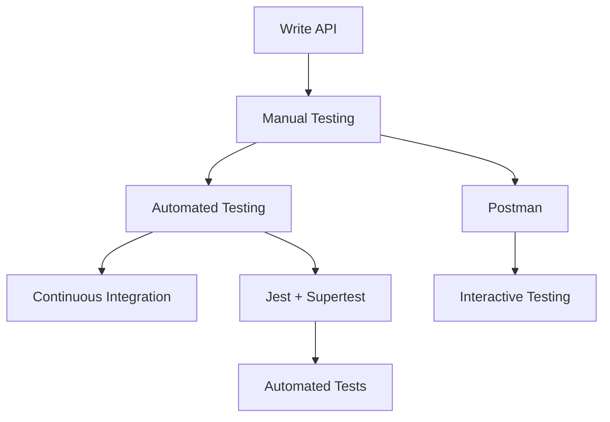

# Testing APIs with Postman & Jest/Supertest 🧪🔍
## Concise Beginner's Guide

---

## Table of Contents
1. [Introduction & Concepts](#introduction--concepts)
2. [Environment Setup](#environment-setup)
3. [Manual Testing with Postman](#manual-testing-with-postman)
4. [Automated Testing with Jest & Supertest](#automated-testing-with-jest--supertest)
5. [Testing File Upload APIs](#testing-file-upload-apis)
6. [Best Practices & Tips](#best-practices--tips)
7. [Troubleshooting](#troubleshooting)
8. [Practice Exercises](#practice-exercises)

---

## 1. Introduction & Concepts

### What is API Testing? 🤔
API testing verifies that your web services work correctly. It's like quality control for your backend - ensuring inputs produce expected outputs.

### Testing Flow


### Types of API Testing
- **Manual Testing**: Using tools like Postman interactively
- **Automated Testing**: Code that tests your code automatically
- **Unit Testing**: Testing individual functions
- **Integration Testing**: Testing complete workflows

### Key HTTP Status Codes
| Code | Meaning | When to Use |
|------|---------|-------------|
| 200 | OK | Successful GET/PUT |
| 201 | Created | Successful POST |
| 400 | Bad Request | Invalid input |
| 401 | Unauthorized | Login required |
| 404 | Not Found | Resource doesn't exist |
| 500 | Server Error | Something broke |

---

## 2. Environment Setup

### Prerequisites ✅
- Node.js (v14+)
- Postman app installed
- Basic JavaScript knowledge
- Understanding of HTTP methods

### Project Setup
```bash
# Create testing project
mkdir api-testing-demo && cd api-testing-demo
npm init -y

# Install dependencies
npm install express cors helmet morgan
npm install --save-dev jest supertest nodemon

# Create structure
mkdir src tests
touch src/app.js src/server.js jest.config.js
```

### Package.json Scripts
```json
{
  "scripts": {
    "start": "node src/server.js",
    "dev": "nodemon src/server.js",
    "test": "jest",
    "test:watch": "jest --watch",
    "test:coverage": "jest --coverage"
  }
}
```

### Jest Configuration
```javascript
// jest.config.js
module.exports = {
    testEnvironment: 'node',
    testMatch: ['**/tests/**/*.test.js'],
    collectCoverageFrom: ['src/**/*.js'],
    verbose: true,
    clearMocks: true
};
```

---

## 3. Manual Testing with Postman

### Sample API for Testing

Create a simple REST API to test:

```javascript
// src/app.js
const express = require('express');
const cors = require('cors');

const app = express();

// Middleware
app.use(cors());
app.use(express.json());

// In-memory data
let users = [
    { id: 1, name: 'John Doe', email: 'john@example.com' },
    { id: 2, name: 'Jane Smith', email: 'jane@example.com' }
];
let nextId = 3;

// Routes
app.get('/health', (req, res) => {
    res.json({ status: 'OK', timestamp: new Date().toISOString() });
});

app.get('/api/users', (req, res) => {
    res.json({ success: true, data: users, total: users.length });
});

app.get('/api/users/:id', (req, res) => {
    const user = users.find(u => u.id === parseInt(req.params.id));
    if (!user) {
        return res.status(404).json({ success: false, message: 'User not found' });
    }
    res.json({ success: true, data: user });
});

app.post('/api/users', (req, res) => {
    const { name, email } = req.body;
    
    if (!name || !email) {
        return res.status(400).json({ 
            success: false, 
            message: 'Name and email are required' 
        });
    }

    const newUser = { id: nextId++, name, email };
    users.push(newUser);
    
    res.status(201).json({ 
        success: true, 
        message: 'User created', 
        data: newUser 
    });
});

app.put('/api/users/:id', (req, res) => {
    const userIndex = users.findIndex(u => u.id === parseInt(req.params.id));
    if (userIndex === -1) {
        return res.status(404).json({ success: false, message: 'User not found' });
    }

    users[userIndex] = { ...users[userIndex], ...req.body };
    res.json({ success: true, data: users[userIndex] });
});

app.delete('/api/users/:id', (req, res) => {
    const userIndex = users.findIndex(u => u.id === parseInt(req.params.id));
    if (userIndex === -1) {
        return res.status(404).json({ success: false, message: 'User not found' });
    }

    users.splice(userIndex, 1);
    res.status(204).send();
});

module.exports = app;
```

```javascript
// src/server.js
const app = require('./app');
const PORT = process.env.PORT || 3000;

app.listen(PORT, () => {
    console.log(`🚀 Server running on http://localhost:${PORT}`);
});
```

### Start Your API
```bash
npm run dev
# Server runs on http://localhost:3000
```

### Postman Setup & Testing

#### 1. Create Environment
1. Open Postman → Environments → Create Environment
2. Name: "API Testing Demo"
3. Variables:
   ```
   base_url: http://localhost:3000
   api_path: /api
   ```

#### 2. Create Collection
1. Collections → New Collection
2. Name: "User API Tests"

#### 3. Essential Requests

**Health Check:**
```
GET {{base_url}}/health
```

**Get All Users:**
```
GET {{base_url}}{{api_path}}/users
```

**Get User by ID:**
```
GET {{base_url}}{{api_path}}/users/1
```

**Create User:**
```
POST {{base_url}}{{api_path}}/users
Headers: Content-Type: application/json
Body:
{
    "name": "Alice Johnson",
    "email": "alice@example.com"
}
```

**Update User:**
```
PUT {{base_url}}{{api_path}}/users/1
Headers: Content-Type: application/json
Body:
{
    "name": "Updated Name"
}
```

**Delete User:**
```
DELETE {{base_url}}{{api_path}}/users/1
```

#### 4. Adding Tests in Postman

Click "Tests" tab in any request:

```javascript
// Basic status check
pm.test("Status code is 200", function () {
    pm.response.to.have.status(200);
});

// Response time check
pm.test("Response time is acceptable", function () {
    pm.expect(pm.response.responseTime).to.be.below(200);
});

// JSON structure validation
pm.test("Response has required fields", function () {
    const jsonData = pm.response.json();
    pm.expect(jsonData).to.have.property('success');
    pm.expect(jsonData).to.have.property('data');
});

// Save data for next requests
pm.test("Save user ID", function () {
    const jsonData = pm.response.json();
    if (jsonData.data && jsonData.data.id) {
        pm.environment.set("user_id", jsonData.data.id);
    }
});
```

#### 5. Pre-request Scripts

```javascript
// Generate random email
const timestamp = Date.now();
pm.environment.set("random_email", `user${timestamp}@example.com`);

// Set timestamp
pm.environment.set("timestamp", new Date().toISOString());
```

#### 6. Running Collection Tests
1. Click collection → Run
2. Select environment
3. Click "Run API Tests"
4. View results

---

## 4. Automated Testing with Jest & Supertest

### Basic Test Structure

```javascript
// tests/api.test.js
const request = require('supertest');
const app = require('../src/app');

describe('User API Tests', () => {
    
    describe('GET /health', () => {
        test('should return health status', async () => {
            const response = await request(app)
                .get('/health')
                .expect(200);

            expect(response.body).toHaveProperty('status', 'OK');
            expect(response.body).toHaveProperty('timestamp');
        });
    });

    describe('GET /api/users', () => {
        test('should return all users', async () => {
            const response = await request(app)
                .get('/api/users')
                .expect(200);

            expect(response.body.success).toBe(true);
            expect(Array.isArray(response.body.data)).toBe(true);
            expect(response.body).toHaveProperty('total');
        });

        test('should return users with correct structure', async () => {
            const response = await request(app)
                .get('/api/users')
                .expect(200);

            const users = response.body.data;
            if (users.length > 0) {
                const user = users[0];
                expect(user).toHaveProperty('id');
                expect(user).toHaveProperty('name');
                expect(user).toHaveProperty('email');
            }
        });
    });

    describe('GET /api/users/:id', () => {
        test('should return specific user', async () => {
            const response = await request(app)
                .get('/api/users/1')
                .expect(200);

            expect(response.body.success).toBe(true);
            expect(response.body.data.id).toBe(1);
        });

        test('should return 404 for non-existent user', async () => {
            const response = await request(app)
                .get('/api/users/999')
                .expect(404);

            expect(response.body.success).toBe(false);
            expect(response.body.message).toContain('not found');
        });
    });

    describe('POST /api/users', () => {
        test('should create new user', async () => {
            const newUser = {
                name: 'Test User',
                email: 'test@example.com'
            };

            const response = await request(app)
                .post('/api/users')
                .send(newUser)
                .expect(201);

            expect(response.body.success).toBe(true);
            expect(response.body.data).toMatchObject(newUser);
            expect(response.body.data).toHaveProperty('id');
        });

        test('should reject invalid data', async () => {
            const invalidUser = { name: 'Test' }; // missing email

            const response = await request(app)
                .post('/api/users')
                .send(invalidUser)
                .expect(400);

            expect(response.body.success).toBe(false);
            expect(response.body.message).toContain('required');
        });
    });

    describe('PUT /api/users/:id', () => {
        test('should update existing user', async () => {
            const updateData = { name: 'Updated Name' };

            const response = await request(app)
                .put('/api/users/1')
                .send(updateData)
                .expect(200);

            expect(response.body.success).toBe(true);
            expect(response.body.data.name).toBe(updateData.name);
        });
    });

    describe('DELETE /api/users/:id', () => {
        test('should delete user', async () => {
            // Create user first
            const newUser = await request(app)
                .post('/api/users')
                .send({ name: 'To Delete', email: 'delete@example.com' });

            const userId = newUser.body.data.id;

            // Delete user
            await request(app)
                .delete(`/api/users/${userId}`)
                .expect(204);

            // Verify deletion
            await request(app)
                .get(`/api/users/${userId}`)
                .expect(404);
        });
    });
});
```

### Integration Test Example

```javascript
// tests/integration.test.js
const request = require('supertest');
const app = require('../src/app');

describe('User Flow Integration', () => {
    test('complete user lifecycle', async () => {
        // 1. Create user
        const createRes = await request(app)
            .post('/api/users')
            .send({ name: 'Flow Test', email: 'flow@example.com' })
            .expect(201);

        const userId = createRes.body.data.id;

        // 2. Get created user
        const getRes = await request(app)
            .get(`/api/users/${userId}`)
            .expect(200);

        expect(getRes.body.data.name).toBe('Flow Test');

        // 3. Update user
        await request(app)
            .put(`/api/users/${userId}`)
            .send({ name: 'Updated Flow Test' })
            .expect(200);

        // 4. Verify update
        const verifyRes = await request(app)
            .get(`/api/users/${userId}`)
            .expect(200);

        expect(verifyRes.body.data.name).toBe('Updated Flow Test');

        // 5. Delete user
        await request(app)
            .delete(`/api/users/${userId}`)
            .expect(204);

        // 6. Verify deletion
        await request(app)
            .get(`/api/users/${userId}`)
            .expect(404);
    });
});
```

### Running Tests
```bash
# Run all tests
npm test

# Run tests in watch mode
npm run test:watch

# Run with coverage
npm run test:coverage
```

---

## 5. Testing File Upload APIs

### File Upload API Extension

Add to your `src/app.js`:

```javascript
const multer = require('multer');
const upload = multer({ storage: multer.memoryStorage() });

app.post('/api/upload', upload.single('file'), (req, res) => {
    if (!req.file) {
        return res.status(400).json({ 
            success: false, 
            message: 'No file uploaded' 
        });
    }

    res.json({
        success: true,
        message: 'File uploaded successfully',
        file: {
            originalname: req.file.originalname,
            mimetype: req.file.mimetype,
            size: req.file.size
        }
    });
});
```

### Testing File Upload in Postman

**Upload File Request:**
```
POST {{base_url}}/api/upload
Body: form-data
Key: file (type: File)
Value: [Select file]
```

**Postman Test Script:**
```javascript
pm.test("File upload successful", function () {
    pm.response.to.have.status(200);
    const jsonData = pm.response.json();
    pm.expect(jsonData.success).to.be.true;
    pm.expect(jsonData.file).to.have.property('originalname');
});
```

### Testing File Upload with Jest

```javascript
// tests/upload.test.js
const request = require('supertest');
const path = require('path');
const app = require('../src/app');

describe('File Upload API', () => {
    test('should upload file successfully', async () => {
        const testFile = path.join(__dirname, 'fixtures', 'test-image.jpg');
        
        const response = await request(app)
            .post('/api/upload')
            .attach('file', testFile)
            .expect(200);

        expect(response.body.success).toBe(true);
        expect(response.body.file).toHaveProperty('originalname');
        expect(response.body.file.mimetype).toContain('image');
    });

    test('should reject request without file', async () => {
        const response = await request(app)
            .post('/api/upload')
            .expect(400);

        expect(response.body.success).toBe(false);
        expect(response.body.message).toContain('No file');
    });

    test('should handle multiple file upload', async () => {
        // Create buffer for testing
        const buffer = Buffer.from('test file content');
        
        const response = await request(app)
            .post('/api/upload')
            .attach('file', buffer, 'test.txt')
            .expect(200);

        expect(response.body.success).toBe(true);
    });
});
```

---

## 6. Best Practices & Tips

### Testing Best Practices 🎯

#### 1. Test Structure
```javascript
describe('Feature/Component', () => {
    describe('Method/Endpoint', () => {
        test('should do specific thing', async () => {
            // Arrange
            const input = { name: 'Test' };
            
            // Act
            const response = await request(app)
                .post('/api/users')
                .send(input);
            
            // Assert
            expect(response.status).toBe(201);
        });
    });
});
```

#### 2. Test Data Management
```javascript
// Use descriptive test data
const validUser = {
    name: 'Valid User',
    email: 'valid@example.com'
};

const invalidUser = {
    name: '', // invalid: empty name
    email: 'not-an-email' // invalid: bad format
};
```

#### 3. Error Testing
```javascript
test('should handle server errors gracefully', async () => {
    // Mock a server error scenario
    const response = await request(app)
        .get('/api/users/invalid-id')
        .expect(404);

    expect(response.body).toHaveProperty('success', false);
    expect(response.body).toHaveProperty('message');
});
```

### Postman Tips 💡

#### 1. Environment Variables
```javascript
// Use variables for flexibility
{{base_url}}/{{api_version}}/users

// Set dynamic values
pm.environment.set("user_id", jsonData.data.id);
```

#### 2. Collection Organization
```
📁 User API
  📁 CRUD Operations
    📄 Create User
    📄 Get Users
    📄 Update User
    📄 Delete User
  📁 Error Cases
    📄 Invalid Data
    📄 Not Found
```

#### 3. Test Automation
```javascript
// Chain requests using saved data
pm.test("Save for next request", function () {
    pm.environment.set("created_user_id", pm.response.json().data.id);
});
```

---

## 7. Troubleshooting

### Common Issues & Solutions

| Problem | Cause | Solution |
|---------|-------|----------|
| Tests timeout | Slow server response | Increase Jest timeout |
| "Cannot GET /api" | Wrong endpoint | Check URL and method |
| "ECONNREFUSED" | Server not running | Start server with `npm run dev` |
| Tests pass individually but fail together | Shared state between tests | Use `beforeEach` to reset data |

### Debug Tips 🔍

```javascript
// Debug request/response
test('debug test', async () => {
    const response = await request(app)
        .get('/api/users')
        .expect(200);
    
    console.log('Response:', response.body);
    console.log('Headers:', response.headers);
});

// Test with detailed error info
test('should create user', async () => {
    try {
        const response = await request(app)
            .post('/api/users')
            .send({ name: 'Test' });
        
        console.log('Status:', response.status);
        console.log('Body:', response.body);
    } catch (error) {
        console.error('Test error:', error);
        throw error;
    }
});
```

### Jest Configuration Issues

```javascript
// Add to jest.config.js if tests hang
module.exports = {
    testEnvironment: 'node',
    testTimeout: 10000, // 10 seconds
    forceExit: true, // Force Jest to exit
    detectOpenHandles: true // Detect why Jest doesn't exit
};
```

---

## 8. Practice Exercises

### Exercise 1: Basic API Testing (Beginner)
- Create Postman collection for all CRUD operations
- Add validation tests for each endpoint
- Test error scenarios (404, 400, etc.)

### Exercise 2: Automated Test Suite (Intermediate)
- Write Jest tests for all endpoints
- Add integration tests for user workflows
- Achieve 80%+ test coverage

### Exercise 3: Advanced Testing (Advanced)
- Test file upload functionality
- Add performance tests
- Mock external API dependencies

### Exercise 4: CI/CD Integration (Expert)
- Set up automated testing in GitHub Actions
- Add test reporting and coverage badges
- Implement test-driven development workflow

---

## Quick Reference 📋

### Essential Commands
```bash
# Testing
npm test                    # Run all tests
npm run test:watch         # Watch mode
npm run test:coverage      # Coverage report

# Server
npm run dev                # Start development server
curl -X GET localhost:3000/health  # Test endpoint
```

### Key Jest Matchers
```javascript
expect(response.status).toBe(200);
expect(response.body).toHaveProperty('success');
expect(response.body.data).toMatchObject(expectedData);
expect(array).toHaveLength(3);
expect(string).toContain('expected text');
```

### Postman Test Snippets
```javascript
// Status code
pm.response.to.have.status(200);

// Response time
pm.expect(pm.response.responseTime).to.be.below(200);

// JSON property
pm.expect(pm.response.json()).to.have.property('success');

// Save variable
pm.environment.set("variable_name", value);
```

---

## Summary 🎯

**What You've Learned:**
- ✅ API testing fundamentals
- ✅ Manual testing with Postman
- ✅ Automated testing with Jest & Supertest
- ✅ File upload API testing
- ✅ Best practices and debugging

**Key Takeaways:**
- Test both success and failure scenarios
- Use descriptive test names and organize tests logically
- Automate repetitive testing tasks
- Keep tests independent and repeatable

**Next Steps:**
1. Practice with provided exercises
2. Learn continuous integration
3. Explore advanced testing patterns
4. Build comprehensive test suites for real projects

Happy testing! 🚀