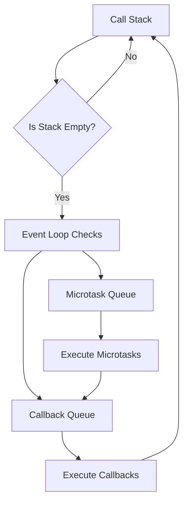
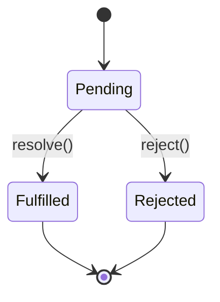

# Node.js Advanced Async Patterns 🚀
## Faculty Development Program - Part 1 of 3

---

## Table of Contents 📚
1. [What is Asynchronous Programming?](#what-is-asynchronous-programming)
2. [Understanding the Event Loop](#understanding-the-event-loop)
3. [Callbacks - The Foundation](#callbacks---the-foundation)
4. [Promises - A Better Way](#promises---a-better-way)
5. [Async/Await - The Modern Approach](#asyncawait---the-modern-approach)
6. [Advanced Patterns](#advanced-patterns)
7. [Practical Examples](#practical-examples)
8. [Common Pitfalls and Solutions](#common-pitfalls-and-solutions)
9. [Best Practices](#best-practices)
10. [Exercises](#exercises)

---

## What is Asynchronous Programming? 🤔

### Definition
**Asynchronous programming** allows your program to perform multiple tasks without waiting for each task to complete before starting the next one. Think of it like cooking multiple dishes at once instead of cooking them one by one.

### Why is it Important in Node.js?
- Node.js is **single-threaded** but uses an **event-driven architecture**
- It can handle thousands of concurrent connections efficiently
- Perfect for I/O operations (file reading, database queries, API calls)

### Real-World Analogy 🍳
Imagine you're cooking dinner:
- **Synchronous**: Boil water → wait → add pasta → wait → make sauce → wait → serve
- **Asynchronous**: Start boiling water → while waiting, prepare sauce → when water boils, add pasta → continue working on other things

---

## Understanding the Event Loop 🔄

The Event Loop is the heart of Node.js asynchronous behavior.



### How it Works:
1. **Call Stack**: Where your code executes
2. **Callback Queue**: Where callbacks wait to be executed
3. **Microtask Queue**: Higher priority queue for Promises
4. **Event Loop**: Moves tasks from queues to call stack

---

## Callbacks - The Foundation 📞

### What are Callbacks?
A **callback** is a function passed as an argument to another function, to be executed later.

### Basic Callback Example

```javascript
// Simple callback example
function greetUser(name, callback) {
    console.log(`Processing greeting for ${name}...`);
    
    // Simulate async operation with setTimeout
    setTimeout(() => {
        callback(`Hello, ${name}! Welcome to Node.js!`);
    }, 1000);
}

// Using the callback
greetUser("Alice", (message) => {
    console.log(message);
});

console.log("This runs immediately!");

// Output:
// Processing greeting for Alice...
// This runs immediately!
// Hello, Alice! Welcome to Node.js! (after 1 second)
```

### File Reading with Callbacks

```javascript
const fs = require('fs');

// Reading a file asynchronously
fs.readFile('example.txt', 'utf8', (error, data) => {
    if (error) {
        console.error('Error reading file:', error.message);
        return;
    }
    console.log('File content:', data);
});

console.log('This executes first!');
```

### The Callback Hell Problem 😰

```javascript
// This is what we want to avoid - Callback Hell!
fs.readFile('file1.txt', 'utf8', (err1, data1) => {
    if (err1) throw err1;
    
    fs.readFile('file2.txt', 'utf8', (err2, data2) => {
        if (err2) throw err2;
        
        fs.readFile('file3.txt', 'utf8', (err3, data3) => {
            if (err3) throw err3;
            
            console.log('All files read:', data1, data2, data3);
            // This creates a "pyramid of doom"
        });
    });
});
```

### 💡 **Tip**: Callback hell makes code hard to read and maintain. This is why Promises were invented!

---

## Promises - A Better Way ✨

### What is a Promise?
A **Promise** represents a value that may be available now, in the future, or never. It has three states:
- **Pending**: Initial state
- **Fulfilled**: Operation completed successfully
- **Rejected**: Operation failed

### Promise States Diagram



### Creating a Basic Promise

```javascript
// Creating a Promise
function fetchUserData(userId) {
    return new Promise((resolve, reject) => {
        // Simulate API call
        setTimeout(() => {
            if (userId > 0) {
                resolve({
                    id: userId,
                    name: 'John Doe',
                    email: 'john@example.com'
                });
            } else {
                reject(new Error('Invalid user ID'));
            }
        }, 1500);
    });
}

// Using the Promise
fetchUserData(123)
    .then(user => {
        console.log('User data:', user);
    })
    .catch(error => {
        console.error('Error:', error.message);
    });
```

### Promise Chaining

```javascript
// Converting callback hell to Promise chain
function readFilePromise(filename) {
    return new Promise((resolve, reject) => {
        fs.readFile(filename, 'utf8', (err, data) => {
            if (err) reject(err);
            else resolve(data);
        });
    });
}

// Much cleaner than callback hell!
readFilePromise('file1.txt')
    .then(data1 => {
        console.log('File 1:', data1);
        return readFilePromise('file2.txt');
    })
    .then(data2 => {
        console.log('File 2:', data2);
        return readFilePromise('file3.txt');
    })
    .then(data3 => {
        console.log('File 3:', data3);
    })
    .catch(error => {
        console.error('Error reading files:', error.message);
    });
```

### Promise.all() - Run Multiple Promises Concurrently

```javascript
// Running multiple async operations simultaneously
const promise1 = fetchUserData(1);
const promise2 = fetchUserData(2);
const promise3 = fetchUserData(3);

Promise.all([promise1, promise2, promise3])
    .then(users => {
        console.log('All users:', users);
    })
    .catch(error => {
        console.error('One or more promises failed:', error);
    });
```

### Promise.race() - First One Wins

```javascript
// The first promise to complete (resolve or reject) wins
const slowPromise = new Promise(resolve => setTimeout(() => resolve('Slow'), 3000));
const fastPromise = new Promise(resolve => setTimeout(() => resolve('Fast'), 1000));

Promise.race([slowPromise, fastPromise])
    .then(result => {
        console.log('Winner:', result); // Output: Winner: Fast
    });
```

---

## Async/Await - The Modern Approach 🎯

### What is Async/Await?
**Async/await** is syntactic sugar over Promises that makes asynchronous code look and behave more like synchronous code.

### Basic Async/Await

```javascript
// Converting Promise to async/await
async function getUserData(userId) {
    try {
        const user = await fetchUserData(userId);
        console.log('User data:', user);
        return user;
    } catch (error) {
        console.error('Error:', error.message);
        throw error;
    }
}

// Using async function
getUserData(123);
```

### Reading Files with Async/Await

```javascript
const fs = require('fs').promises; // Using promises version

async function readMultipleFiles() {
    try {
        // Sequential reading (one after another)
        const data1 = await fs.readFile('file1.txt', 'utf8');
        const data2 = await fs.readFile('file2.txt', 'utf8');
        const data3 = await fs.readFile('file3.txt', 'utf8');
        
        console.log('Files read sequentially:', { data1, data2, data3 });
        
        // Parallel reading (all at once)
        const [pData1, pData2, pData3] = await Promise.all([
            fs.readFile('file1.txt', 'utf8'),
            fs.readFile('file2.txt', 'utf8'),
            fs.readFile('file3.txt', 'utf8')
        ]);
        
        console.log('Files read in parallel:', { pData1, pData2, pData3 });
        
    } catch (error) {
        console.error('Error reading files:', error.message);
    }
}

readMultipleFiles();
```

### 🚨 **Important**: Always use `try-catch` with async/await for error handling!

---

## Advanced Patterns 🧠

### 1. Promise Pool - Limiting Concurrent Operations

```javascript
class PromisePool {
    constructor(concurrency = 3) {
        this.concurrency = concurrency;
        this.running = 0;
        this.queue = [];
    }
    
    async add(promiseFunction) {
        return new Promise((resolve, reject) => {
            this.queue.push({
                promiseFunction,
                resolve,
                reject
            });
            this.process();
        });
    }
    
    async process() {
        if (this.running >= this.concurrency || this.queue.length === 0) {
            return;
        }
        
        this.running++;
        const { promiseFunction, resolve, reject } = this.queue.shift();
        
        try {
            const result = await promiseFunction();
            resolve(result);
        } catch (error) {
            reject(error);
        } finally {
            this.running--;
            this.process();
        }
    }
}

// Usage
const pool = new PromisePool(2); // Only 2 concurrent operations

const tasks = [1, 2, 3, 4, 5].map(id => 
    () => fetchUserData(id)
);

tasks.forEach(task => {
    pool.add(task).then(result => {
        console.log('Task completed:', result);
    });
});
```

### 2. Retry Pattern

```javascript
async function retryOperation(operation, maxRetries = 3, delay = 1000) {
    for (let attempt = 1; attempt <= maxRetries; attempt++) {
        try {
            const result = await operation();
            return result;
        } catch (error) {
            console.log(`Attempt ${attempt} failed:`, error.message);
            
            if (attempt === maxRetries) {
                throw new Error(`Operation failed after ${maxRetries} attempts: ${error.message}`);
            }
            
            // Wait before retrying
            await new Promise(resolve => setTimeout(resolve, delay));
            delay *= 2; // Exponential backoff
        }
    }
}

// Usage
async function unreliableApiCall() {
    // Simulate 70% failure rate
    if (Math.random() < 0.7) {
        throw new Error('API temporarily unavailable');
    }
    return { data: 'Success!' };
}

retryOperation(unreliableApiCall)
    .then(result => console.log('Success:', result))
    .catch(error => console.error('Final failure:', error.message));
```

### 3. Circuit Breaker Pattern

```javascript
class CircuitBreaker {
    constructor(threshold = 5, timeout = 60000) {
        this.threshold = threshold;
        this.timeout = timeout;
        this.failureCount = 0;
        this.lastFailureTime = null;
        this.state = 'CLOSED'; // CLOSED, OPEN, HALF_OPEN
    }
    
    async execute(operation) {
        if (this.state === 'OPEN') {
            if (Date.now() - this.lastFailureTime >= this.timeout) {
                this.state = 'HALF_OPEN';
            } else {
                throw new Error('Circuit breaker is OPEN');
            }
        }
        
        try {
            const result = await operation();
            this.onSuccess();
            return result;
        } catch (error) {
            this.onFailure();
            throw error;
        }
    }
    
    onSuccess() {
        this.failureCount = 0;
        this.state = 'CLOSED';
    }
    
    onFailure() {
        this.failureCount++;
        this.lastFailureTime = Date.now();
        
        if (this.failureCount >= this.threshold) {
            this.state = 'OPEN';
        }
    }
}

// Usage
const breaker = new CircuitBreaker(3, 5000);

async function riskyOperation() {
    return breaker.execute(unreliableApiCall);
}
```

---

## Practical Examples 💻

### Example 1: Web Scraper with Rate Limiting

```javascript
const https = require('https');

class WebScraper {
    constructor(rateLimitMs = 1000) {
        this.rateLimitMs = rateLimitMs;
        this.lastRequest = 0;
    }
    
    async fetchPage(url) {
        // Rate limiting
        const timeSinceLastRequest = Date.now() - this.lastRequest;
        if (timeSinceLastRequest < this.rateLimitMs) {
            await this.sleep(this.rateLimitMs - timeSinceLastRequest);
        }
        
        this.lastRequest = Date.now();
        
        return new Promise((resolve, reject) => {
            https.get(url, (response) => {
                let data = '';
                
                response.on('data', chunk => {
                    data += chunk;
                });
                
                response.on('end', () => {
                    resolve({
                        statusCode: response.statusCode,
                        data: data.slice(0, 200) + '...' // Truncate for demo
                    });
                });
                
                response.on('error', reject);
            });
        });
    }
    
    sleep(ms) {
        return new Promise(resolve => setTimeout(resolve, ms));
    }
    
    async scrapeMultiplePages(urls) {
        const results = [];
        
        for (const url of urls) {
            try {
                console.log(`Fetching: ${url}`);
                const result = await this.fetchPage(url);
                results.push({ url, ...result });
            } catch (error) {
                results.push({ url, error: error.message });
            }
        }
        
        return results;
    }
}

// Usage
async function demo() {
    const scraper = new WebScraper(2000); // 2 second delay between requests
    
    const urls = [
        'https://httpbin.org/json',
        'https://httpbin.org/headers',
        'https://httpbin.org/ip'
    ];
    
    const results = await scraper.scrapeMultiplePages(urls);
    console.log('Scraping results:', results);
}

demo();
```

### Example 2: File Processing Pipeline

```javascript
const fs = require('fs').promises;
const path = require('path');

class FileProcessor {
    constructor() {
        this.processed = 0;
        this.errors = 0;
    }
    
    async processDirectory(dirPath) {
        try {
            const files = await fs.readdir(dirPath);
            const textFiles = files.filter(file => path.extname(file) === '.txt');
            
            console.log(`Found ${textFiles.length} text files to process`);
            
            // Process files in parallel with limit
            const results = await this.processFilesInBatches(
                textFiles.map(file => path.join(dirPath, file)),
                3 // Process 3 files at a time
            );
            
            console.log(`Processing complete: ${this.processed} successful, ${this.errors} errors`);
            return results;
            
        } catch (error) {
            console.error('Error processing directory:', error.message);
            throw error;
        }
    }
    
    async processFilesInBatches(filePaths, batchSize) {
        const results = [];
        
        for (let i = 0; i < filePaths.length; i += batchSize) {
            const batch = filePaths.slice(i, i + batchSize);
            const batchPromises = batch.map(filePath => this.processFile(filePath));
            
            const batchResults = await Promise.allSettled(batchPromises);
            results.push(...batchResults);
            
            console.log(`Processed batch ${Math.ceil((i + 1) / batchSize)} of ${Math.ceil(filePaths.length / batchSize)}`);
        }
        
        return results;
    }
    
    async processFile(filePath) {
        try {
            const content = await fs.readFile(filePath, 'utf8');
            
            // Simulate processing (word count)
            const wordCount = content.split(/\s+/).length;
            const processedContent = `File: ${path.basename(filePath)}\nWords: ${wordCount}\nProcessed at: ${new Date().toISOString()}\n\n`;
            
            // Write processed file
            const outputPath = filePath.replace('.txt', '_processed.txt');
            await fs.writeFile(outputPath, processedContent);
            
            this.processed++;
            return { filePath, outputPath, wordCount };
            
        } catch (error) {
            this.errors++;
            console.error(`Error processing ${filePath}:`, error.message);
            throw error;
        }
    }
}

// Usage
async function demoFileProcessing() {
    const processor = new FileProcessor();
    
    try {
        // Create some sample files first
        await fs.mkdir('sample_files', { recursive: true });
        
        const sampleFiles = [
            { name: 'file1.txt', content: 'This is the first sample file with some content.' },
            { name: 'file2.txt', content: 'This is the second file with different content and more words.' },
            { name: 'file3.txt', content: 'Third file contains even more content for processing.' }
        ];
        
        for (const file of sampleFiles) {
            await fs.writeFile(`sample_files/${file.name}`, file.content);
        }
        
        console.log('Sample files created');
        
        // Process the directory
        const results = await processor.processDirectory('sample_files');
        console.log('Processing results:', results);
        
    } catch (error) {
        console.error('Demo failed:', error.message);
    }
}

demoFileProcessing();
```

---

## Common Pitfalls and Solutions 🚫➡️✅

### Pitfall 1: Forgetting to Handle Errors

```javascript
// ❌ Bad: No error handling
async function badExample() {
    const data = await fetchUserData(123);
    console.log(data); // Will crash if fetchUserData fails
}

// ✅ Good: Proper error handling
async function goodExample() {
    try {
        const data = await fetchUserData(123);
        console.log(data);
    } catch (error) {
        console.error('Failed to fetch user data:', error.message);
        // Handle the error appropriately
    }
}
```

### Pitfall 2: Sequential vs Parallel Execution

```javascript
// ❌ Bad: Sequential (slower)
async function sequentialFetch() {
    const user1 = await fetchUserData(1);
    const user2 = await fetchUserData(2);
    const user3 = await fetchUserData(3);
    // Takes 3 × API response time
    return [user1, user2, user3];
}

// ✅ Good: Parallel (faster)
async function parallelFetch() {
    const [user1, user2, user3] = await Promise.all([
        fetchUserData(1),
        fetchUserData(2),
        fetchUserData(3)
    ]);
    // Takes only 1 × API response time
    return [user1, user2, user3];
}
```

### Pitfall 3: Not Using async/await Consistently

```javascript
// ❌ Bad: Mixing Promises and async/await
async function mixedApproach() {
    const user = await fetchUserData(1);
    
    // Don't mix .then() with async/await in the same function
    return fetchUserData(2).then(user2 => {
        return { user, user2 };
    });
}

// ✅ Good: Consistent async/await
async function consistentApproach() {
    const user = await fetchUserData(1);
    const user2 = await fetchUserData(2);
    return { user, user2 };
}
```

---

## Best Practices 🏆

### 1. Always Handle Errors
```javascript
// Use try-catch for async/await
async function safeOperation() {
    try {
        const result = await riskyOperation();
        return result;
    } catch (error) {
        console.error('Operation failed:', error.message);
        // Return default value or rethrow
        return null;
    }
}
```

### 2. Use Promise.allSettled() for Mixed Results
```javascript
// When you want all results, even if some fail
async function fetchAllUsers(userIds) {
    const promises = userIds.map(id => fetchUserData(id));
    const results = await Promise.allSettled(promises);
    
    const successful = results
        .filter(result => result.status === 'fulfilled')
        .map(result => result.value);
    
    const failed = results
        .filter(result => result.status === 'rejected')
        .map(result => result.reason);
    
    return { successful, failed };
}
```

### 3. Use Timeouts for Long Operations
```javascript
function withTimeout(promise, timeoutMs) {
    const timeout = new Promise((_, reject) => {
        setTimeout(() => reject(new Error('Operation timed out')), timeoutMs);
    });
    
    return Promise.race([promise, timeout]);
}

// Usage
try {
    const result = await withTimeout(fetchUserData(123), 5000);
    console.log(result);
} catch (error) {
    if (error.message === 'Operation timed out') {
        console.log('Request took too long');
    }
}
```

### 4. Create Reusable Async Utilities
```javascript
class AsyncUtils {
    static delay(ms) {
        return new Promise(resolve => setTimeout(resolve, ms));
    }
    
    static async retry(fn, maxAttempts = 3) {
        for (let attempt = 1; attempt <= maxAttempts; attempt++) {
            try {
                return await fn();
            } catch (error) {
                if (attempt === maxAttempts) throw error;
                await this.delay(1000 * attempt); // Exponential backoff
            }
        }
    }
    
    static async parallel(tasks, concurrency = 3) {
        const results = [];
        for (let i = 0; i < tasks.length; i += concurrency) {
            const batch = tasks.slice(i, i + concurrency);
            const batchResults = await Promise.all(batch);
            results.push(...batchResults);
        }
        return results;
    }
}
```

---

## Exercises 📝

### Exercise 1: Basic Async Function
Create an async function that simulates fetching weather data:

```javascript
// Your task: Complete this function
async function getWeatherData(city) {
    // Simulate API delay (1-3 seconds)
    // Return weather object: { city, temperature, condition }
    // Handle invalid city names (throw error)
    
    // YOUR CODE HERE
}

// Test your function
getWeatherData('London').then(console.log);
getWeatherData('InvalidCity').catch(console.error);
```

### Exercise 2: Promise Chain
Convert this callback-based code to use Promises:

```javascript
// Given callback-based functions:
function readConfig(callback) {
    setTimeout(() => callback(null, { apiUrl: 'https://api.example.com' }), 100);
}

function connectToApi(config, callback) {
    setTimeout(() => callback(null, { connected: true, config }), 200);
}

function fetchData(connection, callback) {
    setTimeout(() => callback(null, { data: 'Important data' }), 150);
}

// Your task: Convert to Promise chain and then to async/await
```

### Exercise 3: Error Handling
Fix the error handling in this code:

```javascript
async function processUserData(userId) {
    const user = await fetchUserData(userId);
    const profile = await getUserProfile(user.id);
    const posts = await getUserPosts(user.id);
    
    return {
        user,
        profile,
        posts: posts.filter(post => post.published)
    };
}

// What happens if any of these operations fail?
// How would you improve error handling?
```

---

## Summary 📋

You've learned about Node.js Advanced Async Patterns:

1. **Callbacks**: The foundation of async programming
2. **Promises**: A cleaner way to handle async operations
3. **Async/Await**: Modern, readable syntax for async code
4. **Advanced Patterns**: Pool, Retry, Circuit Breaker
5. **Best Practices**: Error handling, parallel execution, timeouts

### Key Takeaways:
- Always handle errors in async operations
- Use Promise.all() for parallel execution
- Prefer async/await over raw Promises for readability
- Implement proper error handling strategies
- Consider timeouts and retry mechanisms for robust applications

### Next Steps:
- Practice with the exercises
- Build a small project using these patterns
- Learn about Error Handling (Part 2 of this series)

---

**Happy Coding! 🎉**

*Remember: Async programming is like juggling - it takes practice, but once you master it, you can handle multiple things at once efficiently!*