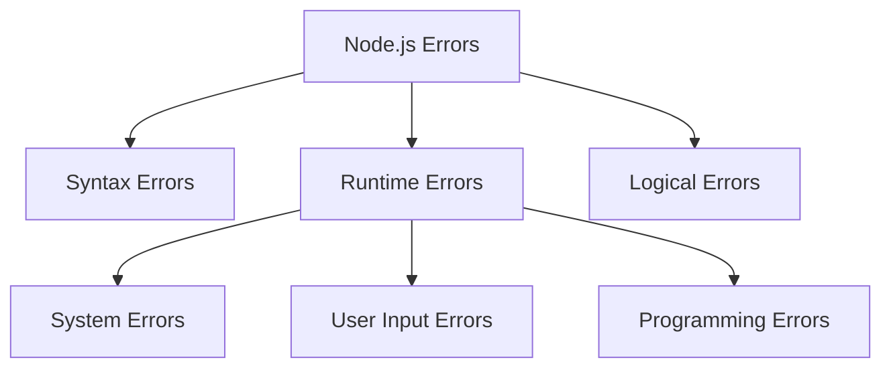

# Node.js Error Handling 🛡️
## Faculty Development Program - Part 2 of 3

---

## Table of Contents 📚
1. [What is Error Handling?](#what-is-error-handling)
2. [Types of Errors](#types-of-errors)
3. [Synchronous Error Handling](#synchronous-error-handling)
4. [Asynchronous Error Handling](#asynchronous-error-handling)
5. [Custom Errors](#custom-errors)
6. [Express.js Error Handling](#expressjs-error-handling)
7. [Best Practices](#best-practices)
8. [Exercises](#exercises)

---

## What is Error Handling? 🤔

**Error handling** is like having safety nets - you hope you don't need them, but they're essential when things go wrong.

### Why Important?
- **Prevents crashes** 💥
- **Better user experience** 😊
- **Easier debugging** 🔧
- **Maintains data integrity** 🔒

---

## Types of Errors 📊



### Quick Examples

```javascript
// 1. Syntax Error (caught before running)
// function broken() { console.log("missing quote); }

// 2. Runtime Error
try {
    let obj = null;
    console.log(obj.property); // TypeError
} catch (error) {
    console.log('Caught:', error.message);
}

// 3. Logical Error (wrong result)
function checkAge(age) {
    if (age = 18) { // ❌ Should be ===
        return "Exactly 18";
    }
    return "Not 18";
}
```

---

## Synchronous Error Handling 🔄

### Try-Catch-Finally

```javascript
function divideNumbers(a, b) {
    try {
        if (b === 0) {
            throw new Error('Cannot divide by zero!');
        }
        return a / b;
        
    } catch (error) {
        console.error('Error:', error.message);
        return null;
        
    } finally {
        console.log('Operation completed');
    }
}

// Test it
console.log(divideNumbers(10, 2)); // 5
console.log(divideNumbers(10, 0)); // null
```

### Input Validation Example

```javascript
function validateUser(userData) {
    try {
        if (!userData.email) {
            throw new Error('Email is required');
        }
        
        if (!userData.email.includes('@')) {
            throw new Error('Invalid email format');
        }
        
        if (!userData.password || userData.password.length < 6) {
            throw new Error('Password must be at least 6 characters');
        }
        
        return true;
        
    } catch (error) {
        console.error('Validation failed:', error.message);
        return false;
    }
}

// Test validation
validateUser({ email: 'test@example.com', password: 'password123' }); // true
validateUser({ email: 'invalid', password: '123' }); // false
```

---

## Asynchronous Error Handling ⚡

### With Promises

```javascript
function fetchUser(id) {
    return new Promise((resolve, reject) => {
        setTimeout(() => {
            if (id <= 0) {
                reject(new Error('Invalid user ID'));
                return;
            }
            resolve({ id, name: `User ${id}` });
        }, 1000);
    });
}

// Using .catch()
fetchUser(1)
    .then(user => console.log('User:', user))
    .catch(error => console.error('Error:', error.message));

// Using .finally()
fetchUser(-1)
    .then(user => console.log('User:', user))
    .catch(error => console.error('Error:', error.message))
    .finally(() => console.log('Request completed'));
```

### With Async/Await

```javascript
async function getUserData(id) {
    try {
        const user = await fetchUser(id);
        console.log('User found:', user);
        return user;
        
    } catch (error) {
        console.error('Failed to get user:', error.message);
        return null;
    }
}

// Multiple async operations
async function getUserProfile(id) {
    try {
        const user = await fetchUser(id);
        const posts = await fetchUserPosts(id);
        
        return { user, posts };
        
    } catch (error) {
        console.error('Profile error:', error.message);
        throw error; // Re-throw if needed
    }
}

// Helper function
async function fetchUserPosts(id) {
    return new Promise(resolve => {
        setTimeout(() => resolve([{ title: 'Post 1' }, { title: 'Post 2' }]), 500);
    });
}
```

### Handling Multiple Promises

```javascript
async function fetchMultipleUsers(ids) {
    // Method 1: Fail if any fails
    try {
        const users = await Promise.all(ids.map(id => fetchUser(id)));
        return users;
    } catch (error) {
        console.error('One fetch failed:', error.message);
        throw error;
    }
}

async function fetchMultipleUsersSafe(ids) {
    // Method 2: Get results even if some fail
    const results = await Promise.allSettled(ids.map(id => fetchUser(id)));
    
    const successful = results
        .filter(r => r.status === 'fulfilled')
        .map(r => r.value);
    
    const failed = results
        .filter(r => r.status === 'rejected')
        .map(r => r.reason.message);
    
    return { successful, failed };
}

// Test both methods
async function testMultipleFetch() {
    console.log('=== Promise.all (fails on any error) ===');
    try {
        await fetchMultipleUsers([1, 2, -1]); // Will fail
    } catch (error) {
        console.log('Promise.all failed');
    }
    
    console.log('=== Promise.allSettled (gets all results) ===');
    const results = await fetchMultipleUsersSafe([1, 2, -1]);
    console.log('Results:', results);
}

testMultipleFetch();
```

---

## Custom Errors 🎯

### Creating Custom Error Classes

```javascript
// Base custom error
class AppError extends Error {
    constructor(message, statusCode = 500) {
        super(message);
        this.name = this.constructor.name;
        this.statusCode = statusCode;
    }
}

// Specific error types
class ValidationError extends AppError {
    constructor(message, field = null) {
        super(message, 400);
        this.field = field;
    }
}

class NotFoundError extends AppError {
    constructor(resource = 'Resource') {
        super(`${resource} not found`, 404);
    }
}

// Using custom errors
function findUserById(id) {
    if (id <= 0) {
        throw new ValidationError('ID must be positive', 'id');
    }
    
    if (id > 100) {
        throw new NotFoundError('User');
    }
    
    return { id, name: `User ${id}` };
}

// Handle different error types
function handleUserLookup(id) {
    try {
        const user = findUserById(id);
        console.log('Found user:', user);
        
    } catch (error) {
        if (error instanceof ValidationError) {
            console.error(`Validation Error: ${error.message} (field: ${error.field})`);
        } else if (error instanceof NotFoundError) {
            console.error(`Not Found: ${error.message}`);
        } else {
            console.error(`Unknown Error: ${error.message}`);
        }
    }
}

// Test different scenarios
handleUserLookup(50);   // Success
handleUserLookup(-1);   // Validation error
handleUserLookup(200);  // Not found error
```

---

## Express.js Error Handling 🚀

### Basic Setup

```javascript
const express = require('express');
const app = express();

app.use(express.json());

// Route with error handling
app.get('/users/:id', async (req, res, next) => {
    try {
        const id = parseInt(req.params.id);
        
        if (isNaN(id) || id <= 0) {
            throw new ValidationError('Invalid user ID', 'id');
        }
        
        if (id > 100) {
            throw new NotFoundError('User');
        }
        
        const user = { id, name: `User ${id}`, email: `user${id}@example.com` };
        res.json(user);
        
    } catch (error) {
        next(error); // Pass to error middleware
    }
});

// 404 handler for unknown routes
app.use('*', (req, res, next) => {
    next(new NotFoundError(`Route ${req.originalUrl}`));
});

// Global error handling middleware (must be last!)
app.use((error, req, res, next) => {
    console.error('Error:', error.message);
    
    let statusCode = error.statusCode || 500;
    let message = error.message || 'Internal Server Error';
    
    // Handle different error types
    if (error instanceof ValidationError) {
        return res.status(400).json({
            error: 'Validation Error',
            message,
            field: error.field
        });
    }
    
    if (error instanceof NotFoundError) {
        return res.status(404).json({
            error: 'Not Found',
            message
        });
    }
    
    // Generic error
    res.status(statusCode).json({
        error: 'Server Error',
        message: process.env.NODE_ENV === 'production' ? 'Something went wrong' : message
    });
});

const PORT = 3000;
app.listen(PORT, () => {
    console.log(`Server running on port ${PORT}`);
    console.log('Try: http://localhost:3000/users/1');
    console.log('Try: http://localhost:3000/users/-1');
    console.log('Try: http://localhost:3000/users/200');
});
```

---

## Best Practices 🏆

### 1. Always Handle Errors

```javascript
// ❌ Bad: No error handling
async function badExample() {
    const data = await fetchUser(1);
    console.log(data.name); // Will crash if fetchUser fails
}

// ✅ Good: Proper error handling
async function goodExample() {
    try {
        const data = await fetchUser(1);
        console.log(data.name);
    } catch (error) {
        console.error('Failed to get user:', error.message);
        // Handle appropriately
    }
}
```

### 2. Use Specific Error Types

```javascript
// ✅ Good: Specific error handling
try {
    validateUser(userData);
} catch (error) {
    if (error instanceof ValidationError) {
        // Handle validation errors
        return res.status(400).json({ error: error.message });
    }
    // Handle other errors
    return res.status(500).json({ error: 'Server error' });
}
```

### 3. Fail Fast Principle

```javascript
function processOrder(order) {
    // Check everything upfront
    if (!order) throw new Error('Order required');
    if (!order.items?.length) throw new Error('No items');
    if (!order.customerId) throw new Error('Customer ID required');
    if (order.total <= 0) throw new Error('Invalid total');
    
    // Process only if everything is valid
    return { success: true, orderId: Math.random() };
}
```

### 4. Log Errors Properly

```javascript
function logError(error, context = {}) {
    console.error({
        message: error.message,
        stack: error.stack,
        timestamp: new Date().toISOString(),
        ...context
    });
}

// Usage
try {
    await processPayment(order);
} catch (error) {
    logError(error, { orderId: order.id, userId: order.customerId });
    throw error;
}
```

---

## Exercises 📝

### Exercise 1: Basic Error Handling
Create a calculator function with proper error handling:

```javascript
function calculator(operation, a, b) {
    // Your task: Handle different operations (+, -, *, /)
    // Throw appropriate errors for invalid inputs
    // Handle division by zero
    
    // YOUR CODE HERE
}

// Test cases
console.log(calculator('add', 5, 3));      // Should return 8
console.log(calculator('divide', 10, 0));  // Should handle error
console.log(calculator('invalid', 1, 2));  // Should handle error
```

### Exercise 2: Async Error Handling
Fix the error handling in this async function:

```javascript
async function getUserWithPosts(userId) {
    const user = await fetchUser(userId);
    const posts = await fetchUserPosts(userId);
    const comments = await fetchUserComments(userId);
    
    return { user, posts, comments };
}

// Problems:
// 1. No error handling
// 2. Sequential execution (slow)
// 3. All operations fail if one fails
// 
// Your task: Fix these issues
```

### Exercise 3: Express Error Middleware
Create a simple Express app with proper error handling for a todo API:

```javascript
// Your task: Create routes for:
// GET /todos - get all todos
// POST /todos - create new todo
// PUT /todos/:id - update todo
// DELETE /todos/:id - delete todo
//
// Include proper error handling for:
// - Invalid IDs
// - Missing required fields
// - Todo not found
// - Server errors
```

---

## Summary 📋

### Key Points:
1. **Always handle errors** - Use try-catch for sync, .catch() or try-catch for async
2. **Create custom error types** - Makes error handling more specific
3. **Fail fast** - Validate inputs early
4. **Log errors properly** - Include context and timestamps
5. **Use appropriate HTTP status codes** - 400 for client errors, 500 for server errors

### Error Handling Hierarchy:
```
Try → Catch → Log → Respond → Monitor
```

### Next Steps:
- Practice with the exercises
- Learn about JWT Authentication (Part 3)
- Build error handling into your projects

---

**Happy Coding! 🎉**

*Remember: Good error handling is like insurance - you don't appreciate it until you need it!* 🛡️