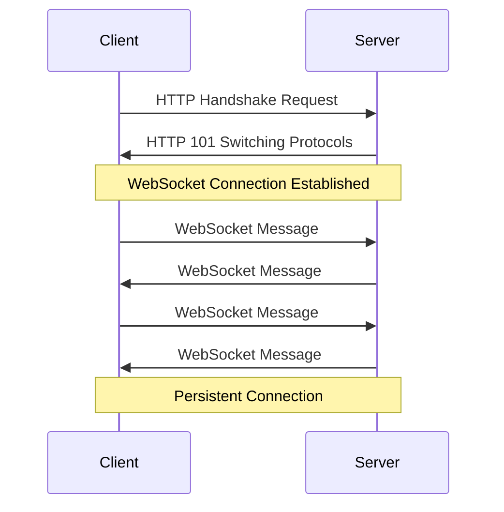
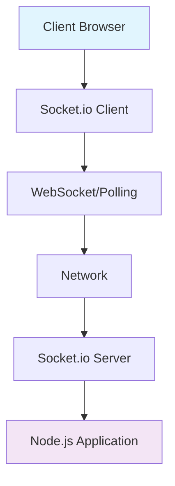
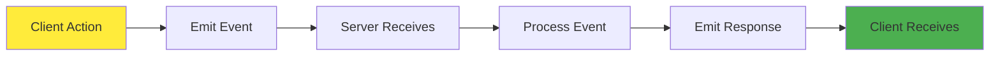

# Node.js WebSockets with Socket.io 🚀
## Complete Beginner's Guide for Faculty Development Program

---

## Table of Contents 📚
1. [What are WebSockets?](#what-are-websockets)
2. [Understanding Socket.io](#understanding-socketio)
3. [Prerequisites](#prerequisites)
4. [Environment Setup](#environment-setup)
5. [Basic WebSocket Concepts](#basic-websocket-concepts)
6. [Your First Socket.io Application](#your-first-socketio-application)
7. [Real-time Chat Application](#real-time-chat-application)
8. [Advanced Features](#advanced-features)
9. [Best Practices](#best-practices)
10. [Troubleshooting](#troubleshooting)
11. [Resources & Next Steps](#resources--next-steps)

---

## What are WebSockets? 🌐

### Traditional HTTP vs WebSockets

**HTTP (Traditional Web Communication):**
- Client sends request → Server responds → Connection closes
- Like sending letters in the mail - one message at a time
- Good for: Loading web pages, form submissions

**WebSockets:**
- Persistent connection between client and server
- Both can send messages anytime
- Like having a phone conversation - real-time, two-way
- Good for: Chat apps, live updates, gaming, collaboration tools

### Why Use WebSockets? 🤔

1. **Real-time Communication**: Instant message delivery
2. **Bi-directional**: Both client and server can initiate communication
3. **Low Latency**: No need to establish new connections
4. **Efficient**: Less overhead than constant HTTP requests

### WebSocket Flow Diagram



---

## Understanding Socket.io 🔌

### What is Socket.io?

Socket.io is a JavaScript library that makes WebSockets easy to use. Think of it as:
- **WebSocket on steroids** 💪
- **Fallback support** for older browsers
- **Additional features** like rooms, namespaces, and automatic reconnection

### Socket.io vs Pure WebSockets

| Feature | Pure WebSockets | Socket.io |
|---------|----------------|-----------|
| Browser Support | Modern browsers only | All browsers (with fallbacks) |
| Reconnection | Manual | Automatic |
| Rooms/Namespaces | Manual implementation | Built-in |
| Learning Curve | Steeper | Gentler |

### Socket.io Architecture



---

## Prerequisites 📋

### What You Need to Know:
- ✅ Basic JavaScript (variables, functions, objects)
- ✅ Basic HTML/CSS
- ✅ Command line basics (cd, ls/dir, mkdir)
- ✅ Basic understanding of client-server concept

### What You'll Learn:
- 🎯 How WebSockets work
- 🎯 Building real-time applications
- 🎯 Socket.io library usage
- 🎯 Event-driven programming

---

## Environment Setup 🛠️

### Step 1: Install Node.js

1. **Download Node.js** from [nodejs.org](https://nodejs.org)
2. **Choose LTS version** (recommended for beginners)
3. **Install** following the installer instructions
4. **Verify installation**:

```bash
node --version
npm --version
```

### Step 2: Create Project Directory

```bash
# Create and navigate to project folder
mkdir websocket-tutorial
cd websocket-tutorial

# Initialize npm project
npm init -y
```

### Step 3: Install Required Packages

```bash
# Install Socket.io and Express
npm install socket.io express

# Install development dependencies (optional)
npm install --save-dev nodemon
```

### Project Structure

```
websocket-tutorial/
├── package.json
├── server.js
├── public/
│   ├── index.html
│   ├── style.css
│   └── client.js
└── node_modules/
```

---

## Basic WebSocket Concepts 📖

### Key Concepts to Understand:

1. **Events**: Messages have names (like "message", "connect", "disconnect")
2. **Emit**: Sending a message
3. **Listen/On**: Receiving a message
4. **Connection**: Link between client and server
5. **Socket**: Individual connection instance

### Event-Driven Programming



---

## Your First Socket.io Application 🎯

### Step 1: Create Basic Server (server.js)

```javascript
// Import required modules
const express = require('express');
const http = require('http');
const socketIo = require('socket.io');

// Create Express app
const app = express();
const server = http.createServer(app);
const io = socketIo(server);

// Serve static files from 'public' directory
app.use(express.static('public'));

// Handle client connections
io.on('connection', (socket) => {
    console.log('👤 A user connected:', socket.id);
    
    // Listen for messages from client
    socket.on('message', (data) => {
        console.log('📩 Message received:', data);
        
        // Send message back to client
        socket.emit('response', `Server received: ${data}`);
    });
    
    // Handle disconnection
    socket.on('disconnect', () => {
        console.log('👋 User disconnected:', socket.id);
    });
});

// Start server
const PORT = 3000;
server.listen(PORT, () => {
    console.log(`🚀 Server running on http://localhost:${PORT}`);
});
```

### Step 2: Create Client HTML (public/index.html)

```html
<!DOCTYPE html>
<html lang="en">
<head>
    <meta charset="UTF-8">
    <meta name="viewport" content="width=device-width, initial-scale=1.0">
    <title>My First Socket.io App</title>
    <style>
        body {
            font-family: Arial, sans-serif;
            max-width: 600px;
            margin: 50px auto;
            padding: 20px;
            background-color: #f5f5f5;
        }
        .container {
            background: white;
            padding: 30px;
            border-radius: 10px;
            box-shadow: 0 2px 10px rgba(0,0,0,0.1);
        }
        input, button {
            padding: 10px;
            margin: 5px;
            border: 1px solid #ddd;
            border-radius: 5px;
        }
        button {
            background-color: #007bff;
            color: white;
            cursor: pointer;
        }
        button:hover {
            background-color: #0056b3;
        }
        #messages {
            margin-top: 20px;
            padding: 15px;
            background-color: #f8f9fa;
            border-radius: 5px;
            min-height: 100px;
        }
    </style>
</head>
<body>
    <div class="container">
        <h1>🚀 My First Socket.io App</h1>
        
        <div>
            <input type="text" id="messageInput" placeholder="Type your message here...">
            <button onclick="sendMessage()">Send Message</button>
        </div>
        
        <div id="messages"></div>
    </div>

    <!-- Socket.io client library -->
    <script src="/socket.io/socket.io.js"></script>
    
    <script>
        // Connect to Socket.io server
        const socket = io();
        
        // Handle connection
        socket.on('connect', () => {
            console.log('✅ Connected to server');
            addMessage('Connected to server! 🎉');
        });
        
        // Listen for responses from server
        socket.on('response', (data) => {
            addMessage(`Server: ${data}`);
        });
        
        // Function to send message
        function sendMessage() {
            const input = document.getElementById('messageInput');
            const message = input.value.trim();
            
            if (message) {
                // Send message to server
                socket.emit('message', message);
                addMessage(`You: ${message}`);
                input.value = '';
            }
        }
        
        // Function to add message to display
        function addMessage(message) {
            const messagesDiv = document.getElementById('messages');
            const messageElement = document.createElement('div');
            messageElement.innerHTML = `<strong>${new Date().toLocaleTimeString()}</strong> - ${message}`;
            messagesDiv.appendChild(messageElement);
            messagesDiv.scrollTop = messagesDiv.scrollHeight;
        }
        
        // Allow Enter key to send message
        document.getElementById('messageInput').addEventListener('keypress', (e) => {
            if (e.key === 'Enter') {
                sendMessage();
            }
        });
    </script>
</body>
</html>
```

### Step 3: Run Your First App

```bash
# Start the server
node server.js

# Or if you installed nodemon:
npx nodemon server.js
```

Visit `http://localhost:3000` in your browser! 🎉

### What's Happening? 🤔

1. **Server starts** and listens on port 3000
2. **Client connects** when you open the webpage
3. **You type a message** and click send
4. **Client emits** 'message' event to server
5. **Server receives** and processes the message
6. **Server emits** 'response' event back to client
7. **Client receives** and displays the response

---

## Real-time Chat Application 💬

Now let's build something more exciting - a multi-user chat room!

### Enhanced Server (server.js)

```javascript
const express = require('express');
const http = require('http');
const socketIo = require('socket.io');

const app = express();
const server = http.createServer(app);
const io = socketIo(server);

// Serve static files
app.use(express.static('public'));

// Store connected users
let connectedUsers = {};

io.on('connection', (socket) => {
    console.log('👤 New user connected:', socket.id);
    
    // Handle user joining
    socket.on('user_join', (username) => {
        connectedUsers[socket.id] = username;
        
        // Notify everyone about new user
        socket.broadcast.emit('user_joined', username);
        
        // Send current user count to everyone
        io.emit('user_count', Object.keys(connectedUsers).length);
        
        console.log(`✅ ${username} joined the chat`);
    });
    
    // Handle chat messages
    socket.on('chat_message', (data) => {
        const username = connectedUsers[socket.id];
        
        // Broadcast message to all users
        io.emit('message_received', {
            username: username,
            message: data.message,
            timestamp: new Date().toLocaleTimeString()
        });
        
        console.log(`💬 ${username}: ${data.message}`);
    });
    
    // Handle typing indicator
    socket.on('typing', () => {
        const username = connectedUsers[socket.id];
        socket.broadcast.emit('user_typing', username);
    });
    
    socket.on('stop_typing', () => {
        socket.broadcast.emit('user_stop_typing');
    });
    
    // Handle disconnection
    socket.on('disconnect', () => {
        const username = connectedUsers[socket.id];
        delete connectedUsers[socket.id];
        
        if (username) {
            // Notify everyone about user leaving
            socket.broadcast.emit('user_left', username);
            
            // Update user count
            io.emit('user_count', Object.keys(connectedUsers).length);
            
            console.log(`👋 ${username} left the chat`);
        }
    });
});

const PORT = 3000;
server.listen(PORT, () => {
    console.log(`🚀 Chat server running on http://localhost:${PORT}`);
});
```

### Chat Client HTML (public/index.html)

```html
<!DOCTYPE html>
<html lang="en">
<head>
    <meta charset="UTF-8">
    <meta name="viewport" content="width=device-width, initial-scale=1.0">
    <title>💬 Real-time Chat App</title>
    <style>
        * {
            margin: 0;
            padding: 0;
            box-sizing: border-box;
        }
        
        body {
            font-family: 'Segoe UI', Tahoma, Geneva, Verdana, sans-serif;
            background: linear-gradient(135deg, #667eea 0%, #764ba2 100%);
            height: 100vh;
            display: flex;
            justify-content: center;
            align-items: center;
        }
        
        .chat-container {
            width: 90%;
            max-width: 600px;
            height: 80vh;
            background: white;
            border-radius: 15px;
            box-shadow: 0 10px 30px rgba(0,0,0,0.3);
            display: flex;
            flex-direction: column;
            overflow: hidden;
        }
        
        .chat-header {
            background: #007bff;
            color: white;
            padding: 20px;
            text-align: center;
        }
        
        .user-count {
            font-size: 14px;
            opacity: 0.9;
        }
        
        .messages-container {
            flex: 1;
            overflow-y: auto;
            padding: 20px;
            background: #f8f9fa;
        }
        
        .message {
            margin-bottom: 15px;
            padding: 10px 15px;
            border-radius: 10px;
            max-width: 80%;
        }
        
        .message.own {
            background: #007bff;
            color: white;
            margin-left: auto;
        }
        
        .message.other {
            background: white;
            border: 1px solid #e0e0e0;
        }
        
        .message.system {
            background: #28a745;
            color: white;
            text-align: center;
            max-width: 100%;
            font-style: italic;
        }
        
        .message-header {
            font-size: 12px;
            opacity: 0.8;
            margin-bottom: 5px;
        }
        
        .typing-indicator {
            font-style: italic;
            color: #666;
            padding: 10px 20px;
        }
        
        .input-container {
            padding: 20px;
            background: white;
            border-top: 1px solid #e0e0e0;
        }
        
        .input-group {
            display: flex;
            gap: 10px;
        }
        
        input {
            flex: 1;
            padding: 12px 15px;
            border: 1px solid #ddd;
            border-radius: 25px;
            outline: none;
            font-size: 14px;
        }
        
        input:focus {
            border-color: #007bff;
            box-shadow: 0 0 0 2px rgba(0,123,255,0.25);
        }
        
        button {
            padding: 12px 20px;
            background: #007bff;
            color: white;
            border: none;
            border-radius: 25px;
            cursor: pointer;
            font-size: 14px;
            transition: background 0.3s;
        }
        
        button:hover {
            background: #0056b3;
        }
        
        .username-modal {
            position: fixed;
            top: 0;
            left: 0;
            width: 100%;
            height: 100%;
            background: rgba(0,0,0,0.5);
            display: flex;
            justify-content: center;
            align-items: center;
            z-index: 1000;
        }
        
        .username-form {
            background: white;
            padding: 30px;
            border-radius: 15px;
            text-align: center;
            min-width: 300px;
        }
        
        .username-form h2 {
            margin-bottom: 20px;
            color: #333;
        }
        
        .username-form input {
            width: 100%;
            margin-bottom: 20px;
        }
    </style>
</head>
<body>
    <!-- Username Modal -->
    <div id="usernameModal" class="username-modal">
        <div class="username-form">
            <h2>🎭 Enter Your Name</h2>
            <input type="text" id="usernameInput" placeholder="Your name..." maxlength="20">
            <button onclick="joinChat()">Join Chat</button>
        </div>
    </div>

    <!-- Chat Interface -->
    <div class="chat-container">
        <div class="chat-header">
            <h1>💬 Real-time Chat</h1>
            <div class="user-count" id="userCount">Connecting...</div>
        </div>
        
        <div class="messages-container" id="messagesContainer">
            <!-- Messages will appear here -->
        </div>
        
        <div class="typing-indicator" id="typingIndicator"></div>
        
        <div class="input-container">
            <div class="input-group">
                <input type="text" id="messageInput" placeholder="Type your message..." disabled>
                <button id="sendButton" onclick="sendMessage()" disabled>Send</button>
            </div>
        </div>
    </div>

    <script src="/socket.io/socket.io.js"></script>
    <script>
        const socket = io();
        let currentUsername = '';
        let typingTimer;
        
        // DOM elements
        const usernameModal = document.getElementById('usernameModal');
        const usernameInput = document.getElementById('usernameInput');
        const messagesContainer = document.getElementById('messagesContainer');
        const messageInput = document.getElementById('messageInput');
        const sendButton = document.getElementById('sendButton');
        const userCount = document.getElementById('userCount');
        const typingIndicator = document.getElementById('typingIndicator');
        
        // Focus on username input
        usernameInput.focus();
        
        // Join chat function
        function joinChat() {
            const username = usernameInput.value.trim();
            if (username) {
                currentUsername = username;
                socket.emit('user_join', username);
                usernameModal.style.display = 'none';
                messageInput.disabled = false;
                sendButton.disabled = false;
                messageInput.focus();
            }
        }
        
        // Send message function
        function sendMessage() {
            const message = messageInput.value.trim();
            if (message) {
                socket.emit('chat_message', { message: message });
                messageInput.value = '';
                socket.emit('stop_typing');
            }
        }
        
        // Add message to chat
        function addMessage(content, type = 'other', username = '') {
            const messageDiv = document.createElement('div');
            messageDiv.className = `message ${type}`;
            
            if (type === 'system') {
                messageDiv.innerHTML = content;
            } else {
                const timestamp = new Date().toLocaleTimeString();
                messageDiv.innerHTML = `
                    <div class="message-header">${username} • ${timestamp}</div>
                    <div>${content}</div>
                `;
            }
            
            messagesContainer.appendChild(messageDiv);
            messagesContainer.scrollTop = messagesContainer.scrollHeight;
        }
        
        // Socket event listeners
        socket.on('connect', () => {
            console.log('Connected to server');
        });
        
        socket.on('user_count', (count) => {
            userCount.textContent = `${count} user${count !== 1 ? 's' : ''} online`;
        });
        
        socket.on('user_joined', (username) => {
            addMessage(`${username} joined the chat 👋`, 'system');
        });
        
        socket.on('user_left', (username) => {
            addMessage(`${username} left the chat 👋`, 'system');
        });
        
        socket.on('message_received', (data) => {
            const isOwnMessage = data.username === currentUsername;
            addMessage(data.message, isOwnMessage ? 'own' : 'other', data.username);
        });
        
        socket.on('user_typing', (username) => {
            typingIndicator.textContent = `${username} is typing...`;
        });
        
        socket.on('user_stop_typing', () => {
            typingIndicator.textContent = '';
        });
        
        // Input event listeners
        usernameInput.addEventListener('keypress', (e) => {
            if (e.key === 'Enter') {
                joinChat();
            }
        });
        
        messageInput.addEventListener('keypress', (e) => {
            if (e.key === 'Enter') {
                sendMessage();
            }
        });
        
        // Typing indicator
        messageInput.addEventListener('input', () => {
            socket.emit('typing');
            clearTimeout(typingTimer);
            typingTimer = setTimeout(() => {
                socket.emit('stop_typing');
            }, 1000);
        });
    </script>
</body>
</html>
```

### Test Your Chat App! 🎉

1. **Start the server**: `node server.js`
2. **Open multiple browser tabs** to `http://localhost:3000`
3. **Enter different usernames** in each tab
4. **Start chatting** between the tabs!

---

## Advanced Features 🌟

### 1. Rooms and Namespaces

**Rooms**: Private groups within your app
**Namespaces**: Separate sections of your app

```javascript
// Joining a room
socket.join('room1');

// Sending message to a room
io.to('room1').emit('message', 'Hello room!');

// Using namespaces
const adminNamespace = io.of('/admin');
adminNamespace.on('connection', (socket) => {
    // Admin-only features
});
```

### 2. Authentication

```javascript
// Server-side authentication middleware
io.use((socket, next) => {
    const token = socket.handshake.auth.token;
    if (isValidToken(token)) {
        next();
    } else {
        next(new Error('Authentication error'));
    }
});
```

### 3. Error Handling

```javascript
// Handle connection errors
socket.on('connect_error', (error) => {
    console.log('Connection failed:', error);
});

// Handle custom errors
socket.on('error', (error) => {
    console.log('Socket error:', error);
});
```

---

## Best Practices 📝

### 1. Performance Tips
- **Limit message frequency** to prevent spam
- **Use rooms** to reduce unnecessary broadcasts
- **Implement reconnection logic** for better user experience

### 2. Security Considerations
- **Validate all incoming data**
- **Implement rate limiting**
- **Use authentication for sensitive features**
- **Sanitize user input** to prevent XSS

### 3. Code Organization
```javascript
// Good: Organized event handlers
const chatHandlers = {
    handleMessage: (socket, data) => {
        // Handle chat message
    },
    handleTyping: (socket) => {
        // Handle typing indicator
    }
};

// Apply handlers
socket.on('message', (data) => chatHandlers.handleMessage(socket, data));
```

### 4. Error Handling Example
```javascript
socket.on('chat_message', (data) => {
    try {
        // Validate data
        if (!data || !data.message || typeof data.message !== 'string') {
            socket.emit('error', 'Invalid message format');
            return;
        }
        
        // Process message
        const username = connectedUsers[socket.id];
        if (!username) {
            socket.emit('error', 'User not authenticated');
            return;
        }
        
        // Broadcast message
        io.emit('message_received', {
            username: username,
            message: data.message.slice(0, 500), // Limit message length
            timestamp: new Date().toLocaleTimeString()
        });
        
    } catch (error) {
        console.error('Error handling message:', error);
        socket.emit('error', 'Server error occurred');
    }
});
```

---

## Troubleshooting 🔧

### Common Issues and Solutions

**Problem**: "Cannot GET /"
**Solution**: Make sure you have the `public` folder and `index.html` file

**Problem**: "socket.io.js not found"
**Solution**: The Socket.io server automatically serves this file at `/socket.io/socket.io.js`

**Problem**: Messages not appearing
**Solution**: Check browser console for errors and verify event names match

**Problem**: Connection keeps dropping
**Solution**: Implement reconnection logic and check network stability

### Debug Tips
```javascript
// Enable Socket.io debugging
localStorage.debug = 'socket.io-client:socket';

// Server-side logging
io.engine.on('connection_error', (err) => {
    console.log(err.req);      // the request object
    console.log(err.code);     // the error code
    console.log(err.message);  // the error message
    console.log(err.context);  // some additional error context
});
```

---

## Key Takeaways 🎯

### What You've Learned:
1. ✅ **WebSocket fundamentals** and how they differ from HTTP
2. ✅ **Socket.io basics** and why it's useful
3. ✅ **Real-time communication** between client and server
4. ✅ **Event-driven programming** with Socket.io
5. ✅ **Building practical applications** like chat systems

### Important Concepts:
- **Events**: Named messages between client and server
- **Emit**: Sending events
- **Listen/On**: Receiving events
- **Rooms**: Grouping connections
- **Broadcast**: Sending to multiple clients

---

## Resources & Next Steps 📚

### Official Documentation
- [Socket.io Documentation](https://socket.io/docs/)
- [Node.js Documentation](https://nodejs.org/docs/)

### Practice Projects
1. **Real-time Drawing App** 🎨
2. **Live Polling System** 📊
3. **Multiplayer Game** 🎮
4. **Collaborative Text Editor** 📝
5. **Live Dashboard** 📈

### Advanced Topics to Explore
- **Scaling with Redis Adapter**
- **Testing Socket.io Applications**
- **Socket.io with React/Vue.js**
- **Mobile App Integration**
- **Performance Optimization**

---

## Quick Reference Commands 🗂️

```bash
# Install Socket.io
npm install socket.io express

# Start development server
node server.js

# Start with auto-restart
npx nodemon server.js

# Check Node.js version
node --version
```

### Essential Socket.io Methods

**Server Side:**
```javascript
io.on('connection', callback)    // Handle new connections
socket.emit('event', data)       // Send to specific client
socket.broadcast.emit()          // Send to all except sender
io.emit('event', data)          // Send to all clients
socket.join('room')             // Join a room
io.to('room').emit()            // Send to room
```

**Client Side:**
```javascript
const socket = io()             // Connect to server
socket.emit('event', data)      // Send to server
socket.on('event', callback)    // Listen for events
socket.disconnect()             // Disconnect
```

---

## Congratulations! 🎉

You've successfully learned the fundamentals of WebSockets and Socket.io! You can now build real-time applications that provide instant communication between users. 

**Next Steps**: Practice building your own real-time applications and explore the other topics in this series: REST APIs with Express + Mongoose, and Database basics with MongoDB + PostgreSQL.

---

*Happy Coding! 🚀*