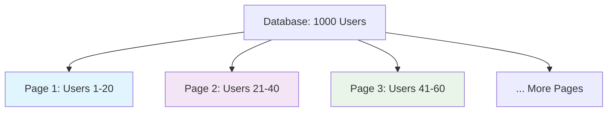
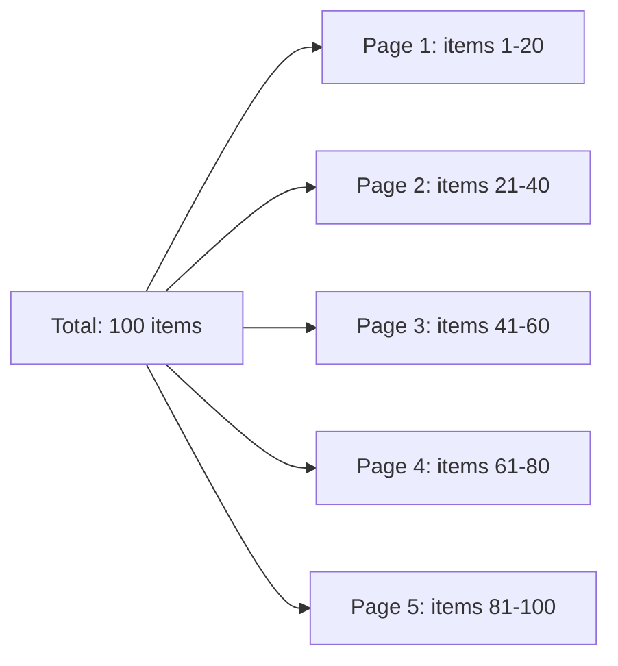
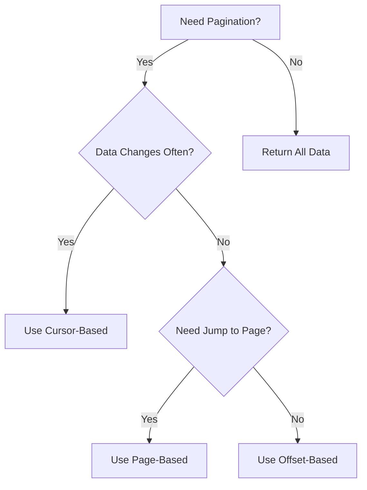

# 📄 Pagination Guide for Beginners
## Simple and Practical Guide to API Pagination

---

## 📚 Table of Contents
1. [What is Pagination?](#what-is-pagination)
2. [Why Do We Need Pagination?](#why-do-we-need-pagination)
3. [Types of Pagination](#types-of-pagination)
4. [Setup](#setup)
5. [Offset-Based Pagination](#offset-based-pagination)
6. [Cursor-Based Pagination](#cursor-based-pagination)
7. [Page-Based Pagination](#page-based-pagination)
8. [Complete Example](#complete-example)
9. [Best Practices](#best-practices)

---

## 🎯 What is Pagination?

**Pagination** is like reading a book page by page instead of trying to read the entire book at once. It breaks large amounts of data into smaller, manageable chunks.

### Real-World Example
Instead of loading 10,000 users at once:
```javascript
// ❌ Bad: All users at once (slow, crashes)
GET /api/users → Returns 10,000 users

// ✅ Good: Users in pages (fast, manageable)
GET /api/users?page=1&limit=20 → Returns 20 users
GET /api/users?page=2&limit=20 → Returns next 20 users
```



---

## 🤔 Why Do We Need Pagination?

### Problems Without Pagination
- 🐌 **Slow Loading**: Loading 10,000 records takes forever
- 💥 **Server Crash**: Too much memory usage
- 📱 **Poor UX**: Users can't find what they need
- 💸 **High Costs**: Expensive database queries

### Benefits With Pagination
- ⚡ **Fast Loading**: Only load what you need
- 💾 **Less Memory**: Server stays healthy
- 😊 **Better UX**: Easy to navigate
- 💰 **Cost Effective**: Cheaper database operations

---

## 🔧 Types of Pagination

### 1. **Page-Based** (Most Common)
```
GET /api/users?page=1&limit=20
GET /api/users?page=2&limit=20
```

### 2. **Offset-Based**
```
GET /api/users?offset=0&limit=20
GET /api/users?offset=20&limit=20
```

### 3. **Cursor-Based** (For Real-time Data)
```
GET /api/users?cursor=abc123&limit=20
GET /api/users?cursor=def456&limit=20
```

---

## 🚀 Setup

### Create Project
```bash
mkdir pagination-demo
cd pagination-demo
npm init -y
npm install express
```

### Sample Data
Create `data.js`:
```javascript
// Generate sample users for testing
const generateUsers = (count = 100) => {
    const users = [];
    for (let i = 1; i <= count; i++) {
        users.push({
            id: i,
            name: `User ${i}`,
            email: `user${i}@example.com`,
            createdAt: new Date(Date.now() - Math.random() * 10000000000).toISOString()
        });
    }
    return users;
};

module.exports = { users: generateUsers(100) };
```

---

## 📖 Page-Based Pagination

Most popular and easiest to understand.

### How It Works
- **Page**: Which page number (1, 2, 3...)
- **Limit**: How many items per page (10, 20, 50...)



### Implementation

**page-server.js**
```javascript
const express = require('express');
const { users } = require('./data');

const app = express();
app.use(express.json());

app.get('/api/users', (req, res) => {
    // Get query parameters with defaults
    const page = parseInt(req.query.page) || 1;
    const limit = parseInt(req.query.limit) || 10;
    
    // Validate parameters
    if (page < 1) {
        return res.status(400).json({ error: 'Page must be 1 or greater' });
    }
    
    if (limit < 1 || limit > 100) {
        return res.status(400).json({ error: 'Limit must be between 1 and 100' });
    }
    
    // Calculate pagination
    const startIndex = (page - 1) * limit;
    const endIndex = startIndex + limit;
    const totalItems = users.length;
    const totalPages = Math.ceil(totalItems / limit);
    
    // Get paginated data
    const paginatedUsers = users.slice(startIndex, endIndex);
    
    // Response with pagination info
    res.json({
        data: paginatedUsers,
        pagination: {
            currentPage: page,
            totalPages: totalPages,
            totalItems: totalItems,
            itemsPerPage: limit,
            hasNextPage: page < totalPages,
            hasPrevPage: page > 1
        }
    });
});

app.get('/', (req, res) => {
    res.json({
        message: "Page-Based Pagination Demo",
        examples: [
            "GET /api/users (default: page=1, limit=10)",
            "GET /api/users?page=2",
            "GET /api/users?page=1&limit=20",
            "GET /api/users?page=3&limit=5"
        ],
        totalUsers: users.length
    });
});

app.listen(3000, () => {
    console.log('🚀 Page-based pagination server on http://localhost:3000');
});
```

### Test It
```bash
# Start server
node page-server.js

# Test different pages
curl "http://localhost:3000/api/users"
curl "http://localhost:3000/api/users?page=2"
curl "http://localhost:3000/api/users?page=1&limit=5"
```

---

## 🎯 Offset-Based Pagination

Similar to page-based but uses offset instead of page numbers.

### How It Works
- **Offset**: How many items to skip (0, 20, 40...)
- **Limit**: How many items to return

### Implementation

**offset-server.js**
```javascript
const express = require('express');
const { users } = require('./data');

const app = express();
app.use(express.json());

app.get('/api/users', (req, res) => {
    // Get query parameters
    const offset = parseInt(req.query.offset) || 0;
    const limit = parseInt(req.query.limit) || 10;
    
    // Validate parameters
    if (offset < 0) {
        return res.status(400).json({ error: 'Offset cannot be negative' });
    }
    
    if (limit < 1 || limit > 100) {
        return res.status(400).json({ error: 'Limit must be between 1 and 100' });
    }
    
    const totalItems = users.length;
    const endIndex = offset + limit;
    
    // Get paginated data
    const paginatedUsers = users.slice(offset, endIndex);
    
    res.json({
        data: paginatedUsers,
        pagination: {
            offset: offset,
            limit: limit,
            totalItems: totalItems,
            hasMore: endIndex < totalItems,
            nextOffset: endIndex < totalItems ? endIndex : null
        }
    });
});

app.get('/', (req, res) => {
    res.json({
        message: "Offset-Based Pagination Demo",
        examples: [
            "GET /api/users (default: offset=0, limit=10)",
            "GET /api/users?offset=10&limit=10",
            "GET /api/users?offset=20&limit=5"
        ]
    });
});

app.listen(3001, () => {
    console.log('🚀 Offset-based pagination server on http://localhost:3001');
});
```

### Test It
```bash
# First 10 users
curl "http://localhost:3001/api/users?offset=0&limit=10"

# Next 10 users  
curl "http://localhost:3001/api/users?offset=10&limit=10"

# Skip 20, get 5
curl "http://localhost:3001/api/users?offset=20&limit=5"
```

---

## 🔄 Cursor-Based Pagination

Best for real-time data that changes frequently.

### How It Works
- **Cursor**: A pointer to a specific item (usually ID or timestamp)
- **Limit**: How many items to return after the cursor

### Implementation

**cursor-server.js**
```javascript
const express = require('express');
const { users } = require('./data');

const app = express();
app.use(express.json());

app.get('/api/users', (req, res) => {
    const cursor = req.query.cursor;
    const limit = parseInt(req.query.limit) || 10;
    
    if (limit < 1 || limit > 100) {
        return res.status(400).json({ error: 'Limit must be between 1 and 100' });
    }
    
    let startIndex = 0;
    
    // If cursor provided, find starting position
    if (cursor) {
        const cursorIndex = users.findIndex(user => user.id.toString() === cursor);
        if (cursorIndex === -1) {
            return res.status(400).json({ error: 'Invalid cursor' });
        }
        startIndex = cursorIndex + 1; // Start after the cursor
    }
    
    // Get paginated data
    const paginatedUsers = users.slice(startIndex, startIndex + limit);
    const hasMore = startIndex + limit < users.length;
    const nextCursor = hasMore ? paginatedUsers[paginatedUsers.length - 1].id : null;
    
    res.json({
        data: paginatedUsers,
        pagination: {
            cursor: cursor || null,
            nextCursor: nextCursor,
            hasMore: hasMore,
            limit: limit
        }
    });
});

app.get('/', (req, res) => {
    res.json({
        message: "Cursor-Based Pagination Demo",
        examples: [
            "GET /api/users (first page)",
            "GET /api/users?cursor=10&limit=5 (after user ID 10)",
            "GET /api/users?limit=20 (first 20 users)"
        ]
    });
});

app.listen(3002, () => {
    console.log('🚀 Cursor-based pagination server on http://localhost:3002');
});
```

### Test It
```bash
# First page
curl "http://localhost:3002/api/users?limit=5"

# Use nextCursor from previous response
curl "http://localhost:3002/api/users?cursor=5&limit=5"
```

---

## 🎨 Complete Example with All Methods

**complete-server.js**
```javascript
const express = require('express');
const { users } = require('./data');

const app = express();
app.use(express.json());

// Helper function for page-based pagination
const pageBasedPagination = (data, page, limit) => {
    const startIndex = (page - 1) * limit;
    const endIndex = startIndex + limit;
    const totalPages = Math.ceil(data.length / limit);
    
    return {
        data: data.slice(startIndex, endIndex),
        pagination: {
            currentPage: page,
            totalPages: totalPages,
            totalItems: data.length,
            itemsPerPage: limit,
            hasNextPage: page < totalPages,
            hasPrevPage: page > 1
        }
    };
};

// Helper function for offset-based pagination
const offsetBasedPagination = (data, offset, limit) => {
    const endIndex = offset + limit;
    
    return {
        data: data.slice(offset, endIndex),
        pagination: {
            offset: offset,
            limit: limit,
            totalItems: data.length,
            hasMore: endIndex < data.length,
            nextOffset: endIndex < data.length ? endIndex : null
        }
    };
};

// Helper function for cursor-based pagination
const cursorBasedPagination = (data, cursor, limit) => {
    let startIndex = 0;
    
    if (cursor) {
        const cursorIndex = data.findIndex(item => item.id.toString() === cursor);
        if (cursorIndex !== -1) {
            startIndex = cursorIndex + 1;
        }
    }
    
    const paginatedData = data.slice(startIndex, startIndex + limit);
    const hasMore = startIndex + limit < data.length;
    const nextCursor = hasMore && paginatedData.length > 0 
        ? paginatedData[paginatedData.length - 1].id 
        : null;
    
    return {
        data: paginatedData,
        pagination: {
            cursor: cursor || null,
            nextCursor: nextCursor,
            hasMore: hasMore,
            limit: limit
        }
    };
};

// Page-based endpoint
app.get('/api/page/users', (req, res) => {
    const page = parseInt(req.query.page) || 1;
    const limit = parseInt(req.query.limit) || 10;
    
    if (page < 1 || limit < 1 || limit > 100) {
        return res.status(400).json({ error: 'Invalid page or limit' });
    }
    
    const result = pageBasedPagination(users, page, limit);
    res.json(result);
});

// Offset-based endpoint
app.get('/api/offset/users', (req, res) => {
    const offset = parseInt(req.query.offset) || 0;
    const limit = parseInt(req.query.limit) || 10;
    
    if (offset < 0 || limit < 1 || limit > 100) {
        return res.status(400).json({ error: 'Invalid offset or limit' });
    }
    
    const result = offsetBasedPagination(users, offset, limit);
    res.json(result);
});

// Cursor-based endpoint
app.get('/api/cursor/users', (req, res) => {
    const cursor = req.query.cursor;
    const limit = parseInt(req.query.limit) || 10;
    
    if (limit < 1 || limit > 100) {
        return res.status(400).json({ error: 'Invalid limit' });
    }
    
    const result = cursorBasedPagination(users, cursor, limit);
    res.json(result);
});

// Info endpoint
app.get('/', (req, res) => {
    res.json({
        message: "Complete Pagination Demo",
        totalUsers: users.length,
        endpoints: {
            "Page-based": "/api/page/users?page=1&limit=10",
            "Offset-based": "/api/offset/users?offset=0&limit=10", 
            "Cursor-based": "/api/cursor/users?cursor=5&limit=10"
        },
        examples: [
            "GET /api/page/users?page=2&limit=5",
            "GET /api/offset/users?offset=10&limit=5",
            "GET /api/cursor/users?limit=5"
        ]
    });
});

app.listen(3003, () => {
    console.log('🚀 Complete pagination server on http://localhost:3003');
    console.log('📄 Available endpoints:');
    console.log('  - Page-based: /api/page/users');
    console.log('  - Offset-based: /api/offset/users');
    console.log('  - Cursor-based: /api/cursor/users');
});
```

---

## 🧪 Testing All Methods

Create **test-pagination.js**:
```javascript
const axios = require('axios'); // npm install axios

async function testPagination() {
    console.log('🧪 Testing Pagination Methods...\n');
    
    try {
        // Test Page-based
        console.log('1. 📖 Page-Based Pagination:');
        const page1 = await axios.get('http://localhost:3003/api/page/users?page=1&limit=5');
        const page2 = await axios.get('http://localhost:3003/api/page/users?page=2&limit=5');
        
        console.log(`Page 1: ${page1.data.data.length} users`);
        console.log(`Page 2: ${page2.data.data.length} users`);
        console.log(`Total Pages: ${page1.data.pagination.totalPages}\n`);
        
        // Test Offset-based
        console.log('2. 🎯 Offset-Based Pagination:');
        const offset0 = await axios.get('http://localhost:3003/api/offset/users?offset=0&limit=5');
        const offset5 = await axios.get('http://localhost:3003/api/offset/users?offset=5&limit=5');
        
        console.log(`Offset 0: ${offset0.data.data.length} users`);
        console.log(`Offset 5: ${offset5.data.data.length} users`);
        console.log(`Has More: ${offset5.data.pagination.hasMore}\n`);
        
        // Test Cursor-based
        console.log('3. 🔄 Cursor-Based Pagination:');
        const cursor1 = await axios.get('http://localhost:3003/api/cursor/users?limit=3');
        const nextCursor = cursor1.data.pagination.nextCursor;
        const cursor2 = await axios.get(`http://localhost:3003/api/cursor/users?cursor=${nextCursor}&limit=3`);
        
        console.log(`First batch: ${cursor1.data.data.length} users`);
        console.log(`Next cursor: ${nextCursor}`);
        console.log(`Second batch: ${cursor2.data.data.length} users`);
        
    } catch (error) {
        console.error('❌ Error:', error.message);
    }
}

testPagination();
```

---

## 📊 Comparison of Methods

| Method | Best For | Pros | Cons |
|--------|----------|------|------|
| **Page-Based** | Regular browsing | Easy to understand, Jump to any page | Issues with new data |
| **Offset-Based** | Simple APIs | Direct control | Slow for large offsets |
| **Cursor-Based** | Real-time feeds | Fast, Consistent | Can't jump to specific page |

---

## 📋 Best Practices

### ✅ Do's
- **Set reasonable limits** (10-100 items per page)
- **Provide total counts** when possible
- **Include navigation info** (hasNext, hasPrev)
- **Validate parameters** (check for negative values)
- **Use consistent response format**
- **Add default values** (page=1, limit=10)

### ❌ Don'ts
- **Don't allow unlimited results** (always set max limit)
- **Don't forget error handling** for invalid parameters
- **Don't expose internal IDs** unnecessarily
- **Don't make it too complex** for simple use cases

### 🔧 Response Format Template
```javascript
{
    "data": [...], // The actual items
    "pagination": {
        "currentPage": 1,
        "totalPages": 10,
        "totalItems": 95,
        "itemsPerPage": 10,
        "hasNextPage": true,
        "hasPrevPage": false
    }
}
```

### 📱 Frontend Usage Example
```javascript
// React component example
const UserList = () => {
    const [users, setUsers] = useState([]);
    const [currentPage, setCurrentPage] = useState(1);
    const [pagination, setPagination] = useState({});
    
    const fetchUsers = async (page) => {
        const response = await fetch(`/api/users?page=${page}&limit=10`);
        const data = await response.json();
        setUsers(data.data);
        setPagination(data.pagination);
    };
    
    return (
        <div>
            {users.map(user => <div key={user.id}>{user.name}</div>)}
            
            <button 
                disabled={!pagination.hasPrevPage}
                onClick={() => fetchUsers(currentPage - 1)}
            >
                Previous
            </button>
            
            <span>Page {currentPage} of {pagination.totalPages}</span>
            
            <button 
                disabled={!pagination.hasNextPage}
                onClick={() => fetchUsers(currentPage + 1)}
            >
                Next
            </button>
        </div>
    );
};
```

---

## 🎯 Summary

### Key Concepts
1. **Pagination** breaks large data into smaller chunks
2. **Page-based** is easiest for most use cases
3. **Offset-based** gives more control
4. **Cursor-based** is best for real-time data
5. **Always validate** input parameters
6. **Provide helpful** pagination metadata

### When to Use Which?


### Quick Implementation Checklist
- [ ] Choose pagination method
- [ ] Set default and max limits
- [ ] Add parameter validation
- [ ] Include pagination metadata
- [ ] Test with different parameters
- [ ] Document the API endpoints

---

## 📚 Next Steps
- Learn about **Database Pagination** (SQL LIMIT/OFFSET)
- Explore **Caching Strategies** for paginated data
- Study **Search + Pagination** combinations
- Learn about **Infinite Scrolling** implementations

---

*This completes the trilogy of API fundamentals: Security, Versioning, and Pagination. Practice these concepts together to build robust, scalable APIs!*