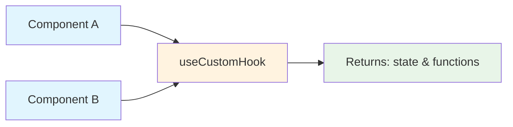

# 🎣 Custom React Hooks Study Guide - Part 2

## ⏰ Time Allocation: 40 minutes

---

## 📚 Table of Contents
1. [What are Custom Hooks?](#-what-are-custom-hooks)
2. [Creating Your First Hook](#-creating-your-first-hook)
3. [Essential Custom Hooks](#-essential-custom-hooks)
4. [Practical Examples](#-practical-examples)
5. [Best Practices](#-best-practices)

---

## 🎯 What are Custom Hooks?

### 📖 Simple Definition
Custom hooks are **JavaScript functions** that:
- Start with the word **"use"** (e.g., `useCounter`, `useToggle`)
- Can use other React hooks inside them
- Allow you to **reuse stateful logic** between components

### 🤔 Why Use Custom Hooks?
- **Don't Repeat Yourself**: Write logic once, use everywhere
- **Cleaner Components**: Move complex logic out of components
- **Easy Testing**: Test hook logic separately
- **Better Organization**: Group related functionality together

### 🔄 How They Work



**Key Point**: Each component gets its **own independent state** when using the same custom hook.

---

## 🏗️ Creating Your First Hook

### Step-by-Step Process

#### Step 1: Identify Repeated Logic
```javascript
// ❌ Same logic in multiple components
function Modal() {
  const [isOpen, setIsOpen] = useState(false);
  const open = () => setIsOpen(true);
  const close = () => setIsOpen(false);
  const toggle = () => setIsOpen(!isOpen);
  
  // Component JSX...
}

function Sidebar() {
  const [isOpen, setIsOpen] = useState(false);
  const open = () => setIsOpen(true);
  const close = () => setIsOpen(false);
  const toggle = () => setIsOpen(!isOpen);
  
  // Component JSX...
}
```

#### Step 2: Extract Into Custom Hook
```javascript
// ✅ Custom hook - extract the repeated logic
function useToggle(initialValue = false) {
  const [value, setValue] = useState(initialValue);
  
  const toggle = () => setValue(!value);
  const setTrue = () => setValue(true);
  const setFalse = () => setValue(false);
  
  return { value, toggle, setTrue, setFalse };
}
```

**Explanation**:
- Function name starts with `use` ✅
- Uses `useState` inside (can use any hook) ✅
- Returns an object with state and functions ✅
- Takes parameters like any function ✅

#### Step 3: Use in Components
```javascript
// ✅ Clean components using the custom hook
function Modal() {
  const { value: isOpen, toggle, setFalse: close } = useToggle();
  
  return (
    <div>
      <button onClick={toggle}>Toggle Modal</button>
      {isOpen && (
        <div className="modal">
          <p>Modal content</p>
          <button onClick={close}>Close</button>
        </div>
      )}
    </div>
  );
}

function Sidebar() {
  const { value: isCollapsed, toggle } = useToggle(true); // Start collapsed
  
  return (
    <aside className={isCollapsed ? 'collapsed' : 'expanded'}>
      <button onClick={toggle}>☰</button>
      {!isCollapsed && <nav>Menu items...</nav>}
    </aside>
  );
}
```

**Benefits**:
- 📦 **Reusable**: Same hook, different components
- 🎯 **Focused**: Each component focuses on UI, not state logic
- 🔧 **Customizable**: Pass different initial values

---

## 🔧 Essential Custom Hooks

### 1. 🔢 Counter Hook

**Problem**: Need counters in different components with increment/decrement logic.

```javascript
function useCounter(startValue = 0) {
  const [count, setCount] = useState(startValue);
  
  const increment = () => setCount(count + 1);
  const decrement = () => setCount(count - 1);
  const reset = () => setCount(startValue);
  
  return { count, increment, decrement, reset };
}

// Usage
function LikesCounter() {
  const { count, increment } = useCounter(0);
  
  return (
    <button onClick={increment}>
      ❤️ {count} likes
    </button>
  );
}

function StepCounter() {
  const { count, increment, decrement, reset } = useCounter(1);
  
  return (
    <div>
      <p>Step: {count}</p>
      <button onClick={increment}>Next</button>
      <button onClick={decrement}>Back</button>
      <button onClick={reset}>Start Over</button>
    </div>
  );
}
```

**Why it's useful**: Eliminates repetitive counter logic across components.

### 2. 📝 Input Hook

**Problem**: Managing form inputs with state and handlers.

```javascript
function useInput(initialValue = '') {
  const [value, setValue] = useState(initialValue);
  
  const onChange = (e) => setValue(e.target.value);
  const clear = () => setValue('');
  
  return { value, onChange, clear };
}

// Usage
function SearchForm() {
  const search = useInput('');
  const email = useInput('');
  
  const handleSubmit = (e) => {
    e.preventDefault();
    alert(`Searching for: ${search.value} from ${email.value}`);
    search.clear();
    email.clear();
  };
  
  return (
    <form onSubmit={handleSubmit}>
      <input 
        {...search} // Spreads: value, onChange
        placeholder="Search..."
      />
      <input 
        {...email}
        placeholder="Your email"
        type="email"
      />
      <button type="submit">Search</button>
    </form>
  );
}
```

**Magic**: The spread operator `{...search}` automatically passes `value` and `onChange` to the input!

### 3. 💾 Local Storage Hook

**Problem**: Sync component state with browser's local storage.

```javascript
function useLocalStorage(key, defaultValue) {
  // Try to get saved value, or use default
  const [value, setValue] = useState(() => {
    try {
      const saved = localStorage.getItem(key);
      return saved ? JSON.parse(saved) : defaultValue;
    } catch {
      return defaultValue;
    }
  });
  
  // Update both state and localStorage
  const setStoredValue = (newValue) => {
    setValue(newValue);
    localStorage.setItem(key, JSON.stringify(newValue));
  };
  
  return [value, setStoredValue];
}

// Usage
function Settings() {
  const [theme, setTheme] = useLocalStorage('theme', 'light');
  const [username, setUsername] = useLocalStorage('username', '');
  
  return (
    <div>
      <p>Theme: {theme}</p>
      <button onClick={() => setTheme(theme === 'light' ? 'dark' : 'light')}>
        Toggle Theme
      </button>
      
      <input 
        value={username}
        onChange={(e) => setUsername(e.target.value)}
        placeholder="Username"
      />
      
      <p>Settings will be remembered! 🎉</p>
    </div>
  );
}
```

**Cool feature**: Values persist even after page refresh!

---

## 🌐 Practical Examples

### 4. 📡 Simple Fetch Hook

**Problem**: Making API calls with loading and error states.

```javascript
function useFetch(url) {
  const [data, setData] = useState(null);
  const [loading, setLoading] = useState(true);
  const [error, setError] = useState(null);
  
  useEffect(() => {
    const fetchData = async () => {
      try {
        setLoading(true);
        const response = await fetch(url);
        const result = await response.json();
        setData(result);
      } catch (err) {
        setError(err.message);
      } finally {
        setLoading(false);
      }
    };
    
    fetchData();
  }, [url]);
  
  return { data, loading, error };
}

// Usage
function UserProfile() {
  const { data: user, loading, error } = useFetch('/api/user/123');
  
  if (loading) return <div>Loading user... ⏳</div>;
  if (error) return <div>Error: {error} ❌</div>;
  
  return (
    <div>
      <h2>{user.name}</h2>
      <p>{user.email}</p>
    </div>
  );
}
```

**Explanation**: 
- `useEffect` runs when component mounts or `url` changes
- Hook manages all the complexity (loading, error, success states)
- Component just focuses on displaying the data

### 5. ⏰ Previous Value Hook

**Problem**: Need to compare current value with previous value.

```javascript
function usePrevious(value) {
  const ref = useRef();
  
  useEffect(() => {
    ref.current = value; // Store current value after render
  });
  
  return ref.current; // Return previous value
}

// Usage
function CounterWithComparison() {
  const [count, setCount] = useState(0);
  const previousCount = usePrevious(count);
  
  return (
    <div>
      <p>Current: {count}</p>
      <p>Previous: {previousCount || 'None'}</p>
      
      {count > previousCount && <p>📈 Going up!</p>}
      {count < previousCount && <p>📉 Going down!</p>}
      
      <button onClick={() => setCount(count + 1)}>+</button>
      <button onClick={() => setCount(count - 1)}>-</button>
    </div>
  );
}
```

**How it works**:
1. `useRef` stores a value that persists between renders
2. `useEffect` updates the ref AFTER each render
3. So `ref.current` always contains the previous value

### 6. 🔍 Debounced Search Hook

**Problem**: Don't want to search on every keystroke (too many API calls).

```javascript
function useDebounce(value, delay) {
  const [debouncedValue, setDebouncedValue] = useState(value);
  
  useEffect(() => {
    const timer = setTimeout(() => {
      setDebouncedValue(value);
    }, delay);
    
    // Clear timeout if value changes before delay
    return () => clearTimeout(timer);
  }, [value, delay]);
  
  return debouncedValue;
}

// Usage
function SearchBox() {
  const [searchTerm, setSearchTerm] = useState('');
  const debouncedSearch = useDebounce(searchTerm, 500); // 500ms delay
  
  // This effect only runs when debounced value changes
  useEffect(() => {
    if (debouncedSearch) {
      console.log('🔍 Searching for:', debouncedSearch);
      // Make API call here
    }
  }, [debouncedSearch]);
  
  return (
    <div>
      <input 
        value={searchTerm}
        onChange={(e) => setSearchTerm(e.target.value)}
        placeholder="Type to search (debounced)..."
      />
      <p>Will search for: "{debouncedSearch}"</p>
    </div>
  );
}
```

**Why debouncing matters**:
- User types "react" = 5 API calls without debouncing
- With debouncing = 1 API call after user stops typing
- Saves bandwidth and improves performance! 🚀

---

## 🔄 Hook Composition

### Combining Multiple Hooks

**Advanced Example**: Todo list using multiple custom hooks

```javascript
// Combine our previous hooks
function TodoApp() {
  const newTodo = useInput('');
  const [todos, setTodos] = useLocalStorage('todos', []);
  const { value: showCompleted, toggle: toggleShow } = useToggle(true);
  
  const addTodo = () => {
    if (newTodo.value.trim()) {
      setTodos([...todos, {
        id: Date.now(),
        text: newTodo.value,
        completed: false
      }]);
      newTodo.clear();
    }
  };
  
  const toggleTodo = (id) => {
    setTodos(todos.map(todo =>
      todo.id === id ? { ...todo, completed: !todo.completed } : todo
    ));
  };
  
  const visibleTodos = showCompleted 
    ? todos 
    : todos.filter(todo => !todo.completed);
  
  return (
    <div>
      <h2>My Todos</h2>
      
      {/* Add new todo */}
      <div>
        <input {...newTodo} placeholder="Add a todo..." />
        <button onClick={addTodo}>Add</button>
      </div>
      
      {/* Filter toggle */}
      <button onClick={toggleShow}>
        {showCompleted ? 'Hide' : 'Show'} Completed
      </button>
      
      {/* Todo list */}
      {visibleTodos.map(todo => (
        <div key={todo.id}>
          <input 
            type="checkbox"
            checked={todo.completed}
            onChange={() => toggleTodo(todo.id)}
          />
          <span style={{
            textDecoration: todo.completed ? 'line-through' : 'none'
          }}>
            {todo.text}
          </span>
        </div>
      ))}
    </div>
  );
}
```

**Power of composition**: Complex app built by combining simple, focused hooks! 🧩

---

## ✅ Best Practices

### 🎯 Naming & Structure

#### ✅ Good Practices
```javascript
// ✅ Always start with "use"
function useCounter() { /* ... */ }

// ✅ Return objects for multiple values (easier to destructure)
function useUser() {
  return { user, loading, error, refetch };
}

// ✅ Provide sensible defaults
function useToggle(initialValue = false) { /* ... */ }

// ✅ Handle edge cases
function useLocalStorage(key, defaultValue) {
  const [value, setValue] = useState(() => {
    try {
      const item = localStorage.getItem(key);
      return item ? JSON.parse(item) : defaultValue;
    } catch (error) {
      console.warn('Error reading from localStorage:', error);
      return defaultValue; // Fallback to default
    }
  });
}
```

#### ❌ Common Mistakes
```javascript
// ❌ Don't call hooks conditionally
function BadHook(shouldUse) {
  if (shouldUse) {
    const [state] = useState(); // Wrong! Hooks must be called every time
  }
}

// ❌ Don't call hooks in loops
function BadHook(items) {
  items.forEach(item => {
    const [state] = useState(); // Wrong! Hook calls must be predictable
  });
}

// ❌ Don't return arrays when order doesn't matter
function useUser() {
  return [user, loading, error, refetch]; // Hard to remember order
}
// ✅ Better:
function useUser() {
  return { user, loading, error, refetch }; // Clear what each value is
}
```

### 🧪 Testing Tips

```javascript
// Simple test example
import { renderHook, act } from '@testing-library/react';
import { useCounter } from './useCounter';

test('useCounter increments correctly', () => {
  const { result } = renderHook(() => useCounter(0));
  
  expect(result.current.count).toBe(0);
  
  act(() => {
    result.current.increment();
  });
  
  expect(result.current.count).toBe(1);
});
```

### 🎨 When to Create Custom Hooks

**Create a custom hook when**:
- ✅ You copy-paste the same stateful logic
- ✅ Component gets too complex with state management
- ✅ You want to test state logic separately
- ✅ Logic is reusable across different components

**Don't create a custom hook when**:
- ❌ Logic is only used in one place
- ❌ It's just a simple function (no hooks inside)
- ❌ Over-engineering simple state

---

## 📋 Quick Reference

### 🏗️ Basic Hook Template
```javascript
function useCustomHook(initialValue, options = {}) {
  // 1. State
  const [state, setState] = useState(initialValue);
  
  // 2. Effects (if needed)
  useEffect(() => {
    // Side effects
  }, []);
  
  // 3. Handlers
  const handler = () => {
    setState(newValue);
  };
  
  // 4. Return API
  return { state, handler };
}
```

### 📊 Hook Categories

| Category | Purpose | Examples |
|----------|---------|----------|
| **State** | Manage simple state | `useToggle`, `useCounter` |
| **Input** | Handle form inputs | `useInput`, `useForm` |
| **Storage** | Persist data | `useLocalStorage` |
| **API** | Data fetching | `useFetch`, `useAPI` |
| **Utility** | Helper functions | `usePrevious`, `useDebounce` |

---

## 🎯 Summary

**🧠 Key Concepts**:
- Custom hooks are **functions starting with "use"**
- They **extract and reuse stateful logic** between components
- Each component gets its **own independent state** instance
- Hooks can **use other hooks** inside them

**💡 Benefits**:
- **DRY Principle**: Don't repeat yourself
- **Cleaner Components**: Separate UI from logic
- **Easy Testing**: Test hook logic independently
- **Better Organization**: Group related functionality

**🎨 Common Patterns**:
- `useToggle` - Boolean state with toggle functions
- `useInput` - Form input handling
- `useLocalStorage` - Persistent state
- `useFetch` - API calls with loading states
- `useDebounce` - Delayed value updates

**Next**: Part 3 covers Zustand for advanced state management! 🐻