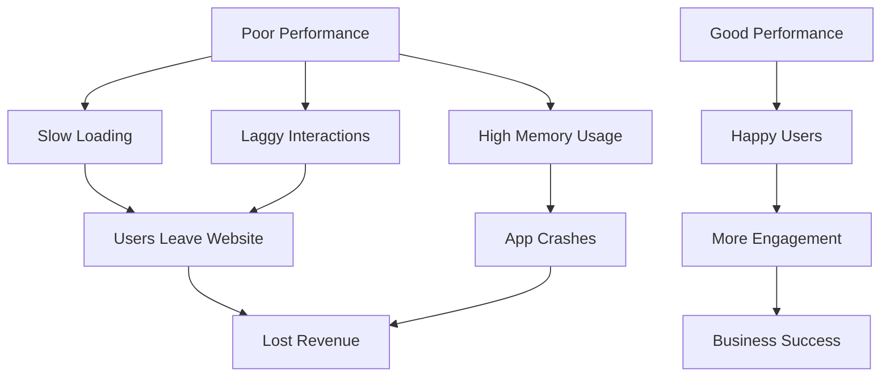
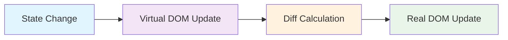
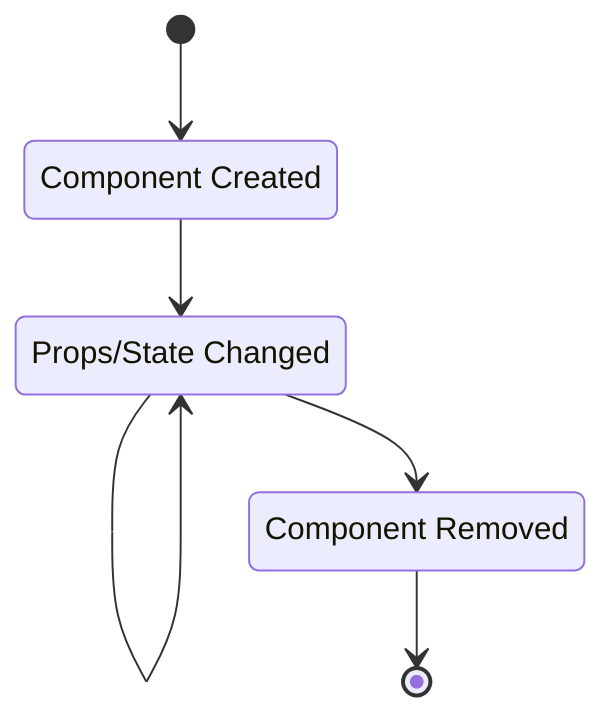

# Part A: React Performance Optimization Guide 🚀

## Table of Contents
1. [What is Performance Optimization?](#what-is-performance-optimization)
2. [Why Performance Matters](#why-performance-matters)
3. [Key Performance Concepts](#key-performance-concepts)
4. [Performance Optimization Techniques](#performance-optimization-techniques)
5. [Practical Examples](#practical-examples)
6. [Tools for Performance Monitoring](#tools-for-performance-monitoring)
7. [Best Practices](#best-practices)

---

## What is Performance Optimization? 🎯

Performance optimization in React means making your app run **faster** and use **less resources** (memory, CPU). Think of it like tuning a car engine to run more efficiently!

### Key Goals:
- ⚡ Faster loading times
- 🔄 Smoother user interactions
- 💾 Less memory usage
- 🔋 Better battery life on mobile devices

---

## Why Performance Matters 📈



### Real Impact:
- **1 second delay** = 7% reduction in conversions
- **53% of users** abandon sites that take >3 seconds to load

---

## Key Performance Concepts 🧠

### 1. Virtual DOM
React uses a "Virtual DOM" - a lightweight copy of the real DOM in memory.



### 2. Component Lifecycle
Components go through different phases:



### 3. Re-rendering
When state or props change, React re-renders components. Too many re-renders = poor performance!

---

## Performance Optimization Techniques 🛠️

### 1. React.memo() - Prevent Unnecessary Re-renders

**What it does:** Wraps a component to only re-render when props actually change.

```jsx
// ❌ Without React.memo - re-renders every time parent updates
const ExpensiveComponent = ({ name, age }) => {
  console.log('Rendering ExpensiveComponent');
  return (
    <div>
      <h2>{name}</h2>
      <p>Age: {age}</p>
    </div>
  );
};

// ✅ With React.memo - only re-renders when name or age changes
const OptimizedComponent = React.memo(({ name, age }) => {
  console.log('Rendering OptimizedComponent');
  return (
    <div>
      <h2>{name}</h2>
      <p>Age: {age}</p>
    </div>
  );
});
```

**When to use:** For components that receive the same props frequently.

### 2. useMemo() - Memoize Expensive Calculations

**What it does:** Caches the result of expensive calculations.

```jsx
import React, { useState, useMemo } from 'react';

const ExpensiveCalculationComponent = ({ numbers }) => {
  const [count, setCount] = useState(0);

  // ❌ Without useMemo - calculates every render
  const expensiveValue = numbers.reduce((sum, num) => sum + num * num, 0);

  // ✅ With useMemo - only calculates when 'numbers' changes
  const memoizedValue = useMemo(() => {
    console.log('Calculating expensive value...');
    return numbers.reduce((sum, num) => sum + num * num, 0);
  }, [numbers]); // Dependency array

  return (
    <div>
      <p>Expensive calculation result: {memoizedValue}</p>
      <p>Count: {count}</p>
      <button onClick={() => setCount(count + 1)}>
        Increment Count
      </button>
    </div>
  );
};
```

**When to use:** For expensive calculations that don't need to run on every render.

### 3. useCallback() - Memoize Functions

**What it does:** Caches function references to prevent child re-renders.

```jsx
import React, { useState, useCallback } from 'react';

const ChildComponent = React.memo(({ onClick }) => {
  console.log('Child component rendered');
  return <button onClick={onClick}>Click me</button>;
});

const ParentComponent = () => {
  const [count, setCount] = useState(0);
  const [text, setText] = useState('');

  // ❌ Without useCallback - new function on every render
  const handleClick = () => {
    setCount(count + 1);
  };

  // ✅ With useCallback - same function reference when dependencies don't change
  const memoizedHandleClick = useCallback(() => {
    setCount(prevCount => prevCount + 1);
  }, []); // Empty dependency array

  return (
    <div>
      <input 
        value={text} 
        onChange={(e) => setText(e.target.value)}
        placeholder="Type something..."
      />
      <p>Count: {count}</p>
      <ChildComponent onClick={memoizedHandleClick} />
    </div>
  );
};
```

**When to use:** When passing functions as props to memoized child components.

### 4. Code Splitting with React.lazy()

**What it does:** Loads components only when needed, reducing initial bundle size.

```jsx
import React, { Suspense, lazy } from 'react';

// ✅ Lazy load components
const HeavyComponent = lazy(() => import('./HeavyComponent'));
const AnotherComponent = lazy(() => import('./AnotherComponent'));

const App = () => {
  const [showHeavy, setShowHeavy] = useState(false);

  return (
    <div>
      <h1>My App</h1>
      <button onClick={() => setShowHeavy(!showHeavy)}>
        Toggle Heavy Component
      </button>
      
      <Suspense fallback={<div>Loading...</div>}>
        {showHeavy && <HeavyComponent />}
      </Suspense>
    </div>
  );
};
```

**Folder Structure for Practice:**
```
src/
  components/
    HeavyComponent.jsx
    AnotherComponent.jsx
  App.jsx
  index.js
```

### 5. Optimize Lists with Keys

**What it does:** Helps React identify which items have changed in lists.

```jsx
// ❌ Bad - using array index as key
const BadList = ({ items }) => (
  <ul>
    {items.map((item, index) => (
      <li key={index}>{item.name}</li>
    ))}
  </ul>
);

// ✅ Good - using unique, stable identifier
const GoodList = ({ items }) => (
  <ul>
    {items.map(item => (
      <li key={item.id}>{item.name}</li>
    ))}
  </ul>
);
```

---

## Practical Examples 💻

### Example 1: Complete Performance-Optimized Todo App

Create a new file: `OptimizedTodoApp.jsx`

```jsx
import React, { useState, useMemo, useCallback } from 'react';

// Memoized Todo Item Component
const TodoItem = React.memo(({ todo, onToggle, onDelete }) => {
  console.log(`Rendering todo: ${todo.text}`);
  
  return (
    <li style={{ 
      textDecoration: todo.completed ? 'line-through' : 'none',
      padding: '8px',
      border: '1px solid #ddd',
      margin: '4px 0'
    }}>
      <input
        type="checkbox"
        checked={todo.completed}
        onChange={() => onToggle(todo.id)}
      />
      <span style={{ marginLeft: '8px' }}>{todo.text}</span>
      <button 
        onClick={() => onDelete(todo.id)}
        style={{ marginLeft: '8px', color: 'red' }}
      >
        Delete
      </button>
    </li>
  );
});

// Memoized Statistics Component
const TodoStats = React.memo(({ todos }) => {
  const stats = useMemo(() => {
    const total = todos.length;
    const completed = todos.filter(todo => todo.completed).length;
    const pending = total - completed;
    
    return { total, completed, pending };
  }, [todos]);

  return (
    <div style={{ 
      background: '#f0f0f0', 
      padding: '16px', 
      margin: '16px 0',
      borderRadius: '4px'
    }}>
      <h3>📊 Statistics</h3>
      <p>Total: {stats.total}</p>
      <p>Completed: {stats.completed}</p>
      <p>Pending: {stats.pending}</p>
    </div>
  );
});

const OptimizedTodoApp = () => {
  const [todos, setTodos] = useState([
    { id: 1, text: 'Learn React', completed: false },
    { id: 2, text: 'Optimize Performance', completed: false },
    { id: 3, text: 'Build Amazing Apps', completed: false }
  ]);
  const [inputText, setInputText] = useState('');

  // Memoized callback functions
  const handleToggle = useCallback((id) => {
    setTodos(prevTodos =>
      prevTodos.map(todo =>
        todo.id === id ? { ...todo, completed: !todo.completed } : todo
      )
    );
  }, []);

  const handleDelete = useCallback((id) => {
    setTodos(prevTodos => prevTodos.filter(todo => todo.id !== id));
  }, []);

  const handleAdd = useCallback(() => {
    if (inputText.trim()) {
      setTodos(prevTodos => [
        ...prevTodos,
        {
          id: Date.now(),
          text: inputText.trim(),
          completed: false
        }
      ]);
      setInputText('');
    }
  }, [inputText]);

  return (
    <div style={{ maxWidth: '600px', margin: '0 auto', padding: '20px' }}>
      <h1>🚀 Optimized Todo App</h1>
      
      <div style={{ marginBottom: '20px' }}>
        <input
          type="text"
          value={inputText}
          onChange={(e) => setInputText(e.target.value)}
          placeholder="Add a new todo..."
          style={{ 
            padding: '8px', 
            marginRight: '8px',
            width: '300px'
          }}
        />
        <button onClick={handleAdd} style={{ padding: '8px 16px' }}>
          Add Todo
        </button>
      </div>

      <TodoStats todos={todos} />

      <ul style={{ listStyle: 'none', padding: 0 }}>
        {todos.map(todo => (
          <TodoItem
            key={todo.id}
            todo={todo}
            onToggle={handleToggle}
            onDelete={handleDelete}
          />
        ))}
      </ul>
    </div>
  );
};

export default OptimizedTodoApp;
```

### How to Test the Optimization:

1. **Create the component** in your React app
2. **Open Browser DevTools** (F12)
3. **Go to Console tab**
4. **Interact with the app** - add todos, toggle completion
5. **Watch the console logs** - you'll see which components re-render

---

## Tools for Performance Monitoring 🔧

### 1. React Developer Tools Profiler

**How to install:**
1. Go to Chrome Web Store
2. Search "React Developer Tools"
3. Install the extension

**How to use:**
1. Open DevTools (F12)
2. Click "Profiler" tab
3. Click "Record" button (🔴)
4. Interact with your app
5. Click "Stop" button
6. Analyze the flame graph

### 2. Lighthouse Performance Audit

**Steps to run:**
1. Open Chrome DevTools (F12)
2. Click "Lighthouse" tab
3. Select "Performance" checkbox
4. Click "Generate report"
5. Review recommendations

### 3. Bundle Analyzer

**Install:**
```bash
npm install --save-dev webpack-bundle-analyzer
```

**Add to package.json:**
```json
{
  "scripts": {
    "analyze": "npm run build && npx webpack-bundle-analyzer build/static/js/*.js"
  }
}
```

**Run:**
```bash
npm run analyze
```

---

## Best Practices Checklist ✅

### Do's ✅
- Use `React.memo()` for components with stable props
- Use `useMemo()` for expensive calculations
- Use `useCallback()` for functions passed as props
- Use unique, stable keys for list items
- Implement code splitting for large components
- Lazy load images and components
- Minimize state updates

### Don'ts ❌
- Don't overuse `useMemo()` and `useCallback()`
- Don't use array indexes as keys in dynamic lists
- Don't create objects/functions inside render
- Don't ignore the dependency arrays
- Don't optimize prematurely - measure first!

### Quick Performance Wins 🏆

1. **Image Optimization**
   ```jsx
   
   ```

2. **Debounce Input Handlers**
   ```jsx
   import { useState, useCallback } from 'react';
   import { debounce } from 'lodash';

   const SearchInput = () => {
     const [query, setQuery] = useState('');

     const debouncedSearch = useCallback(
       debounce((searchTerm) => {
         // API call here
         console.log('Searching for:', searchTerm);
       }, 300),
       []
     );

     return (
       <input
         value={query}
         onChange={(e) => {
           setQuery(e.target.value);
           debouncedSearch(e.target.value);
         }}
         placeholder="Search..."
       />
     );
   };
   ```

---

## Practice Exercises 📝

### Exercise 1: Basic Optimization
1. Create a component that displays a list of users
2. Add React.memo() to prevent unnecessary re-renders
3. Use the React DevTools Profiler to measure the difference

### Exercise 2: Expensive Calculation
1. Create a component that calculates prime numbers
2. Add useMemo() to cache the calculation
3. Add a counter that updates frequently to test the optimization

### Exercise 3: Function Optimization
1. Create a parent component with a child component
2. Pass a function as a prop to the child
3. Use useCallback() to optimize the function
4. Verify using React DevTools

---

## Summary 📋

React Performance Optimization is about:

1. **Preventing unnecessary re-renders** with React.memo()
2. **Caching expensive calculations** with useMemo()
3. **Stabilizing function references** with useCallback()
4. **Loading code efficiently** with lazy loading
5. **Using proper keys** for list items
6. **Measuring performance** with developer tools

Remember: **Measure first, optimize second!** Don't optimize everything - focus on actual performance bottlenecks.

---

## Next Steps 👉

Now that you understand performance optimization, you're ready for **Part B: Testing with React Testing Library & Jest**!