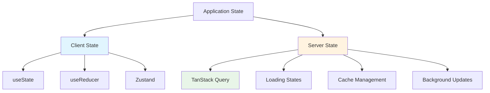

# ⚡ React Query/TanStack Query Study Guide - Part 4

## ⏰ Time Allocation: 40 minutes

---

## 📚 Table of Contents
1. [What is TanStack Query?](#-what-is-tanstack-query)
2. [Basic Setup & First Query](#-basic-setup--first-query)
3. [Core Concepts](#-core-concepts)
4. [Mutations](#-mutations)
5. [Advanced Patterns](#-advanced-patterns)
6. [Best Practices](#-best-practices)

---

## 🎯 What is TanStack Query?

### 📖 Simple Definition
TanStack Query (formerly React Query) is a **data fetching and caching library** that makes server state management in React applications incredibly simple and powerful.

**Think of it as**: "useState for server data" 🌐

### 🤔 Server State vs Client State



#### Client State Examples:
- ✅ Form input values
- ✅ Modal open/closed
- ✅ Selected tabs
- ✅ Theme preferences

#### Server State Examples:
- 🌐 User profile data
- 🌐 Product listings
- 🌐 API responses
- 🌐 Real-time data

### 🚀 Why Use TanStack Query?

#### Without TanStack Query (Traditional Approach)
```javascript
// ❌ Lots of boilerplate for each API call
function UserProfile({ userId }) {
  const [user, setUser] = useState(null);
  const [loading, setLoading] = useState(true);
  const [error, setError] = useState(null);

  useEffect(() => {
    const fetchUser = async () => {
      try {
        setLoading(true);
        const response = await fetch(`/api/users/${userId}`);
        const userData = await response.json();
        setUser(userData);
      } catch (err) {
        setError(err.message);
      } finally {
        setLoading(false);
      }
    };

    fetchUser();
  }, [userId]);

  // Handle loading, error, success states...
  if (loading) return <div>Loading...</div>;
  if (error) return <div>Error: {error}</div>;
  return <div>User: {user.name}</div>;
}
```

#### With TanStack Query (Modern Approach)
```javascript
// ✅ Clean and simple!
function UserProfile({ userId }) {
  const { data: user, isLoading, error } = useQuery({
    queryKey: ['user', userId],
    queryFn: () => fetch(`/api/users/${userId}`).then(res => res.json())
  });

  if (isLoading) return <div>Loading...</div>;
  if (error) return <div>Error: {error.message}</div>;
  return <div>User: {user.name}</div>;
}
```

### 🎁 Key Benefits

| Feature | Traditional | TanStack Query |
|---------|-------------|----------------|
| **Caching** | ❌ Manual | ✅ Automatic |
| **Background Updates** | ❌ None | ✅ Smart refetching |
| **Loading States** | ❌ Manual | ✅ Built-in |
| **Error Handling** | ❌ Manual | ✅ Built-in |
| **Deduplication** | ❌ Multiple requests | ✅ Smart deduplication |
| **Optimistic Updates** | ❌ Complex | ✅ Simple API |

---

## 🚀 Basic Setup & First Query

### 📦 Installation
```bash
npm install @tanstack/react-query
# or
yarn add @tanstack/react-query
```

### 🏗️ Setup Query Client

#### Step 1: Create Query Client
```javascript
// App.jsx
import { QueryClient, QueryClientProvider } from '@tanstack/react-query';

// Create a client
const queryClient = new QueryClient();

function App() {
  return (
    <QueryClientProvider client={queryClient}>
      <div className="App">
        <UserList />
        <PostList />
      </div>
    </QueryClientProvider>
  );
}
```

#### Step 2: Your First Query
```javascript
import { useQuery } from '@tanstack/react-query';

function UserList() {
  // Basic query structure
  const { 
    data,           // The fetched data
    isLoading,      // Loading state
    error,          // Error object
    isError         // Boolean error state
  } = useQuery({
    queryKey: ['users'],                    // Unique identifier
    queryFn: () => fetch('/api/users').then(res => res.json())  // Fetch function
  });

  if (isLoading) return <div>Loading users... ⏳</div>;
  if (isError) return <div>Error: {error.message} ❌</div>;

  return (
    <div>
      <h2>Users 👥</h2>
      {data.map(user => (
        <div key={user.id}>
          <strong>{user.name}</strong> - {user.email}
        </div>
      ))}
    </div>
  );
}
```

**Explanation:**
- **queryKey**: Unique identifier for caching (like a cache key)
- **queryFn**: Function that returns a Promise with your data
- **Automatic**: Loading states, error handling, caching all handled automatically!

---

## 🧠 Core Concepts

### 1. 🔑 Query Keys

Query keys are like **addresses for your cached data**. They determine when queries are the same and when they should refetch.

```javascript
// Static key
useQuery({
  queryKey: ['posts'],
  queryFn: fetchPosts
});

// Dynamic key with parameters
useQuery({
  queryKey: ['posts', postId],
  queryFn: () => fetchPost(postId)
});

// Complex key with filters
useQuery({
  queryKey: ['posts', { status: 'published', author: 'john' }],
  queryFn: () => fetchPosts({ status: 'published', author: 'john' })
});
```

**Key Rules:**
- **Same key = Same cached data** 
- **Different key = Different query**
- **Key changes = Refetch automatically**

### 2. 📊 Query States & Data Flow

```javascript
function PostDetails({ postId }) {
  const { 
    data,
    isLoading,      // Initial fetch in progress
    isFetching,     // Any fetch in progress (including background)
    isError,        // Query failed
    error,          // Error object
    isSuccess,      // Query succeeded
    refetch         // Manual refetch function
  } = useQuery({
    queryKey: ['post', postId],
    queryFn: () => fetchPost(postId)
  });

  // Different UI for different states
  if (isLoading) {
    return <div>Loading post... ⏳</div>;
  }

  if (isError) {
    return (
      <div>
        <p>❌ Failed to load post: {error.message}</p>
        <button onClick={refetch}>Try Again</button>
      </div>
    );
  }

  return (
    <div>
      <h1>{data.title}</h1>
      <p>{data.content}</p>
      
      {/* Show loading indicator during background updates */}
      {isFetching && <span>🔄 Updating...</span>}
      
      <button onClick={refetch}>Refresh Post</button>
    </div>
  );
}
```

### 3. ⚙️ Query Configuration

```javascript
function ProductList() {
  const { data: products } = useQuery({
    queryKey: ['products'],
    queryFn: fetchProducts,
    
    // Configuration options
    staleTime: 5 * 60 * 1000,        // 5 minutes - data is fresh for 5 mins
    cacheTime: 10 * 60 * 1000,       // 10 minutes - keep in cache for 10 mins
    refetchOnWindowFocus: false,     // Don't refetch when window gains focus
    retry: 3,                        // Retry failed requests 3 times
    retryDelay: (attemptIndex) => Math.min(1000 * 2 ** attemptIndex, 30000),
    
    // Conditional fetching
    enabled: !!userId,               // Only fetch if userId exists
    
    // Data transformation
    select: (data) => data.filter(product => product.inStock),
  });

  return (
    <div>
      {products?.map(product => (
        <ProductCard key={product.id} product={product} />
      ))}
    </div>
  );
}
```

**Key Options Explained:**
- **staleTime**: How long data is considered "fresh" (no background refetch)
- **cacheTime**: How long to keep unused data in cache
- **enabled**: Conditional fetching (great for dependent queries)
- **select**: Transform data before it reaches your component

---

## 🔄 Mutations

Mutations are for **changing server data** (POST, PUT, DELETE). Think of them as "actions that modify data".

### 1. 🆕 Basic Mutations

```javascript
import { useMutation, useQueryClient } from '@tanstack/react-query';

function CreatePost() {
  const queryClient = useQueryClient();
  
  // Create mutation
  const createPostMutation = useMutation({
    mutationFn: (newPost) => {
      return fetch('/api/posts', {
        method: 'POST',
        headers: { 'Content-Type': 'application/json' },
        body: JSON.stringify(newPost)
      }).then(res => res.json());
    },
    
    // What to do when mutation succeeds
    onSuccess: () => {
      // Invalidate and refetch posts list
      queryClient.invalidateQueries({ queryKey: ['posts'] });
      alert('Post created successfully! 🎉');
    },
    
    // What to do when mutation fails
    onError: (error) => {
      alert(`Failed to create post: ${error.message} ❌`);
    }
  });

  const handleSubmit = (e) => {
    e.preventDefault();
    const formData = new FormData(e.target);
    const newPost = {
      title: formData.get('title'),
      content: formData.get('content')
    };
    
    // Trigger the mutation
    createPostMutation.mutate(newPost);
  };

  return (
    <form onSubmit={handleSubmit}>
      <h2>Create New Post ✍️</h2>
      
      <input name="title" placeholder="Post title" required />
      <textarea name="content" placeholder="Post content" required />
      
      <button 
        type="submit" 
        disabled={createPostMutation.isPending}
      >
        {createPostMutation.isPending ? 'Creating...' : 'Create Post'}
      </button>
      
      {createPostMutation.isError && (
        <p style={{ color: 'red' }}>
          Error: {createPostMutation.error.message}
        </p>
      )}
    </form>
  );
}
```

### 2. 🎯 Optimistic Updates

Make UI feel instant by updating immediately, then sync with server.

```javascript
function TodoList() {
  const queryClient = useQueryClient();

  // Fetch todos
  const { data: todos } = useQuery({
    queryKey: ['todos'],
    queryFn: fetchTodos
  });

  // Toggle todo mutation with optimistic update
  const toggleTodoMutation = useMutation({
    mutationFn: ({ id, completed }) => 
      fetch(`/api/todos/${id}`, {
        method: 'PATCH',
        headers: { 'Content-Type': 'application/json' },
        body: JSON.stringify({ completed })
      }),
    
    // Optimistic update - runs immediately
    onMutate: async ({ id, completed }) => {
      // Cancel any outgoing refetches
      await queryClient.cancelQueries({ queryKey: ['todos'] });

      // Snapshot the previous value
      const previousTodos = queryClient.getQueryData(['todos']);

      // Optimistically update to the new value
      queryClient.setQueryData(['todos'], (old) =>
        old.map(todo =>
          todo.id === id ? { ...todo, completed } : todo
        )
      );

      // Return a context object with the snapshotted value
      return { previousTodos };
    },
    
    // If the mutation fails, rollback
    onError: (err, variables, context) => {
      queryClient.setQueryData(['todos'], context.previousTodos);
    },
    
    // Always refetch after error or success
    onSettled: () => {
      queryClient.invalidateQueries({ queryKey: ['todos'] });
    },
  });

  const toggleTodo = (id, completed) => {
    toggleTodoMutation.mutate({ id, completed: !completed });
  };

  return (
    <div>
      <h2>My Todos ✅</h2>
      {todos?.map(todo => (
        <div key={todo.id}>
          <input 
            type="checkbox"
            checked={todo.completed}
            onChange={() => toggleTodo(todo.id, todo.completed)}
          />
          <span style={{
            textDecoration: todo.completed ? 'line-through' : 'none'
          }}>
            {todo.text}
          </span>
        </div>
      ))}
    </div>
  );
}
```

**Optimistic Update Flow:**
1. **User clicks** → UI updates immediately (optimistic)
2. **API call** happens in background
3. **If success** → Keep the optimistic update
4. **If error** → Rollback to previous state + show error

---

## 🔥 Advanced Patterns

### 1. 🔗 Dependent Queries

When one query depends on data from another query.

```javascript
function UserPosts({ userId }) {
  // First query - get user
  const { 
    data: user, 
    isLoading: userLoading 
  } = useQuery({
    queryKey: ['user', userId],
    queryFn: () => fetchUser(userId)
  });

  // Second query - get user's posts (depends on user data)
  const { 
    data: posts, 
    isLoading: postsLoading 
  } = useQuery({
    queryKey: ['posts', 'user', userId],
    queryFn: () => fetchUserPosts(userId),
    enabled: !!user, // Only fetch when user data exists
  });

  if (userLoading) return <div>Loading user... ⏳</div>;
  if (!user) return <div>User not found ❌</div>;

  return (
    <div>
      <h2>{user.name}'s Posts</h2>
      {postsLoading ? (
        <div>Loading posts... ⏳</div>
      ) : (
        posts?.map(post => (
          <article key={post.id}>
            <h3>{post.title}</h3>
            <p>{post.excerpt}</p>
          </article>
        ))
      )}
    </div>
  );
}
```

### 2. 🔄 Infinite Queries

Perfect for "Load More" functionality or infinite scroll.

```javascript
import { useInfiniteQuery } from '@tanstack/react-query';

function PostFeed() {
  const {
    data,
    fetchNextPage,
    hasNextPage,
    isFetchingNextPage,
    isLoading
  } = useInfiniteQuery({
    queryKey: ['posts', 'infinite'],
    queryFn: ({ pageParam = 1 }) => fetchPosts({ page: pageParam, limit: 10 }),
    
    // How to get the next page parameter
    getNextPageParam: (lastPage, pages) => {
      // If last page has less than 10 items, no more pages
      return lastPage.length === 10 ? pages.length + 1 : undefined;
    },
    
    initialPageParam: 1,
  });

  if (isLoading) return <div>Loading posts... ⏳</div>;

  return (
    <div>
      <h2>Post Feed 📰</h2>
      
      {/* Flatten all pages and render posts */}
      {data?.pages.flat().map(post => (
        <article key={post.id} style={{ marginBottom: '20px', padding: '15px', border: '1px solid #ddd' }}>
          <h3>{post.title}</h3>
          <p>{post.content}</p>
        </article>
      ))}
      
      {/* Load more button */}
      {hasNextPage && (
        <button 
          onClick={() => fetchNextPage()}
          disabled={isFetchingNextPage}
          style={{ padding: '10px 20px', fontSize: '16px' }}
        >
          {isFetchingNextPage ? 'Loading more...' : 'Load More Posts'}
        </button>
      )}
      
      {!hasNextPage && (
        <p style={{ textAlign: 'center', color: '#666' }}>
          🎉 You've reached the end!
        </p>
      )}
    </div>
  );
}
```

### 3. 🎭 Query Invalidation & Refetching

Smart ways to keep your data fresh.

```javascript
function PostManager() {
  const queryClient = useQueryClient();

  // Different invalidation strategies
  const refreshStrategies = {
    // Invalidate specific query
    refreshSinglePost: (postId) => {
      queryClient.invalidateQueries({ queryKey: ['post', postId] });
    },

    // Invalidate all posts
    refreshAllPosts: () => {
      queryClient.invalidateQueries({ queryKey: ['posts'] });
    },

    // Invalidate queries matching a pattern
    refreshUserData: (userId) => {
      queryClient.invalidateQueries({ 
        predicate: (query) => 
          query.queryKey[0] === 'user' || 
          (query.queryKey[0] === 'posts' && query.queryKey.includes(userId))
      });
    },

    // Remove from cache entirely
    clearPostCache: (postId) => {
      queryClient.removeQueries({ queryKey: ['post', postId] });
    },

    // Manually update cache
    updatePostInCache: (postId, updates) => {
      queryClient.setQueryData(['post', postId], (oldData) => ({
        ...oldData,
        ...updates
      }));
    }
  };

  return (
    <div>
      <h2>Cache Management 🗄️</h2>
      <button onClick={() => refreshStrategies.refreshAllPosts()}>
        Refresh All Posts
      </button>
      <button onClick={() => refreshStrategies.refreshUserData('user123')}>
        Refresh User Data
      </button>
      <button onClick={() => refreshStrategies.clearPostCache('post456')}>
        Clear Post from Cache
      </button>
    </div>
  );
}
```

### 4. 🎪 Custom Hooks

Create reusable query logic.

```javascript
// Custom hook for user data
function useUser(userId) {
  return useQuery({
    queryKey: ['user', userId],
    queryFn: () => fetchUser(userId),
    enabled: !!userId,
    staleTime: 5 * 60 * 1000, // 5 minutes
  });
}

// Custom hook for posts with filters
function usePosts(filters = {}) {
  return useQuery({
    queryKey: ['posts', filters],
    queryFn: () => fetchPosts(filters),
    keepPreviousData: true, // Keep previous data while fetching new
  });
}

// Custom hook for creating posts
function useCreatePost() {
  const queryClient = useQueryClient();
  
  return useMutation({
    mutationFn: createPost,
    onSuccess: (newPost) => {
      // Add to posts list cache
      queryClient.setQueryData(['posts'], (oldPosts) => [
        newPost,
        ...(oldPosts || [])
      ]);
    },
  });
}

// Usage in component
function BlogApp() {
  const { data: user } = useUser('user123');
  const { data: posts } = usePosts({ author: 'user123' });
  const createPostMutation = useCreatePost();

  return (
    <div>
      <h1>{user?.name}'s Blog</h1>
      {/* Rest of component */}
    </div>
  );
}
```

---

## ✅ Best Practices

### 🎯 Query Organization

#### ✅ Good Patterns
```javascript
// ✅ Consistent query key structure
const queryKeys = {
  users: ['users'] as const,
  user: (id: string) => ['users', id] as const,
  userPosts: (id: string) => ['users', id, 'posts'] as const,
  posts: ['posts'] as const,
  post: (id: string) => ['posts', id] as const,
};

// ✅ Centralized API functions
const api = {
  getUser: (id: string) => fetch(`/api/users/${id}`).then(res => res.json()),
  getPosts: (filters?: any) => fetch(`/api/posts?${new URLSearchParams(filters)}`).then(res => res.json()),
  createPost: (post: any) => fetch('/api/posts', {
    method: 'POST',
    headers: { 'Content-Type': 'application/json' },
    body: JSON.stringify(post)
  }).then(res => res.json())
};

// ✅ Custom hooks for reusability
function useUser(id: string) {
  return useQuery({
    queryKey: queryKeys.user(id),
    queryFn: () => api.getUser(id),
    enabled: !!id
  });
}
```

#### ❌ Anti-patterns
```javascript
// ❌ Inconsistent query keys
useQuery({ queryKey: ['user', id] }); // Somewhere else
useQuery({ queryKey: ['users', id] }); // Different pattern - bad!

// ❌ Inline fetch functions (hard to test/reuse)
useQuery({
  queryKey: ['user', id],
  queryFn: () => fetch(`/api/users/${id}`).then(res => res.json()) // Repeated everywhere
});

// ❌ No error handling
useQuery({
  queryKey: ['user', id],
  queryFn: fetchUser, // What if this throws?
});
```

### 🚀 Performance Optimization

```javascript
// ✅ Use select for data transformation
function UserPosts({ userId }) {
  const { data: activePosts } = useQuery({
    queryKey: ['posts', userId],
    queryFn: () => fetchUserPosts(userId),
    // Transform data instead of doing it in component
    select: (posts) => posts.filter(post => post.status === 'active')
  });
  // Component only re-renders when active posts change!
}

// ✅ Keep previous data during refetches
function SearchResults({ query }) {
  const { data, isFetching } = useQuery({
    queryKey: ['search', query],
    queryFn: () => searchPosts(query),
    keepPreviousData: true, // Show previous results while loading new ones
  });

  return (
    <div>
      {isFetching && <div>🔄 Searching...</div>}
      {data?.map(post => <PostCard key={post.id} post={post} />)}
    </div>
  );
}

// ✅ Smart stale times
const queryClient = new QueryClient({
  defaultOptions: {
    queries: {
      staleTime: 5 * 60 * 1000, // 5 minutes default
      cacheTime: 10 * 60 * 1000, // 10 minutes cache
    },
  },
});
```

### 🧪 Testing

```javascript
import { QueryClient, QueryClientProvider } from '@tanstack/react-query';
import { render, screen, waitFor } from '@testing-library/react';

// Test helper
function createTestQueryClient() {
  return new QueryClient({
    defaultOptions: {
      queries: { retry: false }, // Don't retry in tests
      mutations: { retry: false },
    },
  });
}

function renderWithQuery(ui: React.ReactElement) {
  const testQueryClient = createTestQueryClient();
  
  return render(
    <QueryClientProvider client={testQueryClient}>
      {ui}
    </QueryClientProvider>
  );
}

// Test example
test('displays user data when loaded', async () => {
  // Mock the API
  global.fetch = jest.fn(() =>
    Promise.resolve({
      json: () => Promise.resolve({ id: '1', name: 'John Doe' }),
    })
  ) as jest.Mock;

  renderWithQuery(<UserProfile userId="1" />);

  // Check loading state
  expect(screen.getByText('Loading user...')).toBeInTheDocument();

  // Wait for data to load
  await waitFor(() => {
    expect(screen.getByText('User: John Doe')).toBeInTheDocument();
  });
});
```

### 🔧 Error Handling

```javascript
// Global error boundary
function QueryErrorBoundary({ children }) {
  return (
    <ErrorBoundary
      fallback={<div>Something went wrong with data fetching ❌</div>}
      onError={(error) => {
        console.error('Query error:', error);
        // Send to error reporting service
      }}
    >
      {children}
    </ErrorBoundary>
  );
}

// Query-level error handling
function UserProfile({ userId }) {
  const { data: user, error, isError, refetch } = useQuery({
    queryKey: ['user', userId],
    queryFn: () => fetchUser(userId),
    retry: (failureCount, error) => {
      // Don't retry on 404
      if (error.status === 404) return false;
      // Retry up to 3 times for other errors
      return failureCount < 3;
    }
  });

  if (isError) {
    return (
      <div>
        <h2>Oops! Something went wrong ❌</h2>
        <p>{error.message}</p>
        <button onClick={() => refetch()}>Try Again</button>
      </div>
    );
  }

  return <div>User: {user?.name}</div>;
}
```

---

## 🎯 Quick Reference

### 📋 Essential Hooks

| Hook | Purpose | Example |
|------|---------|---------|
| `useQuery` | Fetch & cache data | `useQuery({ queryKey, queryFn })` |
| `useMutation` | Modify server data | `useMutation({ mutationFn })` |
| `useInfiniteQuery` | Paginated data | `useInfiniteQuery({ queryKey, queryFn, getNextPageParam })` |
| `useQueryClient` | Access query client | `const client = useQueryClient()` |

### ⚙️ Common Configurations

```javascript
// Basic query
useQuery({
  queryKey: ['posts'],
  queryFn: fetchPosts,
});

// Conditional query
useQuery({
  queryKey: ['user', userId],
  queryFn: () => fetchUser(userId),
  enabled: !!userId, // Only run if userId exists
});

// Transformed data
useQuery({
  queryKey: ['posts'],
  queryFn: fetchPosts,
  select: (data) => data.filter(post => post.published),
});

// Background updates
useQuery({
  queryKey: ['posts'],
  queryFn: fetchPosts,
  staleTime: 5 * 60 * 1000, // Fresh for 5 minutes
  refetchInterval: 30 * 1000, // Refetch every 30 seconds
});
```

### 🔄 Cache Operations

```javascript
const queryClient = useQueryClient();

// Invalidate (refetch)
queryClient.invalidateQueries({ queryKey: ['posts'] });

// Update cache
queryClient.setQueryData(['user', '123'], newUserData);

// Remove from cache
queryClient.removeQueries({ queryKey: ['posts'] });

// Get cached data
const user = queryClient.getQueryData(['user', '123']);
```

---

## 🎉 Summary

**🧠 Key Concepts:**
- **Server State**: Data from APIs that needs caching, updating, syncing
- **Query Keys**: Unique identifiers for cached data (like cache addresses)
- **Automatic Caching**: Smart caching with background updates
- **Mutations**: For creating, updating, deleting server data
- **Optimistic Updates**: Update UI immediately, sync with server later

**💡 Why TanStack Query is Amazing:**
- **Zero Boilerplate**: No manual loading/error state management
- **Smart Caching**: Automatic background updates and deduplication  
- **Great DX**: Excellent DevTools and TypeScript support
- **Performance**: Selective re-renders and intelligent refetching
- **Flexibility**: Works with any async function (REST, GraphQL, etc.)

**🎯 When to Use:**
- ✅ Fetching data from APIs
- ✅ Need caching and background updates
- ✅ Want to eliminate loading/error boilerplate
- ✅ Complex data relationships and dependencies
- ✅ Optimistic updates and real-time feel

**🚫 When NOT to Use:**
- ❌ Simple static data that never changes
- ❌ Pure client-side state (use useState/Zustand)
- ❌ One-time data fetches that don't need caching

**🏆 Best Practices:**
- Consistent query key patterns
- Custom hooks for reusable logic
- Proper error handling and loading states
- Smart cache invalidation strategies
- Use TypeScript for better DX

**Your React app now has superpowers for server state! 🚀⚡**