# Part B: Testing with React Testing Library & Jest Guide 🧪

## Table of Contents
1. [What is Testing?](#what-is-testing)
2. [Why Test React Apps?](#why-test-react-apps)
3. [Testing Tools Overview](#testing-tools-overview)
4. [Setting Up Testing Environment](#setting-up-testing-environment)
5. [Writing Your First Test](#writing-your-first-test)
6. [React Testing Library Basics](#react-testing-library-basics)
7. [Common Testing Patterns](#common-testing-patterns)
8. [Advanced Testing Techniques](#advanced-testing-techniques)
9. [Best Practices](#best-practices)

---

## What is Testing? 🤔

Testing is like having a **quality checker** for your code. It automatically verifies that your components work as expected, just like testing a car before selling it!

```mermaid
graph TD
    A[Write Code] --> B[Write Tests]
    B --> C[Run Tests]
    C --> D{Tests Pass?}
    D -->|Yes| E[Code is Ready! ✅]
    D -->|No| F[Fix Bugs 🐛]
    F --> A
    
    style E fill:#e8f5e8
    style F fill:#ffebee
```



### Types of Testing:
- 🧪 **Unit Tests**: Test individual components
- 🔗 **Integration Tests**: Test components working together
- 🌐 **End-to-End Tests**: Test complete user workflows

---

## Why Test React Apps? 🎯

### Benefits:
- 🐛 **Catch bugs early** - before users find them
- 🛡️ **Prevent regressions** - ensure new code doesn't break old features
- 📚 **Living documentation** - tests show how components should work
- 🚀 **Refactor confidently** - change code without fear
- 👥 **Team collaboration** - tests help others understand your code

### Real-World Impact:


---

## Testing Tools Overview 🛠️

### Jest 🃏
- **What**: JavaScript testing framework
- **Role**: Test runner, assertion library, mocking
- **Think of it as**: The engine that runs your tests

### React Testing Library 📚
- **What**: Testing utilities for React components
- **Role**: Renders components, simulates user interactions
- **Think of it as**: The tools to interact with your components


---

## Setting Up Testing Environment 📦

### For Create React App (Already Included! 🎉)
```bash
# Create new React app (includes testing setup)
npx create-react-app my-tested-app
cd my-tested-app

# Run existing tests
npm test
```

### For Manual Setup (if needed)
```bash
# Install testing dependencies
npm install --save-dev @testing-library/react @testing-library/jest-dom @testing-library/user-event
```

### Essential Files Structure:
```
src/
  components/
    Button.jsx
    Button.test.jsx          ← Test file
  utils/
    helpers.js
    helpers.test.js          ← Test file
  App.js
  App.test.js               ← Test file
  setupTests.js             ← Test configuration
```

### Setup File (`src/setupTests.js`):
```javascript
// Extends Jest with additional matchers
import '@testing-library/jest-dom';

// Example: Global test configuration
beforeEach(() => {
  // Clear any mocks before each test
  jest.clearAllMocks();
});
```

---

## Writing Your First Test ✍️

### Simple Component to Test:
Create `src/components/Greeting.jsx`:

```jsx
import React from 'react';

const Greeting = ({ name, isLoggedIn }) => {
  if (!name) {
    return <div>Please provide a name</div>;
  }

  return (
    <div>
      <h1>Hello, {name}!</h1>
      {isLoggedIn ? (
        <p>Welcome back!</p>
      ) : (
        <button>Please log in</button>
      )}
    </div>
  );
};

export default Greeting;
```

### Your First Test:
Create `src/components/Greeting.test.jsx`:

```javascript
import React from 'react';
import { render, screen } from '@testing-library/react';
import Greeting from './Greeting';

// Test suite (group of related tests)
describe('Greeting Component', () => {
  
  // Individual test case
  test('renders greeting message with name', () => {
    // 1. Arrange: Set up test data
    const name = 'John';
    
    // 2. Act: Render the component
    render(<Greeting name={name} />);
    
    // 3. Assert: Check if it works correctly
    expect(screen.getByText('Hello, John!')).toBeInTheDocument();
  });

  test('shows error when no name provided', () => {
    render(<Greeting />);
    expect(screen.getByText('Please provide a name')).toBeInTheDocument();
  });

  test('shows welcome message for logged in users', () => {
    render(<Greeting name="Jane" isLoggedIn={true} />);
    expect(screen.getByText('Welcome back!')).toBeInTheDocument();
  });

  test('shows login button for logged out users', () => {
    render(<Greeting name="Bob" isLoggedIn={false} />);
    expect(screen.getByRole('button', { name: 'Please log in' })).toBeInTheDocument();
  });
});
```

### Running Your Tests:
```bash
# Run tests once
npm test

# Run tests in watch mode (re-runs when files change)
npm test -- --watch

# Run tests with coverage report
npm test -- --coverage
```

---

## React Testing Library Basics 📖

### Core Concepts:

#### 1. Queries - Finding Elements 🔍

```javascript
import { render, screen } from '@testing-library/react';

// Most common queries (in order of preference):

// 1. getByRole - Best for interactive elements
screen.getByRole('button', { name: 'Submit' });
screen.getByRole('textbox', { name: 'Email' });
screen.getByRole('heading', { level: 1 });

// 2. getByLabelText - For form inputs
screen.getByLabelText('Password');

// 3. getByText - For text content
screen.getByText('Hello World');
screen.getByText(/hello/i); // Case insensitive regex

// 4. getByDisplayValue - For input values
screen.getByDisplayValue('john@example.com');

// 5. getByPlaceholderText - For placeholder text
screen.getByPlaceholderText('Enter your email');
```

#### 2. Query Variants:

```javascript
// getBy - Finds one element (throws error if not found)
screen.getByText('Submit');

// queryBy - Finds one element (returns null if not found)
const element = screen.queryByText('Optional Text');
if (element) {
  // Element exists
}

// findBy - Finds one element asynchronously (for async content)
const asyncElement = await screen.findByText('Loaded Data');

// getAllBy - Finds multiple elements
const buttons = screen.getAllByRole('button');
```

### Example: Testing Form Component

Create `src/components/LoginForm.jsx`:

```jsx
import React, { useState } from 'react';

const LoginForm = ({ onSubmit }) => {
  const [email, setEmail] = useState('');
  const [password, setPassword] = useState('');
  const [isSubmitting, setIsSubmitting] = useState(false);

  const handleSubmit = async (e) => {
    e.preventDefault();
    setIsSubmitting(true);
    
    try {
      await onSubmit({ email, password });
    } finally {
      setIsSubmitting(false);
    }
  };

  return (
    <form onSubmit={handleSubmit}>
      <h2>Login</h2>
      
      <div>
        <label htmlFor="email">Email:</label>
        <input
          id="email"
          type="email"
          value={email}
          onChange={(e) => setEmail(e.target.value)}
          required
        />
      </div>
      
      <div>
        <label htmlFor="password">Password:</label>
        <input
          id="password"
          type="password"
          value={password}
          onChange={(e) => setPassword(e.target.value)}
          required
        />
      </div>
      
      <button type="submit" disabled={isSubmitting}>
        {isSubmitting ? 'Logging in...' : 'Login'}
      </button>
    </form>
  );
};

export default LoginForm;
```

Test file `src/components/LoginForm.test.jsx`:

```javascript
import React from 'react';
import { render, screen, waitFor } from '@testing-library/react';
import userEvent from '@testing-library/user-event';
import LoginForm from './LoginForm';

describe('LoginForm Component', () => {
  const mockOnSubmit = jest.fn();

  // Reset mock before each test
  beforeEach(() => {
    mockOnSubmit.mockReset();
  });

  test('renders login form correctly', () => {
    render(<LoginForm onSubmit={mockOnSubmit} />);
    
    // Check form elements exist
    expect(screen.getByRole('heading', { name: 'Login' })).toBeInTheDocument();
    expect(screen.getByLabelText('Email:')).toBeInTheDocument();
    expect(screen.getByLabelText('Password:')).toBeInTheDocument();
    expect(screen.getByRole('button', { name: 'Login' })).toBeInTheDocument();
  });

  test('allows user to enter email and password', async () => {
    const user = userEvent.setup();
    render(<LoginForm onSubmit={mockOnSubmit} />);
    
    const emailInput = screen.getByLabelText('Email:');
    const passwordInput = screen.getByLabelText('Password:');
    
    // Type in inputs
    await user.type(emailInput, 'test@example.com');
    await user.type(passwordInput, 'password123');
    
    // Check values
    expect(emailInput).toHaveValue('test@example.com');
    expect(passwordInput).toHaveValue('password123');
  });

  test('calls onSubmit with form data when submitted', async () => {
    const user = userEvent.setup();
    render(<LoginForm onSubmit={mockOnSubmit} />);
    
    // Fill form
    await user.type(screen.getByLabelText('Email:'), 'test@example.com');
    await user.type(screen.getByLabelText('Password:'), 'password123');
    
    // Submit form
    await user.click(screen.getByRole('button', { name: 'Login' }));
    
    // Check if onSubmit was called with correct data
    expect(mockOnSubmit).toHaveBeenCalledWith({
      email: 'test@example.com',
      password: 'password123'
    });
  });

  test('shows loading state during submission', async () => {
    const slowSubmit = jest.fn(() => new Promise(resolve => setTimeout(resolve, 100)));
    const user = userEvent.setup();
    
    render(<LoginForm onSubmit={slowSubmit} />);
    
    // Fill and submit form
    await user.type(screen.getByLabelText('Email:'), 'test@example.com');
    await user.type(screen.getByLabelText('Password:'), 'password123');
    await user.click(screen.getByRole('button', { name: 'Login' }));
    
    // Check loading state
    expect(screen.getByRole('button', { name: 'Logging in...' })).toBeDisabled();
    
    // Wait for loading to complete
    await waitFor(() => {
      expect(screen.getByRole('button', { name: 'Login' })).not.toBeDisabled();
    });
  });
});
```

---

## Common Testing Patterns 🎯

### 1. Testing User Interactions

```javascript
import userEvent from '@testing-library/user-event';

test('handles user interactions', async () => {
  const user = userEvent.setup();
  render(<MyComponent />);
  
  // Click events
  await user.click(screen.getByRole('button', { name: 'Submit' }));
  
  // Typing
  await user.type(screen.getByLabelText('Name'), 'John Doe');
  
  // Selecting options
  await user.selectOptions(screen.getByLabelText('Country'), 'US');
  
  // Keyboard interactions
  await user.keyboard('{Enter}');
  await user.keyboard('{Tab}');
});
```

### 2. Testing Async Operations

```javascript
import { waitFor, waitForElementToBeRemoved } from '@testing-library/react';

test('handles loading states', async () => {
  render(<AsyncComponent />);
  
  // Wait for loading spinner to appear
  expect(screen.getByText('Loading...')).toBeInTheDocument();
  
  // Wait for data to load
  await waitFor(() => {
    expect(screen.getByText('Data loaded!')).toBeInTheDocument();
  });
  
  // Or wait for loading spinner to disappear
  await waitForElementToBeRemoved(() => screen.queryByText('Loading...'));
});
```

### 3. Testing with Mocks

```javascript
// Mock external modules
jest.mock('../api/userApi', () => ({
  getUser: jest.fn()
}));

import { getUser } from '../api/userApi';

test('handles API calls', async () => {
  // Setup mock response
  getUser.mockResolvedValue({ name: 'John', email: 'john@example.com' });
  
  render(<UserProfile userId="123" />);
  
  // Wait for API call and rendering
  await waitFor(() => {
    expect(screen.getByText('John')).toBeInTheDocument();
  });
  
  // Verify API was called correctly
  expect(getUser).toHaveBeenCalledWith('123');
});
```

---

## Advanced Testing Techniques 🚀

### 1. Testing Custom Hooks

Create `src/hooks/useCounter.js`:

```javascript
import { useState, useCallback } from 'react';

export const useCounter = (initialValue = 0) => {
  const [count, setCount] = useState(initialValue);

  const increment = useCallback(() => {
    setCount(prev => prev + 1);
  }, []);

  const decrement = useCallback(() => {
    setCount(prev => prev - 1);
  }, []);

  const reset = useCallback(() => {
    setCount(initialValue);
  }, [initialValue]);

  return { count, increment, decrement, reset };
};
```

Test file `src/hooks/useCounter.test.js`:

```javascript
import { renderHook, act } from '@testing-library/react';
import { useCounter } from './useCounter';

describe('useCounter hook', () => {
  test('initializes with default value', () => {
    const { result } = renderHook(() => useCounter());
    expect(result.current.count).toBe(0);
  });

  test('initializes with custom value', () => {
    const { result } = renderHook(() => useCounter(10));
    expect(result.current.count).toBe(10);
  });

  test('increments count', () => {
    const { result } = renderHook(() => useCounter());
    
    act(() => {
      result.current.increment();
    });
    
    expect(result.current.count).toBe(1);
  });

  test('decrements count', () => {
    const { result } = renderHook(() => useCounter(5));
    
    act(() => {
      result.current.decrement();
    });
    
    expect(result.current.count).toBe(4);
  });

  test('resets count to initial value', () => {
    const { result } = renderHook(() => useCounter(10));
    
    act(() => {
      result.current.increment();
      result.current.increment();
    });
    
    expect(result.current.count).toBe(12);
    
    act(() => {
      result.current.reset();
    });
    
    expect(result.current.count).toBe(10);
  });
});
```

### 2. Testing Context Providers

Create `src/context/ThemeContext.jsx`:

```jsx
import React, { createContext, useContext, useState } from 'react';

const ThemeContext = createContext();

export const useTheme = () => {
  const context = useContext(ThemeContext);
  if (!context) {
    throw new Error('useTheme must be used within ThemeProvider');
  }
  return context;
};

export const ThemeProvider = ({ children }) => {
  const [theme, setTheme] = useState('light');

  const toggleTheme = () => {
    setTheme(prev => prev === 'light' ? 'dark' : 'light');
  };

  return (
    <ThemeContext.Provider value={{ theme, toggleTheme }}>
      {children}
    </ThemeContext.Provider>
  );
};
```

Test file `src/context/ThemeContext.test.jsx`:

```javascript
import React from 'react';
import { render, screen } from '@testing-library/react';
import userEvent from '@testing-library/user-event';
import { ThemeProvider, useTheme } from './ThemeContext';

// Test component that uses the context
const TestComponent = () => {
  const { theme, toggleTheme } = useTheme();
  
  return (
    <div>
      <span>Current theme: {theme}</span>
      <button onClick={toggleTheme}>Toggle Theme</button>
    </div>
  );
};

describe('ThemeContext', () => {
  test('provides default theme value', () => {
    render(
      <ThemeProvider>
        <TestComponent />
      </ThemeProvider>
    );
    
    expect(screen.getByText('Current theme: light')).toBeInTheDocument();
  });

  test('toggles theme when button clicked', async () => {
    const user = userEvent.setup();
    
    render(
      <ThemeProvider>
        <TestComponent />
      </ThemeProvider>
    );
    
    // Initial theme should be light
    expect(screen.getByText('Current theme: light')).toBeInTheDocument();
    
    // Click toggle button
    await user.click(screen.getByRole('button', { name: 'Toggle Theme' }));
    
    // Theme should now be dark
    expect(screen.getByText('Current theme: dark')).toBeInTheDocument();
    
    // Click again to toggle back
    await user.click(screen.getByRole('button', { name: 'Toggle Theme' }));
    
    // Theme should be light again
    expect(screen.getByText('Current theme: light')).toBeInTheDocument();
  });

  test('throws error when used outside provider', () => {
    // Mock console.error to avoid error logs in test output
    const originalError = console.error;
    console.error = jest.fn();
    
    expect(() => {
      render(<TestComponent />);
    }).toThrow('useTheme must be used within ThemeProvider');
    
    // Restore console.error
    console.error = originalError;
  });
});
```

### 3. Testing with External Dependencies

```javascript
// Mock fetch API
global.fetch = jest.fn();

// Mock local storage
Object.defineProperty(window, 'localStorage', {
  value: {
    getItem: jest.fn(),
    setItem: jest.fn(),
    removeItem: jest.fn(),
    clear: jest.fn(),
  },
});

test('saves data to localStorage', async () => {
  const mockSetItem = jest.spyOn(Storage.prototype, 'setItem');
  
  render(<DataSavingComponent />);
  
  await user.click(screen.getByRole('button', { name: 'Save Data' }));
  
  expect(mockSetItem).toHaveBeenCalledWith('userData', JSON.stringify({ id: 1 }));
  
  mockSetItem.mockRestore();
});
```

---

## Best Practices 📋

### ✅ Do's:

1. **Test User Behavior, Not Implementation**
   ```javascript
   // ✅ Good - Tests what user sees and does
   expect(screen.getByRole('button', { name: 'Submit' })).toBeInTheDocument();
   
   // ❌ Bad - Tests implementation details
   expect(wrapper.state().isSubmitting).toBe(false);
   ```

2. **Use Descriptive Test Names**
   ```javascript
   // ✅ Good
   test('shows error message when email is invalid');
   
   // ❌ Bad
   test('email validation');
   ```

3. **Follow AAA Pattern (Arrange, Act, Assert)**
   ```javascript
   test('increments counter when button clicked', async () => {
     // Arrange
     const user = userEvent.setup();
     render(<Counter />);
     
     // Act
     await user.click(screen.getByRole('button', { name: 'Increment' }));
     
     // Assert
     expect(screen.getByText('Count: 1')).toBeInTheDocument();
   });
   ```

4. **Use Data-Testid Sparingly**
   ```javascript
   // ✅ Use semantic queries first
   screen.getByRole('button', { name: 'Submit' });
   screen.getByLabelText('Email');
   
   // ⚠️ Use data-testid only when necessary
   screen.getByTestId('custom-widget');
   ```

### ❌ Don'ts:

1. **Don't Test Implementation Details**
2. **Don't Write Tests That Are Too Complex**
3. **Don't Mock Everything**
4. **Don't Forget to Clean Up**

### Testing Commands Reference 📝

```bash
# Run all tests
npm test

# Run tests in watch mode
npm test -- --watch

# Run tests with coverage
npm test -- --coverage

# Run specific test file
npm test LoginForm.test.jsx

# Run tests matching pattern
npm test -- --testNamePattern="login"

# Run tests in verbose mode (show all tests)
npm test -- --verbose

# Update snapshots
npm test -- --updateSnapshot
```

### Common Jest Matchers 🎯

```javascript
// Equality
expect(value).toBe(4); // Exact equality (Object.is)
expect(value).toEqual({ name: 'John' }); // Deep equality

// Truthiness
expect(value).toBeTruthy();
expect(value).toBeFalsy();
expect(value).toBeNull();
expect(value).toBeUndefined();
expect(value).toBeDefined();

// Numbers
expect(value).toBeGreaterThan(3);
expect(value).toBeGreaterThanOrEqual(3.5);
expect(value).toBeCloseTo(0.3); // For floating point numbers

// Strings
expect('Hello World').toMatch(/World/);
expect('Hello World').toContain('World');

// Arrays
expect(['apple', 'banana']).toContain('apple');
expect(['apple', 'banana']).toHaveLength(2);

// DOM Elements (from @testing-library/jest-dom)
expect(element).toBeInTheDocument();
expect(element).toBeVisible();
expect(element).toHaveTextContent('Hello');
expect(element).toHaveAttribute('type', 'button');
expect(element).toHaveClass('btn-primary');
expect(element).toBeDisabled();
expect(element).toHaveValue('test@example.com');
```

---

## Practice Exercises 📝

### Exercise 1: Basic Component Testing
1. Create a `Button` component with different variants (primary, secondary, disabled)
2. Write tests to verify:
   - Button renders with correct text
   - Button has correct CSS classes
   - onClick handler is called when clicked
   - Button is disabled when disabled prop is true

### Exercise 2: Form Testing
1. Create a `ContactForm` component with name, email, and message fields
2. Write tests to verify:
   - Form renders all fields
   - User can type in all fields
   - Form validation works (required fields, email format)
   - Form submission calls onSubmit with form data

### Exercise 3: Async Component Testing
1. Create a `UserList` component that fetches users from an API
2. Write tests to verify:
   - Loading state is shown initially
   - Users are displayed after loading
   - Error state is handled properly
   - Retry functionality works

### Exercise 4: Custom Hook Testing
1. Create a `useLocalStorage` hook
2. Write tests to verify:
   - Initial value is returned
   - Values are saved to localStorage
   - Values are retrieved from localStorage
   - JSON serialization works correctly

---

## Summary 📋

React Testing Library and Jest help you:

1. **Write tests that focus on user behavior** 👤
2. **Catch bugs before they reach production** 🐛
3. **Document how your components should work** 📚
4. **Refactor with confidence** 🚀
5. **Collaborate better with your team** 👥

### Key Testing Concepts:
- **Arrange, Act, Assert** pattern
- **Query elements like a user would**
- **Test behavior, not implementation**
- **Use mocks wisely**
- **Keep tests simple and focused**

### Essential Tools:
- **Jest**: Test runner and assertion library
- **React Testing Library**: Component testing utilities
- **User Event**: Simulate user interactions
- **Mock functions**: Test function calls and responses

---

## Next Steps 👉

You're now ready to write comprehensive tests for your React applications! Remember to start simple and gradually add more complex testing scenarios as you become more comfortable.

Practice with the exercises above, and you'll be testing like a pro in no time! 🎉