# 🛡️ Security Best Practices for Node.js APIs
## Helmet, CORS, and Rate Limiting Guide for Beginners

---

## 📚 Table of Contents
1. [What is API Security?](#what-is-api-security)
2. [Setting Up Your Environment](#setting-up-your-environment)
3. [Helmet.js - Protecting HTTP Headers](#helmetjs---protecting-http-headers)
4. [CORS - Cross-Origin Resource Sharing](#cors---cross-origin-resource-sharing)
5. [Rate Limiting - Preventing Abuse](#rate-limiting---preventing-abuse)
6. [Complete Example](#complete-example)
7. [Testing Your Security](#testing-your-security)
8. [Best Practices Summary](#best-practices-summary)

---

## 🎯 What is API Security?

**API Security** means protecting your web application from malicious attacks and unauthorized access. Think of it like putting locks, alarms, and security guards on your house.

### Why Do We Need Security?
- **Prevent Hackers**: Stop bad people from stealing data
- **Control Access**: Only allow authorized users
- **Prevent Overload**: Stop too many requests that can crash your server
- **Protect User Data**: Keep sensitive information safe

```mermaid
graph TD
    A[User Request] --> B{Security Check}
    B -->|✅ Safe| C[Process Request]
    B -->|❌ Dangerous| D[Block Request]
    C --> E[Send Response]
    D --> F[Send Error]
```



---

## 🔧 Setting Up Your Environment

### Step 1: Create a New Project
```bash
# Create a new folder
mkdir security-demo
cd security-demo

# Initialize npm project
npm init -y
```

### Step 2: Install Required Packages
```bash
# Install Express (web server)
npm install express

# Install security packages
npm install helmet cors express-rate-limit

# Install development tools
npm install --save-dev nodemon
```

### Step 3: Basic Server Setup
Create a file called `server.js`:

```javascript
const express = require('express');
const app = express();
const PORT = 3000;

// Basic middleware
app.use(express.json());

// Simple route for testing
app.get('/', (req, res) => {
    res.json({ message: 'Hello World! Security Demo Server' });
});

app.listen(PORT, () => {
    console.log(`Server running on http://localhost:${PORT}`);
});
```

### Step 4: Test Your Basic Server
```bash
# Add this to package.json scripts section:
"start": "node server.js",
"dev": "nodemon server.js"

# Run the server
npm run dev
```

---

## 🪖 Helmet.js - Protecting HTTP Headers

### What is Helmet?
**Helmet** is like a protective helmet for your web application. It sets various HTTP headers to protect against common attacks.

### What Problems Does Helmet Solve?
- **XSS Attacks**: Prevents malicious scripts from running
- **Clickjacking**: Stops your site from being embedded in malicious frames
- **MIME Sniffing**: Prevents browsers from guessing file types incorrectly

### HTTP Headers Explained Simply
HTTP headers are like labels on a package that tell the browser how to handle your website.


### Installing and Using Helmet

```javascript
// Add to your server.js
const helmet = require('helmet');

// Use helmet (add this BEFORE your routes)
app.use(helmet());
```

### Complete Example with Helmet
```javascript
const express = require('express');
const helmet = require('helmet');

const app = express();
const PORT = 3000;

// 🛡️ SECURITY: Use Helmet
app.use(helmet());

// Basic middleware
app.use(express.json());

// Test route
app.get('/', (req, res) => {
    res.json({ 
        message: 'Hello World! Now with Helmet protection!',
        timestamp: new Date().toISOString()
    });
});

app.listen(PORT, () => {
    console.log(`🚀 Secure server running on http://localhost:${PORT}`);
});
```

### What Helmet Does Behind the Scenes
When you visit your site, Helmet adds these protective headers:

```
X-Content-Type-Options: nosniff
X-Frame-Options: DENY
X-Powered-By: (removed for security)
Strict-Transport-Security: max-age=15552000; includeSubDomains
```

### 💡 Pro Tip
You can customize Helmet for specific needs:
```javascript
app.use(helmet({
    crossOriginEmbedderPolicy: false, // If you need to embed resources
    contentSecurityPolicy: false     // If you have custom CSP needs
}));
```

---

## 🌐 CORS - Cross-Origin Resource Sharing

### What is CORS?
**CORS** stands for Cross-Origin Resource Sharing. It's like a security guard that decides which websites can talk to your API.

### The Problem CORS Solves
Imagine your API is running on `localhost:3000` and your website is on `localhost:8080`. By default, browsers block this communication for security. CORS allows you to control this.


### Real-World Example
- Your API: `https://api.myapp.com`
- Your Website: `https://myapp.com`
- Allowed: Your website can call your API
- Blocked: `https://badsite.com` cannot call your API

### Installing and Using CORS

```javascript
// Add to your server.js
const cors = require('cors');

// Method 1: Allow all origins (NOT recommended for production)
app.use(cors());

// Method 2: Allow specific origins (RECOMMENDED)
const corsOptions = {
    origin: ['http://localhost:3000', 'https://myapp.com'],
    methods: ['GET', 'POST', 'PUT', 'DELETE'],
    allowedHeaders: ['Content-Type', 'Authorization']
};
app.use(cors(corsOptions));
```

### Complete CORS Example
```javascript
const express = require('express');
const helmet = require('helmet');
const cors = require('cors');

const app = express();
const PORT = 3000;

// 🛡️ SECURITY: Helmet
app.use(helmet());

// 🌐 SECURITY: CORS Configuration
const corsOptions = {
    origin: function (origin, callback) {
        // List of allowed domains
        const allowedOrigins = [
            'http://localhost:3000',
            'http://localhost:8080',
            'https://myapp.com'
        ];
        
        // Allow requests with no origin (mobile apps, etc.)
        if (!origin) return callback(null, true);
        
        if (allowedOrigins.includes(origin)) {
            callback(null, true);
        } else {
            callback(new Error('Not allowed by CORS'));
        }
    },
    credentials: true, // Allow cookies
    methods: ['GET', 'POST', 'PUT', 'DELETE'],
    allowedHeaders: ['Content-Type', 'Authorization']
};

app.use(cors(corsOptions));
app.use(express.json());

// Test routes
app.get('/', (req, res) => {
    res.json({ message: 'CORS is working!' });
});

app.get('/api/data', (req, res) => {
    res.json({ 
        data: 'This is protected by CORS',
        origin: req.get('Origin') || 'No origin header'
    });
});

app.listen(PORT, () => {
    console.log(`🚀 Server with CORS running on http://localhost:${PORT}`);
});
```

### Testing CORS
Create a simple HTML file (`test-cors.html`):
```html
<!DOCTYPE html>
<html>
<head>
    <title>CORS Test</title>
</head>
<body>
    <h1>CORS Test</h1>
    <button onclick="testAPI()">Test API Call</button>
    <div id="result"></div>

    <script>
        async function testAPI() {
            try {
                const response = await fetch('http://localhost:3000/api/data');
                const data = await response.json();
                document.getElementById('result').innerHTML = 
                    `<p>✅ Success: ${JSON.stringify(data)}</p>`;
            } catch (error) {
                document.getElementById('result').innerHTML = 
                    `<p>❌ Error: ${error.message}</p>`;
            }
        }
    </script>
</body>
</html>
```

---

## ⏱️ Rate Limiting - Preventing Abuse

### What is Rate Limiting?
**Rate Limiting** is like having a bouncer at a club who only lets a certain number of people in at a time. It prevents users from making too many requests too quickly.

### Why Do We Need Rate Limiting?
- **Prevent DDoS Attacks**: Stop someone from overwhelming your server
- **Fair Usage**: Ensure all users get equal access
- **Cost Control**: Reduce server costs by limiting excessive usage
- **Prevent Brute Force**: Stop password guessing attacks

### How Rate Limiting Works


### Installing and Using Rate Limiting

```javascript
const rateLimit = require('express-rate-limit');

// Create a rate limiter
const limiter = rateLimit({
    windowMs: 15 * 60 * 1000, // 15 minutes
    max: 100, // Limit each IP to 100 requests per windowMs
    message: {
        error: 'Too many requests, please try again later.'
    }
});

// Apply to all requests
app.use(limiter);
```

### Different Types of Rate Limiting

#### 1. Global Rate Limiting (for all routes)
```javascript
const globalLimiter = rateLimit({
    windowMs: 15 * 60 * 1000, // 15 minutes
    max: 100, // 100 requests per 15 minutes
    message: 'Too many requests from this IP, please try again later.'
});

app.use(globalLimiter);
```

#### 2. Specific Route Rate Limiting
```javascript
const strictLimiter = rateLimit({
    windowMs: 60 * 1000, // 1 minute
    max: 5, // Only 5 requests per minute
    message: 'Too many login attempts, please try again later.'
});

// Apply only to login route
app.post('/api/login', strictLimiter, (req, res) => {
    res.json({ message: 'Login endpoint' });
});
```

### Complete Rate Limiting Example
```javascript
const express = require('express');
const helmet = require('helmet');
const cors = require('cors');
const rateLimit = require('express-rate-limit');

const app = express();
const PORT = 3000;

// 🛡️ SECURITY: Helmet
app.use(helmet());

// 🌐 SECURITY: CORS
app.use(cors({
    origin: 'http://localhost:3000',
    credentials: true
}));

// ⏱️ SECURITY: Rate Limiting

// Global rate limit
const globalLimit = rateLimit({
    windowMs: 15 * 60 * 1000, // 15 minutes
    max: 100, // 100 requests per 15 minutes per IP
    message: {
        error: 'Too many requests, please try again later.',
        retryAfter: '15 minutes'
    },
    standardHeaders: true, // Return rate limit info in headers
    legacyHeaders: false, // Disable X-RateLimit-* headers
});

// Strict rate limit for sensitive operations
const strictLimit = rateLimit({
    windowMs: 60 * 1000, // 1 minute
    max: 5, // 5 requests per minute
    message: {
        error: 'Too many attempts, please wait before trying again.',
        retryAfter: '1 minute'
    }
});

app.use(globalLimit);
app.use(express.json());

// Routes
app.get('/', (req, res) => {
    res.json({ 
        message: 'API with rate limiting!',
        rateLimit: {
            limit: req.rateLimit.limit,
            remaining: req.rateLimit.remaining,
            reset: new Date(req.rateLimit.resetTime)
        }
    });
});

app.get('/api/data', (req, res) => {
    res.json({ 
        data: 'Some data',
        timestamp: new Date().toISOString()
    });
});

// Sensitive route with strict limiting
app.post('/api/login', strictLimit, (req, res) => {
    const { username, password } = req.body;
    
    // Simulate login logic
    if (username === 'admin' && password === 'password') {
        res.json({ success: true, message: 'Login successful' });
    } else {
        res.status(401).json({ success: false, message: 'Invalid credentials' });
    }
});

app.listen(PORT, () => {
    console.log(`🚀 Secure server with rate limiting on http://localhost:${PORT}`);
});
```

### Testing Rate Limiting
Create a test script (`test-rate-limit.js`):
```javascript
const axios = require('axios'); // npm install axios

async function testRateLimit() {
    console.log('Testing rate limit...');
    
    for (let i = 1; i <= 10; i++) {
        try {
            const response = await axios.get('http://localhost:3000/');
            console.log(`Request ${i}: ✅ Success - ${response.data.message}`);
            console.log(`Remaining: ${response.headers['x-ratelimit-remaining']}`);
        } catch (error) {
            console.log(`Request ${i}: ❌ ${error.response.status} - ${error.response.data.error}`);
        }
        
        // Wait a bit between requests
        await new Promise(resolve => setTimeout(resolve, 100));
    }
}

testRateLimit();
```

---

## 🔒 Complete Example

Here's a complete, production-ready example combining all three security measures:

```javascript
const express = require('express');
const helmet = require('helmet');
const cors = require('cors');
const rateLimit = require('express-rate-limit');

const app = express();
const PORT = process.env.PORT || 3000;

// 🛡️ SECURITY MIDDLEWARE

// 1. Helmet for secure headers
app.use(helmet({
    contentSecurityPolicy: {
        directives: {
            defaultSrc: ["'self'"],
            styleSrc: ["'self'", "'unsafe-inline'"],
            scriptSrc: ["'self'"],
            imgSrc: ["'self'", "data:", "https:"],
        },
    },
}));

// 2. CORS configuration
const corsOptions = {
    origin: function (origin, callback) {
        const allowedOrigins = [
            'http://localhost:3000',
            'http://localhost:8080',
            'https://yourapp.com'
        ];
        
        if (!origin || allowedOrigins.includes(origin)) {
            callback(null, true);
        } else {
            callback(new Error('Not allowed by CORS'));
        }
    },
    credentials: true,
    methods: ['GET', 'POST', 'PUT', 'DELETE'],
    allowedHeaders: ['Content-Type', 'Authorization']
};

app.use(cors(corsOptions));

// 3. Rate limiting
const createRateLimit = (windowMs, max, message) => 
    rateLimit({
        windowMs,
        max,
        message: { error: message },
        standardHeaders: true,
        legacyHeaders: false,
    });

// Different rate limits for different endpoints
const generalLimit = createRateLimit(15 * 60 * 1000, 100, 'Too many requests');
const authLimit = createRateLimit(60 * 1000, 5, 'Too many authentication attempts');
const apiLimit = createRateLimit(60 * 1000, 20, 'API rate limit exceeded');

app.use('/api/auth/', authLimit);
app.use('/api/', apiLimit);
app.use(generalLimit);

// Standard middleware
app.use(express.json({ limit: '10mb' }));
app.use(express.urlencoded({ extended: true }));

// 📍 ROUTES

app.get('/', (req, res) => {
    res.json({
        message: 'Secure API Server',
        security: {
            helmet: 'enabled',
            cors: 'configured',
            rateLimit: 'active'
        },
        rateLimit: {
            limit: req.rateLimit?.limit,
            remaining: req.rateLimit?.remaining,
            resetTime: req.rateLimit?.resetTime ? new Date(req.rateLimit.resetTime) : null
        }
    });
});

app.get('/api/public', (req, res) => {
    res.json({
        message: 'This is a public API endpoint',
        data: 'Anyone can access this',
        timestamp: new Date().toISOString()
    });
});

app.post('/api/auth/login', (req, res) => {
    const { username, password } = req.body;
    
    // Simple validation
    if (!username || !password) {
        return res.status(400).json({
            error: 'Username and password required'
        });
    }
    
    // Mock authentication
    if (username === 'demo' && password === 'secure123') {
        res.json({
            success: true,
            message: 'Login successful',
            token: 'mock-jwt-token'
        });
    } else {
        res.status(401).json({
            success: false,
            message: 'Invalid credentials'
        });
    }
});

app.get('/api/protected', (req, res) => {
    const authHeader = req.headers.authorization;
    
    if (!authHeader || authHeader !== 'Bearer mock-jwt-token') {
        return res.status(401).json({
            error: 'Unauthorized - Valid token required'
        });
    }
    
    res.json({
        message: 'This is protected data',
        user: 'demo',
        data: 'Sensitive information here'
    });
});

// Error handling middleware
app.use((err, req, res, next) => {
    if (err.message === 'Not allowed by CORS') {
        res.status(403).json({
            error: 'CORS policy violation',
            message: 'Origin not allowed'
        });
    } else {
        res.status(500).json({
            error: 'Internal server error',
            message: process.env.NODE_ENV === 'development' ? err.message : 'Something went wrong'
        });
    }
});

// 404 handler
app.use('*', (req, res) => {
    res.status(404).json({
        error: 'Endpoint not found',
        availableEndpoints: [
            'GET /',
            'GET /api/public',
            'POST /api/auth/login',
            'GET /api/protected'
        ]
    });
});

app.listen(PORT, () => {
    console.log(`🚀 Secure server running on http://localhost:${PORT}`);
    console.log('🛡️  Security features enabled:');
    console.log('  ✅ Helmet (secure headers)');
    console.log('  ✅ CORS (cross-origin protection)');
    console.log('  ✅ Rate limiting (abuse prevention)');
});
```

---

## 🧪 Testing Your Security

### Test Script
Create `security-test.js`:

```javascript
const axios = require('axios');

const BASE_URL = 'http://localhost:3000';

async function runSecurityTests() {
    console.log('🧪 Running Security Tests...\n');

    // Test 1: Basic connectivity
    console.log('1. Testing basic connectivity...');
    try {
        const response = await axios.get(BASE_URL);
        console.log('✅ Server is running');
        console.log(`Rate limit remaining: ${response.headers['x-ratelimit-remaining']}\n`);
    } catch (error) {
        console.log('❌ Server connection failed\n');
        return;
    }

    // Test 2: CORS headers
    console.log('2. Testing CORS headers...');
    try {
        const response = await axios.get(`${BASE_URL}/api/public`);
        const corsHeader = response.headers['access-control-allow-origin'];
        console.log(`✅ CORS header present: ${corsHeader || 'Not set'}\n`);
    } catch (error) {
        console.log('❌ CORS test failed\n');
    }

    // Test 3: Rate limiting
    console.log('3. Testing rate limiting (making 10 quick requests)...');
    for (let i = 1; i <= 10; i++) {
        try {
            const response = await axios.get(`${BASE_URL}/api/public`);
            console.log(`Request ${i}: ✅ Success (${response.headers['x-ratelimit-remaining']} remaining)`);
        } catch (error) {
            if (error.response?.status === 429) {
                console.log(`Request ${i}: ❌ Rate limited (${error.response.status})`);
            } else {
                console.log(`Request ${i}: ❌ Error: ${error.message}`);
            }
        }
        await new Promise(resolve => setTimeout(resolve, 50));
    }

    // Test 4: Authentication
    console.log('\n4. Testing authentication...');
    try {
        // Valid login
        const loginResponse = await axios.post(`${BASE_URL}/api/auth/login`, {
            username: 'demo',
            password: 'secure123'
        });
        console.log('✅ Valid login successful');

        // Access protected route
        const protectedResponse = await axios.get(`${BASE_URL}/api/protected`, {
            headers: { Authorization: 'Bearer mock-jwt-token' }
        });
        console.log('✅ Protected route accessible with token');

        // Access without token
        try {
            await axios.get(`${BASE_URL}/api/protected`);
        } catch (error) {
            if (error.response?.status === 401) {
                console.log('✅ Protected route properly blocks unauthorized access');
            }
        }
    } catch (error) {
        console.log('❌ Authentication test failed');
    }

    console.log('\n🎉 Security tests completed!');
}

runSecurityTests();
```

Run the test:
```bash
node security-test.js
```

---

## 📋 Best Practices Summary

### ✅ Do's
- **Always use HTTPS** in production
- **Validate input data** before processing
- **Use environment variables** for sensitive configuration
- **Log security events** for monitoring
- **Keep dependencies updated** regularly
- **Use specific CORS origins** instead of allowing all
- **Implement proper error handling** without exposing internals
- **Use different rate limits** for different endpoint types

### ❌ Don'ts
- **Don't use `cors()` without options** in production
- **Don't expose error details** to clients in production
- **Don't use the same rate limit** for all endpoints
- **Don't ignore security headers** that Helmet provides
- **Don't hardcode sensitive values** in your code
- **Don't trust user input** without validation

### 🔧 Configuration Checklist
```javascript
// ✅ Production-ready security setup
app.use(helmet()); // Secure headers
app.use(cors({ origin: ['https://yourdomain.com'] })); // Specific origins
app.use(rateLimit({ windowMs: 900000, max: 100 })); // Reasonable limits
app.use(express.json({ limit: '10mb' })); // Limit payload size
```

### 📊 Monitoring Your Security

Consider logging these security events:
- **Rate limit violations**
- **CORS policy violations**
- **Failed authentication attempts**
- **Suspicious request patterns**

```javascript
// Example logging
app.use((req, res, next) => {
    console.log(`${new Date().toISOString()} - ${req.method} ${req.path} - IP: ${req.ip}`);
    next();
});
```

---

## 🎓 Key Takeaways

1. **Helmet** protects your app with secure HTTP headers
2. **CORS** controls which domains can access your API
3. **Rate Limiting** prevents abuse and ensures fair usage
4. **Always test** your security configurations
5. **Use multiple layers** of security (defense in depth)
6. **Keep learning** about new security threats and solutions

### Next Steps
- Learn about **JWT authentication**
- Explore **input validation** with libraries like Joi
- Study **OWASP Top 10** security risks
- Implement **logging and monitoring**
- Learn about **Content Security Policy (CSP)**

---

## 📖 Additional Resources

- [Helmet.js Documentation](https://helmetjs.github.io/)
- [CORS npm package](https://www.npmjs.com/package/cors)
- [Express Rate Limit](https://www.npmjs.com/package/express-rate-limit)
- [OWASP API Security](https://owasp.org/www-project-api-security/)
- [Node.js Security Best Practices](https://nodejs.org/en/docs/guides/security/)

---

*This document is part of the Faculty Development Program on API Security. Practice these concepts with the provided examples and gradually implement them in your own projects.*