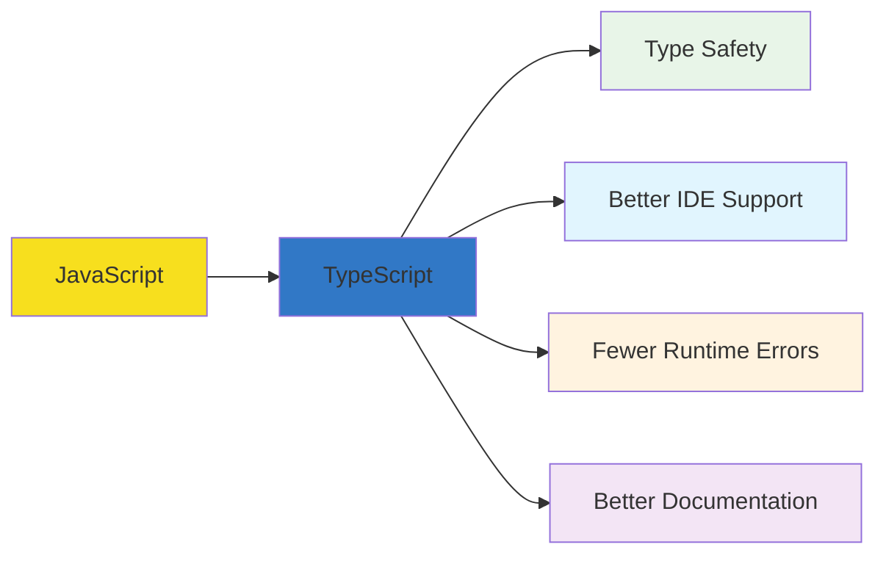
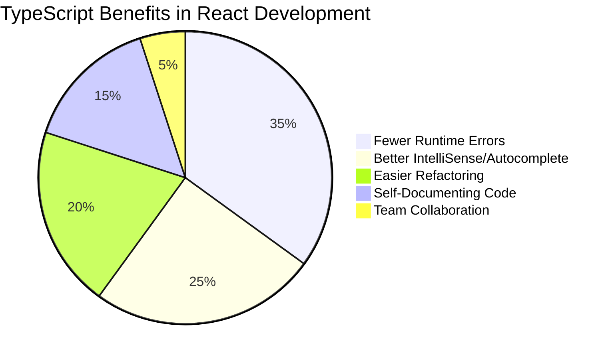

# Part C: TypeScript Basics Guide 📘

## Table of Contents
1. [What is TypeScript?](#what-is-typescript)
2. [Why Use TypeScript with React?](#why-use-typescript-with-react)
3. [Setting Up TypeScript](#setting-up-typescript)
4. [Basic Types](#basic-types)
5. [Functions and Parameters](#functions-and-parameters)
6. [Objects and Interfaces](#objects-and-interfaces)
7. [Arrays and Generics](#arrays-and-generics)
8. [TypeScript with React Components](#typescript-with-react-components)
9. [Common React TypeScript Patterns](#common-react-typescript-patterns)
10. [Best Practices](#best-practices)

---

## What is TypeScript? 🤔

TypeScript is **JavaScript with superpowers**! It adds **type safety** to JavaScript, helping you catch errors before your code runs.



### Think of TypeScript as:
- 🛡️ **A protective helmet** for your JavaScript code
- 🔍 **A spell-checker** that catches mistakes as you type
- 📋 **Documentation** that's built into your code
- 🚨 **An early warning system** for bugs

---

## Why Use TypeScript with React? 🎯

### Without TypeScript (JavaScript):
```javascript
// ❌ No type checking - errors happen at runtime
function Greeting({ name, age }) {
  return <h1>Hello {name}, you are {age} years old!</h1>;
}

// This will break at runtime!
<Greeting name="John" age="twenty-five" />
```

### With TypeScript:
```typescript
// ✅ Type checking catches errors before runtime
interface GreetingProps {
  name: string;
  age: number;
}

function Greeting({ name, age }: GreetingProps) {
  return <h1>Hello {name}, you are {age} years old!</h1>;
}

// TypeScript error: Type 'string' is not assignable to type 'number'
<Greeting name="John" age="twenty-five" /> // ❌ Caught at compile time!
<Greeting name="John" age={25} /> // ✅ Correct!
```

### Benefits Visualization:


---

## Setting Up TypeScript 📦

### For New React Apps:
```bash
# Create React app with TypeScript template
npx create-react-app my-typescript-app --template typescript
cd my-typescript-app

# Start development server
npm start
```

### For Existing React Apps:
```bash
# Install TypeScript and types
npm install --save-dev typescript @types/react @types/react-dom @types/node

# Rename your files from .js/.jsx to .ts/.tsx
# Create tsconfig.json
npx tsc --init
```

### Project Structure with TypeScript:
```
src/
  components/
    Button.tsx           ← TypeScript React component
    Button.types.ts      ← Type definitions (optional)
  hooks/
    useCounter.ts        ← TypeScript hook
  utils/
    helpers.ts           ← TypeScript utilities
  types/
    index.ts             ← Global type definitions
  App.tsx
  index.tsx
tsconfig.json            ← TypeScript configuration
```

### Basic tsconfig.json for React:
```json
{
  "compilerOptions": {
    "target": "es5",
    "lib": ["dom", "dom.iterable", "esnext"],
    "allowJs": true,
    "skipLibCheck": true,
    "esModuleInterop": true,
    "allowSyntheticDefaultImports": true,
    "strict": true,
    "forceConsistentCasingInFileNames": true,
    "module": "esnext",
    "moduleResolution": "node",
    "resolveJsonModule": true,
    "isolatedModules": true,
    "noEmit": true,
    "jsx": "react-jsx"
  },
  "include": [
    "src"
  ]
}
```

---

## Basic Types 📊

### Primitive Types:

```typescript
// String
let userName: string = "John Doe";
let message: string = `Hello, ${userName}!`;

// Number
let age: number = 25;
let price: number = 99.99;
let count: number = 0;

// Boolean
let isLoggedIn: boolean = true;
let isVisible: boolean = false;

// Undefined and Null
let data: undefined = undefined;
let emptyValue: null = null;

// Any (avoid when possible!)
let anything: any = "hello";
anything = 42;
anything = true; // No type checking!
```

### Type Inference (TypeScript is smart! 🧠):
```typescript
// TypeScript automatically infers types
let name = "John"; // TypeScript knows this is a string
let count = 0;     // TypeScript knows this is a number
let isActive = true; // TypeScript knows this is a boolean

// You don't always need to specify types explicitly!
```

### Union Types (Multiple possible types):
```typescript
// Variable can be string OR number
let id: string | number;
id = "user123";  // ✅ Valid
id = 456;        // ✅ Valid
id = true;       // ❌ Error!

// Function parameter can accept multiple types
function displayId(id: string | number) {
  console.log(`ID: ${id}`);
}

displayId("user123"); // ✅ Works
displayId(456);       // ✅ Works
```

### Literal Types (Specific values):
```typescript
// Only these specific values are allowed
let size: "small" | "medium" | "large";
size = "medium"; // ✅ Valid
size = "tiny";   // ❌ Error!

let status: "loading" | "success" | "error";
status = "loading"; // ✅ Valid

// Useful for component props
type ButtonVariant = "primary" | "secondary" | "danger";
```

---

## Functions and Parameters 🔧

### Function Type Annotations:
```typescript
// Function with typed parameters and return type
function add(a: number, b: number): number {
  return a + b;
}

// Function with optional parameters
function greet(name: string, age?: number): string {
  if (age) {
    return `Hello ${name}, you are ${age} years old`;
  }
  return `Hello ${name}`;
}

// Function with default parameters
function createUser(name: string, role: string = "user"): string {
  return `${name} is a ${role}`;
}

// Arrow function syntax
const multiply = (a: number, b: number): number => {
  return a * b;
};

// Short arrow function (return type inferred)
const divide = (a: number, b: number) => a / b;
```

### Function Types:
```typescript
// Define a function type
type MathOperation = (a: number, b: number) => number;

// Use the function type
const subtract: MathOperation = (a, b) => a - b;
const multiply: MathOperation = (a, b) => a * b;

// Function that accepts another function
function calculate(operation: MathOperation, x: number, y: number): number {
  return operation(x, y);
}

const result = calculate(subtract, 10, 5); // result is 5
```

### Void and Never Types:
```typescript
// Function that doesn't return anything
function logMessage(message: string): void {
  console.log(message);
  // No return statement
}

// Function that never returns (throws error or infinite loop)
function throwError(message: string): never {
  throw new Error(message);
}
```

---

## Objects and Interfaces 🏗️

### Object Types:
```typescript
// Inline object type
let user: { name: string; age: number; email: string } = {
  name: "John",
  age: 30,
  email: "john@example.com"
};

// Object with optional properties
let product: { 
  name: string; 
  price: number; 
  description?: string; // Optional property
} = {
  name: "iPhone",
  price: 999
  // description is optional
};
```

### Interfaces (Recommended for React!):
```typescript
// Define an interface
interface User {
  id: number;
  name: string;
  email: string;
  age?: number; // Optional property
  isActive: boolean;
}

// Use the interface
const user: User = {
  id: 1,
  name: "John Doe",
  email: "john@example.com",
  isActive: true
  // age is optional, so we can omit it
};

// Interface for function
interface CreateUserFunction {
  (name: string, email: string): User;
}

const createUser: CreateUserFunction = (name, email) => ({
  id: Math.random(),
  name,
  email,
  isActive: true
});
```

### Extending Interfaces:
```typescript
// Base interface
interface Person {
  name: string;
  age: number;
}

// Extended interface
interface Employee extends Person {
  employeeId: string;
  department: string;
  salary: number;
}

// Usage
const employee: Employee = {
  name: "Jane Smith",
  age: 28,
  employeeId: "EMP001",
  department: "Engineering",
  salary: 75000
};
```

### Nested Objects:
```typescript
interface Address {
  street: string;
  city: string;
  zipCode: string;
  country: string;
}

interface User {
  name: string;
  address: Address; // Nested object
  preferences: {
    theme: "light" | "dark";
    notifications: boolean;
  };
}

const user: User = {
  name: "John",
  address: {
    street: "123 Main St",
    city: "New York",
    zipCode: "10001",
    country: "USA"
  },
  preferences: {
    theme: "dark",
    notifications: true
  }
};
```

---

## Arrays and Generics 📋

### Array Types:
```typescript
// Array of strings
let names: string[] = ["John", "Jane", "Bob"];

// Alternative syntax
let ages: Array<number> = [25, 30, 35];

// Array of objects
interface Product {
  id: number;
  name: string;
  price: number;
}

let products: Product[] = [
  { id: 1, name: "iPhone", price: 999 },
  { id: 2, name: "iPad", price: 599 }
];

// Mixed types using union
let mixedArray: (string | number)[] = ["hello", 42, "world", 100];
```

### Generics (Advanced but useful!):
```typescript
// Generic function - works with any type
function getFirstItem<T>(items: T[]): T | undefined {
  return items[0];
}

// Usage with different types
const firstNumber = getFirstItem([1, 2, 3]); // Type: number | undefined
const firstName = getFirstItem(["John", "Jane"]); // Type: string | undefined
const firstProduct = getFirstItem(products); // Type: Product | undefined

// Generic interface
interface ApiResponse<T> {
  data: T;
  status: number;
  message: string;
}

// Usage
const userResponse: ApiResponse<User> = {
  data: { id: 1, name: "John", email: "john@example.com", isActive: true },
  status: 200,
  message: "Success"
};

const productsResponse: ApiResponse<Product[]> = {
  data: products,
  status: 200,
  message: "Products retrieved successfully"
};
```

---

## TypeScript with React Components ⚛️

### Basic Component with Props:
```typescript
import React from 'react';

// Define props interface
interface GreetingProps {
  name: string;
  age?: number; // Optional prop
  isVip?: boolean; // Optional prop with default
}

// Functional component with typed props
const Greeting: React.FC<GreetingProps> = ({ name, age, isVip = false }) => {
  return (
    <div>
      <h1>Hello, {name}!</h1>
      {age && <p>You are {age} years old</p>}
      {isVip && <span>⭐ VIP Member</span>}
    </div>
  );
};

// Alternative syntax (preferred)
const Greeting2 = ({ name, age, isVip = false }: GreetingProps) => {
  return (
    <div>
      <h1>Hello, {name}!</h1>
      {age && <p>You are {age} years old</p>}
      {isVip && <span>⭐ VIP Member</span>}
    </div>
  );
};

export default Greeting;
```

### Component with State:
```typescript
import React, { useState } from 'react';

interface User {
  id: number;
  name: string;
  email: string;
}

const UserProfile = () => {
  // State with type annotation
  const [user, setUser] = useState<User | null>(null);
  const [loading, setLoading] = useState<boolean>(false);
  const [error, setError] = useState<string>('');

  // Function with typed parameters
  const fetchUser = async (userId: number): Promise<void> => {
    setLoading(true);
    try {
      // Simulated API call
      const response = await fetch(`/api/users/${userId}`);
      const userData: User = await response.json();
      setUser(userData);
    } catch (err) {
      setError('Failed to fetch user');
    } finally {
      setLoading(false);
    }
  };

  return (
    <div>
      {loading && <p>Loading...</p>}
      {error && <p style={{ color: 'red' }}>{error}</p>}
      {user && (
        <div>
          <h2>{user.name}</h2>
          <p>{user.email}</p>
        </div>
      )}
      <button onClick={() => fetchUser(1)}>
        Load User
      </button>
    </div>
  );
};

export default UserProfile;
```

### Event Handlers:
```typescript
import React, { useState } from 'react';

const ContactForm = () => {
  const [formData, setFormData] = useState({
    name: '',
    email: '',
    message: ''
  });

  // Typed event handlers
  const handleInputChange = (e: React.ChangeEvent<HTMLInputElement>) => {
    const { name, value } = e.target;
    setFormData(prev => ({
      ...prev,
      [name]: value
    }));
  };

  const handleTextareaChange = (e: React.ChangeEvent<HTMLTextAreaElement>) => {
    setFormData(prev => ({
      ...prev,
      message: e.target.value
    }));
  };

  const handleSubmit = (e: React.FormEvent<HTMLFormElement>) => {
    e.preventDefault();
    console.log('Form submitted:', formData);
  };

  const handleButtonClick = (e: React.MouseEvent<HTMLButtonElement>) => {
    console.log('Button clicked');
  };

  return (
    <form onSubmit={handleSubmit}>
      <input
        type="text"
        name="name"
        value={formData.name}
        onChange={handleInputChange}
        placeholder="Name"
      />
      
      <input
        type="email"
        name="email"
        value={formData.email}
        onChange={handleInputChange}
        placeholder="Email"
      />
      
      <textarea
        value={formData.message}
        onChange={handleTextareaChange}
        placeholder="Message"
      />
      
      <button type="submit">Submit</button>
      <button type="button" onClick={handleButtonClick}>
        Cancel
      </button>
    </form>
  );
};

export default ContactForm;
```

---

## Common React TypeScript Patterns 🎨

### 1. Button Component with Variants:
```typescript
import React from 'react';

// Props interface with specific allowed values
interface ButtonProps {
  children: React.ReactNode; // Can contain any React content
  variant?: 'primary' | 'secondary' | 'danger';
  size?: 'small' | 'medium' | 'large';
  disabled?: boolean;
  onClick?: (e: React.MouseEvent<HTMLButtonElement>) => void;
}

const Button = ({ 
  children, 
  variant = 'primary', 
  size = 'medium', 
  disabled = false,
  onClick 
}: ButtonProps) => {
  const baseClasses = 'btn';
  const variantClass = `btn-${variant}`;
  const sizeClass = `btn-${size}`;
  
  return (
    <button
      className={`${baseClasses} ${variantClass} ${sizeClass}`}
      disabled={disabled}
      onClick={onClick}
    >
      {children}
    </button>
  );
};

// Usage
const App = () => {
  const handleClick = () => {
    console.log('Button clicked!');
  };

  return (
    <div>
      <Button variant="primary" size="large" onClick={handleClick}>
        Primary Button
      </Button>
      
      <Button variant="danger" disabled>
        Disabled Button
      </Button>
    </div>
  );
};

export default Button;
```

### 2. List Component with Generic Types:
```typescript
import React from 'react';

// Generic props interface
interface ListProps<T> {
  items: T[];
  renderItem: (item: T, index: number) => React.ReactNode;
  keyExtractor: (item: T) => string | number;
}

// Generic component
function List<T>({ items, renderItem, keyExtractor }: ListProps<T>) {
  return (
    <ul>
      {items.map((item, index) => (
        <li key={keyExtractor(item)}>
          {renderItem(item, index)}
        </li>
      ))}
    </ul>
  );
}

// Usage with different data types
interface User {
  id: number;
  name: string;
  email: string;
}

interface Product {
  id: string;
  title: string;
  price: number;
}

const App = () => {
  const users: User[] = [
    { id: 1, name: "John", email: "john@example.com" },
    { id: 2, name: "Jane", email: "jane@example.com" }
  ];

  const products: Product[] = [
    { id: "p1", title: "iPhone", price: 999 },
    { id: "p2", title: "iPad", price: 599 }
  ];

  return (
    <div>
      <h2>Users</h2>
      <List
        items={users}
        keyExtractor={(user) => user.id}
        renderItem={(user) => (
          <div>
            <strong>{user.name}</strong> - {user.email}
          </div>
        )}
      />

      <h2>Products</h2>
      <List
        items={products}
        keyExtractor={(product) => product.id}
        renderItem={(product) => (
          <div>
            {product.title} - ${product.price}
          </div>
        )}
      />
    </div>
  );
};

export default App;
```

### 3. Custom Hook with TypeScript:
```typescript
import { useState, useEffect } from 'react';

// Return type for the hook
interface UseFetchResult<T> {
  data: T | null;
  loading: boolean;
  error: string | null;
  refetch: () => void;
}

// Generic custom hook
function useFetch<T>(url: string): UseFetchResult<T> {
  const [data, setData] = useState<T | null>(null);
  const [loading, setLoading] = useState<boolean>(true);
  const [error, setError] = useState<string | null>(null);

  const fetchData = async () => {
    try {
      setLoading(true);
      setError(null);
      
      const response = await fetch(url);
      if (!response.ok) {
        throw new Error(`HTTP error! status: ${response.status}`);
      }
      
      const result: T = await response.json();
      setData(result);
    } catch (err) {
      setError(err instanceof Error ? err.message : 'An error occurred');
    } finally {
      setLoading(false);
    }
  };

  useEffect(() => {
    fetchData();
  }, [url]);

  return {
    data,
    loading,
    error,
    refetch: fetchData
  };
}

// Usage in component
interface ApiUser {
  id: number;
  name: string;
  username: string;
  email: string;
}

const UserComponent = () => {
  const { data: user, loading, error, refetch } = useFetch<ApiUser>(
    'https://jsonplaceholder.typicode.com/users/1'
  );

  if (loading) return <div>Loading...</div>;
  if (error) return <div>Error: {error}</div>;

  return (
    <div>
      {user && (
        <div>
          <h2>{user.name}</h2>
          <p>Username: {user.username}</p>
          <p>Email: {user.email}</p>
          <button onClick={refetch}>Refresh</button>
        </div>
      )}
    </div>
  );
};

export default UserComponent;
```

### 4. Context with TypeScript:
```typescript
import React, { createContext, useContext, useState } from 'react';

// Define the shape of our context data
interface AuthContextType {
  user: User | null;
  login: (email: string, password: string) => Promise<void>;
  logout: () => void;
  loading: boolean;
}

interface User {
  id: number;
  name: string;
  email: string;
}

// Create context with default value
const AuthContext = createContext<AuthContextType | undefined>(undefined);

// Custom hook to use auth context
export const useAuth = (): AuthContextType => {
  const context = useContext(AuthContext);
  if (context === undefined) {
    throw new Error('useAuth must be used within an AuthProvider');
  }
  return context;
};

// Provider component props
interface AuthProviderProps {
  children: React.ReactNode;
}

// Provider component
export const AuthProvider = ({ children }: AuthProviderProps) => {
  const [user, setUser] = useState<User | null>(null);
  const [loading, setLoading] = useState<boolean>(false);

  const login = async (email: string, password: string): Promise<void> => {
    setLoading(true);
    try {
      // Simulate API call
      const response = await fetch('/api/login', {
        method: 'POST',
        headers: { 'Content-Type': 'application/json' },
        body: JSON.stringify({ email, password })
      });
      
      const userData: User = await response.json();
      setUser(userData);
    } catch (error) {
      throw new Error('Login failed');
    } finally {
      setLoading(false);
    }
  };

  const logout = (): void => {
    setUser(null);
  };

  const value: AuthContextType = {
    user,
    login,
    logout,
    loading
  };

  return (
    <AuthContext.Provider value={value}>
      {children}
    </AuthContext.Provider>
  );
};

// Usage in component
const LoginComponent = () => {
  const { login, user, loading } = useAuth();
  const [email, setEmail] = useState('');
  const [password, setPassword] = useState('');

  const handleSubmit = async (e: React.FormEvent) => {
    e.preventDefault();
    try {
      await login(email, password);
    } catch (error) {
      console.error('Login failed');
    }
  };

  if (user) {
    return <div>Welcome, {user.name}!</div>;
  }

  return (
    <form onSubmit={handleSubmit}>
      <input
        type="email"
        value={email}
        onChange={(e) => setEmail(e.target.value)}
        placeholder="Email"
      />
      <input
        type="password"
        value={password}
        onChange={(e) => setPassword(e.target.value)}
        placeholder="Password"
      />
      <button type="submit" disabled={loading}>
        {loading ? 'Logging in...' : 'Login'}
      </button>
    </form>
  );
};
```

---

## Best Practices 📋

### ✅ Do's:

1. **Start with Interfaces for Props**
   ```typescript
   // ✅ Good - Clear interface
   interface ButtonProps {
     text: string;
     onClick: () => void;
     disabled?: boolean;
   }
   ```

2. **Use Union Types for Limited Options**
   ```typescript
   // ✅ Good - Restricts possible values
   type Theme = 'light' | 'dark' | 'auto';
   type Size = 'sm' | 'md' | 'lg';
   ```

3. **Leverage Type Inference**
   ```typescript
   // ✅ Good - Let TypeScript infer when obvious
   const [count, setCount] = useState(0); // TypeScript knows it's number
   const [user, setUser] = useState<User | null>(null); // Explicit when needed
   ```

4. **Use Generics for Reusable Components**
   ```typescript
   // ✅ Good - Reusable with different data types
   interface SelectProps<T> {
     options: T[];
     value: T;
     onChange: (value: T) => void;
   }
   ```

5. **Create Custom Type Guards**
   ```typescript
   // ✅ Good - Type safety for API responses
   function isUser(obj: any): obj is User {
     return obj && typeof obj.id === 'number' && typeof obj.name === 'string';
   }
   ```

### ❌ Don'ts:

1. **Don't Overuse `any`**
   ```typescript
   // ❌ Bad - Loses type safety
   const data: any = fetchData();
   
   // ✅ Better - Use specific types
   const data: User[] = fetchData();
   ```

2. **Don't Ignore TypeScript Errors**
   ```typescript
   // ❌ Bad - Suppressing errors without fixing
   // @ts-ignore
   const result = someFunction();
   
   // ✅ Better - Fix the underlying issue
   const result: ExpectedType = someFunction();
   ```

3. **Don't Make Everything Optional**
   ```typescript
   // ❌ Bad - Everything optional
   interface User {
     id?: number;
     name?: string;
     email?: string;
   }
   
   // ✅ Better - Only make truly optional things optional
   interface User {
     id: number;
     name: string;
     email: string;
     avatar?: string; // This can be optional
   }
   ```

### Common TypeScript Commands 📝

```bash
# Check TypeScript compilation
npx tsc --noEmit

# Watch mode for type checking
npx tsc --noEmit --watch

# Generate type declarations
npx tsc --declaration

# Strict mode type checking
npx tsc --strict

# Show TypeScript version
npx tsc --version
```

### Useful VS Code Extensions 🔧

1. **TypeScript Importer** - Auto-imports TypeScript types
2. **TypeScript Hero** - Organizes imports and declarations
3. **Bracket Pair Colorizer** - Helps with complex type definitions
4. **Error Lens** - Shows TypeScript errors inline

---

## Practice Exercises 📝

### Exercise 1: Basic Types and Interfaces
1. Create a `Product` interface with required and optional properties
2. Create a function that filters products by category
3. Add proper TypeScript types to all parameters and return values

### Exercise 2: React Component with TypeScript
1. Create a `Card` component with the following props:
   - `title` (required string)
   - `description` (optional string)
   - `imageUrl` (optional string)
   - `actions` (array of button objects)
2. Use proper TypeScript interfaces for all props

### Exercise 3: Custom Hook with TypeScript
1. Create a `useLocalStorage` hook that:
   - Takes a key and initial value
   - Returns current value and setter function
   - Handles JSON serialization/deserialization
   - Uses proper TypeScript generics

### Exercise 4: Advanced Component Patterns
1. Create a `Table` component that:
   - Accepts generic data type
   - Takes column definitions with render functions
   - Supports sorting and filtering
   - Uses proper TypeScript generics and interfaces

---

## TypeScript Cheat Sheet 📚

### Common Type Patterns:
```typescript
// Props with children
interface ComponentProps {
  children: React.ReactNode;
}

// Event handlers
onClick: (e: React.MouseEvent<HTMLButtonElement>) => void;
onChange: (e: React.ChangeEvent<HTMLInputElement>) => void;
onSubmit: (e: React.FormEvent<HTMLFormElement>) => void;

// Refs
const inputRef = useRef<HTMLInputElement>(null);

// State with complex types
const [user, setUser] = useState<User | null>(null);
const [users, setUsers] = useState<User[]>([]);

// Async functions
const fetchData = async (): Promise<User[]> => {
  // Implementation
};

// Component type (for passing components as props)
interface TabProps {
  component: React.ComponentType<any>;
}
```

---

## Summary 📋

TypeScript with React provides:

1. **Type Safety** 🛡️ - Catch errors before runtime
2. **Better Developer Experience** 💻 - IntelliSense and autocomplete
3. **Self-Documenting Code** 📚 - Types serve as documentation
4. **Easier Refactoring** 🔄 - Confidently change code structure
5. **Team Collaboration** 👥 - Clear contracts between components

### Key Concepts to Remember:
- **Interfaces** for defining object shapes
- **Union types** for multiple possible values
- **Generics** for reusable components
- **Optional properties** with `?`
- **Event typing** for React handlers
- **State typing** with `useState<Type>()`

### Learning Path:
1. Start with basic types and interfaces ✅
2. Add TypeScript to simple components ✅
3. Learn event handling and state management ✅
4. Practice with custom hooks and context ✅
5. Explore advanced patterns and generics ✅

---

## Troubleshooting Common TypeScript Errors 🔧

### Error 1: Property does not exist on type
```typescript
// ❌ Error: Property 'name' does not exist on type '{}'
const user = {};
console.log(user.name); // Error!

// ✅ Solution: Define the type properly
interface User {
  name: string;
  age: number;
}

const user: User = {
  name: "John",
  age: 25
};
console.log(user.name); // Works!
```

### Error 2: Argument of type 'string' is not assignable to parameter of type 'number'
```typescript
// ❌ Error: Type mismatch
function setAge(age: number) {
  // Implementation
}

setAge("25"); // Error! String instead of number

// ✅ Solution: Convert or fix the type
setAge(25); // Correct number
setAge(parseInt("25")); // Convert string to number
```

### Error 3: Object is possibly 'null' or 'undefined'
```typescript
// ❌ Error: Possible null/undefined
const user: User | null = getUser();
console.log(user.name); // Error! user might be null

// ✅ Solution: Check for null/undefined
if (user) {
  console.log(user.name); // Safe!
}

// Or use optional chaining
console.log(user?.name); // Safe with optional chaining
```

### Error 4: Type '{}' is missing properties
```typescript
// ❌ Error: Missing required properties
interface User {
  id: number;
  name: string;
  email: string;
}

const user: User = {
  name: "John"
}; // Error! Missing id and email

// ✅ Solution: Provide all required properties
const user: User = {
  id: 1,
  name: "John",
  email: "john@example.com"
};

// Or make some properties optional
interface User {
  id: number;
  name: string;
  email?: string; // Now optional
}
```

---

## Real-World Example: Complete Todo App with TypeScript 📱

Let's put everything together in a complete TypeScript React application:

### Types Definition (`src/types/index.ts`):
```typescript
// Todo item interface
export interface Todo {
  id: string;
  text: string;
  completed: boolean;
  createdAt: Date;
  priority: 'low' | 'medium' | 'high';
}

// Filter options
export type FilterType = 'all' | 'active' | 'completed';

// Form data for new todos
export interface NewTodoData {
  text: string;
  priority: Todo['priority'];
}

// API response types
export interface ApiResponse<T> {
  data: T;
  status: number;
  message: string;
}
```

### Todo Item Component (`src/components/TodoItem.tsx`):
```typescript
import React from 'react';
import { Todo } from '../types';

interface TodoItemProps {
  todo: Todo;
  onToggle: (id: string) => void;
  onDelete: (id: string) => void;
  onEdit: (id: string, newText: string) => void;
}

const TodoItem: React.FC<TodoItemProps> = ({ 
  todo, 
  onToggle, 
  onDelete, 
  onEdit 
}) => {
  const [isEditing, setIsEditing] = React.useState(false);
  const [editText, setEditText] = React.useState(todo.text);

  const handleSubmit = (e: React.FormEvent) => {
    e.preventDefault();
    if (editText.trim()) {
      onEdit(todo.id, editText.trim());
      setIsEditing(false);
    }
  };

  const handleKeyDown = (e: React.KeyboardEvent) => {
    if (e.key === 'Escape') {
      setEditText(todo.text);
      setIsEditing(false);
    }
  };

  const getPriorityColor = (priority: Todo['priority']): string => {
    switch (priority) {
      case 'high': return '#ff4757';
      case 'medium': return '#ffa502';
      case 'low': return '#2ed573';
      default: return '#747d8c';
    }
  };

  return (
    <li className={`todo-item ${todo.completed ? 'completed' : ''}`}>
      <input
        type="checkbox"
        checked={todo.completed}
        onChange={() => onToggle(todo.id)}
      />
      
      {isEditing ? (
        <form onSubmit={handleSubmit} className="edit-form">
          <input
            type="text"
            value={editText}
            onChange={(e) => setEditText(e.target.value)}
            onKeyDown={handleKeyDown}
            onBlur={() => setIsEditing(false)}
            autoFocus
          />
        </form>
      ) : (
        <span 
          className="todo-text"
          onDoubleClick={() => setIsEditing(true)}
        >
          {todo.text}
        </span>
      )}
      
      <span 
        className="priority-indicator"
        style={{ backgroundColor: getPriorityColor(todo.priority) }}
      >
        {todo.priority}
      </span>
      
      <div className="todo-actions">
        <button onClick={() => setIsEditing(true)}>
          Edit
        </button>
        <button 
          onClick={() => onDelete(todo.id)}
          className="delete-btn"
        >
          Delete
        </button>
      </div>
    </li>
  );
};

export default TodoItem;
```

### Add Todo Form (`src/components/AddTodoForm.tsx`):
```typescript
import React, { useState } from 'react';
import { NewTodoData, Todo } from '../types';

interface AddTodoFormProps {
  onAdd: (todoData: NewTodoData) => void;
}

const AddTodoForm: React.FC<AddTodoFormProps> = ({ onAdd }) => {
  const [formData, setFormData] = useState<NewTodoData>({
    text: '',
    priority: 'medium'
  });

  const handleSubmit = (e: React.FormEvent<HTMLFormElement>) => {
    e.preventDefault();
    
    if (formData.text.trim()) {
      onAdd(formData);
      setFormData({ text: '', priority: 'medium' });
    }
  };

  const handleInputChange = (e: React.ChangeEvent<HTMLInputElement>) => {
    setFormData(prev => ({
      ...prev,
      text: e.target.value
    }));
  };

  const handlePriorityChange = (e: React.ChangeEvent<HTMLSelectElement>) => {
    setFormData(prev => ({
      ...prev,
      priority: e.target.value as Todo['priority']
    }));
  };

  return (
    <form onSubmit={handleSubmit} className="add-todo-form">
      <input
        type="text"
        value={formData.text}
        onChange={handleInputChange}
        placeholder="What needs to be done?"
        required
      />
      
      <select 
        value={formData.priority} 
        onChange={handlePriorityChange}
      >
        <option value="low">Low Priority</option>
        <option value="medium">Medium Priority</option>
        <option value="high">High Priority</option>
      </select>
      
      <button type="submit">
        Add Todo
      </button>
    </form>
  );
};

export default AddTodoForm;
```

### Custom Hook (`src/hooks/useTodos.ts`):
```typescript
import { useState, useCallback } from 'react';
import { Todo, NewTodoData } from '../types';

interface UseTodosReturn {
  todos: Todo[];
  addTodo: (todoData: NewTodoData) => void;
  toggleTodo: (id: string) => void;
  deleteTodo: (id: string) => void;
  editTodo: (id: string, newText: string) => void;
  clearCompleted: () => void;
}

export const useTodos = (initialTodos: Todo[] = []): UseTodosReturn => {
  const [todos, setTodos] = useState<Todo[]>(initialTodos);

  const addTodo = useCallback((todoData: NewTodoData) => {
    const newTodo: Todo = {
      id: Date.now().toString(),
      text: todoData.text,
      priority: todoData.priority,
      completed: false,
      createdAt: new Date()
    };

    setTodos(prev => [...prev, newTodo]);
  }, []);

  const toggleTodo = useCallback((id: string) => {
    setTodos(prev => 
      prev.map(todo => 
        todo.id === id 
          ? { ...todo, completed: !todo.completed }
          : todo
      )
    );
  }, []);

  const deleteTodo = useCallback((id: string) => {
    setTodos(prev => prev.filter(todo => todo.id !== id));
  }, []);

  const editTodo = useCallback((id: string, newText: string) => {
    setTodos(prev =>
      prev.map(todo =>
        todo.id === id
          ? { ...todo, text: newText }
          : todo
      )
    );
  }, []);

  const clearCompleted = useCallback(() => {
    setTodos(prev => prev.filter(todo => !todo.completed));
  }, []);

  return {
    todos,
    addTodo,
    toggleTodo,
    deleteTodo,
    editTodo,
    clearCompleted
  };
};
```

### Main App Component (`src/App.tsx`):
```typescript
import React, { useState, useMemo } from 'react';
import { FilterType } from './types';
import { useTodos } from './hooks/useTodos';
import TodoItem from './components/TodoItem';
import AddTodoForm from './components/AddTodoForm';
import './App.css';

const App: React.FC = () => {
  const { 
    todos, 
    addTodo, 
    toggleTodo, 
    deleteTodo, 
    editTodo, 
    clearCompleted 
  } = useTodos();
  
  const [filter, setFilter] = useState<FilterType>('all');

  // Memoized filtered todos for performance
  const filteredTodos = useMemo(() => {
    switch (filter) {
      case 'active':
        return todos.filter(todo => !todo.completed);
      case 'completed':
        return todos.filter(todo => todo.completed);
      default:
        return todos;
    }
  }, [todos, filter]);

  // Memoized statistics
  const stats = useMemo(() => {
    const total = todos.length;
    const completed = todos.filter(todo => todo.completed).length;
    const active = total - completed;
    
    return { total, completed, active };
  }, [todos]);

  const handleFilterClick = (filterType: FilterType) => {
    setFilter(filterType);
  };

  return (
    <div className="app">
      <header className="app-header">
        <h1>TypeScript Todo App</h1>
        
        <div className="stats">
          <span>Total: {stats.total}</span>
          <span>Active: {stats.active}</span>
          <span>Completed: {stats.completed}</span>
        </div>
      </header>

      <main className="app-main">
        <AddTodoForm onAdd={addTodo} />
        
        <div className="filters">
          <button 
            className={filter === 'all' ? 'active' : ''}
            onClick={() => handleFilterClick('all')}
          >
            All
          </button>
          <button 
            className={filter === 'active' ? 'active' : ''}
            onClick={() => handleFilterClick('active')}
          >
            Active
          </button>
          <button 
            className={filter === 'completed' ? 'active' : ''}
            onClick={() => handleFilterClick('completed')}
          >
            Completed
          </button>
        </div>

        <ul className="todo-list">
          {filteredTodos.map(todo => (
            <TodoItem
              key={todo.id}
              todo={todo}
              onToggle={toggleTodo}
              onDelete={deleteTodo}
              onEdit={editTodo}
            />
          ))}
        </ul>

        {stats.completed > 0 && (
          <button 
            className="clear-completed"
            onClick={clearCompleted}
          >
            Clear Completed ({stats.completed})
          </button>
        )}

        {filteredTodos.length === 0 && (
          <div className="empty-state">
            {filter === 'all' 
              ? 'No todos yet. Add one above!' 
              : `No ${filter} todos.`
            }
          </div>
        )}
      </main>
    </div>
  );
};

export default App;
```

---

## Testing TypeScript Components 🧪

Here's how to test our TypeScript components:

### TodoItem Test (`src/components/TodoItem.test.tsx`):
```typescript
import React from 'react';
import { render, screen, fireEvent } from '@testing-library/react';
import userEvent from '@testing-library/user-event';
import { Todo } from '../types';
import TodoItem from './TodoItem';

// Mock functions with proper TypeScript types
const mockOnToggle = jest.fn<void, [string]>();
const mockOnDelete = jest.fn<void, [string]>();
const mockOnEdit = jest.fn<void, [string, string]>();

// Sample todo for testing
const sampleTodo: Todo = {
  id: '1',
  text: 'Test todo',
  completed: false,
  createdAt: new Date(),
  priority: 'medium'
};

describe('TodoItem Component', () => {
  beforeEach(() => {
    jest.clearAllMocks();
  });

  test('renders todo item correctly', () => {
    render(
      <TodoItem
        todo={sampleTodo}
        onToggle={mockOnToggle}
        onDelete={mockOnDelete}
        onEdit={mockOnEdit}
      />
    );

    expect(screen.getByText('Test todo')).toBeInTheDocument();
    expect(screen.getByRole('checkbox')).not.toBeChecked();
    expect(screen.getByText('medium')).toBeInTheDocument();
  });

  test('calls onToggle when checkbox is clicked', async () => {
    const user = userEvent.setup();
    
    render(
      <TodoItem
        todo={sampleTodo}
        onToggle={mockOnToggle}
        onDelete={mockOnDelete}
        onEdit={mockOnEdit}
      />
    );

    await user.click(screen.getByRole('checkbox'));
    
    expect(mockOnToggle).toHaveBeenCalledWith('1');
  });

  test('enters edit mode when text is double-clicked', async () => {
    const user = userEvent.setup();
    
    render(
      <TodoItem
        todo={sampleTodo}
        onToggle={mockOnToggle}
        onDelete={mockOnDelete}
        onEdit={mockOnEdit}
      />
    );

    await user.dblClick(screen.getByText('Test todo'));
    
    expect(screen.getByDisplayValue('Test todo')).toBeInTheDocument();
  });

  test('calls onEdit when edit form is submitted', async () => {
    const user = userEvent.setup();
    
    render(
      <TodoItem
        todo={sampleTodo}
        onToggle={mockOnToggle}
        onDelete={mockOnDelete}
        onEdit={mockOnEdit}
      />
    );

    // Enter edit mode
    await user.dblClick(screen.getByText('Test todo'));
    
    // Edit the text
    const input = screen.getByDisplayValue('Test todo');
    await user.clear(input);
    await user.type(input, 'Updated todo');
    
    // Submit form
    fireEvent.submit(input.closest('form')!);
    
    expect(mockOnEdit).toHaveBeenCalledWith('1', 'Updated todo');
  });
});
```

---

## Congratulations! 🎉

You've completed all three parts of the React development guide:

- **Part A**: Performance Optimization 🚀
- **Part B**: Testing with React Testing Library & Jest 🧪  
- **Part C**: TypeScript Basics 📘

### What You've Learned:

#### Performance Optimization 🚀
- React.memo(), useMemo(), useCallback()
- Code splitting and lazy loading
- Performance monitoring tools
- Best practices for optimal React apps

#### Testing 🧪
- Jest and React Testing Library fundamentals
- Writing user-focused tests
- Testing components, hooks, and context
- Mock functions and async testing
- Test-driven development practices

#### TypeScript 📘
- Type safety and error prevention
- Interfaces and type definitions
- React component typing
- Custom hooks with TypeScript
- Real-world patterns and best practices

### You're Now Ready To:
✅ Build performant React applications  
✅ Write comprehensive test suites  
✅ Use TypeScript for better code quality  
✅ Collaborate effectively with development teams  
✅ Debug and maintain complex React projects  
✅ Follow industry best practices  

### Next Steps for Continued Learning:
1. **Build a Portfolio Project** combining all three skills
2. **Explore Advanced React Patterns** (render props, compound components)
3. **Learn State Management** (Redux Toolkit, Zustand)
4. **Master React Router** for navigation
5. **Dive into Next.js** for production apps
6. **Study Design Patterns** in React applications

Keep practicing, keep building, and remember: **great developers are made through consistent practice and continuous learning!** 🌟

Happy coding! 💻✨